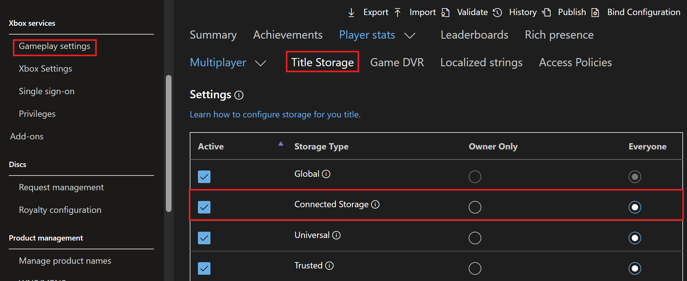

# Game Saves debugging

This article covers common Game Saves scenarios that require debugging and how to fix them.

## Common Game Saves error scenarios

### Misconfigured service configuration identifier

If error 0x80830002 (E_GS_NO_ACCESS) occurs when you call [XGameSaveFilesGetFolderWithUiAsync](../../../reference/system/xgamesavefiles/functions/xgamesavefilesgetfolderwithuiasync.md), the service configuration identifier (SCID) in your source code is likely incorrect. Ensure that the SCID matches what appears in Microsoft Partner Center. The following system error message might appear. 

#### Game binding implications

If your title uses [game binding](../../../services/fundamentals/game-binding/game-binding-overview.md) and later adds a PC version of the Microsoft Game Development Kit (GDK), it must use the Microsoft account (MSA) AppID (MSAppID) of the primary product. Using the secondary product’s MSAAppID causes 0x80830002 errors.

### Misconfigured Partner Center settings

Misconfigured Partner Center settings can be a common cause of Game Saves errors. For user Game Saves to sync to and from the cloud, select the **Connected Storage** option in Partner Center in **Gameplay settings** > **Title Storage**. The following image illustrates the Partner Center Connected Storage configuration setup required to ensure Game Saves can properly sync to and from the cloud.

### Handle cleanup

Game Saves syncing to and from the cloud is managed with multiple handles. If the lifetimes of these handles aren't properly managed, undefined behavior can result when syncing to and from the cloud.

`XGameSaveFiles`:

- Call [XGameSaveFilesGetFolderWithUiAsync](../../../reference/system/xgamesavefiles/functions/xgamesavefilesgetfolderwithuiasync.md) when the title launches and when it resumes. This call implicitly creates a Game Saves provider handle. The OS disposes of it when the title suspends or terminates.

`XGameSave`:

- Delete `XGameSaveUpdateHandle` after an [XGameSaveSubmitUpdate](../../../reference/system/xgamesave/functions/xgamesavesubmitupdate.md) call whether the update succeeded or failed.
- Delete `XGameSaveContainerHandle` when the title is suspended or terminated.
- Delete `XGameSaveProviderHandle` when the title is suspended or terminated.

### Confirmation of Game Saves

To confirm that your Game Saves are uploading to the cloud, the title needs to begin the process of releasing the lock to the title and then begin uploading data. You can see this traffic with Fiddler by 
[inspecting Game Saves network traffic](game-saves-tools.md#inspecting-game-saves-network-traffic).

For more information about the Game Saves sync flow, see [Understanding the Game Saves sync flow](game-saves-syncing.md).

## Common errors

| Error code | Name | Description | Troubleshooting |
| ---------- | ---- | ----------- | --------------- |
| 0x80830002 | E_GS_NO_ACCESS | The operation failed because the title doesn't have access to the container storage spaces. | This error occurs if the SCID and TitleID aren't configured correctly, causing API calls to fail. Check your game's .config file for the correct TitleID and your source code for the correct SCID.   The error message that appears on the console system prompt is, "There may be a service outage. Please check the service status. If there is a service outage, wait a bit and try again, or use this game or app offline."    The error occurs when an attempt is made to access a different title that wasn't provided with the appropriate cross-title access policies. Configure the required access policies in Partner Center to enable cross‑title load and save. |
| 0x000000DF | ERROR_FILE_TOO_LARGE | The file size exceeds the limit allowed and can't be saved.  | This error occurs when an attempt is made to write data to an `XGameSaveFiles` path that's past the 256-MB title quota. This error is the same error as E_QUOTA_EXCEEDED.   For more information, see [Storage Systems Limits and Quotas](game-saves-storage-systems.md#limits-and-quotas). |
0x80830004 | E_GS_USER_CANCELED  | The user canceled the download of their save games.  | This error occurs if a user cancels a sync attempt, forcing the provider to fail when trying to obtain the lock.    If the sync attempt is denied, call `XGameSaveFilesGetFolderWithUI` again so that the file path writes locally. This call returns `S_OK`.      This error also occurs when calling `XGameSaveFilesGetFolderWithUIResult` with a stale provider. This error also occurs when the Gaming Runtime Services (GRTS) uninitializes a Game Saves provider when it suspends a title or when other system‑managed events occur. When the title resumes, call `XGameSaveFilesGetFolderWithUiAsync` to reinitialize the provider and ensure that the saved data is current. If the title resumes without making this call, the provider remains uninitialized. Game Saves operations fail.|
| 0x8007000E | E_OUTOFMEMORY | There's no memory remaining to service your request.  | This error usually occurs for several reasons this error usually occurs. You can capture memory allocations with PIX and check for memory leaks.      Be aware of the following:    1. Handles are ref-counted. Check for handle leaks. Close updated handles after a successful or unsuccessful update. Avoid having large amounts of pending updates.    2. Use `XMemTransferMemory` as a workaround to transfer some memory to the system partition.    3. Heavy memory fragmentation. |
| 0x80070057 | E_INVALIDARG | An invalid argument was supplied. The parameter is incorrect. | This error can occur if the SCID used in `XGameSaveFilesGetFolderWithUI` on PC isn't a valid GUID. |
| ---        | ---  | `XGameSaveFilesGetFolderWithUI` is either indefinitely hanging or failing sporadically. | Ensure that no open GameSave system dialogs appear on the machine you're running on or dialogs don't appear on other consoles for the user. An open dialog for sign-in or sync can cause undefined behavior if it's ignored.  
| 0x80830006 | E_QUOTA_EXCEEDED | The game exceeded the per-user quota for the game. By default, this quota is 256 MB. | Use the following best practices for Game Saves data management.     1. Don't store dependent data across containers.    2. Use fewer blobs in the container to improve performance.   For more information, see [Storage Systems Limits and Quotas](game-saves-storage-systems.md#limits-and-quotas) |
| 0x80830005 | E_GS_UPDATE_TOO_BIG  | The size of the save update is too large. | The total size of an `XGameSave` update must be smaller than GS_MAX_BLOB_SIZE (16 MB), regardless of the total number of blobs in the update context. |
| 0x8924010c | E_GAMERUNTIME_INVALID_HANDLE  | This handle value is no longer valid.  | This error occurs when an attempt is made to reuse unclosed handles from a previous user. Close handles that are no longer in use. |
| 0x80830001 | E_GS_INVALID_CONTAINER_NAME | The name of the container is invalid. | Valid characters for the path portion (up to and including the final forward slash) include uppercase letters (A-Z), lowercase letters (a-z), numbers (0-9), underscores (\_), and forward slashes (/). The path portion can be empty.   Valid characters for the file name portion (everything after the final forward slash) include uppercase letters (A-Z), lowercase letters (a-z), numbers (0-9), underscores (\_), periods (.), and hyphens (-). The file name can't be empty, end in a period, or contain two consecutive periods.  |
| 0x80830003 | E_GS_OUT_OF_LOCAL_STORAGE  | The device doesn't have enough storage capacity save the game.  | Users must make Game Save storage space available on the device. This error can occur even if the per-user quota isn't exceeded.   For more information, see[Managing Game Saves through the device](game-saves-walkthroughs-and-samples.md#managing-game-saves-through-the-device).  |
| 0x80830007 | E_GS_PROVIDED_BUFFER_TOO_SMALL  | The buffer provided to the API was too small.  | This error occurs if the caller passes a buffer into Game Save APIs that’s smaller than the size of the blob data read. Call [XAsyncGetResultSize](../../../reference/system/xasync/functions/xasyncgetresultsize.md) if you’re using `Async` calls to ensure that the correct buffer size is used.  |
| 0x80830008 | E_GS_BLOB_NOT_FOUND | The specified blob can’t be found.  | To confirm that a blob exists, use the `xbstorage` or `gamesaveutil` tools to download the blob. Perform this step after the title releases the lock (when it terminates or suspends) to prevent undefined behavior.  For more information, see [Game Saves Tools](game-saves-tools.md#game-saves-tools).  |
| 0x80830009 | E_GS_NO_SERVICE_CONFIGURATION  | The title isn't properly configured for connected storage.   | This error occurs when the SCID is incorrect or when the title isn’t correctly configured in Partner Center.  For more information, see [Partner Center Configurations](game-saves-walkthroughs-and-samples.md#partner-center-configurations).  |
| 0x8083000A | E_GS_CONTAINER_NOT_IN_SYNC  | The container isn't synchronized yet.   | Ensure that the XGameSave container is synchronized before submitting updates to it.  |
| 0x8083000B | E_GS_CONTAINER_SYNC_FAILED  | The synchronization of the container failed. | Confirm that the internet connection is stable when syncing data from the cloud.  |
| 0x8083000C | E_GS_USER_NOT_REGISTERED_IN_SERVICE | Indicates that the user’s MSA isn't yet an Xbox services account.      | Confirm that the user you're using is registered correctly in Partner Center.   |
| 0x8083000D | E_GS_HANDLE_EXPIRED  | The handle used by the function expired and must be reacquired.  | `XGameSaveUpdateHandle` can't be reused after a submit or when the title is suspended |
| 0x8083000E | E_GS_ASYNC_FUNCTION_REQUIRED  | The function is being called on a time-sensitive thread, risking deadlocks.  | Use the async implementation instead.  |
| 0x8083000F | E_GS_PROVIDER_MISMATCH | The game is mixing `XGameSave` and `XGameSaveFiles` calls, which isn't supported.   | Only one type of Game Saves API can be initialized at a time within a title. Also, use one Game Saves API for a title. In the case where you’re working with multiple titles, there are methods to interop between different APIs.   For more information, seen [Interop between XGameSave and XGamesaveFiles](game-saves-walkthroughs-and-samples.md#interop-between-xgamesave-and-xgamesavefiles)  |
| 0x80831001 | E_GS_TERMINATEDTITLE_STALE_DATA or `TerminateApplicationAfterSuspend`| This information isn’t exposed through user‑facing APIs. The behavior is expected. Process Lifetime Management (PLM) stops the title when it detects stale data and the device reconnects to the internet. After a suspend event, the application closes. | This debug output isn't a bug. When the game is terminated because of missing the Game Saves lock at init time (for example, during offline play or conflict-dialog choice), the OS terminates the game on suspend to ensure a clean next-launch state.  |

### Win32 NTSTATUS codes

With `XGameSaveFiles`, the following status codes might appear.

| Value      | Name | `XGameSaveFiles` Description |
| ---------- | ----------------------------- | --------- |
| 0xC0000106 | STATUS_NAME_TOO_LONG| The directory name is too long. |
| 0xC0000033 | STATUS_OBJECT_NAME_INVALID    | The directory name contains characters not valid in the cloud service.  |
| 0xC0000106 | STATUS_NAME_TOO_LONG          | The file name&mdash;including the folder path&mdash;is too long. |
| 0xC0000904 | STATUS_FILE_TOO_LARGE | The file size exceeded 64 MB or the game exceeded its per-user maximum quota for game saves. |
| 0xC000009A | STATUS_INSUFFICIENT_RESOURCES | The game exceeded its allotted storage space on the device. |
