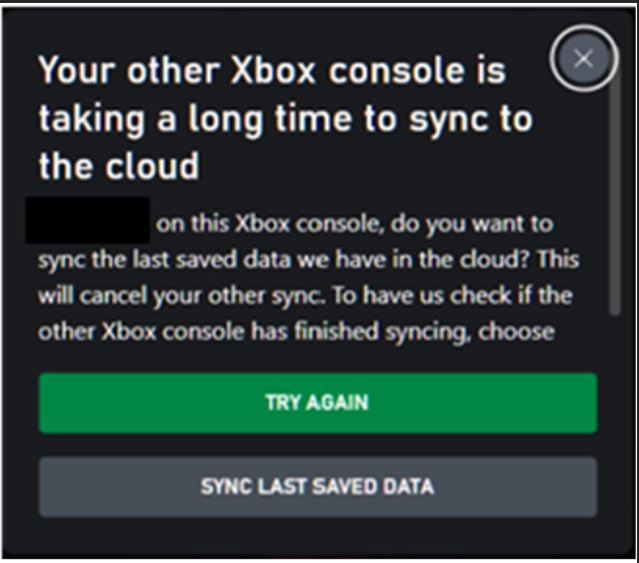
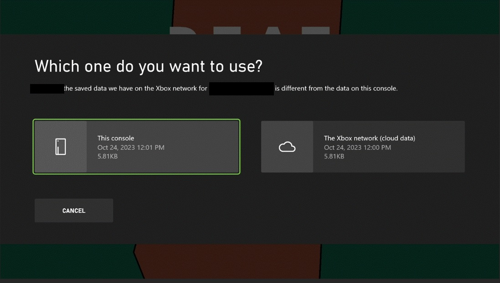
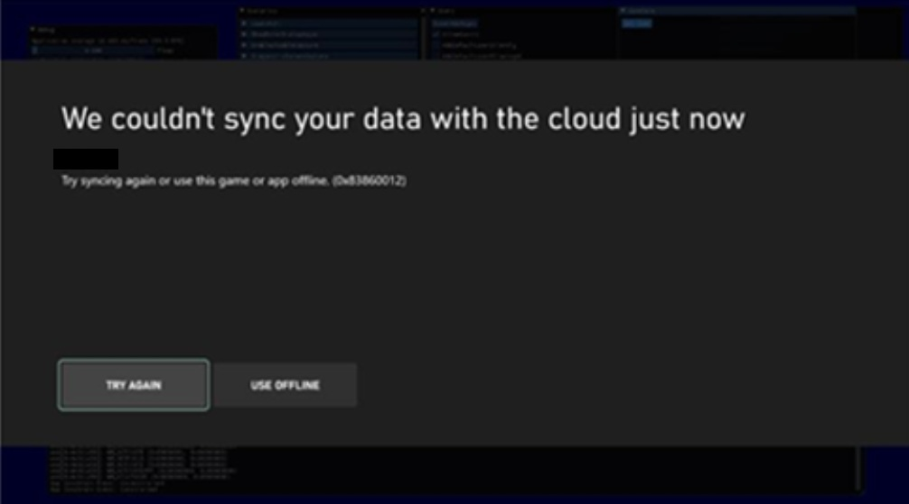
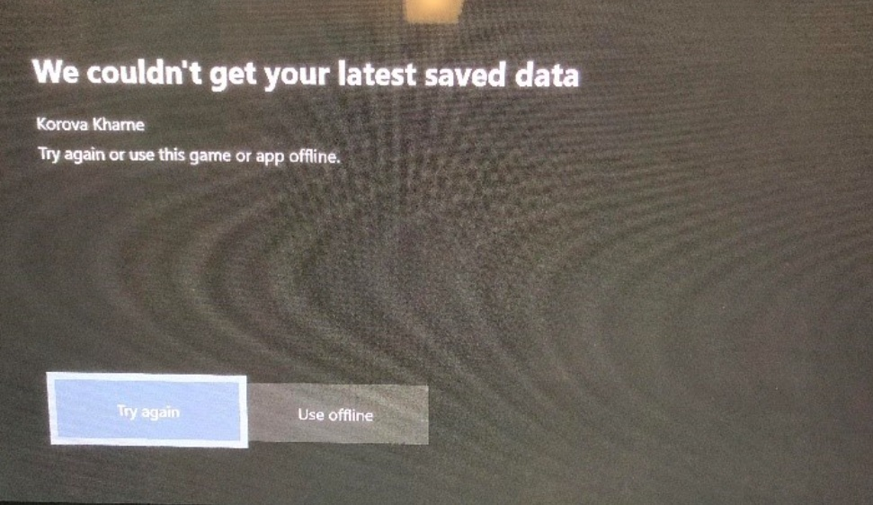
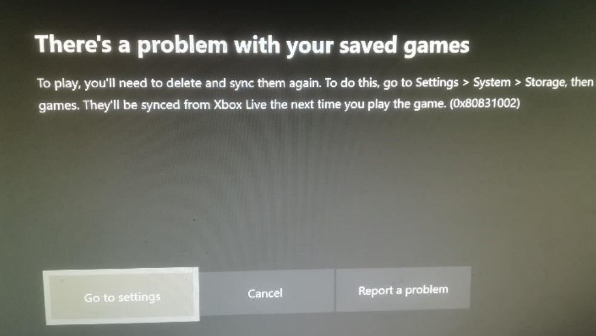
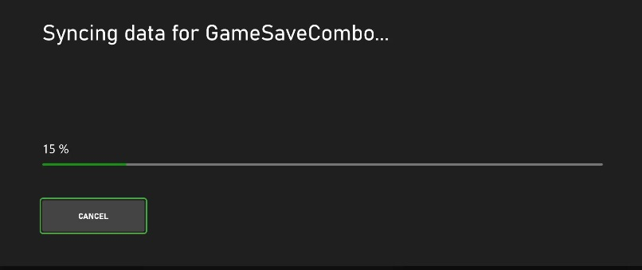
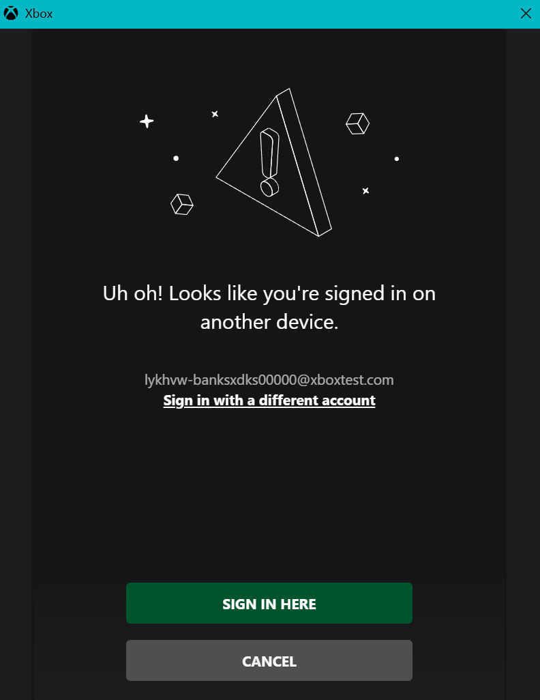
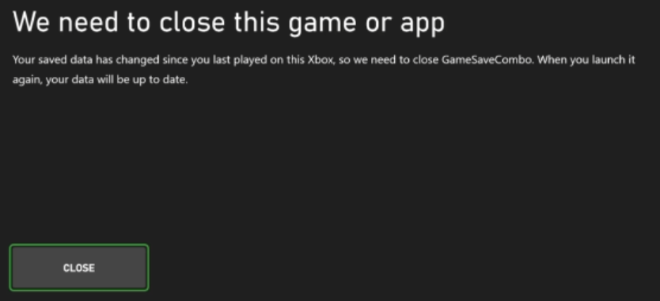
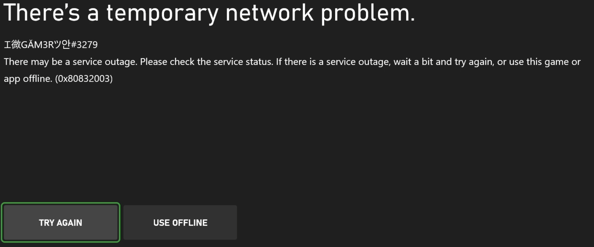

# Game Saves system dialogs

 This article provides the possible dialogs that can occur when titles occasionally require a user’s input to resolve a Game Saves conflict or inform them about errors. 

## System dialogs at a glance

| Message | System prompt reason | Dialog overview |
| ------- | -------------------- | ----------------- |
| Your other Xbox console is taking a long time to sync to the cloud. | A separate device is holding a lock on the user's data.  | [Your other Xbox console is taking a long time to sync to the cloud](game-saves-dialogues.md#your-other-xbox-console-is-taking-a-long-time-to-sync-to-the-cloud) |
| Which one do you want to use? | The local Game Saves data is newer than the data in the cloud. The user must choose which version to use before  they resume the save. | [Which one do you want to use?](game-saves-dialogues.md#which-one-do-you-want-to-use) |
| We couldn't sync your data with the cloud. | The user or device is offline when a sync to the cloud occurs. | [We couldn't sync your data with the cloud](game-saves-dialogues.md#we-couldnt-sync-your-data-with-the-cloud) |
| We couldn't get your latest saved data. | The title can't access Xbox social and gaming services | [We couldn't get your latest saved data](game-saves-dialogues.md#we-couldnt-get-your-latest-saved-data) |
| There's a problem with your saved games. | The Game Saves for the user were corrupted. | [There's a problem with your saved games](game-saves-dialogues.md#theres-a-problem-with-your-saved-games)                                                        |
| Syncing data for ...   | Data is being downloaded from the cloud into Game Saves local storage | [Syncing data for ...](game-saves-dialogues.md#syncing-data) |
| Looks like you're signed in on another device. | The user is signed in on another device when they try to play on the current device.| [Looks like you're signed in on another device.](game-saves-dialogues.md#looks-like-youre-signed-in-on-another-device) |
| We need to close this game or app. | The current device's game save data is stale. | [We need to close this game or app](game-saves-dialogues.md#we-need-to-close-this-game-or-app)  |
| There's a temporary network problem.  | The title couldn't connect to the Xbox network when attempting to initialize the Game Saves provider. It's also possible that the service configuration identifier (SCID) used for the provider isn't valid. | [There's a temporary network problem.](game-saves-dialogues.md#theres-a-temporary-network-problem) |

## Game Saves dialogs

### Your other Xbox console is taking a long time to sync to the cloud

Before the user syncs their saves, the title acquires a lock on the user’s game‑save data. If another device still holds the lock, the other device might be offline, which prevents the title from calling `WebReleaseLock` to release the lock. It’s also possible that the device might still be processing a large upload.

The user can choose one of the following options.

- **Try again**: Attempts to acquire the lock again. If the lock isn't available, the same dialog appears.
- **Sync last saved data**: Releases the lock held by the other device and cancels its sync. The previous session’s data is lost. The current device becomes the active device and takes ownership of the lock.
- **Cancel**: Switches the title to offline mode.

### Which one do you want to use?

If the data in Game Saves local storage conflicts with the cloud version, the user is prompted to choose which data to use. This conflict typically occurs during the following situations.

- Cross-device play.
- Offline play versus online play.  
- Title or platform bugs are present.

The user can choose one of the following options.

- **This console**: Overwrites and deletes the user's data in the cloud.
- **The Xbox network (cloud data)**: Overwrites the data in local storage.

### We couldn't sync your data with the cloud

This occurs if the user or device is offline when a sync to the cloud occurs.

The user can choose from one of the following options.

- **Try again**: The game tries to connect again.
- **Use offline**: Saves data locally for only the current session. 

For more information about offline behavior, see [Understanding the Game Saves sync flow](game-saves-syncing.md#connection-check).

### We couldn't get your latest saved data

This error occurs if the Xbox service for social and gaming is limited.

The user can choose from one of the following options.

- **Try again**: The game tries to connect again.
- **Use offline**: Saves data locally for only the current session. Saves for the session aren't uploaded.

If the problem persists, the user can check the Xbox status page.

### There's a problem with your saved games

The Game Saves for the user are corrupted. 

The user can choose from one of the following options.

- **Go to settings**: Opens storage management, where users can clear local storage.
- **Cancel**: 
- **Report a problem**. Diagnostics are sent directly to Microsoft.

To diagnose corrupted data during development, you can investigate it directly with [Game Saves Tools](game-saves-tools.md#game-saves-tools).

### Syncing data

The Syncing data dialog occurs when the device downloads data from the cloud.

The user has only one option.

- **Cancel**: This causes the title to be played in [offline mode](game-saves-syncing.md#connection-check).

### Looks like you're signed in on another device

This dialog appears frequently during game‑save operations. If there's an active session on another device, the dialog enables the user to move that session to the current device.

The user can choose one of the following options.

- **Sign in here**: Moves the session to the current device.
- **Cancel**: Cancels the sign-in flow, and then returns `E_ABORT: 0x80004004`.

### We need to close this game or app 

Stale data occurs when the title uses local Game Saves data while offline. This situation can happen when the device reconnects and another device still holds the lock.

### There's a temporary network problem

This error's dialog appears when the title encounters connection issues when it attempts to initialize Game Saves. 

The user can choose one of the following options.

- **Try again**: The title attempts to initialize Game Saves again.
- **Use offline**: The title launches in Offline mode, storing all data to Game Saves local storage. Cloud sync doesn’t occur during the game session.

This dialog might appear even when the title is connected but can’t reach Xbox services. This error appears when Microsoft Partner Center isn’t configured correctly. 

For more information on Game Saves errors, see [Common Error Scenarios](game-saves-debugging.md#common-game-saves-error-scenarios).
