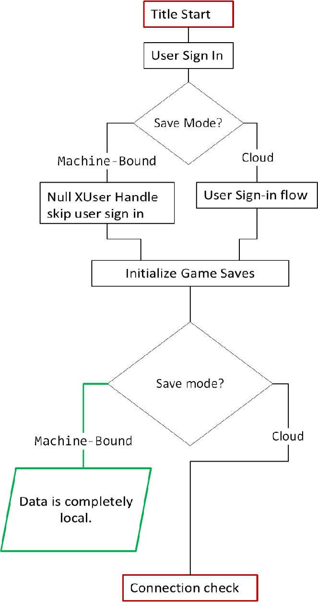
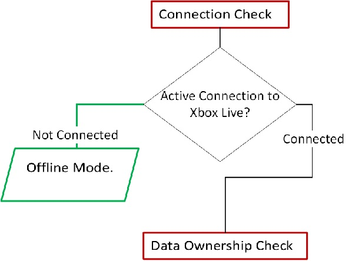
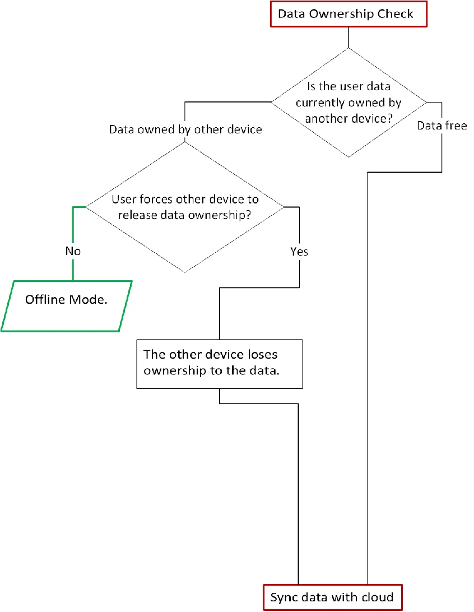
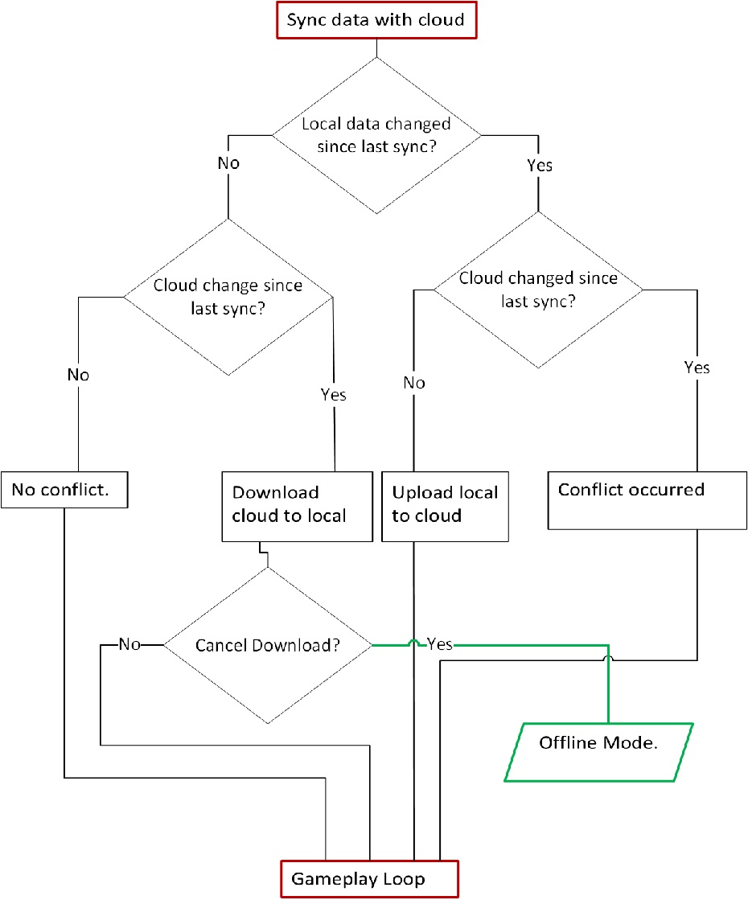
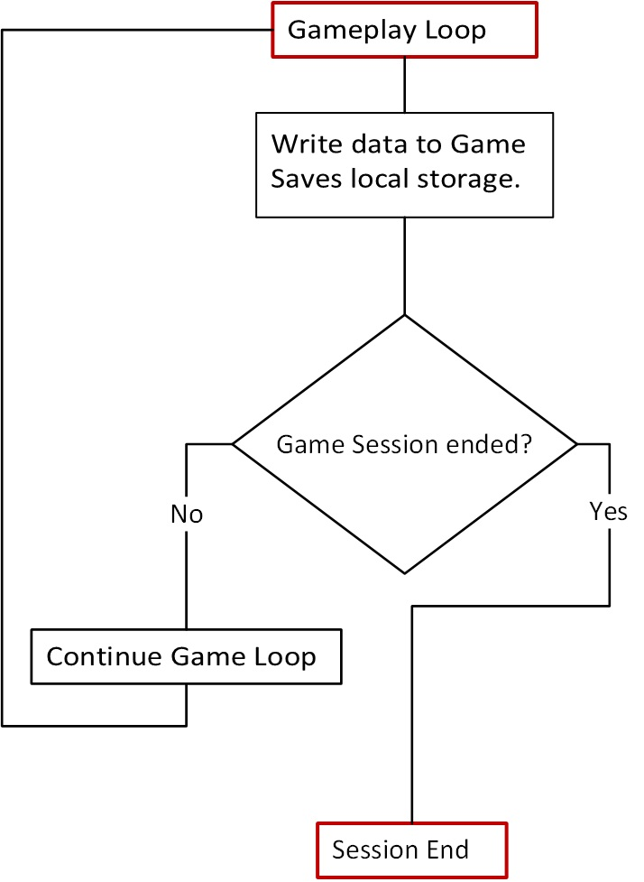
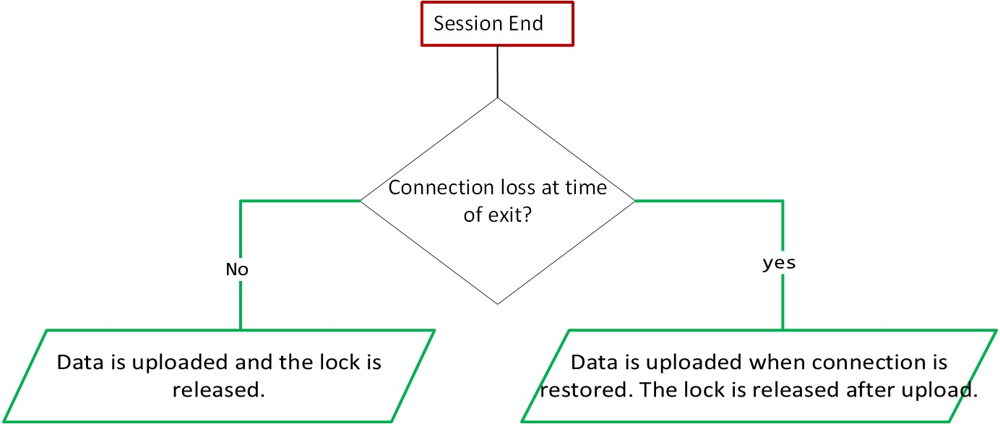

# Understanding the Game Saves sync flow

This article describes the six-part synchronization flow for Game Saves. While behavior might differ slightly depending on the specific Game Saves API you use, the general flow for a user-initiated save is the same. The steps are as follows.

1. [Title start](game-saves-syncing.md#title-start)   
2. [Connection check](game-saves-syncing.md#connection-check)  
3. [Data ownership check](game-saves-syncing.md#data-ownership-check)  
4. [Syncing data with the cloud](game-saves-syncing.md#syncing-data-with-the-cloud)  
5. [Gameplay loop](game-saves-syncing.md#gameplay-loop)  
6. [Session end](game-saves-syncing.md#session-end)

## Title start

When the title launches, the first step is to determine the user who Game Saves is being managed for.
If the user has an active game session on another device, a system dialog asks the user to switch devices. If the user switches, the other device syncs its latest local Game Saves data to the new device. If you want data to be local and bound to the device, you can use a machine-only provider. This option passes in a `null` user handle into the Game Saves APIs. 

After the title selects the user, it initializes Game Saves with that user’s handle. During initialization, Game Saves connects to the Xbox network to prepare the user’s storage space.

| API            | Game Saves provider initialization function |
| -------------- | ------------------------------------------ |
| `XGameSave`      | `XGameSaveInitializeProvider()`              |
| `XGameSaveFiles` | `XGameSaveFilesGetFolderWithUIAsync()`       |

Relevant system dialog: 

For information about user models and user management, see [User models](game-saves-developer-guide.md#user-models).

For information about storage, see [Game Saves storage systems](game-saves-storage-systems.md#game-saves-storage-systems).

## Connection check

Next, the title determines if it can connect to the Xbox network to confirm that syncing to the cloud is possible. If the title can’t connect, the user gets an option to retry or resume the title in offline mode. Game Saves can be run in offline mode.

Relevant system dialogs:

### Offline behavior

| Xbox network access | Data sync pattern |
| ---------------- | ------ |
| Yes              | Normal cloud sync flow. Continue to data-ownership check. |
| No               | Offline mode: The title saves data to the user’s local Game Saves storage, but the current session doesn’t sync with the cloud. |

## Data ownership check

After the connection is confirmed, the title determines if the device has the right to modify the data. If the device does, it can acquire a lock to the title. For a title to obtain and release a lock, the title requires access to Xbox services.

The title checks if there’s another device that holds a lock to the users’ data. This device might still retain a lock for the following reasons.

- Being disconnected from the Xbox network, making the device unable to call `WebReleaseLock`.
- The other device is uploading a large Game Save and is unable to call `WebReleaseLock`.

If another device holds the lock, the user has the following options.

- Forcefully acquire the lock from the other device, causing the other device to lose session data.
- Try to acquire the lock normally again.
- Cancel acquiring the lock.

If the user cancels acquiring the lock, the title launches in offline mode.

For more connections lost and lock scenarios, see [Connection loss and lock scenarios](game-saves-syncing.md#connection-loss-and-lock-scenarios).

Relevant system dialogs:

For details about monitoring lock acquisition over the Xbox network, see [Inspecting Game Saves network traffic](game-saves-tools.md#inspecting-game-saves-network-traffic).

## Syncing data with the cloud

After the title acquires the lock on the user’s data, it syncs that data with the cloud. The title then determines if it does one of the following actions:

- Upload the local Game Saves data. 
- Download cloud data and update the local Game Saves data.
- Take no action.
- Resolve any data conflicts.

The title determines this by comparing two timestamps.

- **Local save time**: When this device last wrote a save
- **Cloud save time**: When the cloud copy was last updated

### The four sync outcomes

| Local vs. cloud         | Action                           | What it means                                              |
| ---------------------- | -------------------------------- | ---------------------------------------------------------- |
| Neither changed    | Do nothing                   | Data matches in both locations. No new progress.  |
| Only local changed | Upload local>cloud         | User played offline. Send the newer local game save data to the cloud.         |
| Only cloud changed | Download cloud>local       | User played on another device. Get their game save data from the cloud.       |
| Both changed       | Conflict>prompt the user | Each location shows progress. The other device doesn’t. User resolves. |

> [!NOTE]
> If the download from the cloud occurs, a sync dialog appears, [Syncing data for ...](game-saves-dialogues.md#syncing-data). If the user cancels the Game Saves by using this dialog, the title continues in offline mode.

### Changed and save states

This scenario assumes the user is playing on two devices, Device A and Device B.

**Local changed**  

The user made progress while offline on Device A. For example, the user leveled up to 126 on Device A without an internet connection.

**Cloud changed**  

Progress was uploaded from Device B since the user last synced Device A. For example, The user leveled up to 99 on Device B and uploaded to the cloud.

**Both changed**  

The user played offline on Device A. The user also played on Device B since they last synced Device A. For example, Device A is level 126. The cloud is level 99. 

If there's a conflict, the system prompts the user to resolve it with a dialog: [Which one do you want to use?](game-saves-dialogues.md#which-one-do-you-want-to-use)

### Atomicity

Game Saves are atomic at the container (folder) level. If the cloud folder includes a blob that the matching local folder doesn’t contain, the system treats the two folders as separate. This difference creates a conflict.

## Gameplay loop

The *gameplay loop* is the active part of the game session. It begins after the title finishes syncing save data with the cloud.

During the active game session, the title reads and writes save data locally. All data created or updated in this period stays in Game Saves local storage until the system performs a cloud sync.

The gameplay loop ends when the user’s game session ends if one of the following conditions is true for console or PC. A session ends when a console or PC triggers a state change such as suspension, termination, sign out, or another system event.

### Periodic synchronization to the cloud

Every 30 minutes of gameplay, the title attempts to automatically sync to the cloud. This behavior is based on the following scenarios.

| Game Saves API | Action | When                                                                                |
| -------------- | -------| ----------------------------------------------------------------------------------- |
| `XGameSaveFiles`, No-code cloud saves| Upload local>cloud | 30 minutes elapsed since the game wrote to the designated save area. |
| `XGameSave`   | Upload local>cloud | Every 30 minutes of gameplay. |

## Session end

After the game session ends, the title uploads the new data to the cloud.
The device attempts to upload data to the cloud when the device has a connection. After the data is uploaded, the lock is released.

To see the lock release on the Xbox network for debugging, see [Inspecting Game Saves Network Traffic](game-saves-tools.md#inspecting-game-saves-network-traffic).

## Connection loss and lock scenarios

Data written during connection loss is stored in Game Saves local storage and uploaded after the connection resumes. However, if the user attempts to use another device, the current device is unable to release the lock because the connection was lost. The user is able to force a transfer of the lock to another device. Depending on when these lock transfers occur, a title can experience differing behavior.

### Connection loss before title start

>**When:** The user launches a title without a connection.

The title provides the user with the option to launch in offline mode because there's no connection.
When the device reconnects to the Xbox network and the cloud contains newer data, the title treats the local data as stale. In this case, the title ends the game session by terminating the app with a suspend operation.

Relevant system dialog: [We need to close this game or app](game-saves-dialogues.md#we-need-to-close-this-game-or-app)

### Connection loss during the gameplay loop

>**When:** The user is in an active game session, and the title still holds the lock. At some point, the connection is lost. The title then allows gameplay during this loss.

| Offline device | Lock state on reconnect    | Title action on reconnect                                         | User experience/UI    |
| -------------- | -------------------------- | ----------------------------------------------------------------- | ------------------------- |
| Console        | Still holds lock           | Continue saving locally.                                           | Saves go to local storage. |
| Console        | Lock taken by another device | The title terminates.                                            | Exit to Home screen.       |
| PC        | Still holds lock           | Continue saving locally.                                           | Saves go to local storage. |
| PC        | Lock taken by other device | Gameplay resumes as normal. Conflict resolution is done on the next sync. | Gameplay resumes.         |

### Connection loss before session end (terminate or suspend)

> **When:** The player quits/suspends the title while the device is disconnected. The device still has unsynced local data.

| Offline device | Time of connection loss | Lock state on reconnect    | Device action on reconnect |
| -------------- | ----------------------- | -------------------------- | ------ |
| Console        | Before termination      | Still holds lock           | Data uploaded and lock released.  |
| Console        | Before termination | Lock taken by other device | Data goes through merge resolution on next title start. |
| Console        | Before suspend   | Still holds lock           | Data uploaded and lock released. |
| Console        | Before suspend   | Lock taken by other device | Title terminated, data goes through merge resolution on next title start. |
| PC        | Before termination | Still holds lock      | Data uploaded and lock released. |
| PC        | Before termination | Lock taken by other device | Data goes through merge resolution on next title start.  |
| PC        | Before suspend   | Still holds lock  | Data uploaded and lock released. |
| PC        | Before suspend   | Lock taken by another device | Data goes through merge resolution on next title start. |

## Power loss

Power loss acts similarly to connection loss. The main difference is that any save operations that were active are lost.