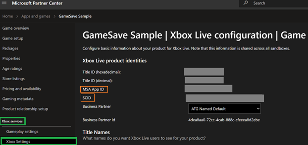
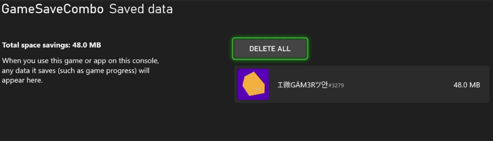
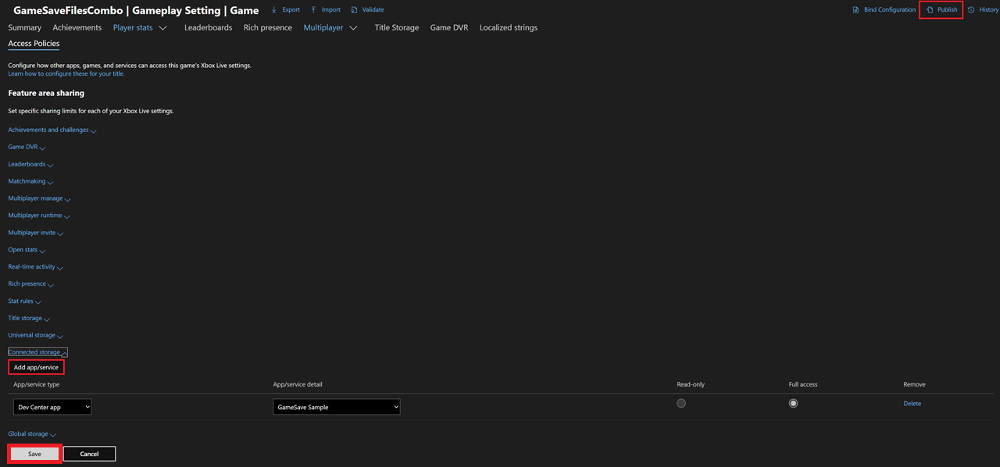

# Game Saves walkthroughs and samples

This article provides practical step-by-step instructions for common development and migration scenarios when using Game Saves. Essential setup in Microsoft Partner Center, best practices for writing data safely, platform-specific save management, and recommended testing procedures are covered.

## Partner Center configurations

### Enabling Xbox services and Game Saves for your title

To use the Game Saves APIs, use Partner Center to do the following:

- Enable Xbox services.
  1. Sign in to [Partner Center](https://partner.microsoft.com/dashboard/home). 
  2. Go to your title, and then use the settings to enable Xbox services. For more information about this step, see [Setting up an app or game at Partner Center, for Managed Partners](../../../services/fundamentals//portal-config/live-setup-partner-center-partners.md#2-contact-your-microsoft-representative-to-enable-your-app-or-game).
- Get your service configuration identifier (SCID). All read and write operations must be associated with a SCID. It’s also used for Game Saves initialization.
  - In Partner Center, it can be found under the **Xbox services**>**Xbox settings** tab for your title. Your Microsoft account (MSA) App ID (MSAAppID) is also found on this page.

    

After you have your SCID and MSAAppID, add  this App ID to the title’s config (.mgc) file.

For more information about game config files, see [Creating the Microsoft Game Config .mgc](../game-config/MicrosoftGameConfig-Overview.md)

## Development scenarios

### Where do I integrate Game Saves in my code?

Game Saves logic is dependent on user sign-in. Add Game Saves code should be next to the User Sign in flow.

### How do I ensure that my Game Saves data doesn't become corrupted?

To save data safely and avoid its corruption, follow these steps. This guidance applies to all save operations.

1. Write to a temporary file.
    - Serialize your save data into a new file (for example, `save.tmp`) rather than overwriting the live save. This step protects the existing save in case your process is interrupted mid-write.
2. Close the write handle after the write is fully committed to disk.
3. Replace the old save file atomically with the new temporary file by using the Win32 [ReplaceFile](/windows/win32/api/winbase/nf-winbase-replacefilea).

### How do I support offline devices?

The developer is responsible for determining how the title behaves if there's connection loss both before and after initializing Game Saves. 

For more information about offline behavior, see [Understanding the Game Saves sync flow](game-saves-syncing.md#connection-check).

### What user interactions do I need to be aware of?

The OS shows system prompts when an action requires user input. For information about these prompts, see [Game Saves dialogs](game-saves-dialogues.md).

### Is there a way to save locally and to the device only?

If you pass a `null` user handle into the Game Save initialization process, you end up with a machine-only provider. The data stays local and persistent, up to a total limit of 256 MB. It doesn’t sync to the cloud.

For more information about Game Saves storage, see [Game Saves storage systems](game-saves-storage-systems.md)

### Managing Game Saves through the device

#### Accessing local Game Saves on PC by using File Explorer

If your title runs on PC, you have direct access to the files. Depending on Game Saves API implementation, you can access your local Game Saves at the following locations.

| Game Saves API | File path                                                                     |
| :------------- | :---------------------------------------------------------------------------- |
| XGameSaveFiles | `%AppData%\Local\Packages\<PACKAGE_NAME>\SystemAppData\xgs\<HexXuid>_<Scid>\` |
| XGameSave      | `%AppData%\Local\Packages\<PACKAGE_NAME>\SystemAppData\wgs\<HexXuid>_<Scid>\` |

When manipulating data on PC, sync logic still applies. For example, modifying data when the title doesn't have a lock causes conflicts.

#### Accessing local Game Saves on console

Manage the console save data via the Xbox UI. Access it by using the following steps.

1. Select the **Home** button on the Xbox controller.

1. Select **My games & apps**>**See all**.

1. Hover over your game, and then select the **View** button.

1. Select **Saved data**.



Be aware of the following when manipulating data directly on console.

- Deleting data on the console by using the system UI *doesn’t remove the copy stored in the cloud*. When you launch the title again, it syncs the data from the cloud.
- Machine-provider data appears as a user with no name. This data stays on the device, doesn’t sync to the cloud, and is bound to the device.

For more information about the machine provider, see [Game Saves storage systems](game-saves-storage-systems.md#game-saves-storage-systems).

For more detailed control of Game Saves, use [Game Saves tools](game-saves-tools.md#manipulating-game-saves).

## Testing scenarios

When you create test cases, ensure that you separate data validation from the game‑save logic.

### Test if Game Saves are syncing correctly to and from the cloud

Use the following steps to test for correct syncing. The test flows verify the behavior.

`XGameSaveFiles`:

1. Confirm that the SCID is correct.
2. Confirm that you're using the correct user handle.
3. Confirm that the title calls `XGameSaveFilesGetFolderWithUIAsync` during the current game session. If the title resumes from a suspend state, call the function.
    a. Use Fiddler to confirm the lock was acquired.
    b. Save this path and use it later to confirm that the data is uploading.
4. Write some data to the file path provided by `XGameSaveFilesGetFolderWithUIAsync`
5. Terminate or suspend the title.
6. Wait 10&ndash;30 seconds for the OS to automatically upload the data to the cloud and release the lock.
    a. Confirm that the data was uploaded and the lock was released with Fiddler.
7. Manually delete the data in the folder provided by `XGameSaveFilesGetFolderWithUIAsync`.
    b. On console, access this data through player settings.
8. Launch the title again, and then attempt to sign the user in.
9. A sync dialog appears, showing an active download sync from the cloud.

Here are some resources to help test successful syncing.

- [Game Saves tools to inspect traffic and manipulate saves](game-saves-tools.md)  
- [Understanding the Game Saves sync flow](game-saves-syncing.md)

### Test if Game Saves is roaming correctly

For a test plan to confirm if data is roaming, see [XR-052-06 Test Plan](../../../store/policies/XR/XR052.md#052-06-cloud-storage-roaming)

## Migration scenarios

### Sharing Game Saves across titles

To transfer or access data from one title to another, two steps are required. 

1. Modify the access policies of the title you want to access in Partner Center. 
2. Initialize the Game Saves providers for both titles in source code.

#### Modify access policies 

A title can control which titles have access to its Game Saves data by configuring access policies. 

1. Go to [Partner Center]( https://partner.microsoft.com/dashboard). 
2. Select **Apps and games** > **\<your title\>** > **Gameplay settings**. 
3.  In **Gameplay Settings**, select **Access Policies**, and then expand **Connected Storage**. 
4.  Select **Add app/service**, and then add the titles that you want to provide access to. 
5.  After you finish adding the titles, select **Save**, and then select **Publish**. The changes take place within an hour.  

The following screenshot is an example of making the GameSaveFilesCombo title fully accessible to the GameSaveSample title. 



#### Initialize Game Save providers 

Now that you have permission to access the first title, the `XGameSave` data can be read from the other title.

 - If you're using `XGameSave`, call `XGameSaveInitializeProvider`/`XGameSaveInitializeProviderAsync` for each title. 
 - If you're using `XGameSaveFiles`, the providers are implicitly initialized. Call `XGameSaveFilesGetFolderWithUiAsync` for each title. 

### Interop between XGameSave and XGameSaveFiles

A title might need to use `XGameSave` together with `XGameSaveFiles`. The typical reasons might be as follows.

- The publisher has an existing title on console that's already using `XGameSave`.
- The publisher doesn't want to update that existing title to use `XGameSaveFiles`.
- The publisher thinks that adding `XGameSaveFiles` to a PC title is easier than using `XGameSave`, but still wants to support cross-saves between PC, console, and Xbox game streaming.

Moving between `XGameSave` and `XGameSaveFiles` is fairly straightforward. When the title calls [XGameSaveFilesGetFolderWithUiAsync](../../../reference/system/xgamesavefiles/functions/xgamesavefilesgetfolderwithuiasync.md), there's a mapping of containers and blobs to directories and files by using the following rules.

- Any forward slash (\/) in the container name creates the directory structure in which the file resides.
- The following characters are invalid for `XGameSaveFiles` and if encountered is mapped to an underscore (\_).
  - Characters from \\0 through \\001f, inclusive.
- The following characters aren't valid for `XGameSaveFiles`. If they're encountered, they're mapped to a period (\.).
  - Quotation marks (\")
  - Less than sign (\<)
  - Greater than sign (\>)
  - Pipe (\|)
  - Asterisk (\*)
  - Question mark (\?)
  - Backslash (\\)
- A slash (\/) in the blob name maps to a period (\.) in the file name.
- Files are limited to 16 MB. `XGameSave` supports a maximum upload size of 16 MB.

When the title moves from `XGameSaveFiles` back to `XGameSave`, it restores the original container and blob names if the file names remain unchanged or haven't been moved. 

### Porting previous titles to PC Game Saves with no-code cloud saves

Some titles that are ported to PC Game Pass might require a no-code cloud save solution. Reasons include the following:

- The title runs as an x86 application. It uses the Microsoft Game Development Kit (GDK) only in its packaged form.
- The title was created without developers writing code, using tools like Blueprint in Unreal Engine from Epic Games or Bolt from Unity.

Titles that use no‑code cloud saves read and write to their designated save directory through standard Win32 file I/O APIs. The system automatically syncs the data. It's not necessary to write special code to handle the synchronization and upload. Synchronization occurs before the title launches.

No-code cloud saves get uploaded when the title on PC is no longer active. The upload happens when one of the following is true.

- The title is terminated.
- The tracked user signs out.
- Power state change happens on PC.
- 30 minutes have elapsed since the title last wrote to the designated save area.

The no-code cloud save solution is built on top of `XGameSaveFiles` and shares all its limitations with respect to file sizes and per-user storage limits. Files are limited to 64 MB (or 16 MB if there's a need to have interoperation between `XGameSave` or Connected Storage). By default, the per-user storage is limited to 256 MB. Titles that need larger per-user storage limits can work with their Developer Partner Manager (DPM) to request an exception.

> [!NOTE]
> There are specific naming conventions and character limits for directories and file names. For more information, see [XGameSaveFiles path logic](XGameSaveFiles.md#xgamesavefiles-path-logic). 

No-code cloud saves are supported only on PC. The title requires the [Simplified User Model](../user/users-opting-into-simplified-model.md). It ensures that a user is signed in before the title launches. If a user can't be signed in to the title, it doesn't launch. If the user is signed out during game play, it gets terminated.

### Enabling no-code cloud saves

To enable no-code cloud saves, do the following:

1. Modify your MicrosoftGame.config file. 
1. Enable the simplified user model.
1. Specify the root folder that you expect the save files to get written to and read from. 
1. Provide the title's corresponding SCID.

This process is shown in the following code example.

```
<Game configVersion="1">
   <Identity Name="SampleNameOne" Publisher="CN=NoPublisher"/>
   <SaveGameStorage>
      <NoCodePCRoot RelativeTo="SavedGames">test\path</NoCodePCRoot>
      <SCID>DF9D8061-4790-4B84-86B4-CD060B00B4DD</SCID>
      <MaxUserQuota>256</MaxUserQuota>
   </SaveGameStorage>
   <!-- Content removed for brevity -->
   
   <!-- Must also opt into requiring a default user at launch -->
   <AdvancedUserModel>false</AdvancedUserModel>
</Game>
```

The root folder that's specified by `NoCodePCRoot` must be relative to one of a small collection of options.

| RelativeTo      | Folder location on PC                           |
| --------------- | ----------------------------------------------- |
| `AppData`         | Maps to the environment variable %APPDATA%      |
| `Public`          | Maps to the environment variable %PUBLIC%       |
| `LocalAppData`    | Maps to the environment variable %LOCALAPPDATA% |
| `LocalAppDataLow` | Maps to %USERPROFILE%\AppData\LocalLow          |
| `ProgramData`     | Maps to the environment variable %PROGAMDATA%   |
| `SavedGames`      | Maps to %USERPROFILE%\Saved Games               |
| `UserProfile`     | Maps to the environment variable %USERPROFILE%  |

> [!IMPORTANT]
> We recommend using `SavedGames` as the `RelativeTo` value. The *Saved Games* folder (`%USERPROFILE%\Saved Games`) corresponds to the Windows known folder ID `FOLDERID_SavedGames` and is not synced by OneDrive by default. Other locations such as `AppData` (`%APPDATA%`) fall under the user's *Documents* hierarchy and can be affected by OneDrive's auto-syncing behavior, which may cause conflicts with cloud save synchronization. For more information about `FOLDERID_SavedGames`, see [SHGetKnownFolderPath](/windows/win32/api/shlobj_core/nf-shlobj_core-shgetknownfolderpath).

*Files can't be placed directly in the root directory*.Nest them within at least one subfolder from the root folder. For example, using a file name directly, like `<NoCodePCRoot RelativeTo="SavedGames">savegame1.sav</NoCodePCRoot>`, wouldn't be valid because savegame1.sav would be ignored. `<NoCodePCRoot>` is intended to define a directory path, not a specific file.

## Code samples

- [GameSaveCombo](/samples/microsoft/xbox-gdk-samples/gamesavecombo/)
- [GameSaveFilesCombo](/samples/microsoft/xbox-gdk-samples/gamesavefilescombo/)