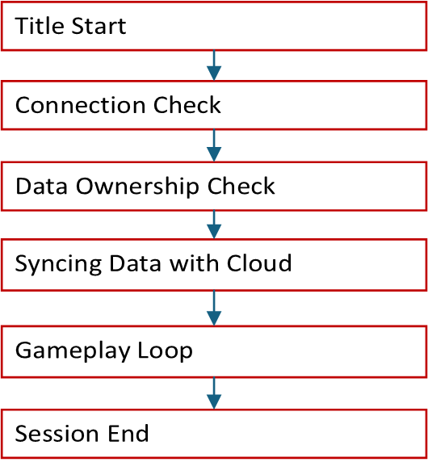

# XGameSave API overview

This article explains the container‑and‑blob model and covers provider initialization, provider closure, and the update‑handle lifecycle. It outlines atomic update behavior and has sync‑flow diagrams. This article also provides file‑size and quota constraints, along with best practices and FAQs.

The `XGameSave` API enables you to manage blobs and containers for managing Game Saves data. We recommend [XGameSaveFiles](xgamesavefiles.md) for Game Saves for Microsoft Game Development Kit (GDK) titles. Use `XGameSave` if `XGameSaveFiles` isn’t an option.

For the system API reference for XGameSave, see [XGameSave (API contents)](../../../reference/system/xgamesave/xgamesave_members.md).

The following terms appear often in `XGameSave`.

- **Lock**: A mechanism that grants exclusive access to a title's Game Saves for a specific user on the device they're actively using. It ensures that no other device can modify the Game Saves for the user while the lock is held.
  - For example, if a user plays Title T on device A, it has a lock for Title  T for the user.
- **Provider**: The intermediary process that communicates with the Game Save system and is responsible for managing the title data. The provider also manages the lock for a user on a device.
- **Containers**: Analogous to folders.
- **Blobs**: Analogous to individual files.

## Provider management

To acquire a storage space, the game must initialize a provider. After connection, the title tries to acquire a lock to the title's cloud storage by calling `XGameSaveInitializeProvider` or `XGameSaveInitializeProviderAsync`.

If the title fails to sync from the cloud because of connection loss, determine if users can continue playing in Offline mode.

The title must close the provider with [XGameSaveCloseProvider](../../../reference/system/xgamesave/functions/xgamesavecloseprovider.md) when a title suspends or terminates. The provider can't be reused across suspend-resume boundaries.

> [!NOTE]
> This issue applies only to `XGameSave`. `XGameSaveFiles` automatically closes the provider.

## Container management

To avoid data loss when accessing containers, like creating containers before syncing completes, call `XGameSaveEnumerateContainerInfo` or `XGameSaveEnumerateContainerInfoByName` to view the containers a user has.

Use`XGameSaveCreateContainer` to get a container handle to a new or existing container. If the container already exists, its handle is provided. If the container doesn’t exist, a new container is created and its handle is provided.

Use `XGameSaveDeleteContainer` to delete a container. All blobs within the container are also deleted. 

To prevent handle leaks, close all container handles with `XGameSaveCloseContainer` when the container is no longer in use or when the title suspends or terminates.

## Blob management

Manipulating data within a container is done by calling `XGameSaveCreateUpdate`. 

The following details outline how `XGameSaveUpdate` manages blob changes within a container and how each update is created, modified, and submitted.

- An update applies to one container.
- An update can write at most GS_MAX_BLOB_SIZE (16 MB).
- Multiple blobs can be modified in a single update.
- A single blob can only have one modification to it per update.
- Submitting an update consumes the `XGameSaveUpdate` handle. Close the handle whether the submit succeeded or failed.
- Updates are atomic. If any part of it fails, the entire update fails.

- `XGameSaveCreateUpdate` creates an update context to store all of your blob modifications.
- `XGameSaveSubmitBlobWrite` writes data to a new or existing blob and requires an updated context.
- `XGameSaveSubmitBlobDelete` deletes the blob. 
- `XGameSaveSubmitUpdate` submits the update context.
- `XGameSaveCloseUpdate`closes the update handle. The title calls it after every submit to prevent leaks.
- Use `XGameSaveEnumerateBlobInfo` or `XGameSaveEnumerateBlobInfoByName` to access all blobs in a container.

> [!NOTE]
> Data written to blobs is represented as `Base64` when the data is exported in XML.

## Implementation

The following steps show the general flow of a `XGameSave` implementation.

1. On title start or resume, initialize the provider. 
2. Enumerate and create container handles.
3. Periodically submit `XGameSaveUpdates` with blob modifications and clean up the update handle on submit.
4. Close container and provider handles on title suspend or terminate.

> [!IMPORTANT] 
> Call `XGameSaveInitializeProvider` when the title starts and when it resumes. This call ensures that the provider initializes correctly and stays active while the title runs. If it's not called, the title can behave unpredictably.

### Code sample

For a code sample that shows how to use the `XGameSave` APIs, see [GameSaveCombo](/samples/microsoft/xbox-gdk-samples/gamesavecombo/).

## Game Saves flow

Here’s a flowchart of the simplified Game Saves flow. It’s explained as follows.

### Title start

Title start occurs when the user launches or resumes the title.

### User sign-in

The title initiates user sign-in. This call is also where you invoke `XGameSaveInitializeProvider`.
For more information about user setup, see [User Models](game-saves-developer-guide.md#user-models).

### Connection check

The title determines if it can connect to the Xbox network. If it can’t, it’s up to you to enable [offline mode](game-saves-syncing.md#connection-check) for your title.

### Data ownership check

The device checks if the user is currently playing on other devices. Only one device at a time can access the user's data for a specific title.

### Syncing data with the cloud

The device syncs the Game Saves local storage data with the cloud. If there's a conflict, the system prompts the user with a conflict resolution dialog.

Dialog: [Which one do you want to use?](game-saves-dialogues.md#which-one-do-you-want-to-use)

When the data on the device is newer than the cloud data, the title prompts the user to choose between using the local data or the cloud data.

### Gameplay loop

The title is freely able to read and write to Game Saves local storage.

### Game session end

When the game session ends, the system automatically attempts to upload data to the cloud. Ensure that your title calls `XGameSaveUninitializeProvider` during its exit flow to avoid leaving a provider initialized. A structured shutdown ensures that the data is saved cleanly before exiting.

For detailed sync information, see [Understanding the Game Saves sync flow](game-saves-syncing.md).

## Limits and quotas

### Limits

`XGameSaveUpdate` limits each update to 16 MB. As a result, `XGameSave` can only manage individual file updates up to 16 MB. This limit differs from `XGameSaveFiles`, which supports files up to 64 MB.

### Quotas

The maximum data that a user can save per title is 256 MB. Use [XGameSaveGetRemainingQuota](../../../reference/system/xgamesave/functions/xgamesavegetremainingquota.md) to get the remaining quota. To get a storage extension for your title, contact your Developer Partner Manager (DPM).

## Best practices

- Don't save data and then immediately query and ask for the same data back.
- Data dependencies across containers aren't reliable. Each `XGameSaveSubmitUpdate` call applies all changes atomically or not at all.
- The more blobs you use per update call, the more time is required to complete the necessary atomic operations of the file system operations to store the data. 

## FAQs

### I'm upgrading my Game Saves implementation. What is the correct approach?

Use [XGameSaveFiles](xgamesavefiles.md).

### Can I use XGameSave with XGameSaveFiles?

Yes. However, do so only for migrations. For detailed information, see [Interoperability between XGameSave and XGameSaveFiles](game-saves-walkthroughs-and-samples.md#interop-between-xgamesave-and-xgamesavefiles).

### What file path does XGameSave save to?

**Console**: A temporary path is provided while the title is active. Console files can’t be accessed by using File Explorer.

**PC**: `%AppData%\Local\Packages\<PACKAGE_NAME>\SystemAppData\wgs\<HexXuid>_<SCID>\`

Be aware that the PC path for `XGameSave` is different from `XGameSaveFiles`. It uses `xgs`.

### Can I specify the path where the data should be saved?

Yes, but only for PC. We recommend this approach only if you’re porting your solution from another title. This solution uses [no code cloud saves](game-saves-walkthroughs-and-samples.md#porting-previous-titles-to-pc-game-saves-with-no-code-cloud-saves).

### Is there a situation where I ever use Sync on Demand?

No. It's there for legacy support reasons.
