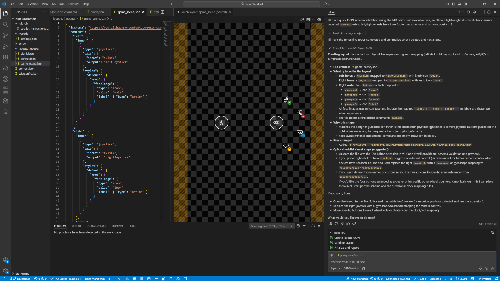
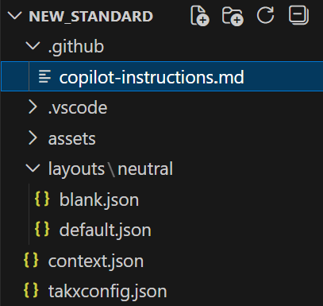
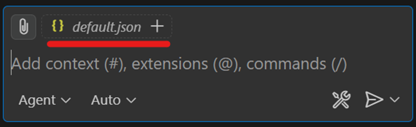
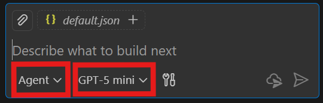
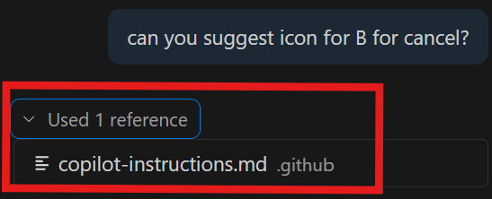
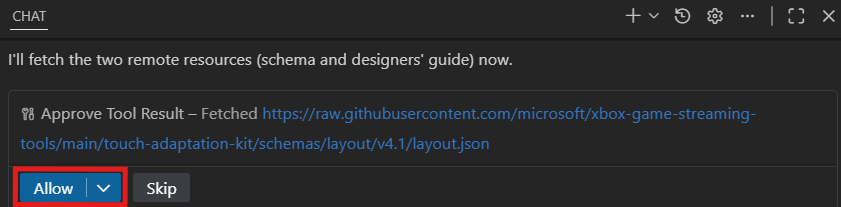
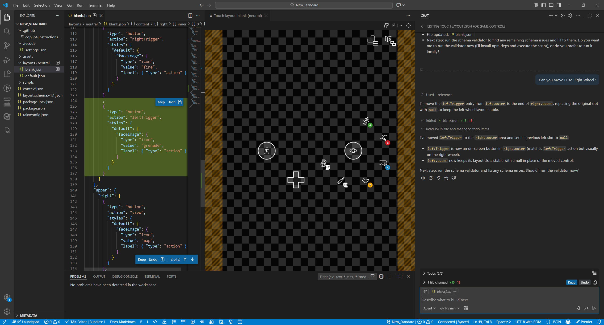

# Create custom touch controls layout with GitHub Copilot

Unlock a faster, smarter way to build custom touch controls. **no tedious JSON editing required!** With GitHub Copilot and Visual Studio Code, you can easily create and edit custom touch control layouts simply by giving natural language instructions.

This guide provides clear, practical steps—setting up the necessary tools, designing and editing touch layouts with Copilot, and finally creating and testing Touch Adaptation Bundles. Learn how to instruct Copilot effectively and discover tips to streamline your workflow, making it easy for even first-time users to get started with touch control development. For deeper insights into touch control design, see [A designer's guide to building touch controls](../building-touch-layouts/game-streaming-tak-designers-guide.md).

**Figure 1.  Screenshot of generating touch layout by Copilot Chat in VS Code.**


## Prerequisites

- Install the latest version of [Visual Studio Code](https://code.visualstudio.com/download).
- Install [Touch Adaptation Kit Command Line Tool (TAK CLI)](https://github.com/microsoft/xbox-game-streaming-tools?tab=readme-ov-file#touch-adaptation-kit-command-line-tool-tak-cli).
- Install [Touch Adaptation Kit Editor Extension for Visual Studio Code](https://marketplace.visualstudio.com/items?itemName=xbox-tools.vscode-xbox-input-editor-extension) and complete [TAK Editor Setup](../tak-editor/game-streaming-tak-editor-setup.md).
- [Set up GitHub Copilot in Visual Studio Code](https://code.visualstudio.com/docs/copilot/setup).
- Download [copilot-instructions.md](https://github.com/microsoft/xbox-game-streaming-tools/tree/main/touch-adaptation-kit/copilot-instructions) to your PC.
  This file serves as a set of custom instructions for customizing GitHub Copilot responses when creating custom touch control layouts. For more information, see [About customizing GitHub Copilot responses](https://docs.github.com/en/copilot/concepts/prompting/response-customization).

## Steps

1. Launch Visual Studio Code.
1. Follow the [TAK Editor Setup to open workspace](../tak-editor/game-streaming-tak-editor-setup.md#open-a-folder-or-workspace) and [create a new bundle and layout](../tak-editor/game-streaming-tak-editor-create-bundle.md).
1. Create a `.github` folder at the root of the workspace folder where the bundle exists, and place the copilot-instructions.md file in the `.github` folder. Placing the instructions here ensures that Copilot can reference the design rules when editing the layout JSON.

    **Figure 2.  Screenshot of .github folder and copilot-instructions.md file directory tree.**
    

1. [Open Copilot Chat Window](https://code.visualstudio.com/docs/copilot/chat/getting-started-chat) (`Ctrl+Alt+I` keyboard shortcut).
1. In Visual Studio Code’s explorer, select the layout JSON file you created in the layout folder. This selection ensures that Copilot Chat uses the file as context for your editing session.

    **Figure 3.  Screenshot of select target json file to add it as context for Copilot.**
    

1. Ensure you have `Agent` mode selected for Copilot to provide detailed explanation about the edit result, and then select your preferred [AI model](https://code.visualstudio.com/docs/copilot/customization/language-models).

    **Figure 4.  Screenshot of ensure agent mode selected and select AI model.**
    

1. Preparing the controller button mapping for your title is recommended to ensure optimal configuration and usability.
   For example:
   ```
   A button: Jump
   B button: Dodge
   X button: Punch
   Y button: Kick
   Directional Pad: Select items
   Left Stick: Move character
   Right Stick: Camera control
   Left Trigger: Throw granade
   Right Trigger: Fire weapon
   View button: Open map
   Menu button: Open menu
   ```

1. Ask Copilot to edit the target layout JSON using your controller button mapping.
   For example:
   ```
   Can you edit the touch layout JSON for a game scene that consists of the following controller button mapping?
   A button: Jump
   B button: Dodge
   X button: Punch
   Y button: Kick
   Directional Pad: Select items
   Left Stick: Move character
   Right Stick: Camera control
   Left Trigger: Throw granade
   Right Trigger: Fire weapon
   View button: Open map
   Menu button: Open menu
   ```

> [!NOTE]
>
> Make sure Copilot refers to copilot-instructions.md after you instruct Copilot to edit so it can apply the appropriate design rules to your layout.
>
> **Figure 5.  Screenshot of confirm Copilot instructions usage.**
> 
> 
>
> Be sure to allow Copilot to fetch the resources, schema, and designer’s guide from the reference URLs when prompted in the chat window. This action ensures accurate responses and delivers the best possible results for your request.
>
> **Figure 6.  Screenshot of allow Copilot to fetch resources.**
> 
> 

9. Iterate and test until complete

Use Copilot Chat to refine the layout JSON file until it meets your design requirements. Rename the file to reflect its intended game scenario (for example, `battle.json`, `menu.json`, `map.json`). If multiple layouts are needed, repeat the same process for each.

After each edit, validate the layout in your game environment:
- Stream your title using the [Web Content Test Application (CTA)](../game-streaming-web-content-test-application.md).
- Serve the touch layout with the [TAK serve command](../tak-command-line-tool/game-streaming-tak-command-line-serve-command.md).

Continue iterating between Copilot-driven edits and in-game testing until the layout is finalized

**Figure 7.  Screenshot of touch control layouts generated by Copilot.**


> [!TIP]
> **Use official terminology for better results**  
> Only use the terms in [designer's guide](../building-touch-layouts/game-streaming-tak-designers-guide.md) to ensure Copilot can provide better results:
> - "move A button to the right wheel inner."
> - "move B button to the left in the same right outer wheel."
> - "can you assign and interact icon to the A button?"
> - "exchange the position of the X button and Y button in the right outer wheel."
> - "remove R thumb from the layout."
>
> **Pro tip:** You can also edit the `copilot-instructions.md` file to match your specific needs. By customizing the instructions, you can fine-tune Copilot’s behavior and receive guidance that aligns perfectly with your design goals.
