# A designer's guide to building touch controls

## Table of contents

1. [Overview](#overview)
    1. [Benefits of adding touch controls to Xbox console games](#benefits-of-adding-touch-controls-to-xbox-console-games)
2. [Best practices](#best-practices)
    1. [Play other touch supported games first](#play-other-touch-supported-games-first)
    2. [Use touch controls to play your unmodified game](#use-touch-controls-to-play-your-unmodified-game)
    3. [Start from a template and stay minimal](#start-from-a-template-and-stay-minimal)
    4. [Follow control placement guidelines](#follow-control-placement-guidelines)
        1. [Left wheel](#left-wheel)
        2. [Right wheel](#right-wheel)
        3. [Upper](#upper)
        4. [Lower](#lower)
    5. [Follow tips for specific control types and advanced scenarios](#follow-tips-for-specific-control-types-and-advanced-scenarios)
        1. [4-way and 8-way D-pads](#4-way-and-8-way-d-pads)
        2. [Gyroscope aiming and tips for shooter games](#gyroscope-aiming-and-tips-for-shooter-games)
        3. [Handling complex and combination actions](#handling-complex-and-combination-actions)
    6. [Use the Touch Adaptation Kit Editor](#use-the-touch-adaptation-kit-editor)
    7. [Change the touch controls to match the current in-game scenario](#change-the-touch-controls-to-match-the-current-in-game-scenario)
    8. [Use a cinematic layout to keep immersion during movies and cut-scenes](#use-a-cinematic-layout-to-keep-immersion-during-movies-and-cut-scenes)
    9. [Use native touch to fully customize touch interactions](#use-native-touch-to-fully-customize-touch-interactions)
    10. [Use custom assets to match the art style of the game](#use-custom-assets-to-match-the-art-style-of-the-game)
    11. [Change in-game UI, hints and control remapping for touch controls](#change-in-game-ui-hints-and-control-remapping-for-touch-controls)
    12. [Check for common issues for touch controls and Xbox Game Streaming](#check-for-common-issues-for-touch-controls-and-xbox-game-streaming)
        1. [Disconnection during gameplay](#disconnection-during-gameplay)
        2. [Compatibility with various device types](#compatibility-with-various-device-types)

## Overview

This article explains why adding touch controls to Xbox console games is beneficial and provides best practices about how to create great touch control experiences.

Touch controls have been one of the top player-requested features for cloud gaming titles. These controls are supported for both Xbox Cloud Gaming (Beta) and Xbox Remote Play. Xbox touch controls unlock new ways for players to interact with their games, providing players with even more choices in how and when they play. By collaborating with game developers to integrate touch controls into over 200 games, much has been learned. Touch controls help developers be more creative and flexible in how players interact with their games without a gamepad across different devices and platforms. By considering touch controls and physical gamepad mapping in the early stages of development, developers can design more intuitive and accessible gameplay experiences that cater to different preferences and situations.

### Benefits of adding touch controls to Xbox console games

Touch controls enable players, wherever they are, to enjoy games by removing the need for a gamepad. This makes games accessible to a wider and more diverse audience, especially new or casual players who might not have a gamepad or prefer playing without one. Xbox Game Streaming telemetry and data shows a tangible increase in gameplay time and user sentiment across different genres for games that have implemented touch controls. Twenty percent of Xbox Cloud Gaming players use touch as their exclusive method of playing games. In addition, titles that provide touch controls are played, on average and across genres, about twice as much as titles that do not. Also, players using touch controls provide, on average, equivalent if not higher satisfaction to the overall streaming sentiment for that title. As such, it's important that the touch-enabled games are relevant and, most importantly, play well with touch controls. Finally, touch supported games have special highlighting in the catalog with the 'Play with Touch' filter and 'Touch supported' label as shown in the below screenshot. Combining all of these factors, it is clear the importance of making a game touch-enabled and, even more importantly, ensuring it plays well with touch controls.

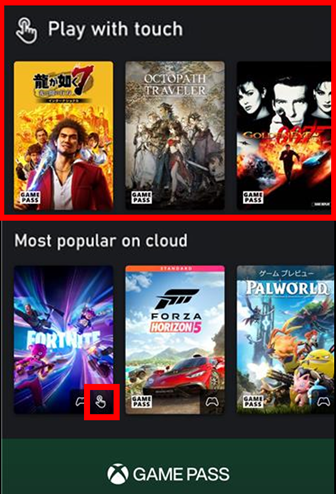

## Best practices

This guide provides essential practices for creating touch controls for your game. They're focused on delivering a smooth and natural experience for players on touchscreen devices. Most of these practices can be easily integrated without needing to change your existing game code.

### Play other touch supported games first

Many great examples of touch supported games already exist. While no two games are identical in their input requirements, you can learn what type of touch controls and layouts might fit your game, how to use native touch, and more, simply by getting familiar with the existing touch supported titles. For more information about how to play games with touch controls, see [Use Xbox touch controls with cloud gaming or remote play](https://support.xbox.com/help/games-apps/cloud-gaming/use-touch-controls).

### Use touch controls to play your unmodified game

It's important to simply play your game with touch controls to understand how it works with them. This is easily done by streaming from your Development Kit to a touch device by using the Standard layout within the Content Test Application. For information about how to set up a streaming development environment, see [Game streaming test prerequisites](../game-streaming-stream-your-game.md).

> [!NOTE]
> While the `Standard` layout is useful to get feel for touch controls with your game, we don't recommend the layout for playing games in general. To develop touch controls for your game, see the following guidelines.

By using the Standard layout, it will become apparent where it's difficult to control the game and where you can create a better layout. The following best practices walk through how to achieve a more fun and fluid experience using touch.

### Start from a template and stay minimal

Getting started with custom touch controls in your game is simple. No game code changes are needed. In just a few minutes, you can take a sample layout from templates, either from [Xbox GitHub](https://github.com/microsoft/xbox-game-streaming-tools/tree/main/touch-adaptation-kit/samples/sample-layouts) or by using the [Create Command](../tak-command-line-tool/game-streaming-tak-command-line-create-command.md) to customize the layout for your game's specific needs. Eliminate all unnecessary buttons, and then customize the templates. While the templates already apply many of the best practices for contol locations, the next section provides a deeper set of guidelines for customizing layouts.

### Follow control placement guidelines

A traditional gamepad control scheme often uses up to four simultaneous inputs. As seen in the following image, typically gameplay requires the use of both thumbs and two fingers on the controller simultaneously. (The controls in green are typically accessed by usiung thumbs. The controls in red are accessed by using fingers.)

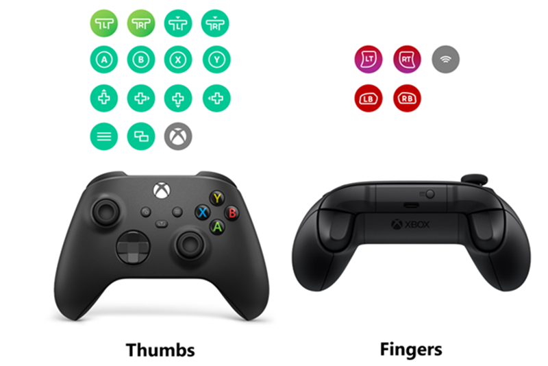

Touch interfaces, in contrast with gamepads, are much more constrained. Usually only two inputs at a time are possible by using the left and right thumb while holding a device. No controls typically exist on the sides or back of a touch device to allow more simultaneous inputs. In addition, touch controls can't provide the same physical response of pressing buttons or actuating a trigger like a gamepad does. Careful consideration of where to place controls and how to map them is critical to providing a fun experience.

The following image of standard controller layout shows all possible buttons. The most used controls are in zones where players' fingers are comfortable as shown in the gray bands. Notice how a player's thumbs can only reach so far into the center of the screen and how the regions of comfortable movement are often almost radial from where the device is being gripped.

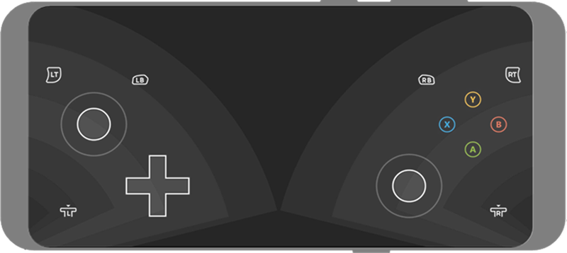

Although the Standard layout provides all available inputs from a physical Xbox controller, it's likely not a great way to play your game. Also, it's probably not very fun for players. Because each game uses different controls in most cases and in different combinations, it's preferable to customize which controls are most readily available to players based on the different control zones that the Touch Adaptation Kit provides.
The following image shows the locations that are available to place controls in. Those within a zone are placed into slots that are arranged in various locations on the screen.

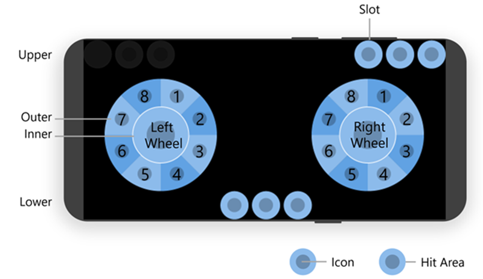

Typically, the player's thumbs are over the left and right wheels for most of gameplay. Theese locations are where the primary actions for your game should go. The `upper` and `lower` zones, in contrast, are best suited to less frequently used actions. It might require a player to consciously move their thumbs to reach those controls, especially on larger devices like tablets. The following section provides lots of details about each zone and where to consider placing various game actions.

Lastly, it's very important to play your game and rank all actions by how frequency they're used. For example, in a shooter game's FPS mode, frequent actions are shooting, reloading, aiming and moving the character. Less common actions are switching weapons, throwing a grenade, and using items. The least used actions are opening a menu and a map. You can apply this ranking to place touch controls by using the following guidelines in terms of primary, secondary and tertiary actions.

#### Left wheel

The left wheel is typically used for player movement or locomotion and actions that need to be done while the player is moving.

##### **Inner**

The left [inner wheel](../../../../reference/system/touchadaptationkit/layout/game-streaming-touch-inner-wheel.md) ring is typically reserved for [only one control](../../../../reference/system/touchadaptationkit/layout/game-streaming-touch-inner-wheel.md#pattern-1-one-control) that moves the character around. This is the primary locomotion action.

###### Tips

1. Use a non-relative (absolute) left joystick in character-controlled games. The term *relative* refers to how a joystick responds to touch movement with respect to where the touch began. For more information, see [Joystick](../../../../reference/system/touchadaptationkit/controls/game-streaming-touch-joystick.md).

2. Use a relative left joystick instead if a game has a system to change speed such as from a walk to a run based on the amount of left joystick input. Non-relative joystick doesn't work well in the situation where a player needs to gradually change the input to change speed.

3. In 2D games that can use either a D-pad or the left joystick to control character locomotion, use a [Directional Pad](../../../../reference/system/touchadaptationkit/controls/game-streaming-touch-directionalpad.md) instead of a joystick control. Do so unless the left joystick provides funtionality that a D-pad doesn't (for example, speed or fine angle direction). When using a joystick instead of D-pad, preferably use a non-relative joystick for 2D character locomotion.

4. For specific layouts that navigate only menues, use a D-pad control where possible. If a D-pad can't be used, use a non-relative joystick.

5. Use a relative joystick for simple layouts. Relative joysticks are more familiar to players who are accustomed to a gamepad. However, a non-relative joystick can provide a higher skill ceiling by allowing players to more quickly apply their desired input without always needing to drag their touch. Try out both types of joysticks to get a good sense of what's most enjoyable.

##### **Outer**

The outer wheel ring is useful for other frequent actions. The most frequent actions, however, usually belong on the right wheel.

###### Tips

1. Create an [outer ring control cluster](../../../../reference/system/touchadaptationkit/layout/game-streaming-touch-control-cluster-outer.md) for the secondary and tertiary actions. This provides a larger hit area for this action. When using only a single control in a cluster, consider using a cluster syntax of `[<your secondary action control>, null]` or `[null, <your secondary action control>]` to create a two-control cluster with a blank spot to effectively place the single control slightly further in or out of the ring as compared to `[<your secondary action control>]`.

2. Place the secondary action outside the upper left part of the inner ring, in slot 7 and slot 8. This provides easy access without needing to reach further toward the middle of the screen. Don't split the secondary slot (control cluster) until all other slots in the wheel are full and room is needed.

3. Place the tertiary action directly below the inner ring, in slot 4 and slot 5. This is a comfortable position to quickly move a thumb to from the primary action. Don't split the tertiary slot (control cluster) until all other slots in the wheel are full and room is needed.

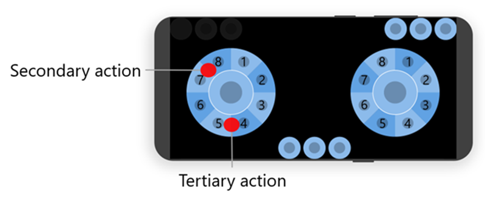

4. Consider which actions need to be held along with player locomotion (such as a hold to crouch or sprint). Create a joystick control with an `action` assignment to allow both actions to happen together while leaving the right thumb free for other important actions.
For an example, see [A joystick that switches from walk to sprint when a threshold is passed](../../../../reference/system/touchadaptationkit/controls/game-streaming-touch-joystick.md#example-2-joystick-that-switches-from-walk-to-sprint-when-threshold-is-passed).

#### Right wheel

The right wheel is most often used to perform camera movement along with the primary character actions, such as attack, shoot, jump, use item or special skill.

##### **Inner**

Typically, reserve the right [inner wheel](../../../../reference/system/touchadaptationkit/layout/game-streaming-touch-inner-wheel.md) ring for [only one control](../../../../reference/system/touchadaptationkit/layout/game-streaming-touch-inner-wheel.md#pattern-1-one-control) that performs the most frequently used action, like primary attack. While the inner wheel ring can be clustered with multiple controls, it's best to keep a large hit area dedicated to the most frequently used action.

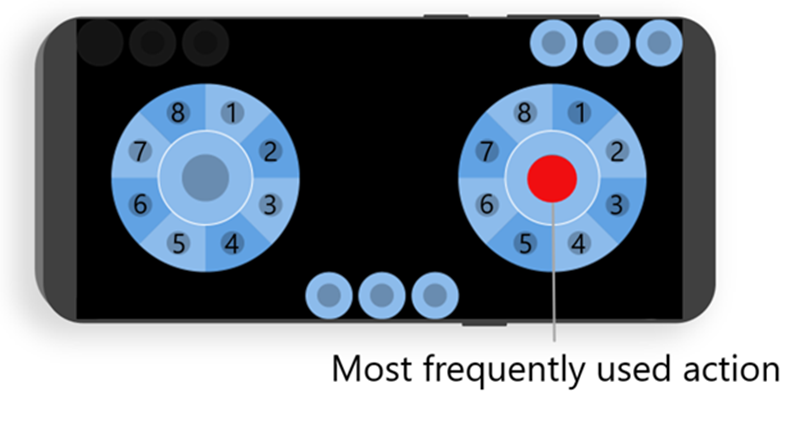

###### Tips

1. For frequently used actions that might require another action to be held, for example aim down sights, consider using a [button control](../../../../reference/system/touchadaptationkit/controls/game-streaming-touch-button.md) with a `pullAction` to allow a single touch to be used to activate both aim and shoot.

##### **Outer**

The outer wheel ring is typically used for quick actions that can be performed while moving. Examples of these actions are jump, dash, and reload.

###### Tips

1. Create an [outer ring control cluster](../../../../reference/system/touchadaptationkit/layout/game-streaming-touch-control-cluster-outer.md) for the secondary and tertiary actions to provide a larger hit area for this action. When using only a single control in a cluster, consider using a cluster syntax of `[<your secondary action control>, null]` or `[null, <your secondary action control>]` to create a two-control cluster with a blank spot to effectively place the single control slightly further in or out of the ring compared to `[<your secondary action control>]`. Don't add additional controls to the secondary cluster until all other slots in the wheel are full and more room is needed.

2. Place the secondary action outside the upper right of the primary action, in slot 1 and slot 2. This allows for easy access without needing to reach further toward the middle of the screen. Don't split the secondary slot (control cluster) until all other slots in the wheel are full and room is needed.

3. Place the tertiary action directly below the inner ring, in slot 4 and slot 5. This is a comfortable position to quickly move a thumb to from the primary action. Don't split the tertiary slot (control cluster) until all other slots in the wheel are full and room is needed.

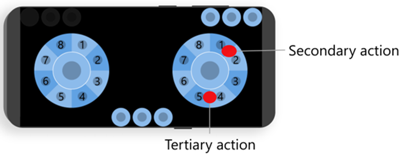

4. Use jump-like actions in the tertiary slot.

> [!NOTE]
> If a dash-like action also exists, use dash in slot 4 with jump in slot 5 instead of using a control cluster for the tertiary. This effectively divides the space in half allowing for easy combinations between the primary actions, jump, dash, and player movement. The following image shows that easy combinations between primary attack, dash, and jump are possible with clustering.

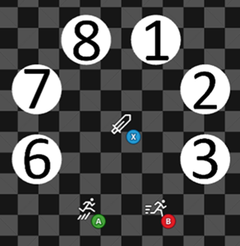

5. Depending on how close other actions need to be to a jump like action, consider placing them in the secondary slot (a cluster between slots 1 and 2), or in slot 6. From there, clustering between slot 5 and 6 places another action that sits near jump. 

The following image shows clustering three actions between slot 5 and 6, guard and roll, that sits near jump.

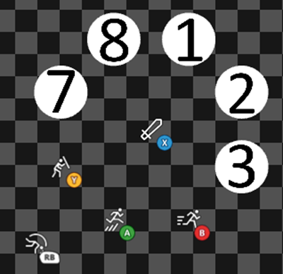

6. Whenever possible use the [gyroscope sensor control](../../../../reference/system/touchadaptationkit/sensor-controls/game-streaming-touch-gyroscope.md) to control the camera. This frees up the right thumb for another action at all times. As a last resort, use a relative right joystick to control the camera.

#### Upper

The upper zone is most useful for infrequent, menu or navigation like actions. This zone starts in the upper right corner and grows toward the middle.

###### Tips

1. In cinematic sections of the game, upper can be used for a skip action. The upper-right corner is a common spot for navigation actions and will likely be in a letter or pillar box.

2. The upper-left corner is reserved for system buttons. Players are expecting similar actions that might pause or navigate the game in the upper row. Consider placing things like map, inventory, and menu in this area.

#### Lower

The lower zone is centered at the bottom of the screen. This zone is the least frequently used area for controls. It can be challenging to reach the middle of the screen on some devices.

###### Tips

1. Although it's possible to place blank controls into the lower zone to adjust the position of controls, remember that various form factors of devices might allow fewer controls to be seen. Don't try to position controls in the bottom corners by adding many blank controls. They often overlap with the control wheels. Players frequently move their wheels slightly lower for a comfortable playing position.

### Follow tips for specific control types and advanced scenarios

#### 4-way and 8-way D-pads

A D-pad is commonly used to control character for 4-way or 8-way movements. It's also useful for navigating menus. By default, the D-pad control works like a physical D-pad where multiple directions can be activated together. This is also known as *8-way*. In contrast, a 4-way D-pad can only have one of its four directions active at a time. To restrict a D-pad to exclusively 4-way, add `"interaction": {"activationType": "exclusive"}` to the control.

###### Tips

1. Use an 8-way D-pad when a 2D game allows a character to move in eight directions, including diagonals.

2. Use a 4-way D-pad when a 2D game allows a character to move only four directions: left, right, up, and down.

3. Use a 4-way D-pad when controlling menus.

#### Gyroscope aiming and tips for shooter games

A common scenario when adapting complex games for touch controls is that the user might need to activate more than two actions at a time despite only having two thumbs that can reasonably interact with touch controls. To help with these more complex tasks, a gyroscope can be used to provide an additional input.

###### Tips

1. Use a gyroscope for controlling a player-look camera. It makes intuitive sense to players to be able to tilt a device left to right and forward to back to precisely control the camera.

2. Using a gyroscope with mouse input (specify `"output": "relativeMouse"`) is far superior for aiming in games over using a joystick (specify `"output": "relativeJoystick"`), especially in first- and third-person games.

3. A 90-degree rotation of a phone in physical space usually turns the in-game character 120 degrees. This functionality makes it easier for players to switch between games and have the controls feel more familiar to them.

4. Using a gyroscope with a touchpad is preferred. Better players will want this combination for quick orientation—most of the fine aim comes from the gyroscope.

5. Consider combining a joystick with a gyroscope to allow more ways to play. The gyroscope controls can be used to make small adjustments in addition to what the joystick provides.

6. An "Always on" style of gyroscope has the highest skill ceiling; however, this style doesn't work well for players in moving vehicles.

7. Where possible, use a different layout without gyroscope controls for menus and other sections of games where it's not needed.

8. Create most buttons with touchpads with `"renderAsButton": true`, depending on their action and how the game supports those abilities. Aim+Fire is the primary example, but this can apply to things like block and grenade throw. Here's an example of Aim (LT) + Fire (RT) touchpad control.

```JSON
{
    "type": "touchpad",
    "axis": [
        {
            "input": "axisX",
            "output": "relativeMouseX",
            "sensitivity": 5
        },
        {
            "input": "axisY",
            "output": "relativeMouseY",
            "sensitivity": 2.5
        }
    ],
    "renderAsButton": true,
    "action": [ "rightTrigger", "leftTrigger" ],
    "styles": {
        "default": {
            "faceImage": {
                "type": "icon",
                "value": "fire"
            },
        }
    }
}
```

9. Always place Aim+Fire more toward the center of the screen, usually at slot 5 on outside the right wheel. If it's placed at the edge, where the player can't turn the camera fully to the right, they'll run out of room to swipe.

10. When building a new touch layout for first- or third-person shooter games, use the first-person shooter starter template. Each action position has been well analyzed.

Gears 5 uses the gyroscope and a touchpad with `renderAsButton: true` for Aim+Fire control to achieve precise aiming as shown in the following screenshot.

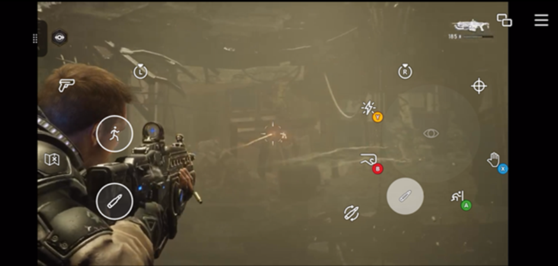

#### Handling complex and combination actions

Performing complex actions with only two thumbs can be challenging for a player. The Touch Adaptation Kit provides several mechanisms to perform complex actions by touch.

###### Tips

1. [Multiple actions](../../../../reference/system/touchadaptationkit/types/game-streaming-touch-action.md#example-2-action-is-pressing-the-left-bumper-and-the-right-bumper-buttons-simultaneously) can be assigned to a single control. For example, crouching is activated by simultaneously pressing the left bumper and the right bumper. The following button definition allows a player to enable crouching by single press.

> [!NOTE]
> When assigning multiple actions to a control, no default iconography can be used. It's important to customize the styling to indicate what semantic action the control has as shown in the following example.

```JSON
{
    "type": "button",
    "action": [ "leftBumper", "rightBumper"],
    "styles": {
        "default": {
            "faceImage": {
                "type": "icon",
                "value": "crouch"
            }
        }
    }
}
```

2. A `pullAction` can be assigned to a [button control](../../../../reference/system/touchadaptationkit/controls/game-streaming-touch-button.md). It helps a player to use one touch and drag motion to activate two actions. For example, aiming is assigned to LT, and shooting is assigned to RT. The following button definition allows a player to aim while pressing the button, and then shoot by pulling to the outside.

```JSON
{
    "type": "button",
    "action": "leftTrigger",
    "pullAction": "rightTrigger",
    "styles": {
        "default": {
            "faceImage": {
                "type": "icon",
                "value": "aim"
            }
        },
        "pulled": {
            "faceImage": {
                "type": "icon",
                "value": "fire"
            }
        }
    }
}
```

3. A joystick with `action` and `actionThreshold` activates an assigned action, in addition to its axis output, only if the value of `actionThreshold` is reached. For example, only left joystick input activates. Sprint is activated by pressing RT with left joystick input. The following joystick definition allows a player to activate sprint by passing the threshold value of 2.5. A player can switch from walk to sprint by just using the left joystick.

```JSON
{
    "type": "joystick",
    "action": "rightTrigger",
    "actionThreshold": 2.5,
    "axis": {
        "input": "axisXY",
        "output": "leftJoystick",
        "deadzone": {
            "threshold": 0.05,
            "radial": true
        }
    },
    "styles": {
        "default": {
            "knob": {
                "faceImage": {
                    "type": "icon",
                    "value": "walk"
                }
            }
        },
        "activated": {
            "knob": {
                "faceImage": {
                    "type": "icon",
                    "value": "sprint"
                }
            }
        }
    }
}
```

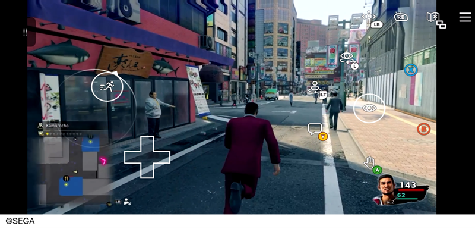

In Yakuza Like a Dragon, the right trigger is activated to sprint if left joystick input exceeds the threshold value of 2.5.

4. Joystick with "action" can activate an assigned action while using the joystick. For example, a radial menu is activated by pressing the left bumper and can be selected by moving the right joystick. The following joystick definition allows a player to hold the left bumper and select action from a radial menu by using the right joystick.

```JSON
{
    "type": "joystick", 
    "action": "leftBumper",
    "axis": {
        "input": "axisXY",
        "output": "rightJoystick",
        "deadzone": {
            "threshold": 0.05,
            "radial": true
        }
    },
    "styles": {
        "default": {
            "knob": {
                "faceImage": {
                    "type": "icon",
                    "value": "inventory"
                }
            }
        }
    }
} 
```

In Sea of Thieves, a radial menu is used to select equipment by using the joystick with `action`.

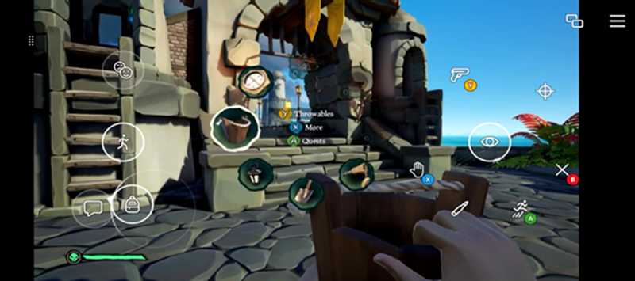


### Use the Touch Adaptation Kit Editor

The [Touch Adaptation Kit (TAK) Editor extension for Visual Studio Code](../tak-editor/game-streaming-tak-editor.md) is a tool for creating, previewing, verifying, and packaging a Touch Adaptation Bundle (TAB). These files have the .takx file extension. You can use the TAK Editor for your games on Xbox Game Streaming, all from within VS Code, without an ongoing game stream. Using this VS Code extension provides inline Intellisense and simplifies the touch control authoring experience.

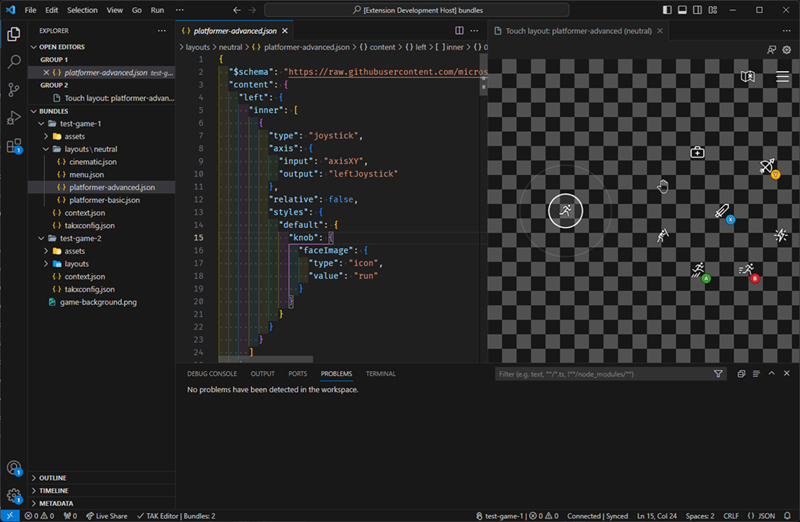

### Change the touch controls to match the current in-game scenario

Games can change the touch layout or modify the state of a layout based on the dynamic game state at runtime. Both methods can be used together to create the most natural experience for players. For more information, see the documentation on how to [change the touch layout or modify state based on game state](game-streaming-touch-changing-layouts-game-state.md#change_layout).

As an example, Minecraft Dungeons uses touch layout state modifications to progressively show game mechanics as a player learns new abilities.

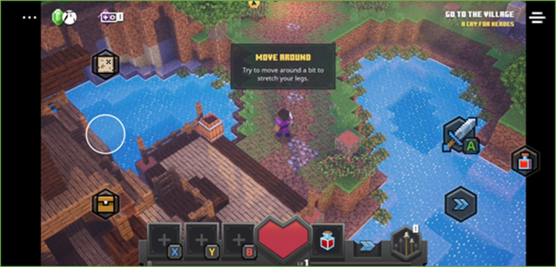

In Minecraft Dungeons, only basic controls such as movement and melees are displayed at first.

 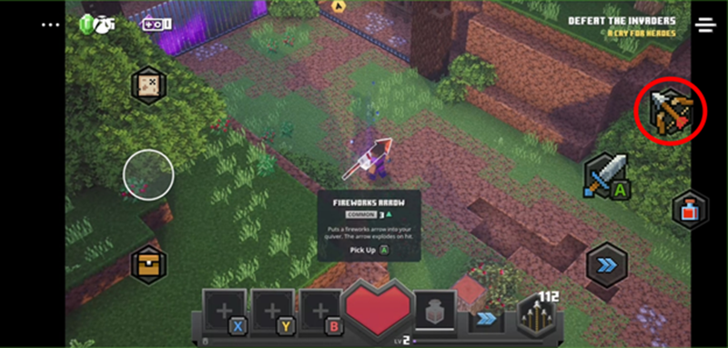
In Minecraft Dungeons, when acquiring ranged weapon for the first time, a ranged attack control is added.

### Use a cinematic layout to keep immersion during movies and cut-scenes

Movies and cut-scenes are primarily intended to be viewed to enjoy the game's story. The necessary controls are generally limited to things like pausing and skipping. To create the most immersive viewing experience, it's important to eliminate as many controls as possible.

###### Tips

1. When possible, display touch controls only when a player needs them.

    1. Detecting touch input from a player is relatively simple. For more information, see [Building a native touch interface for your game with IGameInput](../game-streaming-native-touch-igameinput.md) and the full [SimpleCloudAwareSample](https://github.com/microsoft/Xbox-GDK-Samples/tree/main/Samples/xCloud/SimpleCloudAwareSample) game sample.

    2. Touch can be detected even if a Touch Adaptation Kit layout is displayed. By using the native touch APIs, a player can tap the screen to cause the game to show a minimal cinematic layout. The game can hide this layout after some time without a touch input being detected.

As an example, Persona 3 Reload has a custom cinematic layout with native touch detection.


In Persona 3 Reload, the touch controls are hidden while a cut-scene plays.

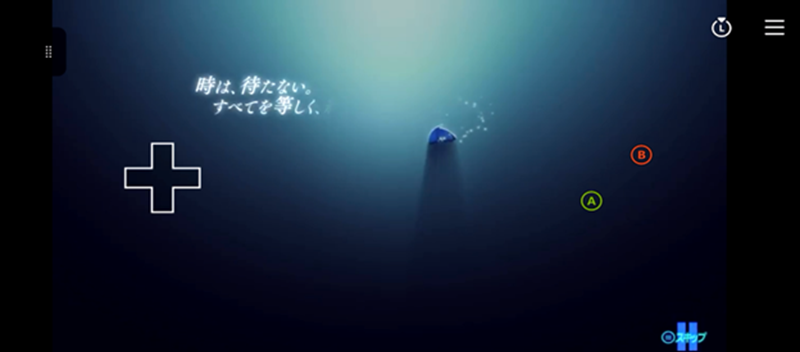

In Persona 3 Reload, the touch controls are displayed by detecting native touch that shows a small selection of control to skip the cut-scene.

2. Alternatively, a similar effect can be achieved with no game code modifications. A [touch layout layer](../../../../reference/system/touchadaptationkit/layout/game-streaming-touch-layer.md) of controls in the upper right zone can be used in combination with a [button control](../../../../reference/system/touchadaptationkit/controls/game-streaming-touch-button.md) by using the `toggle` property and a layer action.

### Use native touch to fully customize touch interactions

Native touch is the most familiar way to play games on touchscreen devices. Players on mobile devices are familiar with games that build direct touch support for controlling the game. By using the `GameInput` API, you can enable native touch in your game. It provides a more intuitive and natural way of interacting with your game world. Native touch can complement or replace the Touch Adaptation Kit overlays that are remapped to the buttons and sticks of the Xbox controller. For more details, see [Building a native touch interface for your game with IGameInput](../game-streaming-native-touch-igameinput.md) and the full [SimpleCloudAwareSample](https://github.com/microsoft/Xbox-GDK-Samples/tree/main/Samples/xCloud/SimpleCloudAwareSample) game sample.

Here are some examples of native touch support.

- **Inventory management:** Native touch can make it easier and faster to select and equip items by letting a player simply tap on items and even use techniques like drag. This can be a considerable quality of life improvement compared to traditional controller-based management.

 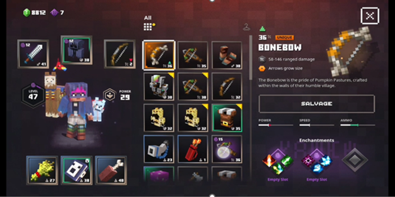

In Minecraft Dungeons, inventory management is done by using native touch.

- **Menus:** Manipulating a menu is more intuitive on a touchscreen. Just tap on a desired item rather than using a D-pad or joystick to navigate to the item.

- **Full native touch support:** Some games support full native touch, eliminating the need for any remapping to a controller by using the Touch Adaptation Kit. This allows players to fully focus on the mobile gaming experience. These games usually already have a mobile version or support a touch-friendly interface, making native touch support relatively easy. Games designed to be played primarily with a mouse also tend to support native touch more easily.

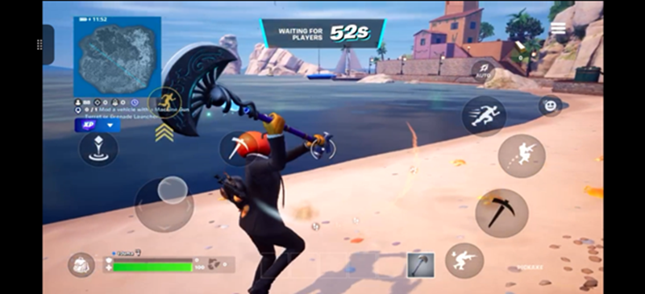

In Fortnite, native touch supported when playing through Xbox Cloud Gaming.

### Use custom assets to match the art style of the game

Although you can select an asset from a built-in set of icons for your controls, the most immersive and seamless experience is to customize the controls by using artwork that matches the art style of your game. Doing this allows the Touch Adaptation Kit overlays to feel purposeful, natural, and integral to the game. This is in contrast to a simple remapping to the game designed only with controller in mind.

As an example, Minecraft Dungeons uses blocky iconography that mirrors the in-game design language.

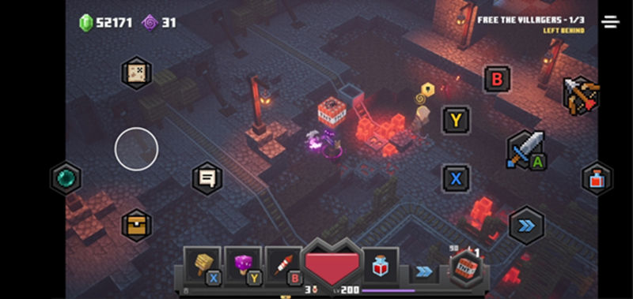

In Minecraft Dungeon, custom assets match the game's unique art style.

### Change in-game UI, hints and control remapping for touch controls

UI, hints, and control remapping usually change based on the input type that's used by a player. For example, if a game supports both gamepad and keyboard and mouse input types, typically it shows gamepad-specific button prompts when a gamepad input is detected. The game typically shows keyboard and mouse UI when keyboard or mouse input is detected.

This dynamic user experience based on input type also applies to Touch Adaptation Kit controls. By using the [XGameStreamingGetGamepadPhysicality API](../../../../reference/system/xgamestreaming/functions/xgamestreaminggetgamepadphysicality.md), it's possible to identify whether the input was from a physical gamepad, or from a touch layout that has been translated into a virtual controller input. In response to this, the user experience can be customized to show the most appropriate imagery to the player.

As an example, Gears 5 dynamically adjusts the in game prompts based on input type.

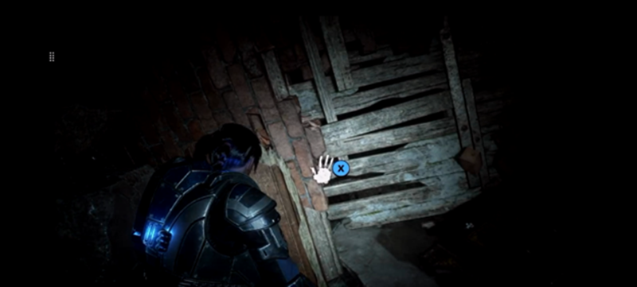

In Gears 5, UI and hints are available when using a gamepad input type.

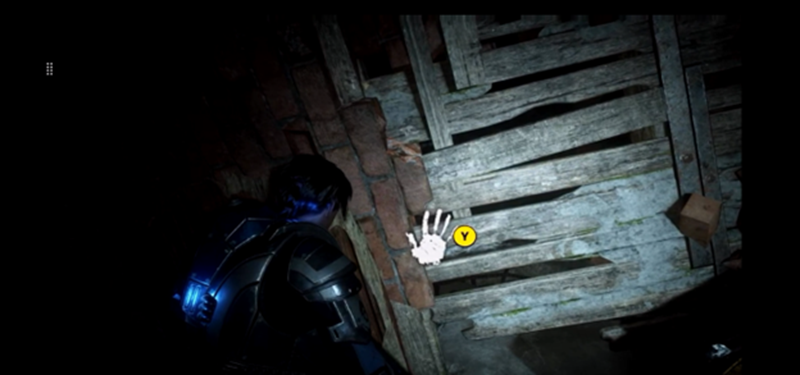

In Gears 5, UI and hints are available when using a gamepad input type with a remapped input.

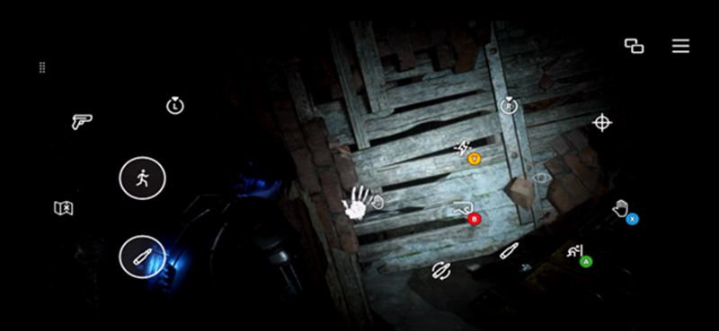

In Gears 5, UI and hints are available for the touch input type that matches the icon of touch control. Gears 5 intelligently handles remapping on a per-input type basis, so the remapped controller input isn’t shown or used when playing with touch.

### Check for common issues for touch controls and Xbox Game Streaming

#### Disconnection during gameplay

On mobile devices, there are many situations where a player briefly leaves their game. For example, going to the home screen, checking messages and news, and making calls. These situations cause the streaming client to disconnect or pause. As a result, there might be state mismatches from the game.

###### Tips

1. Ensure proper loading and operation of touch controls including layout, assets, and state when a game returns from a disconnected state. This is especially important when APIs are used to control the state of the touch controls.

2. Pause gameplay where possible when a player is disconnected to prevent loss of progress or a game over situation. This can be done by looking for a [constrain event](../../../../gdk-dev/console-dev/overviews/xbox-game-life-cycle.md) or the disconnection of a streaming client.

#### Compatibility with various device types

There are various types of devices capable of using touch controls including phones, tablets and 2-in-1 PCs. The different characteristics of these devices, including differences in screen size and the presence or absence of sensors, might prevent comfortable gameplay if these differences aren't considered.

###### Tips

1. Ensure all touch controls work and are easily reachable on devices that have various screen sizes.

2. Ensure the availability of sensors on devices. If they aren't available, have other options that don't require sensors. For example, your game uses a gyroscope for aiming. If a gyroscope isn't available on a device, use a touchpad control instead.

3. To easily test different screen sizes, it's possible to use a PC to change the window size of the PC Content Test Application or web browser. If no touch-enabled PC is readily available, the Content Test Application allows basic testing with a setting to treat mouse clicks as touch events. Finally, use the [TAK Editor Extension](../tak-editor/game-streaming-tak-editor.md) preview window view to easily view touch controls at different dimensions.
