# High Contrast Mode

Dependent on your title's color scheme, there may be instances where your touch layouts are hard to see because they contrast poorly with your title running in the underlying stream. This can be especially problematic for gamers with low vision, color blindness, or other visual impairments. High contrast mode is a client setting that, when activated, adds additional strokes and button backplates to buttons styled with an [icon](../../../../reference/system/touchadaptationkit/types/game-streaming-touch-icon.md), as well as modifies the [system colors](../../../../reference/system/touchadaptationkit/layout/game-streaming-touch-color-palette.md#system-colors) to increase contrast.

For example, the standard layout and a solid light background color, with high contrast mode is **disabled**:

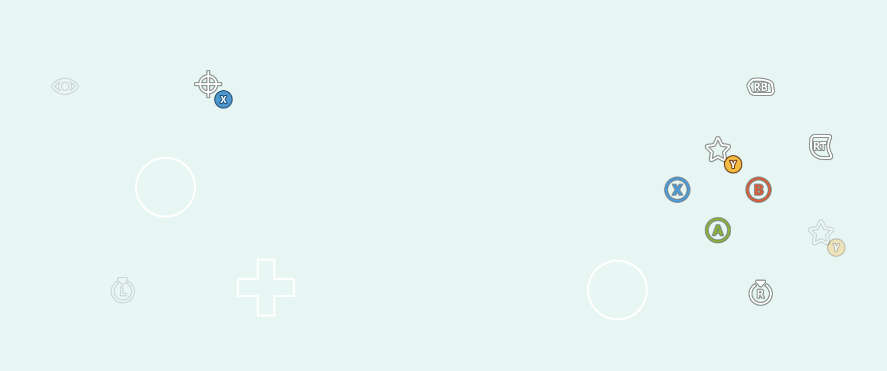

And here is the same setup with high contrast mode **enabled**:

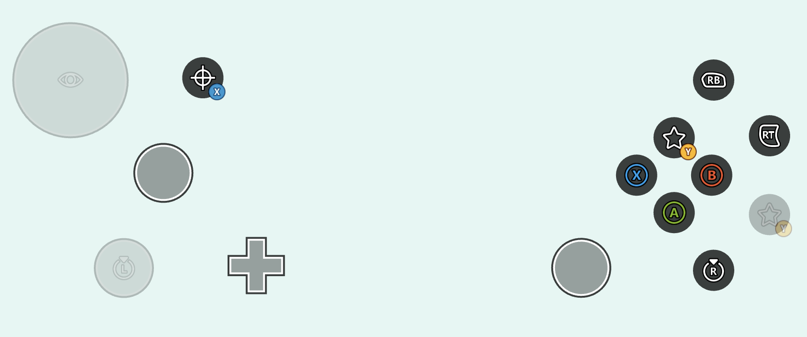


While you can rely on the system defaults for high contrast mode styling, you can also include [high contrast mode variants for your custom assets](#custom-assets-for-high-contrast-mode) as well as [override the system colors](#overriding-system-colors-for-high-contrast-mode) to match the visual aesthetic of your game.

<a id="custom-assets-for-high-contrast-mode"></a>
## Custom assets for high contrast mode

When using [custom assets](game-streaming-tak-custom-assets.md) in your touch adaptation bundle, you can include high contrast asset variants for each of your standard contrast assets. These high contrast assets variants are then rendered whenever high contrast mode is enabled. Assets are marked as a high contrast variant by including a `.hc` suffix following your asset's name and preceding the file extension. For example, consider `myAsset.png` (left) and it's high contrast variant, `myAsset.hc.png` (right):


When laying out your assets on disk, both standard contrast and high contrast assets are [organized by language and asset scale](game-streaming-tak-custom-assets.md#asset-files) as normal. For the above assets, the file structure might look something like this:

```
assets/
└───neutral/
    ├───@1.0x/
    │       myAsset.png
    │       myAsset.hc.png
    ├───@1.5x/
    │       myAsset.png
    │       myAsset.hc.png
    ├───@2.0x/
    │       myAsset.png
    │       myAsset.hc.png
    ├───@3.0x/
    │       myAsset.png
    │       myAsset.hc.png
    └───@4.0x/
            myAsset.png
            myAsset.hc.png
```

Within a layout, assets are referenced [without the filename extension](game-streaming-tak-custom-assets.md#referencing-assets-from-layouts) **and without the `.hc` suffix**. For example, a button styled with the assets from above might be configured like this:

```JSON
{
    "type": "button",
    "action": "gamepadA",
    "styles": {
        "idle": {
            "faceImage": {
                "type": "asset",
                "value": "myAsset"
            }
        }
    }
}
```

Given this style, the touch adaptation kit will automatically select either `myAsset.png` or `myAsset.hc.png` dependent on if high contrast mode is disabled or enabled, respectively. This styling will yield the following when high contrast mode is **disabled**:


And the following when high contrast mode is **enabled**:

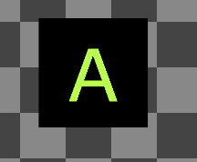

<a id="overriding-system-colors-for-high-contrast-mode"></a>
## Overriding system colors for high contrast mode

[Color palettes](../../../../reference/system/touchadaptationkit/layout/game-streaming-touch-color-palette.md) within your touch layouts or [context file](../game-streaming-touch-touch-adaptation-bundle.md#context) can be used to override the [system colors](../../../../reference/system/touchadaptationkit/layout/game-streaming-touch-color-palette.md#system-colors). Controls implicitly sample the system colors when styling, meaning any overrides will effect the global styling of all controls (unless a control has it's own override within a custom `styles` block).

For example, the following layout overrides some of the system colors to achieve custom styling when high contrast mode is enabled:

```JSON
{
  "$schema": "https://raw.githubusercontent.com/microsoft/xbox-game-streaming-tools/main/touch-adaptation-kit/schemas/layout/v4.0/layout.json",
  "styles": {
    "colors": {
      "highContrast": {
        "system_contentPrimary": "#ff00ffff",
        "system_contentSecondary": "#00ff00aa",
        "system_contrastPrimary": "#ff0000aa"
      }
    }
  },
  "content": {
    "left": {
      "inner": [
        {
          "type": "joystick",
          "axis": {
            "input": "axisXY",
            "output": "leftJoystick"
          }
        },
        {
          "type": "button",
          "action": "dPadRight",
          "styles": {
            "default": {
              "faceImage": {
                "type": "icon",
                "value": "map"
              }
            }
          }
        }
      ]
    },
    "right": {
      "inner": [
        {
          "type": "button",
          "action": "gamepadY"
        },
        {
          "type": "button",
          "action": "gamepadB"
        },
        {
          "type": "button",
          "action": "gamepadA"
        },
        {
          "type": "button",
          "action": "gamepadX"
        }
      ]
    }
  }
}

```

In the above layout, three color overrides are declared in the `highContrast` block that will only be applied when high contrast mode is enabled:
1. `system_contentPrimary` will override the styling applied to our joystick middle stroke and map icon tint.
2. `system_contentSecondary` will override the styling applied to our joystick fill.
3. `system_contrastPrimary` will override the styling applied to our joystick outer stroke and button backplates.

The above layout with high contrast mode **disabled**:

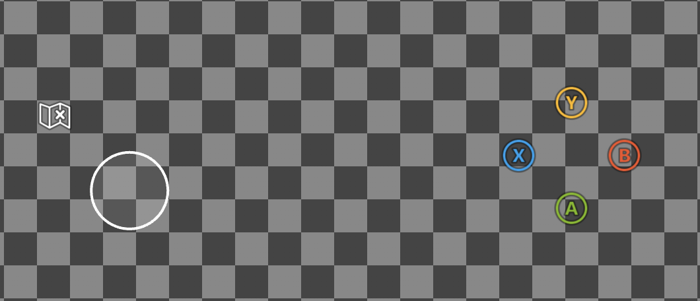

And with high contrast mode **enabled**:

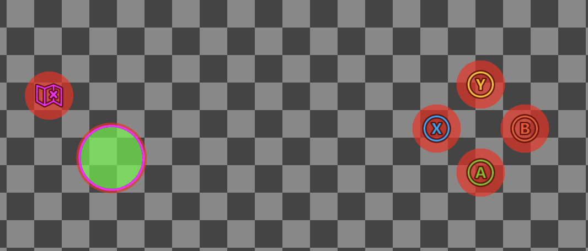

## Enabling high contrast mode

You can test high contrast mode on any of the [web](#web-cta), [android](#android-cta), or [windows](#windows-cta) content test applications (CTA).

<a id="web-cta"></a>
### Web CTA

High contrast mode can be enabled on the [web CTA](../game-streaming-web-content-test-application.md) by:

Clicking on your profile and navigating to "Settings" window:

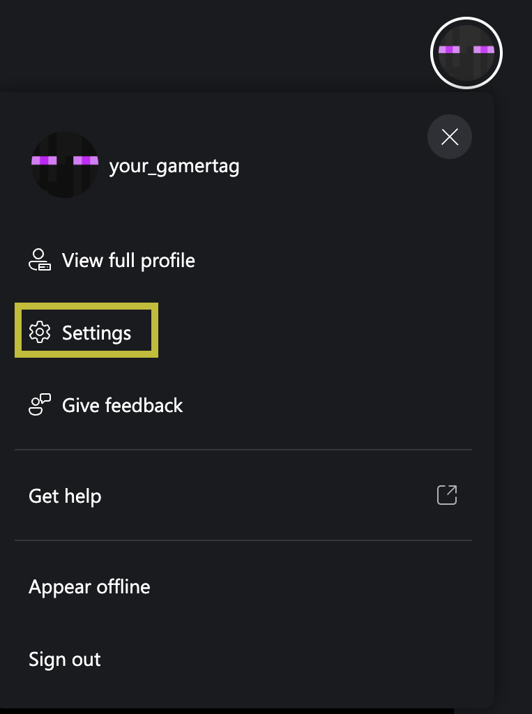

Navigating to "Accessibility" and checking "Enable high contrast in-game":

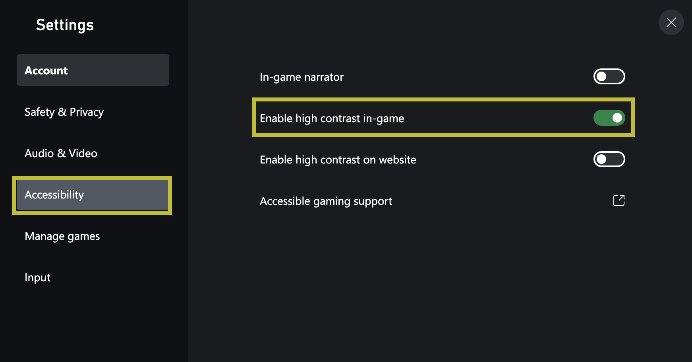


<a id="android-cta"></a>
### Android CTA (Deprecated)

High contrast mode can be enabled on the [android CTA](../game-streaming-android-content-test-application.md) by:

Clicking on your profile:

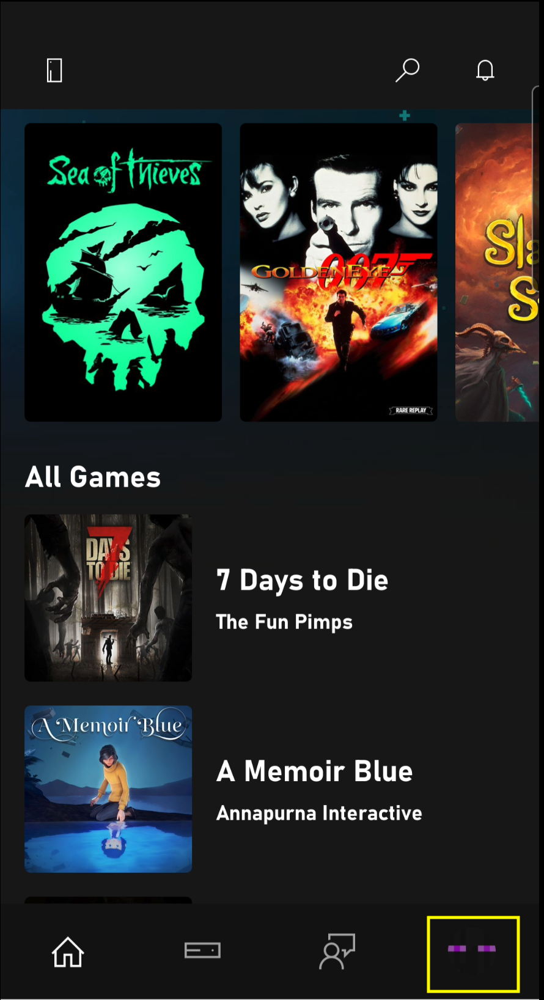

Checking "Enable high contrast mode":

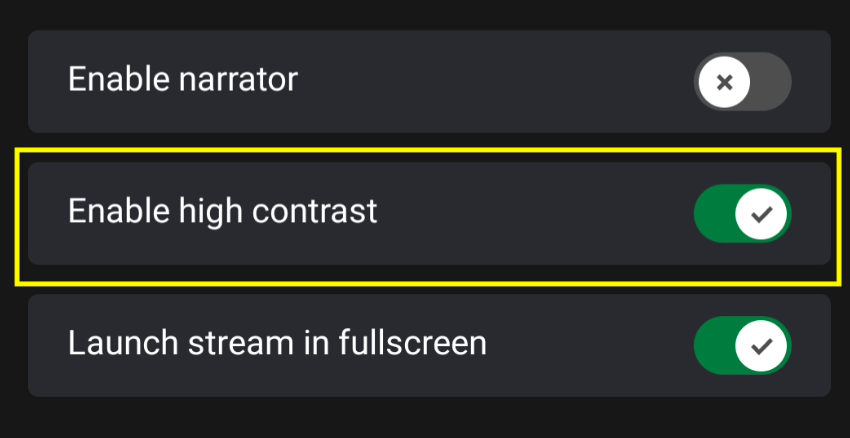


<a id="windows-cta"></a>
### Windows CTA (Deprecated)

High contrast mode can be enabled on the [windows CTA](../game-streaming-windows-pc-content-test-application.md) by:

Clicking on your profile:

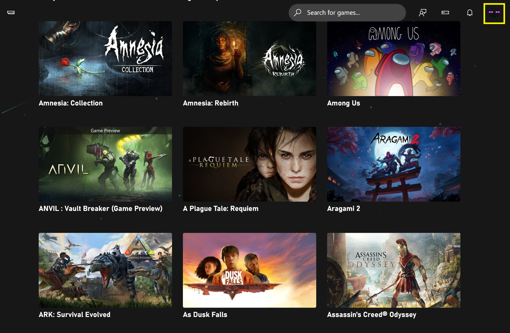

Checking "Enable high contrast mode":

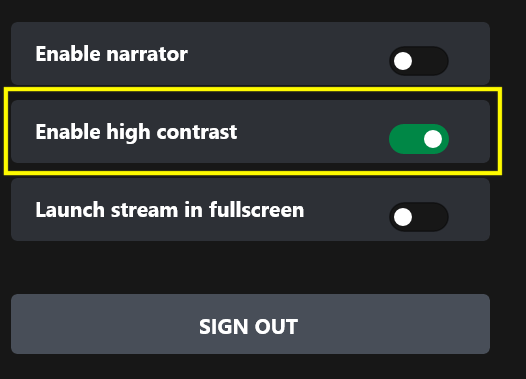