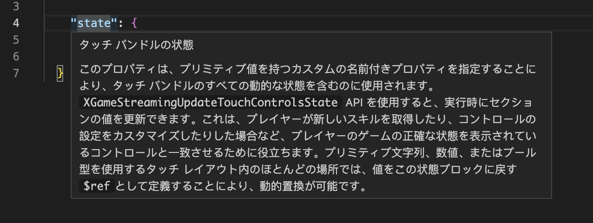

# Building Touch Control Layouts

Building your touch control layouts consists of creating a [touch adaptation bundle](../game-streaming-touch-touch-adaptation-bundle.md) that includes:

- A `takxconfig.json` file that is a JSON representation of all of the bundle's metadata and properties
- A collection of layouts where each layout file is a JSON representation of the controls available to players for a specific scenario in game
- A Context file which is a JSON representation of the global state and properties used by layouts
- Any custom assets that are referenced by those layouts

## Getting Started

The easiest way to create a [touch adaptation bundle](../game-streaming-touch-touch-adaptation-bundle.md) is to use the [create command](../tak-command-line-tool/game-streaming-tak-command-line-create-command.md). This command can be used to easily create all the files and folders needed to get up and running with the touch adaptation kit. In addition to being able to create a full bundle, the create command can be used to create a single layout file based on a template layout for different genres and situations in a game.

## Touch Bundle JSON Schemas

The various JSON files, like a layout or context file, use a JSON schema file to provide structure and rules about how to write a valid file. These schema files are hosted on the [Xbox Game Streaming Tools Github](https://github.com/microsoft/xbox-game-streaming-tools/tree/main/touch-adaptation-kit/schemas) in a variety of languages. These language specific schemas can be used in tools like [Visual Studio Code](https://code.visualstudio.com/download) to get Intellisense about schema properties and issues in that language. To use a localized version of the schema file, simply set the `$schema` property in your file to point to a localized version. For example, the below example JSON and image shows the Japanese language help text for the `state` property in a context file.

```JSON
//Example context file
{
  "$schema": "https://raw.githubusercontent.com/microsoft/xbox-game-streaming-tools/main/touch-adaptation-kit/schemas/ja-JP/context/v4.0/context.json",

  "state": {
    "enableReload": false
  }
}
```


