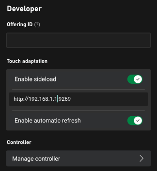
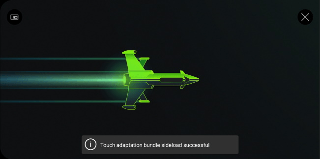
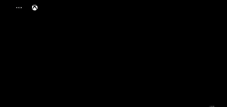

# Deploying your touch control layouts

## Overview

After you've [built your touch layouts](game-streaming-touch-building-touch-layout.md), you'll want to interact with them in your game.

## Prerequisites

To deploy and view your layouts, you'll need to have:

- A Windows PC that has the [Touch Adaptation Kit Command Line Tool (tak.exe)](../tak-command-line-tool/game-streaming-tak-command-line.md).
- A device with the [Web Content Test Application](../game-streaming-web-content-test-application.md), [Android Content Test Application (Deprecated)](../game-streaming-android-content-test-application.md), or the [Windows PC Content Test Application (Deprecated)](../game-streaming-windows-pc-content-test-application.md).
- A set of layouts that you would like to deploy and view.

## Deploying your layouts

### 1. Serve the layouts

On the Windows PC that has the [Touch Adaptation Kit Command Line Tool (tak.exe)](../tak-command-line-tool/game-streaming-tak-command-line.md), utilize the [Serve Command](../tak-command-line-tool/game-streaming-tak-command-line-serve-command.md) to make the layouts available to devices that request them.

```pwsh
C:\Program Files (x86)\Microsoft GDK\bin>tak serve --layout-path C:\MyGameLayouts
Verifying touch adaptation bundle 'C:\MyGameLayouts '.
Now listening on: http://0.0.0.0:9269
Application started. Press Ctrl+C to shut down.
Hosting environment: Production
Content root path: C:\MyGameLayouts
```

### 2. Configuring the Content Test Application to load

In the settings of your Content Test Application, enter the configuration for the Touch Adaptation Settings (in the Developer section).

- Make sure **Enable sideload** is toggled on.
- Enter the address to the PC (including port) that's serving the layouts.

> [!NOTE] 
> If you're using the [Web Content Test Application](../game-streaming-web-content-test-application.md) with **Safari** or to connect to a **remote PC** running the serve command, ensure that the sideload address starts with `https` and that the `--certificate-file` option was used. See [Serve Command](../tak-command-line-tool/game-streaming-tak-command-line-serve-command.md) for more information on starting secure (HTTPS) sideload servers.

- Enable autorefresh if you want changes that are made to the layouts to be immediately updated on all connected clients (otherwise, updates will only happen when a new streaming connection is started).

.

### 3. Stream your game

Upon each streaming connection, the CTA will connect to the TAK server and download the latest layouts.

.

When a layout is requested, you'll see a request and download on the PC that's hosting the `serve` command.

```
C:\Program Files (x86)\Microsoft GDK\bin>tak serve --layout-path C:\MyGame\layouts
Verifying touch adaptation bundle 'C:\MyGame\layouts'.
Now listening on: http://0.0.0.0:9269
Application started. Press Ctrl+C to shut down.
Hosting environment: Production
Content root path: C:\MyGame\layouts
Request starting HTTP/1.1 POST http://192.168.1.1:9269/connection/negotiate?negotiateVersion=1  0
Request finished in 1.6283ms 200 application/json
Request starting HTTP/1.1 GET http://192.168.1.1:9269/connection?id=3u0Xs_Dlwn-J1mREHTcG5w
Request starting HTTP/1.1 GET http://192.168.1.1:9269/v1/tabs/active/download
Request finished in 3.9865ms 200 application/octet-stream
```

### 4. Select your layout

After a streaming session has been started, you can select the touch layout to be utilized by selecting Developer and then TAK from the in-stream overlay by selecting the `...` button at the top-left corner.


