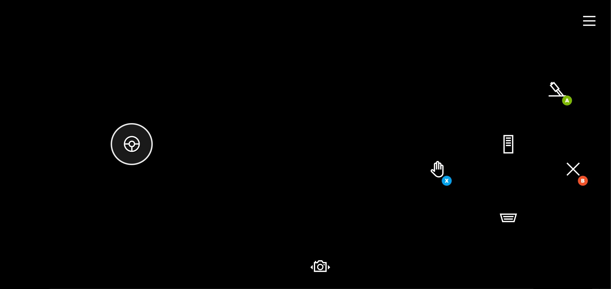

# Driving Touch Control Layout

Sample layout for a driving game.

## Remarks

The driving layout shows how a game can provide a simple optimized experience letting the player focus on game play.

Key elements include:

- Steering via the left hand by using a single axis joystick.
- Gas pedal placed in the most easily accessible control location for the right hand.
- Two braking options (regular brake and handbrake) placed in the next most accessible locations.
- Two basic interaction buttons (interact & close) available for when needed.
- A switch camera option available in the lower center to allow the player to make view changes.

## Availability

1. Part of the TAK [sample-layouts](https://github.com/microsoft/xbox-game-streaming-tools/tree/main/touch-adaptation-kit/samples/sample-layouts) sample.
2. TAK command line tool [create command](../../tak-command-line-tool/game-streaming-tak-command-line-create-command.md)
