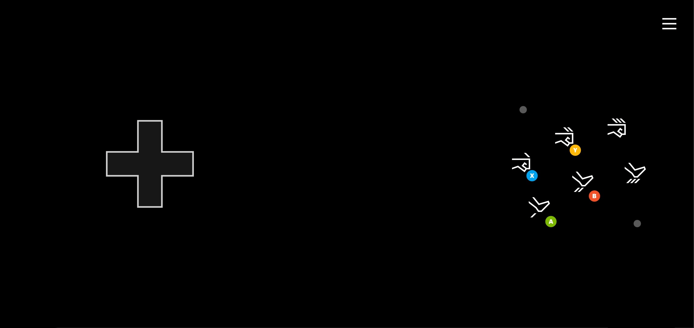

# Fighting Touch Control Layout

Layout for fighting games using a familiar arcade like layout.

## Remarks

The fighting layout provides all the basic controls needed for a fighting game.

Key elements include:

- Larger directional pad for movement.
- Arcade style layout of punch/kick controls.

## Availability

1. Part of the TAK [sample-layouts](https://github.com/microsoft/xbox-game-streaming-tools/tree/main/touch-adaptation-kit/samples/sample-layouts) sample.
2. TAK command line tool [create command](../../tak-command-line-tool/game-streaming-tak-command-line-create-command.md)
