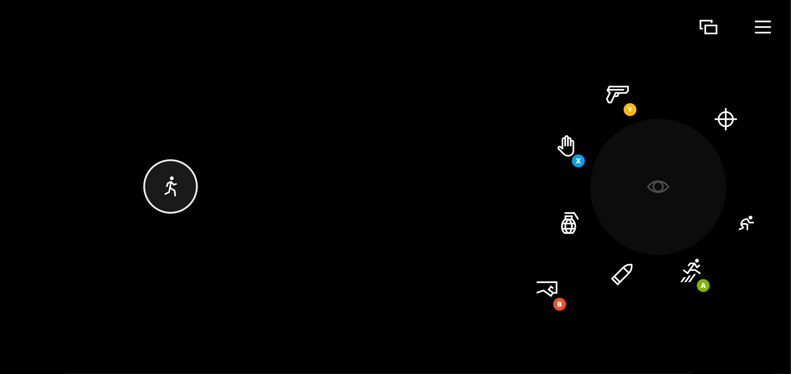

# First Person Shooter Touch Control Layout

## Remarks

The first person shooter layout provides all the basic controls needed for a first person shooter style game.

Key elements include:

- A joystick on the left for player movement
- A touchpad on the right for camera control using relative mouse output
- Common actions arranged as buttons around the right wheel

## Availability

1. Part of the TAK [sample-layouts](https://github.com/microsoft/xbox-game-streaming-tools/tree/main/touch-adaptation-kit/samples/sample-layouts) sample.
2. TAK command line tool [create command](../../tak-command-line-tool/game-streaming-tak-command-line-create-command.md)
