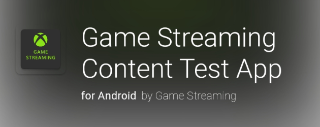
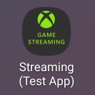
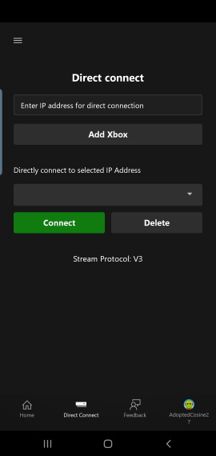
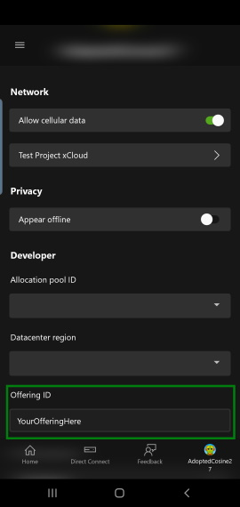
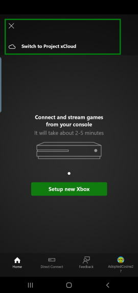

# Android Content Test Application (CTA) overview (Deprecated)

> [!IMPORTANT]
> The Android Content Test Application (CTA) is being deprecated and will no longer be supported starting early 2025. Please use the **[web version](game-streaming-web-content-test-application.md)** which has overall parity and can provide a better testing experience. Thank you for your support and understanding. If you have any questions or concerns, please reach out to your Microsoft representative.

Use this topic to set up a Content Test Application (CTA) to simulate the user experience of streaming your game as shown in the following screenshot.

Use the CTA to locally connect to your Xbox Development Kit and play your game locally. Connect to a private offering on Xbox Game Streaming to stream your game from an Azure datacenter.

## Get the Android CTA

> [!IMPORTANT]
> The download link may stop working in 2025 due to ["the retirement of Visual Studio App Center"](/appcenter/retirement).

The Content Test Application (CTA) is available to download by going to [https://aka.ms/GetAndroidContentTestApplication](https://aka.ms/GetAndroidContentTestApplication) or by scanning the QR code below.

> [!NOTE]
> You will need to meet the following [pre-requisites](game-streaming-stream-your-game.md) to be able to use the Content Test Application (CTA).

For more information about setting up the app, see [Testing Android Apps](/appcenter/distribution/testers/testing-android).

For questions, please contact your Microsoft Account Representative.

## Open the CTA

You can find the CTA on your Android device as Streaming (Test App) as shown in the following screenshot.

## Access the CTA

To begin testing, sign in to the app with a Microsoft account. While signed in to the app, you can identify feedback and issues, and authenticate your permissions for any private offering of Xbox Game Streaming.

> [!NOTE]
> Sandbox [test accounts](../../../services/develop/test-accounts/live-setup-testaccounts.md) _aren't_ supported in the CTA.

## Connect your dev kit

You can validate the locally installed version of your game in a streaming environment by connecting to your dev kit.

> [!NOTE]
> Ensure that your Android device that's running the CTA, and your dev kit, are connected to the same network.

To configure the CTA to connect to your dev kit, select the **Direct connect** tab in the Android app, and then enter the IP address of your dev kit. You can find the IP address in Dev Home on your dev kit.

Select **Add Xbox** to add the entered IP address to the **Directly connect to selected IP Address** drop-down menu as shown in the following screenshot.

After your IP address appears in the drop-down menu, select the address, and then select **Connect**.

## Connect to a private offering on Xbox Game Streaming

> [!NOTE]
> Alternative tool: [Web Content Test Application (CTA)](game-streaming-web-content-test-application.md#offering-selection)

If your studio made a set of games available via a private offering on Xbox Game Streaming for validation and testing, select your Microsoft account avatar to go to Settings and connect to the offering.

Enter the Offering ID that was provided by your Microsoft Account Representative as shown in the following screenshot.

After entering the ID, select **Home** to browse the titles that are in the offering.

If the app shows the setup process for Xbox Console Streaming, you can switch to Xbox Game Streaming from the menu as shown in the following screenshot.

> [!NOTE]
> Offerings currently do not automatically route users to the closest available data center. In order to control this, use the region dropdown in the settings menu to select where to stream from.

Contact your Microsoft Account Representative to ensure that your games are available for your validation in a private offering.

## Developer Settings

From the home page, developer settings can be accessed by clicking on the user's profile picture and then looking for the developer category. This settings area allows developers to change the private offering or override stream configuration settings.
[Stream Configuration Overview](game-streaming-content-test-application-stream-config.md) includes more information about the specific stream configuration settings that can be overridden.

## Troubleshooting

There are some common issues and solutions when setting up the CTA on your Android device.

### I didn't receive the link to install the CTA

Contact your Microsoft Account Representative to ensure that the correct Microsoft account was used during the registration process.

You can check to see if you have access to the app from the [App Center Install Portal](https://install.appcenter.ms/).

### I can't connect to my dev kit

Ensure that you've followed the steps in the [Setting up your Xbox Development Kit for Streaming](game-streaming-setup-xbox-developer-kit.md) topic.

Use the following steps to setup network connectivity between your client device and dev kit.

1. Ensure that the dev kit has public internet access (access to Xbox services is required).
1. Check that the IP address that's used to connect from the client device is the main IP address of the dev kit that's displayed in Dev Home.
1. Test the connection between the dev kit and Android device by using Internet Control Message Protocol (ICMP) for a nearby router. The Google Play Store has multiple apps that are available for checking network connectivity and latency.

> [!NOTE]
> The following network connection settings can affect your ability to successfully stream your game.

- UDP Protocol connectivity is required. Streaming from a devkit utilizes UDP port 9002. Additionally, streaming from a private offering may use UDP ports 1024 through 1191.
- NAT and network proxies are generally not an issue but can impact performance.
- HTTP (TCP only) proxies aren't supported.

### I don't have access to the private offering

If you can't access your studio's private offering to validate your game directly from Xbox Game Streaming, ensure that you're signed in to the CTA with the Microsoft account that's authorized.

### I can't sideload Touch Adaptation Layouts to the CTA

- Ensure that the PC running the [Touch Adaptation Kit command line tool](tak-command-line-tool/game-streaming-tak-command-line.md) is on the same network as the device running the CTA.
- The [Touch Adaptation Kit command line tool](tak-command-line-tool/game-streaming-tak-command-line.md) server uses TCP port 9269 by default. Ensure that this port is either unblocked or customize the port using the --port command line option.
