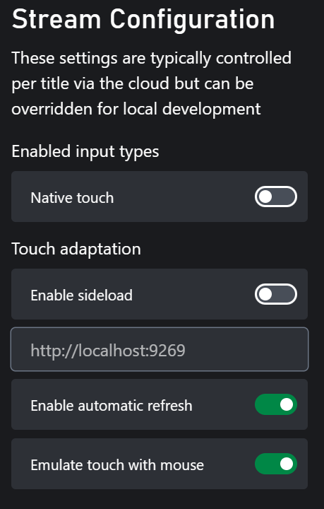
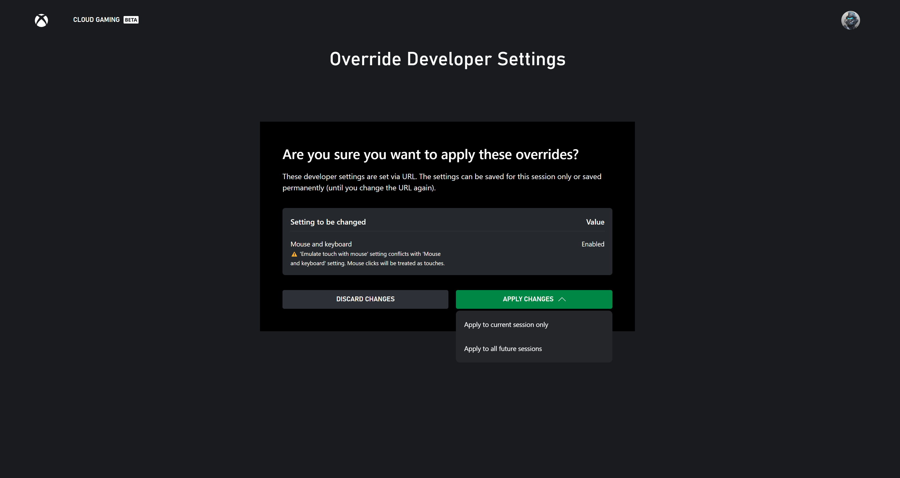

# Content Test Application (CTA) Stream Configuration Overview

This topic covers the developer settings within the content test application used to override stream configuration settings.

- [Stream Configuration](#stream-configuration)
- [Override Stream Configuration](#override-stream-configuration)

## Stream Configuration

The stream configuration section of settings can be accessed from the home page on PC and Android by clicking on the user's profile image and then selecting the developer section of options. On web, this section of settings can be found by clicking the gear icon next to the user's profile image.

Stream configuration settings are the set of settings that are configured on the cloud streaming service for your game. These settings include items like the available touch control bundles for the game, and information like if the title supports native touch. In the content test application, these settings can be locally overridden to test the behavior of your game in these different modes either while streaming in a private offering or directly streaming from a Xbox Development Kit. In order to ensure correct behavior of your game when played with cloud streaming, contact your Microsoft Account Representative to ensure the cloud configuration correctly reflects the capabilities of your game.

### Enabled Input Settings

| Setting                                                   | Description                                                                                                   |
| :-------------------------------------------------------- | :------------------------------------------------------------------------------------------------------------ |
| Native Touch                                              | Allows a game to directly receive touch events and handle them natively in game.                              |
| Mouse and Keyboard                                        | Allows a game to receive mouse and keyboard events.                                                           |

### Touch Adaptation

The settings in this section all pertain to how touch adaptation bundles are used for your game. The sub settings in the menu are as follows:

| Setting                                                   | Description                                                                                                   |
| :-------------------------------------------------------- | :------------------------------------------------------------------------------------------------------------ |
| Enable [TAK sideload](tak-command-line-tool/game-streaming-tak-command-line.md) | Allows a touch bundle to be loaded from the sideload server address rather than from the cloud configuration. |
| Sideload server address                                   | Web address of the sideload server. Typically this will be something like `https://<your ip address>:9269` for remote machines and `http://localhost:9269` when connecting to a sideload server running on the local machine.    ⚠️ **NOTE**: if the address is `https` and not `http`, then the [Touch Adaptation Kit Command Line Tool (tak.exe)](tak-command-line-tool/game-streaming-tak-command-line.md) must use the `--certificate-file` option when executing the `serve` command. The [Web Content Test Application (CTA)](game-streaming-web-content-test-application.md) only supports `https` sideload addresses when connecting to a remote sideload server. |
| Enable automatic refresh                                  | Allows local changes in the touch bundle to be automatically updated in the content test application.         |
| Emulate touch with Mouse                                  | Allows mouse clicks to be treated as touch events. This is useful if testing on a non touch device.           |

## Override Stream Configuration

It is possible to override the stream configuration settings mentioned above by using query strings in the URL for testing purposes. The settings and their corresponding query strings are as follows:

| Settings                 | Query string                        |
|--------------------------|-------------------------------------|
| Native Touch             | `devTools.enableNativeTouch`        |
| Mouse and Keyboard       | `devTools.enableMouseAndKeyboard`   |
| Enable TAK sideload      | `devTools.takSideloadEnabled`       |
| Sideload server address  | `devTools.takServerAddress`         |
| Enable automatic refresh | `devTools.takAutoRefresh`           |
| Emulate touch with mouse | `devTools.takAllowMouseInteraction` |

For example, if your current configuration has "Mouse and Keyboard" disabled and you want to temporarily enable it for testing a game, you can add the query string `devTools.enableMouseAndKeyboard=true` to the URL of your game streaming link. The modified URL would look like this: `https://www.xbox.com/en-US/play/launch/{title_name}/{title_id}?devTools.enableMouseAndKeyboard=true`.

When loading a URL with these overrides, it will redirect to another page that asks for acknowledgement to prevent accidental incorrect configuration overrides. If all the override settings are the same as the current settings, the page will be skipped.

The page will display all the settings with override values different from the current settings. If the override value is the same as the current setting value, it will not appear in the list. The page will also provide warnings about potential conflicts with other setting values. On this page, you can choose to either discard or apply the changes. Clicking "DISCARD CHANGES" will discard all the overrides and proceed to the original target page with the existing settings. Clicking "APPLY CHANGES" will give you two options for how you want the overrides to take effect:

- Apply to current session only: This will keep the overrides in the URL and apply the settings only to the current browser page session. It will then navigate to the original target page. The overrides will disappear once you leave the current page.
- Apply to all future sessions: This will update your current settings with the override values and navigate to the original target page without the override query strings, as the values are saved in your settings.

The override settings page will only appear once per page session after acknowledging the override settings. If there is a different override setting, the page will appear again.
