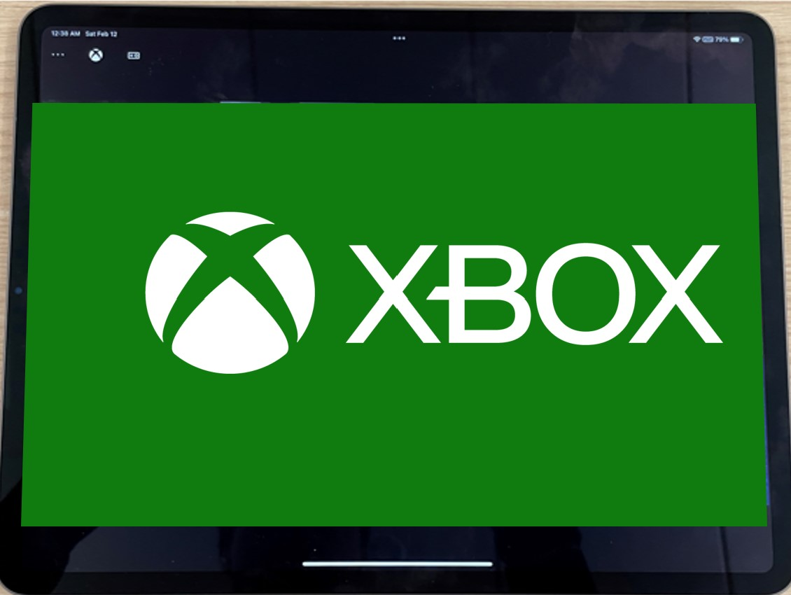
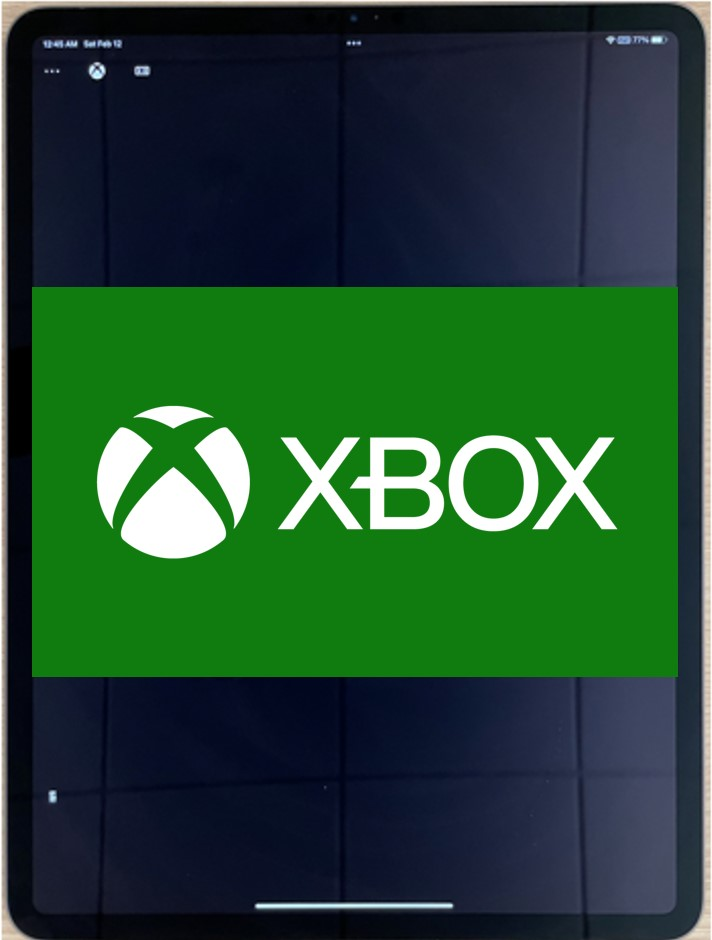
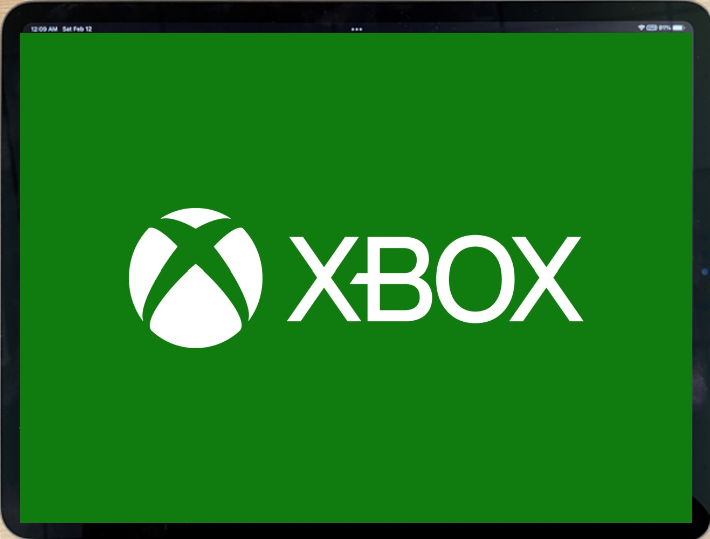
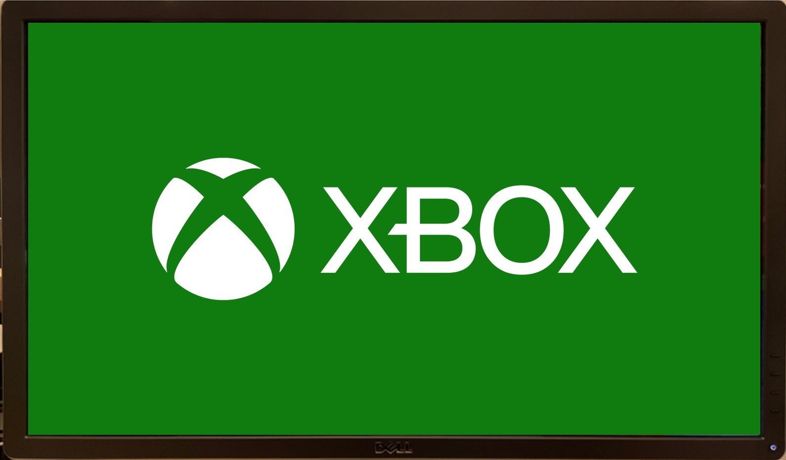

# Custom Resolution Overview

Xbox Game Streaming provides you the ability to customize the resolution of your games based on the output resolution of devices besides TV, such as phones, tablets and other devices. This aids in providing a richer experience across devices. [XGameStreamingGetDisplayDetails](../../../reference/system/xgamestreaming/functions/xgamestreaminggetdisplaydetails.md) and [XGameStreamingSetResolution](../../../reference/system/xgamestreaming/functions/xgamestreamingsetresolution.md) were introduced to allow you to switch your stream from the Xbox's 16:9 aspect ratio to an aspect ratio that matches many different devices such as phones, tablets, etc.

For example, the image below illustrates how an Xbox game renders on a regular 16:9 TV screen vs a tablet or phone in portrait mode in the streaming environment without any changes.

 
**Figure 1. Game rendering on different devices without `XGameStreamingGetDisplayDetails` and `XGameStreamingSetResolution`**

On the other hand, the next image illustrates how the same game renders on different devices using the APIs above to set the aspect ratio to 4:3. Note how the spaces are gone when rendering on the tablet.

**Figure 2. Game rendering on different devices with `XGameStreamingGetDisplayDetails` and `XGameStreamingSetResolution`**

`XGameStreamingGetDisplayDetails` returns display details of the specified client. This can be used to make informed decisions like what custom aspect ratios to render at or what resolution to use to enable [DirectCapture](game-streaming-directcapture-overview.md). DirectCapture was built to minimize server latency when the title presents a compatible frame, eliminating approximately 16 to 72 milliseconds of latency. This latency reduction is different for each game because it depends on the game's render output.

`XGameStreamingSetResolution` should be used once the title has decided on a resolution. This API will set the resolution of the stream.

The APIs expose the requirements for DirectCapture and the client's preferred resolution so that different titles can adopt them.
> [!NOTE]
> The min/max requirements as well as other DirectCapture rules need to be followed.

Please take into consideration that while these APIs will exist on home consoles, they will only allow standard resolutions to be used in order to maintain TV compatibility (effectively making them no-ops).

## How To Properly Use The APIs

1. **Connect a stream**

If you have not streamed your game before, please follow the instructions here: [Game Streaming Test Prerequisites](game-streaming-stream-your-game.md)

1. **Get display's details**

    To get the display's details, games can call `XGameStreamingGetDisplayDetails` which will return the displays details of the specified client.

1. **Pick a resolution**

    This depends on the game. There are several options such as

    a. Using `preferredWidth`/`preferredHeight` as a best match.

    b. Use `XGameStreamingDisplayDetails` to find the closest match to a resolution in a pre-configured set of tested resolutions.

    c. Turn on resolution picker for the PC version of the game to allow the player to choose the resolution. Consider limiting to resolutions within the `maxWidth` `maxHeight` and `maxPixels` bounds.

1. **Set stream resolution**

    Call `XGameStreamingSetResolution` to change the streaming resolution to your new render resolution. It is best to call in response to user action such as the start of the stream, resizing, rotate device action, etc.

    Note that this resolution does not need to match preferredWidth/preferredHeight. If it does not match, the stream may be may be scaled to fit on screen with letter or pillar boxes added to fill any remaining space.

    > [!NOTE]
    > It is important to note that setting the stream resolution takes time, uses limited resources, and has player-visible effects, so this API should only be called rarely; for example, when a new client connects or changes its preferred resolution.

    Calling `XGameStreamingSetResolution` more than once every 200ms will cause brief stretching. This API is NOT real-time safe.

1. **Start rendering**

    Rendering custom resolutions should be the same as rendering other resolutions -- set your window size and configure your backbuffer with the new resolution.

If you want to give it a try, please follow our samples [here](https://github.com/microsoft/Xbox-GDK-Samples/tree/main/Samples/xCloud/CustomResolution).

## See also

[Custom Resolution Best Practices](game-streaming-custom-resolution-best-practices.md)

[Testing With Custom Resolution (NDA topic)](game-streaming-testing-custom-resolution.md)