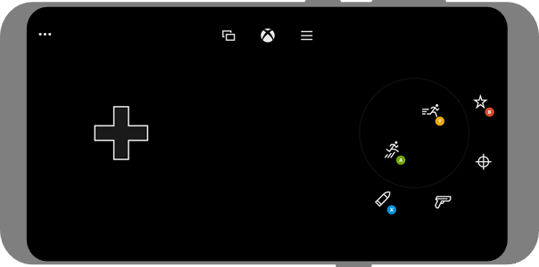

# Getting started with touch

This article covers how to configure touchscreen overlay controls for your Xbox Game Streaming title.

You can make your game playable without an attached controller. Touchscreen controls increase the number of users who are playing your game, increase engagement for mobile users, and provide users with an intuitive experience for their device.

There are two avenues for bringing touch input to your game.

1. **Touch Adaptation Kit Layouts**. The streaming client can overlay touch controls over the game. You can provide custom layouts that optimize the controls for your game and change to different layouts for different parts of your game.

2. **Native touch**. You can support touch directly for areas of your game that would respond to standard touch interactions more naturally than controller interactions. Examples of where this is commonly desired include menus, inventory management, and map interactions.

Touch input, in either form, isn't enabled by default. To locally test with touch, the Content Test Application can be configured to enable either native touch or touch adaptation kit bundle sideloading. [Stream Configuration Overview](game-streaming-content-test-application-stream-config.md) includes more information about how to use these settings. After touch is working locally, contact your Microsoft Account Representative to enable touch input for others while streaming.

For more information about the CTA, see [Web Content Test Application (CTA)](game-streaming-web-content-test-application.md).

## Touch Adaptation Kit layouts

For a more advanced guide on the best practices for designing touch layouts by using the Touch Adaptation Kit, check out [A designer's guide to building touch controls](building-touch-layouts/game-streaming-tak-designers-guide.md).

You can take the following actions by using the [Touch Adaptation Kit (TAK)](game-streaming-touch-touch-adaptation-kit-overview.md).

- [Create](building-touch-layouts/game-streaming-touch-building-touch-layout.md) custom touch-adapted layouts.
- [Deploy](building-touch-layouts/game-streaming-touch-publishing-layouts.md) custom touch-adapted layouts to your device.
- Use the [Cloud Aware touch adaptation kit APIs](../../../reference/system/xgamestreaming/xgamestreaming_members.md#TouchAdaptation) to control the display of your control layouts.

> [!NOTE]
> Touch adaptation kit layouts are *only* visible to users who are actively using touch input. When a controller is actively being used, the touch controls are hidden. As such, it's always safe and preferable to add touch adaptation kit layouts and call the [Cloud Aware touch adaptation kit APIs](../../../reference/system/xgamestreaming/xgamestreaming_members.md#TouchAdaptation).

Your game can have a similar touch-adapted layout as shown in the following screenshot.

## Support native touch

Supporting native touch is similar to supporting mouse or other input in your game. Touch events will be represented by [IGameInputReading](../../../reference/input/gameinput/interfaces/igameinputreading/igameinputreading.md) with a [GameInputKind](../../../reference/input/gameinput/enums/gameinputkind.md) that has the value of `GameInputKindTouch`.

For a complete guide to implementing native touch, check out [Building a native touch interface for your game with IGameInput](game-streaming-native-touch-igameinput.md)

## See also

[Introduction to Xbox Game Streaming](game-streaming-overview.md)  
[Designer's Guide to Building Touch Controls](building-touch-layouts/game-streaming-tak-designers-guide.md)  
[Building a native touch interface for your game with IGameInput](game-streaming-native-touch-igameinput.md)  
[How to get the TAK CLI](https://aka.ms/get-takcli)
