# Web Content Test Application (CTA) overview

This topic covers the list of developer tools which are available on [xbox.com/play/dev-tools](https://www.xbox.com/play/dev-tools). These tools have been designed for use with the Edge and Chrome browsers on Windows, and with Safari on Mac, iOS and iPadOS.

- [Landing page](#landing-page)
- [Offering selection](#offering-selection)
- [Remote connect](#remote-connect)
- [Dev settings menu](#dev-settings-menu)
- [Dev tools menu](#dev-tools-menu)

## Developer Home Page

To start using the developer tools, simply visit [xbox.com/play/dev-tools](https://www.xbox.com/play/dev-tools) or launch a web based streaming experience like [xbox.com/play](https://www.xbox.com/play/) and enter developer mode by following these steps:

1. Open settings
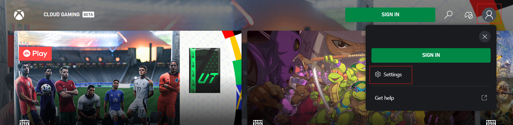

2. Click or tap on "Account" **10 times in quick succession** to reveal the developer settings tab
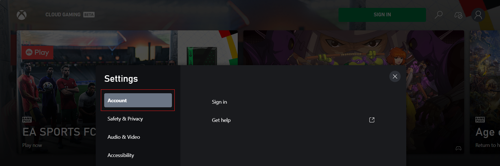

3. Click on "Developer Tools Home" button. Different options may be available in the developer tab based on sign in state, and account access.
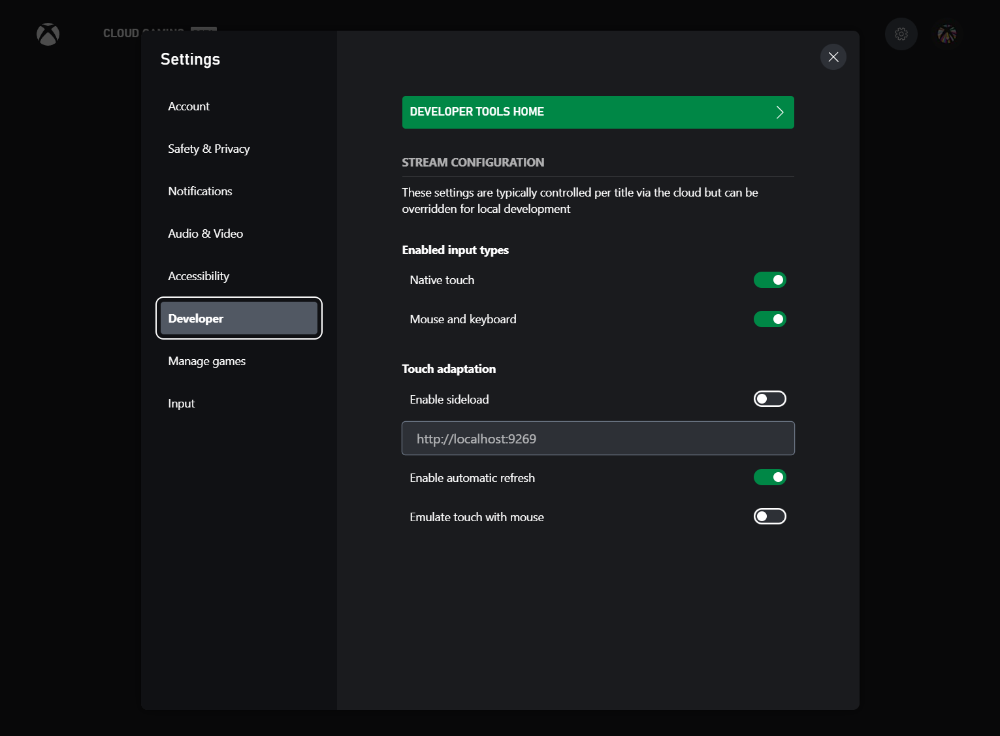

> [!NOTE]
> On iOS or iPad OS, you can save this page as a progressive web app (PWA) by clicking the share button and selecting "Add to Home Screen". Once it is setup, this PWA will remember your account and configuration making it easy to return to later to continue testing.

- For retail accounts, simply leave the sandbox blank and log in using the same account that is logged into the Xbox Development Kit or configured to access a private offering.

> [!NOTE]
> For sandbox test accounts, remember to fill in the sandbox id before signing in. If this is not done, some features may not work appropriately as these accounts don't have access to retail features. In this case, it may be necessary manually log out of the account by visiting a different microsoft website like [outlook.com](https://www.outlook.com) and then try again with the correct sandbox ID.

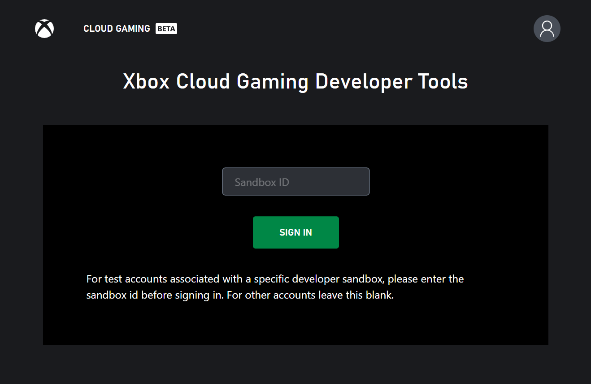

Once Signed in, this landing page has links to quickly get access to remote play and private offering selection. Depending on if the signed in account has been associated with a Xbox Development Kit or granted access to a private offering, some of the options may be disabled. If the account doesn't have access to any developer scenarios, an error message will be displayed with information on how to get setup. The below sections go into more detail on specific account setup requirements.

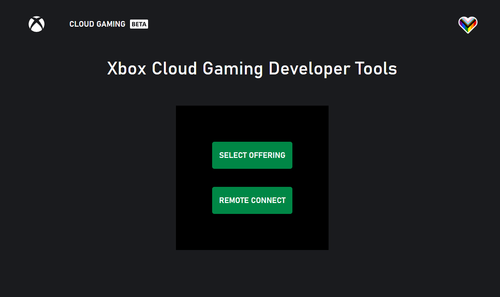

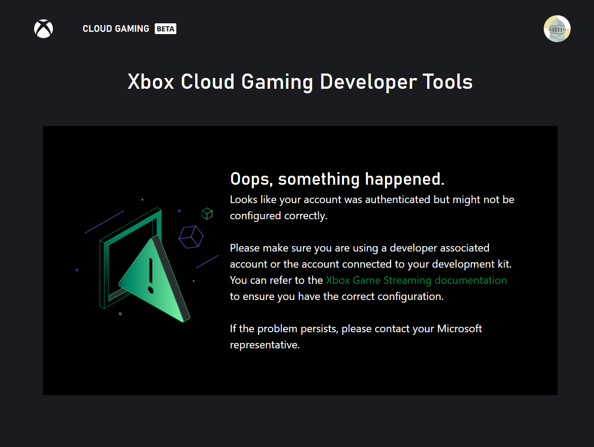

## Offering Selection

Offerings are the private test environments used to validate games running on datacenter hardware. For more information on offerings, please check out the information in the [Game Streaming Overview](game-streaming-overview.md#what-are-private-offerings).

To use a specific offering, go to [xbox.com/play/dev-tools/select-offering](https://www.xbox.com/play/dev-tools/select-offering) or click on "Select Offering" from the developer home page. On the offering selection page, the offerings you have access to will be pre-populated in the dropdown list. You can then select the offering, and click connect. If for some reason your desired offering is not in the dropdown list, you can manually enter it in the input box above, and click "Add offering".

After you click connect, you will be directed to the main catalog page configured for your offering. There will be text on the page which indicates that you are now using a custom offering. If you are unable to access the offering, ensure you are signed in to an account which is authorized to use that specific offering.

### Offering Regions

Because offerings connect to a real datacenter, it is important to be able to test in different regions and experience the representative streaming experience in that region. Currently offerings do not automatically route users to the closest available data center. Instead, this can be manually controlled with the streaming region dropdown in the developer settings menu or the `user.region` query parameter. Note that available regions must be configured ahead of time; please contact your Microsoft account representative to adjust the available regions for your offering.

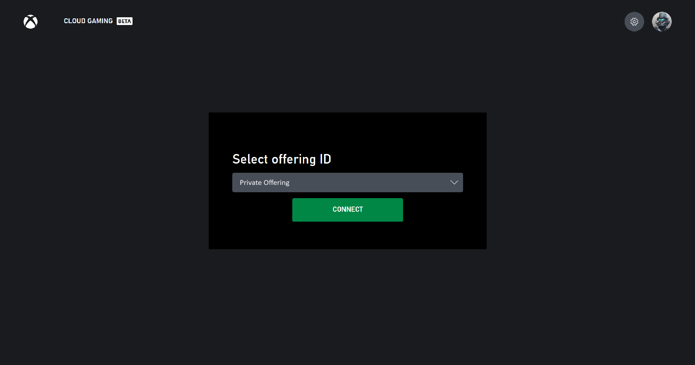

## Remote Connect

Remote connect enables the user to connect remotely to Xbox Development Kits that have been enabled for remote features for that user. In order to able this experience, steps first need to be taken on the Xbox Development Kit.

### Xbox Development Kit setup

- Note that you must do this part before attempting to log in to remote connect website - if you have not yet configured a Xbox Development Kit for remote use with your account, the remote connect page will redirect you back to the xbox.com/play landing page.
- Log in to the Xbox Development Kit with the account (including a sandbox account) that you will use from the website
- If you want, give the Xbox Development Kit a name so that you can easily identify it
- Go to Dev Home -> Streaming -> under "Remote Connect" select your account.
  - As an alternative, remote connect can also be enabled via the consumer settings: Go to Dev Home -> Settings -> Launch Settings -> Devices & Connections -> Remote Features -> Enable Remote Features to enable remote connect

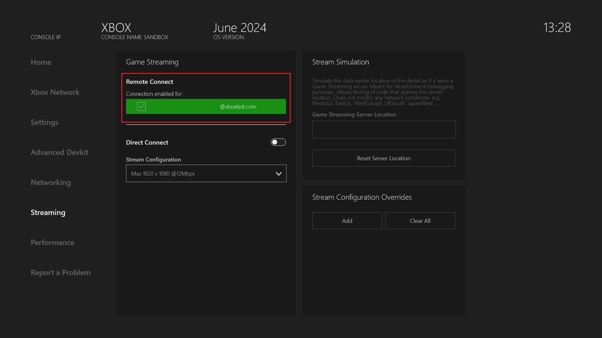

### Web Content Test App setup

Ensure you have completed the above step of setting up your Xbox Development Kit before proceeding. If you have not enabled remote features on your Xbox Development Kit, the remote connect feature may be disabled on the developer tools home page.

Follow the steps at the top of this page in order to login with the same account that was setup for remote play on the Xbox Development Kit. Remember to enter the sandbox id for a sandbox test account.

Once signed in and on [Developer Tools Home](https://www.xbox.com/play/dev-tools), select the remote connect option to see a list of devices the user is able to connect to. Instructions for adding a new device can also be found on this page by clicking the "Setup New Xbox" button.

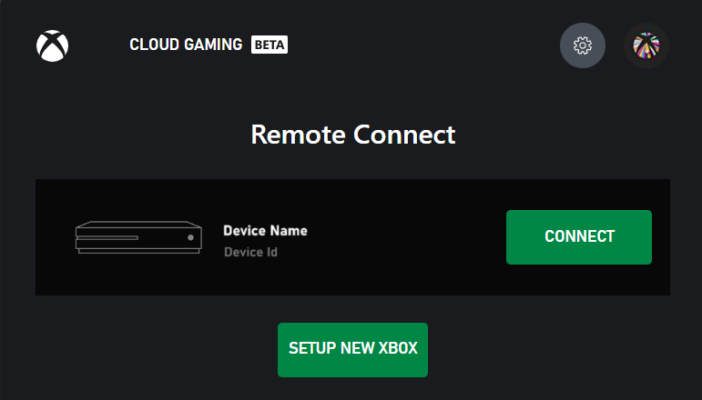

> [!NOTE]
> Make sure the client device you are connecting to your Xbox Development Kit from is on the same network as your Xbox Development Kit. Connections will also work over a VPN. Network traffic to the Xbox Development Kit will flow on UDP port 9002 so this port should also be unblocked by network configuration.

## Dev Settings Menu

When using a custom offering or connecting to a remote Xbox Development Kit, you will find a set of developer settings accessible from the settings menu. The settings menu is able to be reached from clicking on the user profile photo in the upper right corner and selecting settings. These developer settings include the ability to return to the developer tools homepage, change private offerings, and adjust stream configuration settings. [Stream Configuration Overview](game-streaming-content-test-application-stream-config.md) includes more information about the specific stream configuration settings that can be overridden.

- Enable [TAK sideload](tak-command-line-tool/game-streaming-tak-command-line.md)
- Sideload server address
- Enable automatic refresh: enable automatic refresh for TAK sideload
- Allow mouse interaction: allow mouse interaction on streaming with TAK

This dev settings menu is additionally always enabled on the [xbox.com/play/dev-tools/select-offering](https://www.xbox.com/play/dev-tools/select-offering) and [xbox.com/play/dev-tools/direct-connect](https://www.xbox.com/play/dev-tools/direct-connect) pages.

## Dev Tools Menu

When streaming from a custom offering or from a Xbox Development Kit, you will have access to the developer menu, which can be found in the bottom left corner of the stream. After you click on this menu, you will have the ability to switch the active TAK layout if you are using the [TAK CLI to sideload your layouts](tak-command-line-tool/game-streaming-tak-command-line.md).

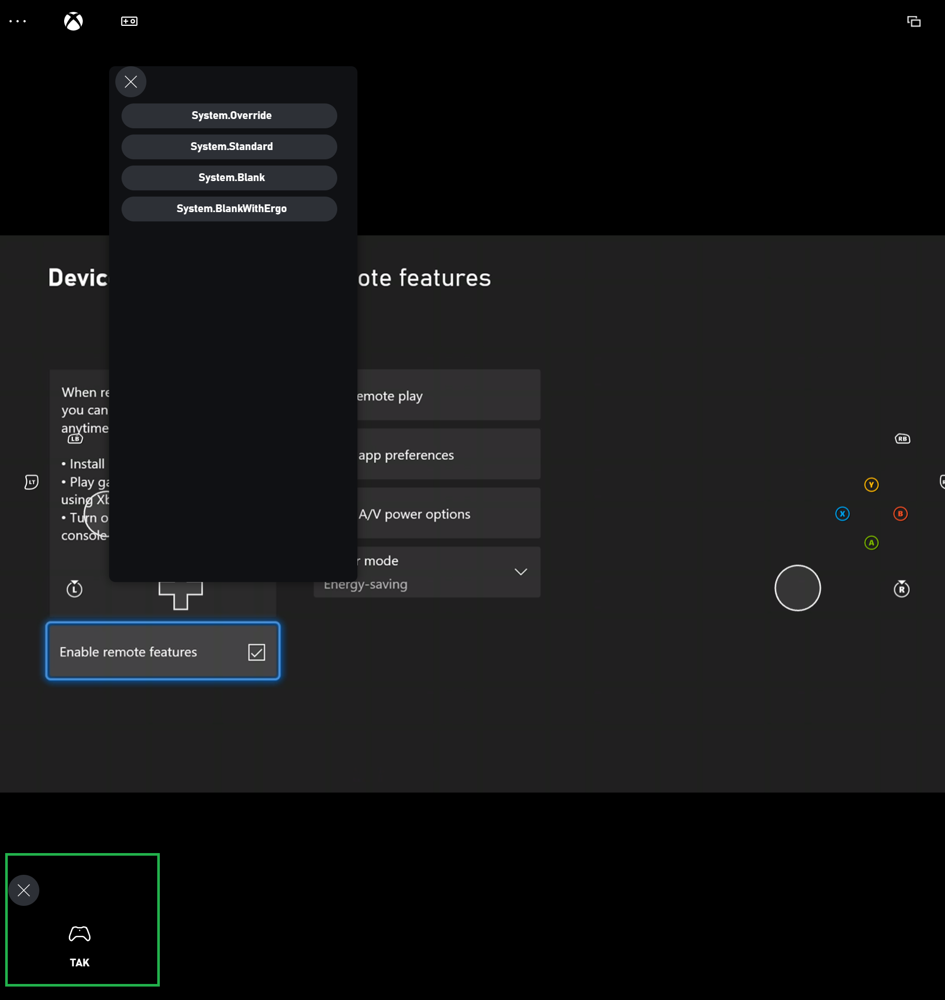

## Mouse and Keyboard

Mouse and Keyboard unlocks the gameplay experience that users have grown accustomed to and offers the opportunity for users to play games that only support mouse and keyboard. In addition, this enables users to play Mouse and Keyboard supported titles when they don't have a controller. For developers, supporting keyboard unlocks their ability to access internal debugging commands.  

Make sure your CTA is setup for testing, you can follow the instructions here: [Configure your web CTA](game-streaming-web-content-test-application.md)

### How to test Mouse and Keyboard

Once your Content Test Application (CTA) is setup, you can test your Mouse and Keyboard implementation by going to the account icon and navigating to the Developer tab as shown in the following screenshot.  

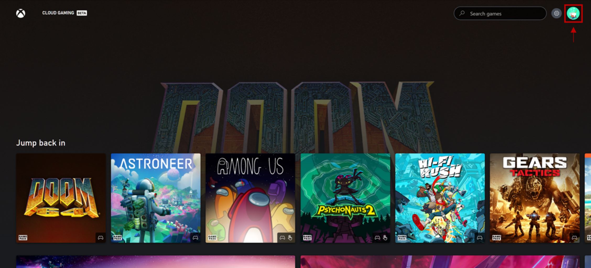

After navigating to the Developer tab, toggle on "Mouse and Keyboard" to enable the feature.

> [!NOTE]
> It is recommended to keep "Emulate touch with mouse" under the touch adaption section toggled OFF while testing Mouse and Keyboard. During a stream if both are on, mouse clicks will be interpreted as touch. However, tapping F9 will still enter and exit Mouse and Keyboard mode. 
   
 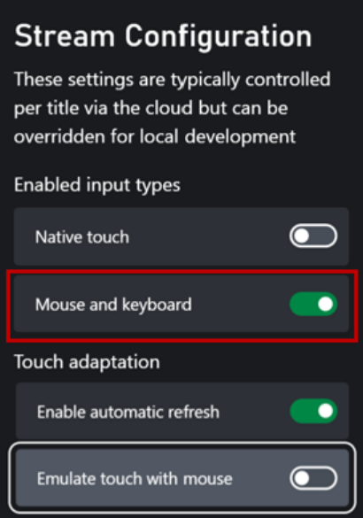

> [!NOTE]
> Players can use a shortcut key, typically F9, to enter and exit keyboard mode. While it is possible for players to remap this key, please avoid using F9 for critical game functionality if possible or allow players to remap keys within the game.

To **enter Mouse and Keyboard mode** you can left click on the screen once a stream is initiated, or tap F9. 
To **exit Mouse and Keyboard mode** tap F9.
 
Please reach out to your Microsoft account representative when you have completed testing and are ready to enable Mouse and Keyboard for all users. 