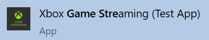
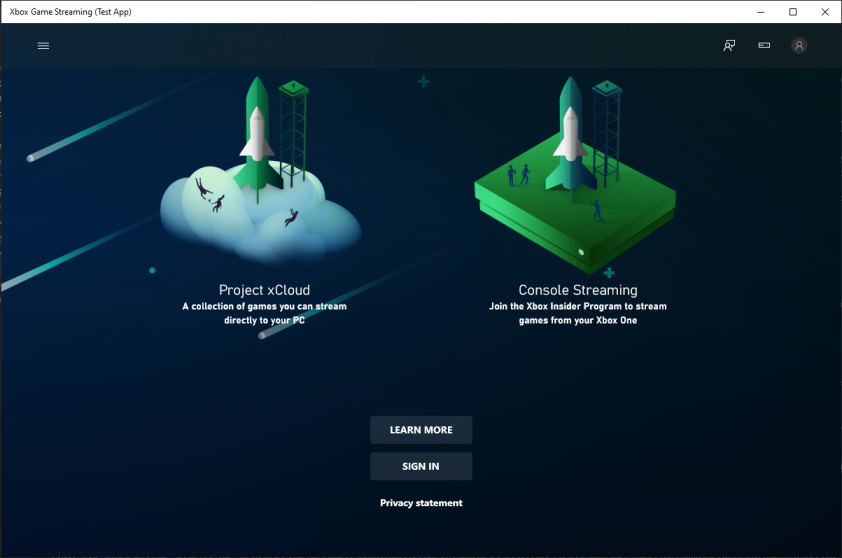
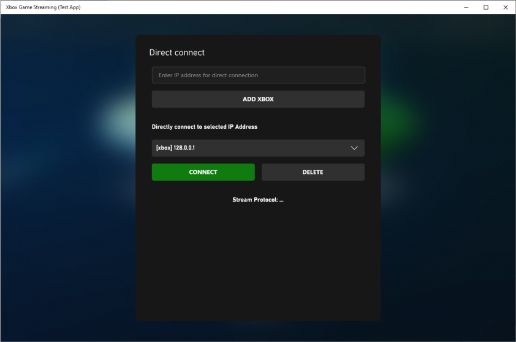
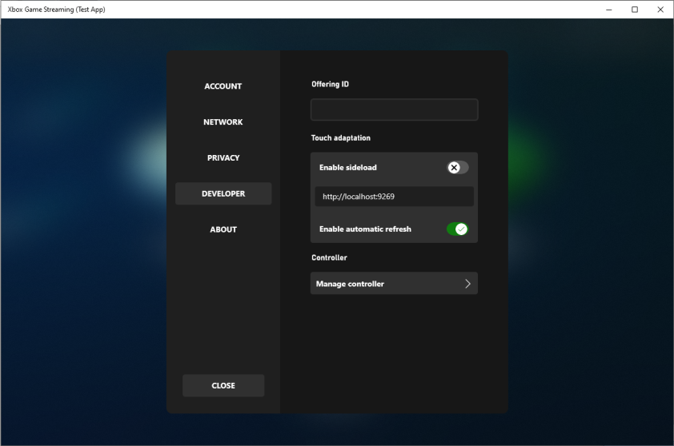
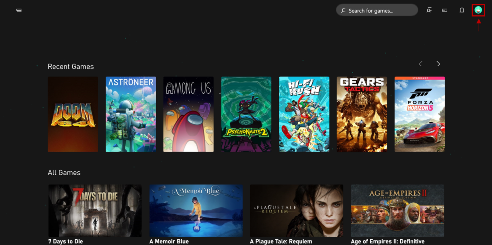
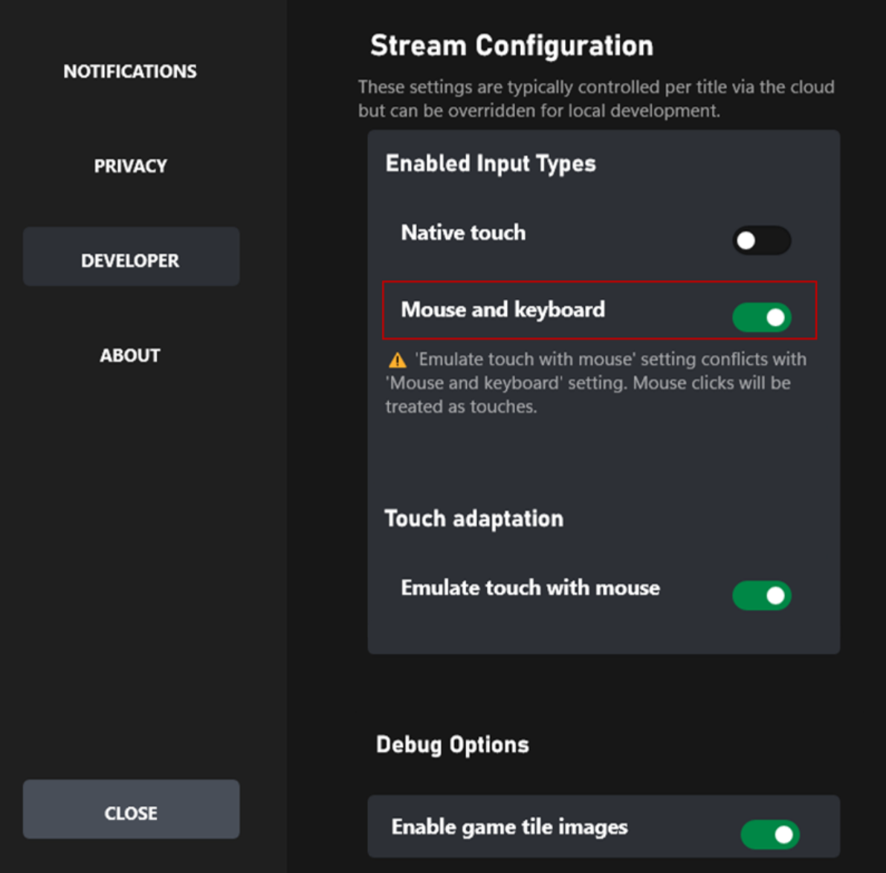

# Windows Content Test Application (CTA) overview (Deprecated)

> [!IMPORTANT]
> The Windows Content Test Application (CTA) is being deprecated and will no longer be supported starting early 2025. Please use the **[web version](game-streaming-web-content-test-application.md)** which has overall parity and can provide a better testing experience. Thank you for your support and understanding. If you have any questions or concerns, please reach out to your Microsoft representative.

Use this topic to set up a Content Test Application (CTA) to simulate the user experience of streaming your game.

Use the CTA to locally connect to your Xbox Development Kit and play your game locally.
Connect to a private offering on Xbox Game Streaming to stream your game from an Azure datacenter.

## Get the Windows CTA (Deprecated)

The Windows Content Test Application (CTA) is being deprecated and the download link is no longer available. Please see above to use Web Content Test Application as an alternative.

For questions and concerns, please contact your Microsoft Account Representative.

> [!NOTE]
> You will need to meet the following [pre-requisites](game-streaming-stream-your-game.md) to be able to use the Content Test Application (CTA).

## Open the CTA

You can find the CTA on your Windows 10 PC as Xbox Game Streaming (Test App) as shown in the following screenshot.

  

When you open the CTA, you can sign in to the app and connect to Xbox Game Streaming, or you can connect to your development kit as shown in the following screenshot.

  

## Connect your dev kit

> [!NOTE]
> Alternative tool: [Xbox Manager: remote control](../../../tools/tools-console/xbom/manager-tool-gamepad-input.md)

You *don't* need to be signed in to the CTA to connect to your dev kit for streaming.  

You can validate the locally installed version of your game in a streaming environment by connecting to your dev kit.

> [!NOTE]
> Ensure that your Windows 10 PC that's running the CTA, and your dev kit, are connected to the same network.

To configure the CTA to connect to your dev kit, select the **Direct connect** icon as shown in the following screenshot.

In the **Direct connect** pane, enter the IP address of your dev kit. You can find the IP address in Dev Home on your dev kit.  

Select **Add Xbox** to add the entered IP address to the **Directly connect to selected IP Address** drop-down menu as shown in the following screenshot.

After your IP address appears in the drop-down menu, select the address, and then select **Connect**.

## Connect to a private offering on Xbox Game Streaming

> [!NOTE]
> Alternative tool: [Web Content Test Application (CTA)](game-streaming-web-content-test-application.md#offering-selection)

You must be signed in when attempting to connect to a private offering for your game studio in Xbox Game Streaming.

> [!NOTE]
> You must sign in to the CTA by using a retail Xbox account. Sandbox [test accounts](../../../services/develop/test-accounts/live-setup-testaccounts.md) *aren't* supported.

If your studio made a set of games available via a private offering on Xbox Game Streaming for validation and testing, select your Xbox account avatar to go to Settings and connect to the offering.  

Enter the Offering ID that was provided by your Microsoft Account Representative as shown in the following screenshot.

  

After entering the ID, select **Enter** to browse the titles that are in the offering.  

If the app shows the setup process for Xbox Console Streaming, you can switch to Xbox Game Streaming in the menu at the top left of the panel.

Contact your Microsoft Account Representative to ensure that your games are available for your validation in a private offering.

> [!NOTE]
> Offerings currently do not automatically route users to the closest available data center. In order to control this, use the region dropdown in the settings menu to select where to stream from.

## Developer Settings

From the home page, developer settings can be accessed by clicking on the user's profile picture and then looking for the developer category. This settings area allows developers to change the private offering or override stream configuration settings.
[Stream Configuration Overview](game-streaming-content-test-application-stream-config.md) includes more information about the specific stream configuration settings that can be overridden.

## Troubleshooting

There are some common issues and solutions when setting up the CTA on your Windows 10 PC.

### I can't connect to my dev kit

Ensure that you've followed the steps in the [Setting up your Xbox Development Kit for Streaming](game-streaming-setup-xbox-developer-kit.md) topic.

Use the following steps to set up network connectivity between the client device and dev kit.  

1. Ensure that the dev kit has public internet access (access to Xbox services is required).
1. Check that the IP address that's used to connect from the client device is the main IP address of the dev kit that's displayed in Dev Home.
1. Test the connection between the dev kit and the Windows 10 PC by using Internet Control Message Protocol (ICMP) (ping) for a nearby router.  

> [!NOTE]
> The following network connection settings can affect your ability to successfully stream your game.
>
>- UDP Protocol connectivity is required (Port 9002).
>- NAT and network proxies are generally not an issue but can impact performance.
>- HTTP (TCP only) proxies aren't supported.

### I don't have access to the private offering

If you can't access your studio's private offering to validate your game directly from Xbox Game Streaming, ensure that you're signed in to the CTA with the Xbox services account that's authorized.

## Mouse and Keyboard

Mouse and Keyboard unlocks the gameplay experience that users on PC have grown accustomed to and offers the opportunity for users to play games that only support mouse and keyboard. In addition, this enables users to play Mouse and Keyboard supported titles when they don't have a controller.  

Make sure your CTA is setup for testing, you can follow the instructions here: [Configure your CTA](game-streaming-windows-pc-content-test-application.md)

### How to test Mouse and Keyboard

Once your Content Test Application (CTA) is setup, you can test your Mouse and Keyboard implementation by going to the account icon and navigating to the Developer tab as shown in the following screenshot.

After navigating to the Developer tab, toggle on Mouse and Keyboard to enable the feature.

> [!NOTE]
> It is recommended to keep "Emulate touch with mouse" under the touch adaption section toggled OFF while testing Mouse and Keyboard. During a stream if both are on, mouse clicks will be interpreted as touch. However, tapping F9 will still enter and exit Mouse and Keyboard mode.

> [!NOTE]
> Players can use a shortcut key, typically F9, to enter and exit keyboard mode. While it is possible for players to remap this key, please ensure to avoid using F9 for critical game functionality if possible or allow players to remap keys within the game.

To **enter Mouse and Keyboard mode** you can left click on the screen once a stream is initiated, or tap F9.
To **exit Mouse and Keyboard mode** tap F9.

Please reach out to your Microsoft account representative when you have completed testing and are ready to enable Mouse and Keyboard for all users.
