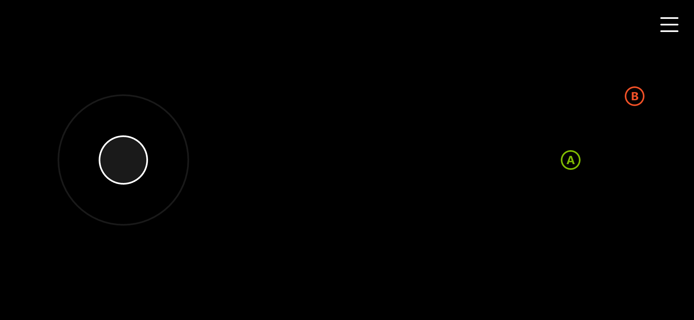
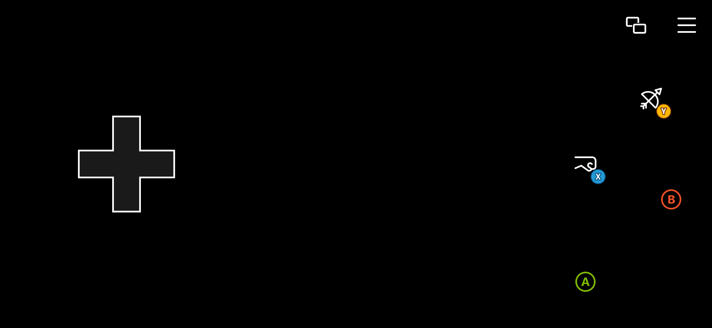
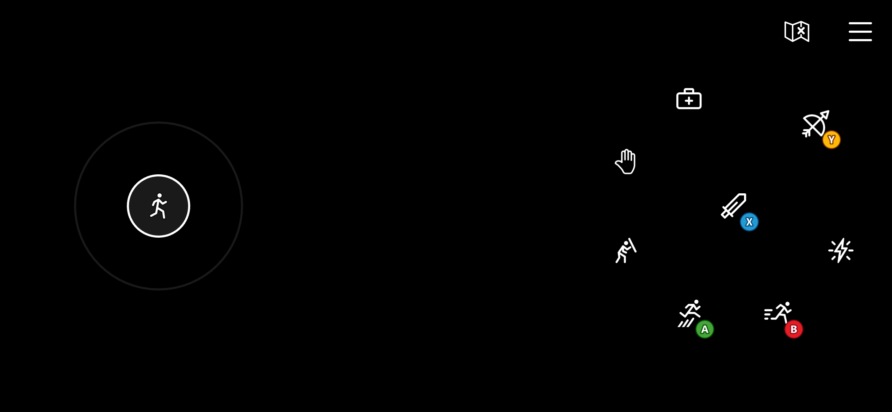
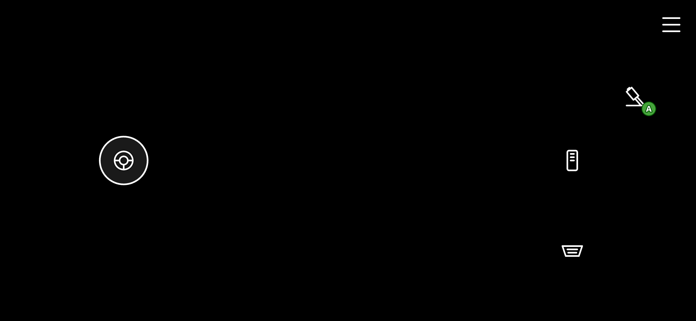
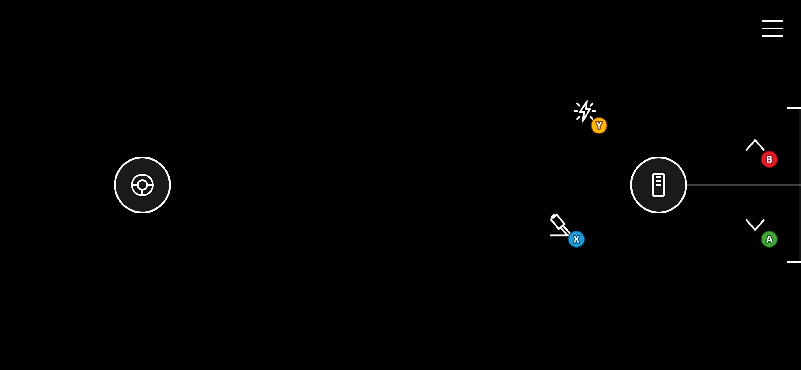
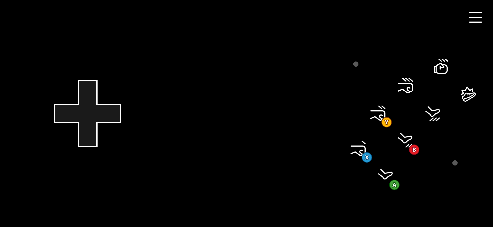
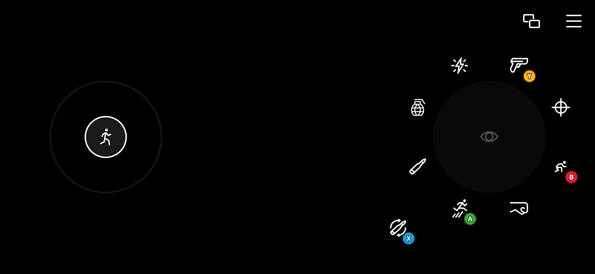

# Templates
These are the templates available for use with the TAK CLI. They can either be used while [creating a new unpacked bundle](game-streaming-tak-command-line-create-command.md#create-bundle) or [creating a layout in an existing unpacked bundle](game-streaming-tak-command-line-create-command.md#create-layout).

Use the Command Line Tool name of each template when referring to it in the Command Line Tool.

| Template                                      | Command Line Tool Name |
| --------------------------------------------- | ---------------------- |
| [Blank](#blank)                               | `Blank`                |
| [Menu](#menu)                                 | `Menu`                 |
| [Cinematic](#cinematic)                       | `Cinematic`            |
| [Platformer (Basic)](#platformer-basic)       | `PlatformerBasic`      |
| [Platformer (Advanced)](#platformer-advanced) | `PlatformerAdvanced `  |
| [Racing (Basic)](#racing-basic)               | `RacingBasic`          |
| [Racing (Advanced)](#racing-advanced)         | `RacingAdvanced`       |
| [Fighting](#fighting)                         | `Fighting`             |
| [Shooter](#shooter)                           | `Shooter`              |

## Blank

This is an empty layout with no content. It is configured to use the latest TAK schema. This is a good starting point for creating a custom touch controls layout that suits the game's needs.

## Menu

Template for a menu screen. Contains a left joystick for menu navigation, as well as A and B buttons.

## Cinematic

Barebone template for a cinematic screen. Only contains a B button on the upper right corner of the screen to maximize screen real estate available for the cinematic.

## Platformer (Basic)

Basic template for a platformer game. Uses a directional pad for movement and provides stylized A, B, X, Y buttons.

## Platformer (Advanced)

Advanced template for a platformer game. Uses a left joystick for movement that provides more accurate movement controls. Includes stylized A, B, X, Y buttons. It also uses four additional buttons on the right wheel mapped to the left bumper, right bumper, and triggers for miscellaneous actions like blocking, healing, abilities, and interacting.

## Racing (Basic)

Basic template for a racing game. It uses a one-dimensional (horizontal) left joystick for steering. It also uses 3 styled buttons on the right wheel, mapped to the left trigger (break), right trigger (accelerate), and A (handbrake).

## Racing (Advanced)

Advanced template for a racing game. Similar to the basic version, it uses a one-dimensional (horizontal) left joystick for steering. Instead of using buttons for the left and right triggers, it uses the throttle control which allows for more precise control of the trigger values as well as ability to "stick" the throttle in a position for cruise control. It also uses styled A, B, X, Y buttons on the right wheel for more controls.

## Fighting

Template for a fighting game. It uses a directional pad on the left wheel for movement, and a series of 8 buttons on the right wheel arranged in an "arcade" fashion for fighting combos. These buttons are mapped to A, B, X, Y, left bumper, right bumper, and triggers.

## Shooter

Template for a shooting game. Uses a two-directional left joystick for movement and a touchpad mapped to relative mouse movement for more precise aiming. Several controls on the right wheel are configured to render as buttons while they also act as touchpads. This allows the player to continue to aim while using the buttons for their actions, like shooting, reloading, jumping, and switching weapons.

