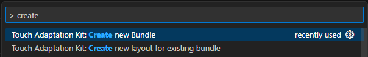
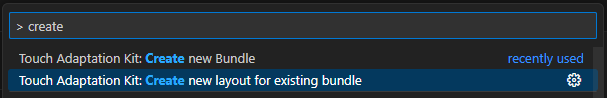

# Creating bundles and layouts in the TAK Editor

This article is a guide on how to get started with creating new Touch Adaptation Bundles (TABs) and layouts using the TAK Editor. It is assumed that the extension is already installed and set up. You can find [installation](game-streaming-tak-editor.md) and [setup](game-streaming-tak-editor-setup.md) instructions in the previous articles.

## Create a new bundle

1. Launch the command palette (`Ctrl+Shift+P` or `Cmd+Shift+P`).
2. Search for "create" and select "Touch Adaptation Kit: Create new Bundle"

   
3. A series of prompts will appear asking for parameters that will define the bundle. Enter the requested information and press `Enter` after each prompt. The prompts are summarized in the table below.

    | Prompt                   | Description                                                                                                                                                                                                                                                                                                                                                                                                                                                                                     |
    | ------------------------ | ----------------------------------------------------------------------------------------------------------------------------------------------------------------------------------------------------------------------------------------------------------------------------------------------------------------------------------------------------------------------------------------------------------------------------------------------------------------------------------------------- |
    | `Workspace`              | This only appears if there are more than one workspace folders open in VS Code. If there is only one root workspace folder, it will automatically be selected and the prompt is skipped. If there are multiple workspace folders, the one in which the bundle should be placed must be selected.                                                                                                                                                                                                 |
    | `Name`                   | The name of the new bundle. This can either be a simple name (e.g., `test-game-1`) or a nested relative path. For example, if the root workspace folder selected is called `bundles` and a relative path `role-playing-games/test-game-1` is provided, the created bundle will be placed at `path/to/bundles/role-playing-games/test-game-1`.                                                                                                                                                   |
    | `Layouts Directory Name` | Default: `layouts`. The name of the directory within the bundle where the layouts will be stored.                                                                                                                                                                                                                                                                                                                                                                                               |
    | `Assets Directory Name`  | Default: `assets`. The name of the directory within the bundle where the assets will be stored.                                                                                                                                                                                                                                                                                                                                                                                                 |
    | `Context File Name`      | Default `context`. The name of the context file. This file is placed at the root of the bundle. [Read more about the context file](../game-streaming-touch-touch-adaptation-bundle.md#context-and-state).                                                                                                                                                                                                                                                                                       |
    | `Languages`              | Default: None. A comma-separated list of IETF Langauge Tags (e.g., `en-US, ja-JP, fr-CA`) that the bundle will support. When adding support for multiple languages, a sub-directory dedicated to each language will be created within the layouts and assets directories. [Learn more about Touch Adaptation Bundle Localization](../game-streaming-tak-localization.md). Note that a `neutral` directory is created under the layouts directory regardless of the language tags provided here. |
    | `Templates`              | Default: `blank`. Select any number of templates to use as a starting point for the new bundle. A preview of how the bundles render is available [here](../tak-command-line-tool/game-streaming-tak-command-line-templates.md). Note that for each template selected, a layout will be created in *each* of the language sub-directories under the layouts directory.                                                                                                                           |

> [!NOTE]
> Aside from the `Workspace` and `Name` prompts, all other prompts have default values that can be accepted by pressing `Enter` without entering any text.

## Create a new layout

Similar to creating a bundle, the process of creating a new layout is done through the command palette.

> [!IMPORTANT]
> At least one bundle must exist within the workspace folder(s) that is open in VS Code to create a bundle.

The steps are as follows:

1. Launch the command palette (`Ctrl+Shift+P` or `Cmd+Shift+P`).
2. Search for "create" and select "Touch Adaptation Kit: Create new layout for existing bundle"

   
3. A series of prompts will appear asking for parameters that will define the layout. Enter the requested information and press `Enter` after each prompt. The prompts are summarized in the table below.

    | Prompt                | Description                                                                                                                                                                                                                                                                                                                                  |
    | --------------------- | -------------------------------------------------------------------------------------------------------------------------------------------------------------------------------------------------------------------------------------------------------------------------------------------------------------------------------------------- |
    | `Bundle`              | This appears as a dropdown list of all the bundles that are found within the open workspace folder(s). Select the bundle in which the layout should be created. This only appears if there are multiple bundles in the workspace. If there is only one bundle, it will be automatically selected and the prompt is skipped.                  |
    | `Template`            | Default: `blank`. Select a template to use as a starting point for the new layout. A preview of how the bundles render is available [here](../tak-command-line-tool/game-streaming-tak-command-line-templates.md).                                                                                                                           |
    | `Name`                | Default: Template name. The name of the new layout. This can only be a simple name (e.g., `main-menu`) and cannot be a nested relative path. This must be unique such that there are no other layouts with the same name in the bundle.                                                                                                      |
    | `All Languages`       | Default: `No`. If `Yes` is selected, a layout will be created in *each* of the language sub-directories under the layouts directory of the selected bundle. If `No` is selected, the layout will only be created in the `neutral` directory. If `Yes` is selected, the `Languages` parameter is skipped.                                     |
    | `Languages`           | Default: None. A comma-separated list of IETF Language Tags (e.g., `en-US, ja-JP, fr-CA`) that the layout should be created for. If `All Languages` is set to `Yes`, this prompt is skipped. If language tags are provided for which a sub-directory does not exist within the layouts directory of the selected bundle, it will be created. |
    | `Make Layout Default` | Default: `No`. If `Yes` is selected, the layout will be set as the default layout for the bundle. This happens as a change in the `takxconfig.json` file of the bundle.                                                                                                                                                                      |

## Next step

> [!div class="nextstepaction"]
> [Preview Layouts](game-streaming-tak-editor-preview-layouts.md)
