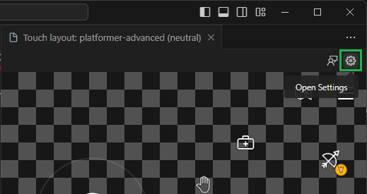
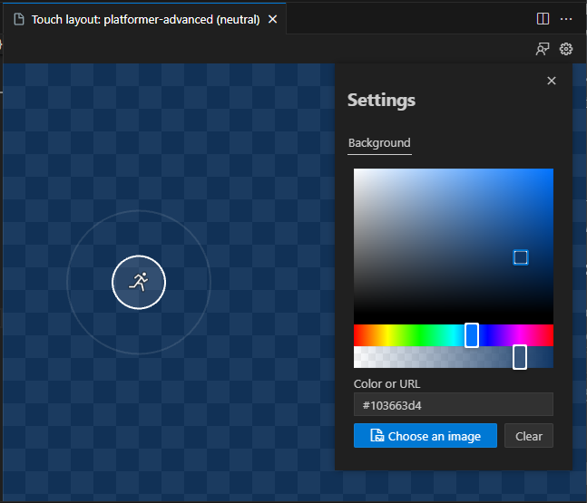
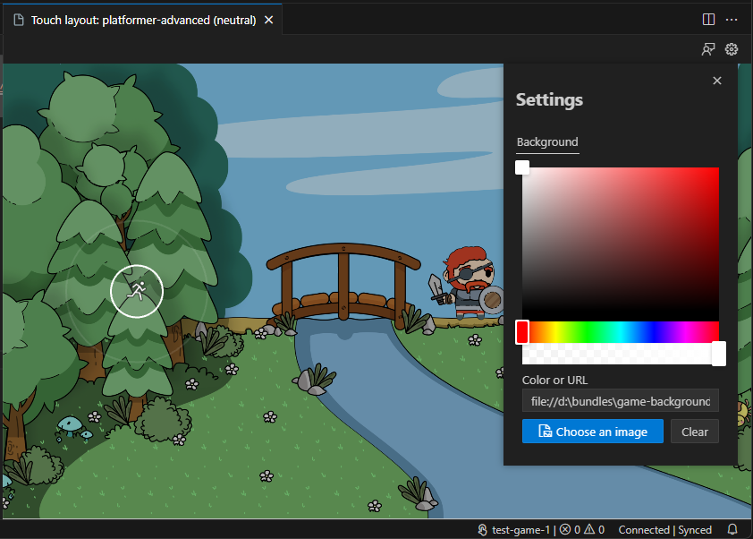
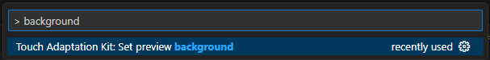
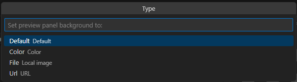

# Customizing the Touch Controls Preview

This article provides an overview of the various options available for customizing the preview of touch adaptation layouts using the TAK Editor. The preview can be customized to simulate different game scenes, and to test how the touch controls will look in different contexts. This can be done by assigning a background color or image to the preview.

## Background

Customizing the background with a color or image can be done in two ways: via the preview settings, or executing a command in the Command Palette.

### Via Preview Settings

1. Open a layout file for a bundle in the editor, to launch the preview.
2. Click on "Open Settings" in the top-right corner of the preview panel:

    
3. A modal will appear with options to customize the background. A color or an image can be assigned:
   1. **Color:** Click on the color picker to select a color. Alternatively, a color can be entered in the input field. The color can be specified in any of the formats supported by CSS (e.g., `#0000ffff`, `rgba(0, 0, 255, 1)`, `hsl(240, 100%, 50%)`, or `blue`).

      
   2. **Image:** Click on "Choose an image" to open a file picker. Navigate to the location of the image and select it. Alternatively, the URL of an image may be entered in the input field.

      

### Via Command Palette

1. Open a layout file for a bundle in the editor, to launch the preview. **This command is only available when the preview is open.**
2. Launch the Command Palette (`Ctrl+Shift+P` on Windows or `Cmd+Shift+P` on macOS).
3. Search for "Background" and select "Touch Adaptation Kit: Set preview background":

    
4. Select one of the options available:

    
   1. `Default`: Resets the background to the default transparent checkerboard pattern.
   2. `Color`: Assigns a color to the background. It must be entered as text in the format of a CSS color value.
   3. `Image`: Assigns an image to the background. A file picker will open to select an image.
   4. `URL`: Assigns an image to the background using a URL. A text input will appear to enter the URL.

## Next step

> [!div class="nextstepaction"]
> [Pack bundles for submission to Xbox](game-streaming-tak-editor-pack-bundles.md)
