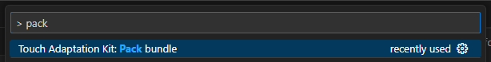
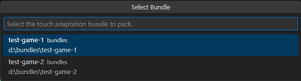

# Packing Touch Adaptation Bundles with the TAK Editor

This article provides an overview of the process of packaging touch adaptation bundles using the TAK Editor for submission to Xbox Game Streaming services through your Microsoft Account Representative. The packaging process involves creating a `.takx` file that contains all the necessary assets and metadata for the bundle. You can learn more [publishing touch layouts](../building-touch-layouts/game-streaming-touch-publishing-layouts.md) and the underlying [pack command](../tak-command-line-tool/game-streaming-tak-command-line-pack-command.md) in the TAK CLI that powers the packaging process.

## Prerequisites

* A valid bundle with at least one layout has been created using the TAK Editor. If you haven't created a bundle yet, see [Create a new bundle](game-streaming-tak-editor-create-bundle.md#create-a-new-bundle).

## Pack a bundle

1. Launch the Command Palette (`Ctrl+Shift+P` on Windows or `Cmd+Shift+P` on macOS).
2. Search for "Pack" and select "Touch Adaptation Kit: Pack Bundle".

    
3. If there is more than one bundle in the workspace, a list of bundles will appear. Select the bundle you want to pack. If there is only one bundle, this step will be skipped, and the command will proceed with the only available bundle.

    
4. Verification: A selection dropdown will ask whether the bundle should be verified for correctness before packing. It is **highly recommended to answer this step with "Yes"** to ensure that the bundle can be submitted to your Microsoft Account Representative without any issues.
5. Asset Optimization: A selection dropdown will ask whether the assets in the bundle should be optimized with quantization during the pack operation. This can reduce the size of the packaged bundle, but may also affect the visual quality of the assets. If asset optimization is enabled, it is recommended to test the packed bundle in your game to ensure that the visual quality is acceptable.
6. A save file dialog will appear to specify the location and name of the `.takx` file. Navigate to the desired location and enter a name for the file. The `.takx` extension will be appended automatically. Click "Save Bundle" to initiate the packing process.

    Note that it can be stored at any location accessible from the machine and it does not need to be in the same workspace folder as the unpacked (loose) bundle.

## Next step

> [!div class="nextstepaction"]
> [Troubleshooting](game-streaming-tak-editor-troubleshooting.md)
