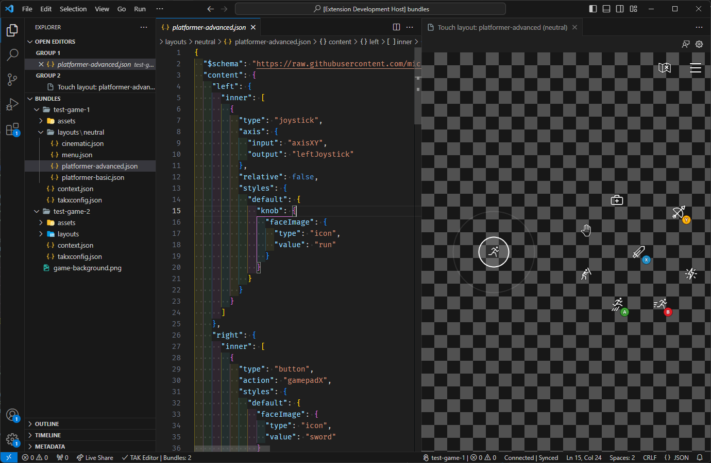
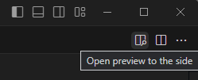
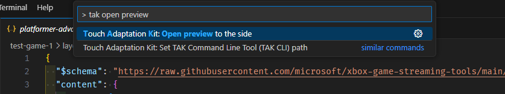
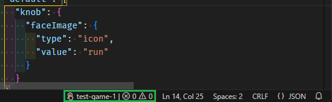
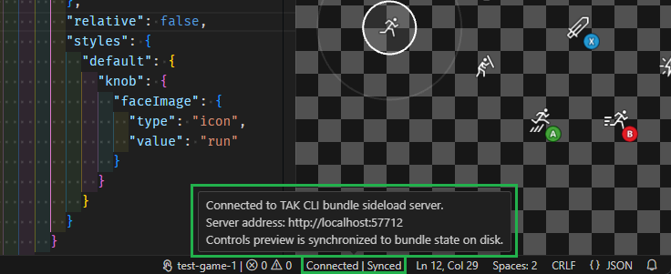
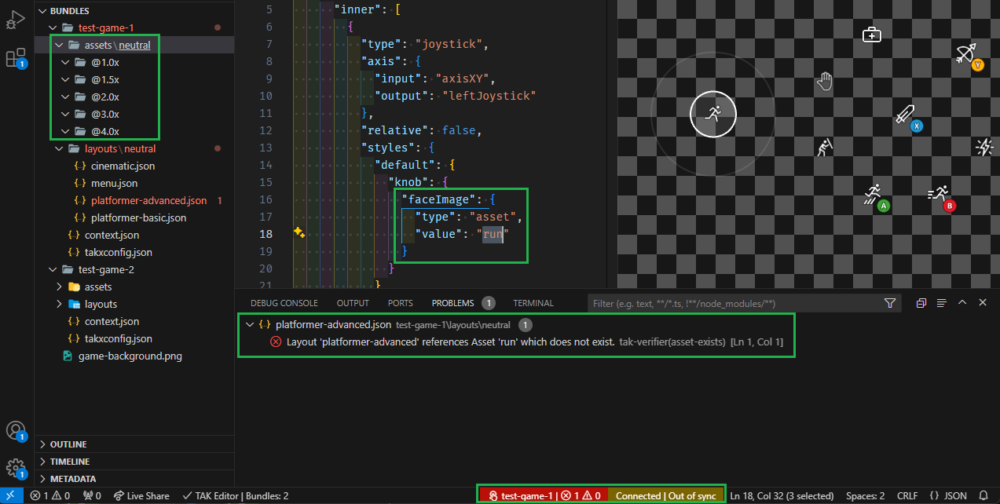

# Preview Touch Adaptation Layouts

This article provides an overview of previewing touch adaptation layouts using the TAK Editor, as well as the various options available for customizing the preview.

## Prerequisites

* TAK Editor is [installed](game-streaming-tak-editor.md) and [set up](game-streaming-tak-editor-setup.md).
* At least one [bundle](game-streaming-tak-editor-create-bundle.md#create-a-new-bundle) with a [layout](game-streaming-tak-editor-create-bundle.md#create-a-new-layout) exists in the workspace folder(s) open.

## Preview layouts

Previewing a layout is as simple as opening the layout file in the editor, through the [VS Code Explorer](https://code.visualstudio.com/docs/getstarted/userinterface#_explorer). By simply clicking on a layout file within the `layouts` directory of a bundle, the JSON contents of the layout will be displayed in one tab, and a live preview of the layout will automatically appear in a tab next to it.

> [!IMPORTANT]
> If there are **errors** in the layout file, they will be displayed in the [VS Code Problems Panel](https://code.visualstudio.com/docs/editor/editingevolved#_errors-warnings). The preview will not be updated until the errors are resolved. This is explored in more detail in the [Status, Errors, and Warnings](#status-errors-and-warnings) section.

The preview is interactive, meaning that you can interact with the touch controls using your mouse (or touch input if using a touch-enabled device). The preview will respond to your input as if it were being rendered on an actual game stream.

Changes made to the layout JSON file will be reflected in the preview upon saving the file. This allows for a quick and iterative design process, where you can make changes to the layout and immediately see the results.

If the preview tab is closed, it can be re-opened in one of two ways:

1. By clicking on the "Open Preview" button in the top-right corner of the layout file:

    
2. By executing the "Touch Adaptation Kit: Open preview to the side" command through the Command Palette.

    

Note that both the command and the button will only be available when (1) a layout file is open, and (2) the preview is not already open.

## Status, Errors, and Warnings

### Verification Status

As modifications are made to the layouts, assets, and other files within a bundle, the extension will continuously verify the contents of the bundle for validity against a pre-defined set of rules to which all bundles must adhere. This is done in the background and re-evaluated whenever a file nested within a bundle is saved or changed in any other way (e.g., renamed).

The status of this verification is reported through a status bar item located at the bottom-right edge of the window.

This status bar item will only appear when at least one layout file is open in the editor. It displays the name of the active bundle and the number of issues (errors and warnings) found in the bundle. Clicking on the status bar item will open the [VS Code Problems Panel](https://code.visualstudio.com/docs/editor/editingevolved#_errors-warnings) with a list of all the issues found in the bundle.

### Synchronization Status

The preview panel has an active bundle sideload connection to the TAK CLI. You can read more about how this works in the [TAK CLI documentation](../tak-command-line-tool/game-streaming-tak-command-line-serve-command.md).

The status of this connection is reported through a status bar item located at the bottom-right edge of the window, next to the verification status bar item. This status will only appear when the preview panel is open.

The above screenshot shows the status bar item when the connection is active and the preview is synchronized. This is the case when there are no errors in the bundle (warnings are allowed and keep the state as "synchronized"). If errors are present, the status will change to "Out of sync".

When hovering over this status bar item, a tooltip will appear with details on the sideload server that is hosted by the TAK CLI. This address can be used to connect another game streaming client to the preview, such as the [Content Test App](../building-touch-layouts/game-streaming-touch-deploying-touch-layout.md).

### Errors and Warnings

The [VS Code Problems Panel](https://code.visualstudio.com/docs/editor/editingevolved#_errors-warnings) will display a list of all the issues found in the bundle. This includes all issues that are found during the verification process.

When an issue exists, clicking on either of the verification or synchronization status bar items will open the Problems Panel and display the list of issues. Each issue will have a description and a location in the bundle where the issue was found.

For example, in the following screenshot, one error exists in the bundle where the layout file `platformer-advanced.json` is referencing and asset (`run.png`) that does not exist in the bundle:

The preview's state is now "Out of sync" until either the reference is changed to an asset that exists in the bundle, or the asset is added to the bundle.

## Next step

> [!div class="nextstepaction"]
> [Customizing the preview](game-streaming-tak-editor-customize-preview.md)
