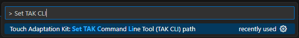
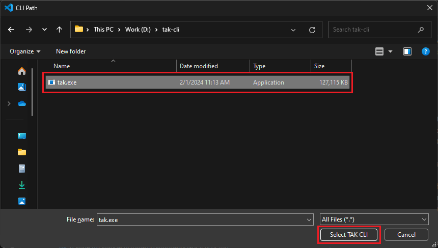
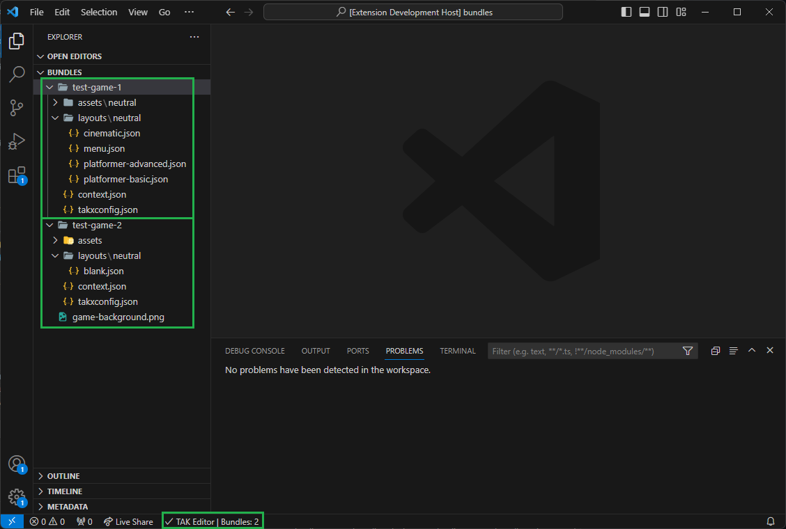
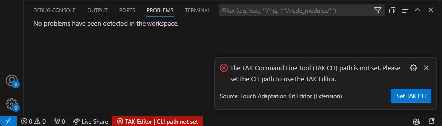
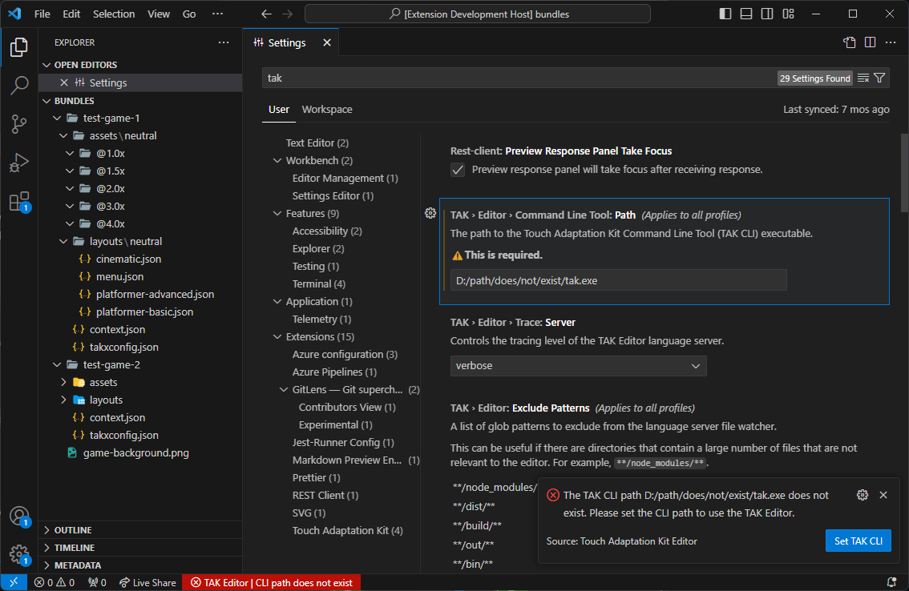
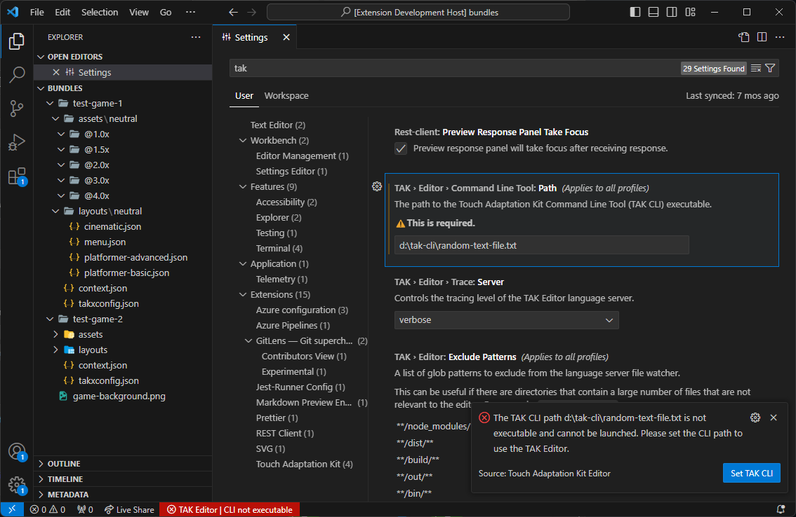
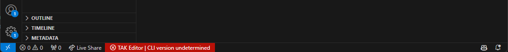
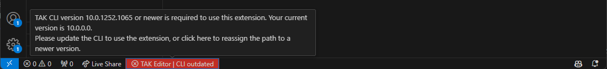

# TAK Editor Setup

This article provides the steps that must be followed to set up the TAK Editor. It is assumed that you have already installed Visual Studio Code, [downloaded the latest TAK CLI](https://aka.ms/get-takcli), and installed the TAK Editor extension. If you haven't done so, see the [Overview](game-streaming-tak-editor.md) page for more information.

At a high level, the setup process involves the following steps:

1. Set the TAK CLI path in the extension.
2. Open a folder or workspace in Visual Studio Code
    * This is where bundles will be created and edited.

> [!NOTE]
> Most of the functionality of this extension can be accessed through commands executed in the [VS Code Command Palette](https://code.visualstudio.com/docs/getstarted/userinterface#_command-palette). The Command Palette can be accessed by pressing `Ctrl+Shift+P` on Windows or `Cmd+Shift+P` on macOS. It is recommended to familiarize yourself with this interface, as it will be used frequently throughout this guide.

## Set TAK CLI path

Once the [TAK CLI](../tak-command-line-tool/game-streaming-tak-command-line.md) is downloaded on the machine, its path must be set in the extension settings. The extension will launch the TAK CLI in the background to perform various operations, such as creating bundles.

This can either be done through executing a command in VS Code, or by manually setting the path in the [VS Code User Settings](https://code.visualstudio.com/docs/getstarted/settings) (Setting ID: `TAK.editor.commandLineTool.path`).

To set the path through the command:

1. Open the Command Palette (`Ctrl+Shift+P` on Windows or `Cmd+Shift+P` on macOS).
2. Search for "Set TAK CLI" and select the "Touch Adaptation Kit: Set TAK Command Line Tool (TAK CLI) Path" command.

   
3. A file picker will open. Navigate to the location where the TAK CLI is downloaded and select the executable file (`tak.exe` on Windows, `tak` on macOS):

    

## Open a folder or workspace

A folder or [workspace](https://code.visualstudio.com/docs/editor/workspaces) must be opened in Visual Studio Code to work on bundles. Think of this as the parent directory that will contain the bundle(s) for your game(s).

To open a folder, click on the "File" menu in the top-left corner of the window, and select "Open Folder". Navigate to the location where you want to create bundles (or an existing folder that contains bundles), and click "Select Folder".

To open a workspace, click on "File" and then select "Open Workspace from File". Note that this will require an existing workspace file (with the `.code-workspace` extension) to be present on the machine. If you don't have a workspace file, you can create one by selecting "Add Folder to Workspace..." from the "File" menu and adding the desired folders. You can then save the workspace by clicking on "File" and selecting "Save Workspace As...".

## Troubleshooting

A status bar item (with the label "TAK Editor") will appear at the bottom left corner of the window to indicate the status of the extension. This allows you to quickly identify if the TAK CLI path is set correctly, and if the extension is able to communicate with the CLI.

If everything is set up correctly, the status bar item will show a checkmark and display the number of touch adaptation bundles found in the workspace, if any.

If the status bar item shows an error, it can be hovered to view more details about the error. This is usually accompanied by a notification that appears in the bottom-right corner of the window with more information.

Common issues include:

### TAK CLI Path Not Set

This occurs when the CLI path is not set in the extension settings. In fact, the first time the extension is installed, this is the default state. To resolve this, follow the steps in the [previous section](#set-tak-cli-path) to set the path.

You may also click the "Set TAK CLI" button in the notification, or click on the status bar item and select the "Set TAK Command Line Tool" option to set the path.

### TAK CLI Path Does Not Exist

This occurs when the path provided does not exist. This can happen if the CLI is moved or deleted from the location where it was initially set, or if it was manually typed in the settings and there was a typo. To resolve this, reassign the path by following the steps in the [previous section](#set-tak-cli-path).

### TAK CLI Not Executable

This occurs when the path provided is not an executable file. This can happen if the wrong file is selected in the file picker, or if the file is not marked as executable (e.g., no execute permissions on macOS). To resolve this, reassign the path.

macOS: If the path is set correctly but the CLI is not marked as executable, execute permissions must be assigned on the file. A restart of VS Code may be required for the extension to recognize the change.

### TAK CLI Version Undetermined

This can occur if the extension is unable to launch the CLI and determine its version, which can be caused either by the CLI version being too old, or if the wrong executable is selected as the CLI. To resolve this, ensure that the latest version of the CLI is downloaded and reset the path.

### TAK CLI Version Outdated

This occurs if the extension is able to launch and verify the version of the CLI, but the version is out of date. This can happen if the extension was recently updated and required a newer version of the TAK CLI. To resolve this, download the latest version of the CLI and reset the path.

## Next step

> [!div class="nextstepaction"]
> [Create a new Touch Adaptation Bundle](game-streaming-tak-editor-create-bundle.md)
