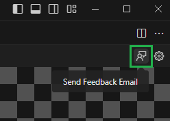
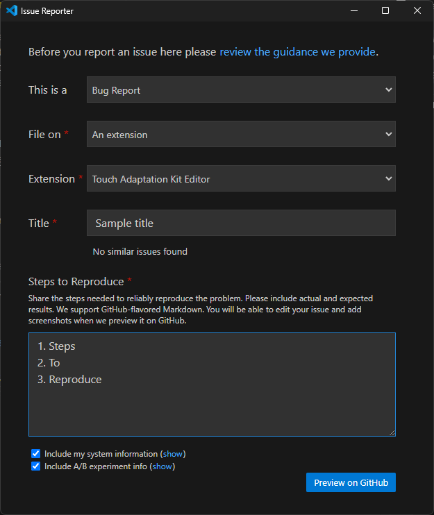

# Troubleshooting and Feedback

This article provides guidance on how to troubleshoot issues and provide feedback for the Touch Adaptation Kit (TAK) Editor Extension for Visual Studio Code.

## Logs

Logs are a valuable resource for understanding and troubleshooting issues with the TAK Editor extension, which has 3 output channels in the Output panel (`Ctrl+Shift+U` on Windows or `Cmd+Shift+U` on macOS, by default) of Visual Studio Code:

1. **TAK Editor**: General logs for the extension. This channel is useful for understanding the extension's behavior. For instance, as bundles are added and removed from a workspace, the logs in this channel will reflect those changes. It also provides information about the messages that are being sent to and from the preview panel.
2. **TAK Editor Language Server**: The logs in this channel are more verbose and contain information about communication between the language server (which is hosted by the TAK CLI) and the extension. Every notification and request sent by or to the language server is logged here.
3. **TAK Editor Language Server Trace**: These are even more verbose logs that contain the raw JSON-RPC messages sent between the extension and the language server. This channel is generally used for debugging and is not necessary for more troubleshooting. Its contents, however, are useful to be included in bug reports sent to the engineering team.

## Providing Feedback on the Extension

If you encounter issues with the TAK Editor extension, or if you have suggestions for improvements, you can provide that feedback in one of two ways:

### Feedback Email via the Extension

This is exposed both as a button in the Preview panel and as a command in the Command Palette.

1. Preview Panel: Feedback Button

   

2. Command Palette: Search for feedback and select "Touch Adaptation Kit: Send feedback email"

   Selecting either of these options will open an email draft in your default email client with the recipient, subject, and a template in the body pre-filled. You can complete the template with your feedback and send the email to the engineering team.

   > [!IMPORTANT]
   > In the case of bug reports, including logs from the Output channels mentioned above in your feedback email will help the engineering team understand the issue better. However, it is important to **ensure that no sensitive information is included in the logs** before sending them, as they can contain information about the workspace and the machine where the extension is running, such as file paths to where the bundles are stored and what they are called.

### GitHub Issue via VS Code's Report Issue

You can also report issues and provide feedback by using the "Report Issue" feature in Visual Studio Code. This will open a new issue in the [GitHub repository](https://aka.ms/takeditor-github-issue).

1. Click on the "Help" menu in the top bar of Visual Studio Code.
2. Select "Report Issue".
3. `This is a`: Select one of "Bug Report", "Feature Request", or "Performance Issue".
4. `File on`: Select "An extension".
5. `Extension`: Select "Touch Adaptation Kit Editor"
6. Provide a title and a description of the issue or feedback. If it's a bug report, provide steps to reproduce the issue.
7. Once satisfied with the information provided, click on "Preview on GitHub". This will open the issue in the GitHub repository, allow you to review the information and make any final adjustments, and then submit the issue.

> [!WARNING]
> Note that the GitHub repository is public, so **do not include any sensitive information** in the issue description or comments.

