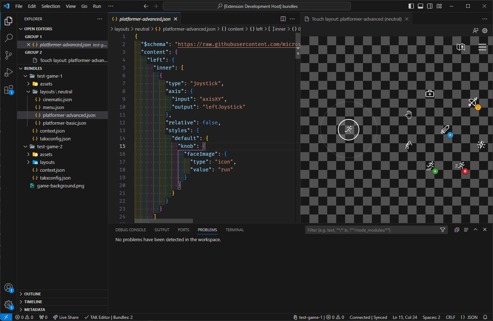

# What is the Touch Adaptation Kit Editor?

The TAK Editor extension for Visual Studio Code is a tool that allows you to create, preview, verify, and package Touch Adaptation Bundles (TABs) for your games on Xbox Game Streaming, all from within VS Code, without an ongoing game stream required. This article provides an overview of the extension, its features, and how to use it.

## Capabilities

The TAK Editor serves as the fundamental instrument for initiating the process of designing touch controls for a game on Xbox Game Streaming. Some key features include:

* Create touch adaptation bundles using predefined templates, or start from scratch with the blank template.
* Create additional layouts for existing bundles.
* Live interactive preview of layouts.
* Customize the preview background with colors and images to simulate different game scenes.
* View verification issues with a bundle in the [VS Code Problems Panel](https://code.visualstudio.com/docs/editor/editingevolved#_errors-warnings).
* Pack a bundle for submission to the Xbox Game Streaming service.

## Prerequisites

* [Visual Studio Code](https://code.visualstudio.com/Download)
* Touch Adaptation Kit Command Line Tool (TAK CLI)
  * [Windows](https://aka.ms/get-takcli)
  * [macOS](https://aka.ms/get-takcli-mac)

The extension **requires** the TAK CLI for all of its functionality. The CLI must be downloaded separately and placed on the machine where the extension is installed. Once the tool is downloaded, its path must be set in the extension settings. This is covered in the next section. Invoking the CLI from the terminal is not required, as the extension will handle all interactions with the CLI.

## Installation

The extension can be installed through the [Visual Studio Code Marketplace](https://aka.ms/get-takeditor) or from within Visual Studio Code.

To install from within Visual Studio Code:

1. Open Visual Studio Code.
2. [Browse for extentions](https://code.visualstudio.com/docs/editor/extension-marketplace#_browse-for-extensions) by clicking on the Extensions icon in the Activity Bar on the side of the window.
   * `Ctrl+Shift+X` on Windows
   * `Cmd+Shift+X` on macOS
3. Search for "Touch Adaptation Kit Editor" and click on the extension.
4. Click the Install button.

## Next step

> [!div class="nextstepaction"]
> [TAK Editor Setup](game-streaming-tak-editor-setup.md)
