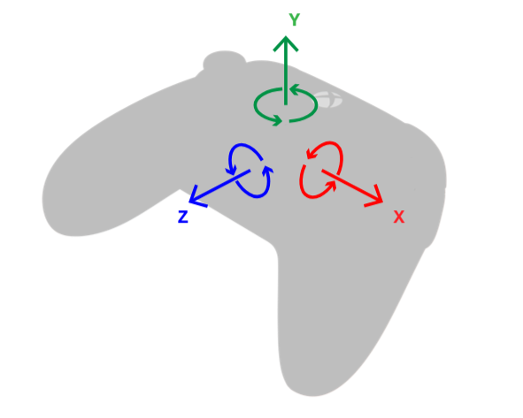
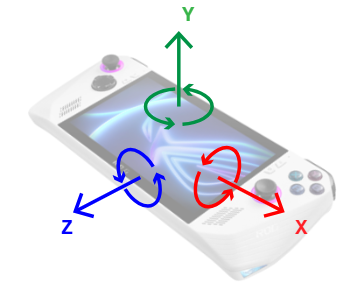

# Sensors in GameInput

The sensor capabilities in GameInput rely on the Windows sensor stack. To make your device compatible with this sensor
stack, please see:

- [HID Sensors Usages](/windows-hardware/design/whitepapers/hid-sensors-usages)
- [Integrating Motion and Orientation Sensors](/windows-hardware/design/whitepapers/integrating-motion-and-orientation-sensors)
- [Waratah samples](https://github.com/microsoft/hidtools/wiki/Waratah-Samples#accelerometer-and-gyroscope-gyrometer)

Validation:
- [SensorExplorer](https://apps.microsoft.com/detail/9pgl3xpq1tpx)
- [HLK Motion Sensor Tests](/windows-hardware/test/hlk/testref/how-to-run-hck-motion-sensor-tests)


## Coordinate system

Devices should report device acceleration as a Y-up right-handed system. Angular velocity follows the right-hand rule
about these axes.

| Gamepad coordinate system | Handheld coordinate system |
| ------------------------- | -------------------------- |
|  |  |

The X axis goes from the center of the device towards the right. The Y axis goes from the center of the device towards
the user’s face. The Z axis goes from the center of the device out the bottom.

Sample acceleration output, in g:
- Device laying flat on table: {0, 1, 0}
    - Angular velocity at rest is {0, 0, 0}
- From there, lift device upwards: increases {0, 2, 0}
- From there, drop device: decreases {0, 0, 0}
- Rotate device so top edge is in air and bottom edge is on surface: {0, 0, -1}
    - While in motion, angular velocity X becomes positive: {2, 0, 0}
- Go back to flat.
- Rotate device so left edge is in air and right edge is on surface: {-1, 0, 0}
    - While in motion, angular velocity Z becomes negative: {0, 0, -2}
- Go back to flat.
- Rotate device clockwise (opposite to right-hand rule)
    - While in motion, angular velocity Y becomes negative: {0, -2, 0}


## Remarks


### Noise from device vibrations

Low-frequency rumbling or buzzing in the device (such as those caused by haptics) may induce gyrometer noise and
affect precision.


- Possible hardware mitigation: mechanical isolation of the sensor from the haptics, via intentional placement of sensor
or surrounding sensor with vibration-dampening padding material
- Possible software mitigation: use of a low-pass filter


### Registry keys

[!IMPORTANT]
If your device must pass [Windows Hardware Quality Lab certification](/windows-hardware/test/hlk/testref/how-to-run-hck-motion-sensor-tests),
add the registry key described below. GameInput will transform the device's WHQL-compliant output to match the expected
output for game developers.

Mappings for a device with Vendor ID (VID) **VVVV**, Product ID (PID) **PPPP**, Usage Page **UUUU**, and Usage ID
**XXXX** will be read out from this location in the registry:

```
HKEY_LOCAL_MACHINE\SOFTWARE\Microsoft\GameInput\Devices\VVVVPPPPUUUUXXXX
```

Only the Generic usage page (0x0001) and usage Ids Joystick (0x0004) and Gamepad (0x0005) are supported.

| Value name      | Value type | Required? | Information                                                                                                      | Values |
| ---             | ---        | ---       | ---                                                                                                              | ---    |
| IsWhqlCertified | DWORD      | No        | Tells GameInput to transform sensor outputs from a WHQL-certified device to match the desired coordinate system. | 0, 1   |

[!TIP]
The following subkeys are meant for manufacturers of devices that have already gone to market. If the device has not yet
released, it should correctly report the [coordinate system described above](#coordinate-system) and should pass the relevant tests.

| Value name                    | Value type | Required? | Information                                                                                                           | Values  |
| ---                           | ---        | ---       | ---                                                                                                                   | ---     |
| SensorsAxisX                  | SZ         | No        | Tells GameInput to take the X-axis from the device's sensor report and label it with the axis indicated by the value. | X, Y, Z |
| SensorsAxisY                  | SZ         | No        | Tells GameInput to take the Y-axis from the device's sensor report and label it with the axis indicated by the value. | X, Y, Z |
| SensorsAxisZ                  | SZ         | No        | Tells GameInput to take the Z-axis from the device's sensor report and label it with the axis indicated by the value. | X, Y, Z |
| SensorsInvertAccelerationX    | DWORD      | No        | Tells GameInput to invert the sign of acceleration on the X axis. Applied after the above Axis transformation.        | 0, 1    |
| SensorsInvertAccelerationY    | DWORD      | No        | Tells GameInput to invert the sign of acceleration on the Y axis. Applied after the above Axis transformation.        | 0, 1    |
| SensorsInvertAccelerationZ    | DWORD      | No        | Tells GameInput to invert the sign of acceleration on the Z axis. Applied after the above Axis transformation.        | 0, 1    |
| SensorsInvertAngularVelocityX | DWORD      | No        | Tells GameInput to invert the sign of angular velocity about the X axis. Applied after the above Axis transformation. | 0, 1    |
| SensorsInvertAngularVelocityY | DWORD      | No        | Tells GameInput to invert the sign of angular velocity about the Y axis. Applied after the above Axis transformation. | 0, 1    |
| SensorsInvertAngularVelocityZ | DWORD      | No        | Tells GameInput to invert the sign of angular velocity about the Z axis. Applied after the above Axis transformation. | 0, 1    |


<a id="seealsoSection"></a>

## See also

[GameInputSensorsInfo](../../../../reference/input/gameinput/structs/gameinputsensorsinfo.md)

[GameInputSensorsState](../../../../reference/input/gameinput/structs/gameinputsensorsstate.md)

[Overview of GameInput](../overviews/input-overview.md)

[Windows.Devices.Sensors](/uwp/api/windows.devices.sensors)
