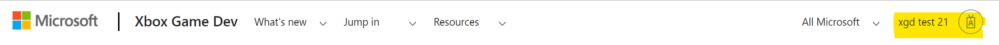
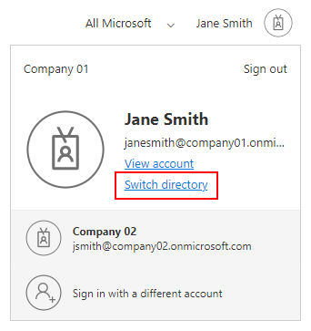
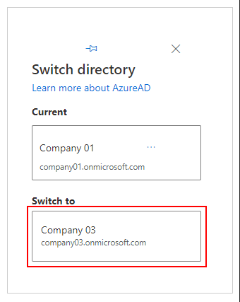

# Access Microsoft Game Development Kit development resources

Microsoft provides several resources to help Xbox developers build games on our platforms. Some of these resources are only available to partners that have joined a Microsoft managed program.

## Public resources

The following resources do not need any authorization or permissions:

* [Public gaming documentation](/gaming/) - landing page for all public gaming documentation at Microsoft. This includes the public subset of the Microsoft Game Development Kit (GDK) documentation.

* [Public Microsoft Game Development Kit (GDK) on GitHub](https://aka.ms/gdk) - contains the *common* tools, libraries, and documentation needed to build games for Xbox Game Pass for PC on Windows 10/11, Xbox consoles (Xbox Series X&#124;S, Xbox One), and cloud gaming with Xbox Game Pass Ultimate.

* [Public Microsoft Game Development Kit (GDK) samples](https://github.com/microsoft/Xbox-GDK-Samples/) - code samples demonstrating usage of Microsoft Game Development Kit (GDK) features.

## Secure resources

The following resources require that you are part of an organization that has been onboarded as an Xbox development partner, and that you or your employer has a valid Microsoft Game Development Kit (GDK) Agreement:

* [Secure Xbox downloads](https://aka.ms/gdkdl) - A secure, high-speed download service for Xbox development resources, including:
  * Latest release of software and recoveries of the GDK.
  * Offline versions of GDK documentation.
  * Submission Validator. (All submissions are required to use this proprietary tool.)
  * Samples restricted by NDA covering audio, graphics, PlayFab, system, tools, and Xbox Live.
  * Event presentations and materials about developing games by using the GDK.
* [Xbox developer forums](https://forums.xboxlive.com) - get support directly from Microsoft.
* [Microsoft Game Development Kit NDA topics](/gaming/xbox-nda-docs/) - access graphic APIs that are specific to Xbox consoles.

## Accessing secure resources

To access to secure Xbox developer resources, you need to be part of an organization that has a Microsoft Partner Center account that has been provisioned during initial onboarding as an Xbox Development partner.

Permissions are managed by the owner of the Partner Center account within your organization through the use of a Microsoft Entra ID tenant.

> [!NOTE]
> Access to Secure Xbox Downloads is not managed through Partner Center. You must contact your Microsoft representative to enable access to the secure download site.

If you are the owner of an on-boarded Partner Center account and you need to associate an Microsoft Entra tenant with your account, you can follow the instructions in [Set up your organization in Microsoft Partner Center](../get-started/overviews/set-up-organization.md).

> [!IMPORTANT]
> Personal Microsoft accounts (MSAs) are no longer supported for access at this time. If you do not have a Microsoft Entra tenant associated with you partner center account, you can add one by following the steps in this article: [Associate Microsoft Entra ID with your Partner Center account](/windows/uwp/publish/associate-azure-ad-with-partner-center).
>
> If your company does not have a Partner Center account, you can find more information on how to set up an account here: [Set up your organization in Partner Center - Microsoft Game Development Kit | Microsoft Docs](../get-started/overviews/set-up-organization.md).

## Trouble shooting secure access issues

If you unable to access secure resources, try the following steps to help resolve the issue:

### Verify that you are signed into the correct account

You might have permission to access secure documentation from one account but not from another. Verify that you are logged into the account associated with your organization's Microsoft Partner Center account. You can switch between accounts by clicking on the account name located in the top right corner of the page.

### Verify that your account is signed into the correct Microsoft Entra tenant

You may have an account that is a member of multiple Microsoft Entra tenants, some of which may not be connected to a Partner Center account that grants you access to secure Xbox resources.

You can switch your tenant by doing the following:

1. Click on your account name in the upper right corner to display your profile card.

2. On the profile card, click **Switch directory**. 

   

   > [!CAUTION]
   > If you do not see the **Switch directory** option, it may indicate that you are signed in with a personal Microsoft Account (MSA). See the important alert about MSAs earlier in this topic.

3. Select the tenant associated with your organization's Partner Center account.

   

### Check that you've been correctly added to your company's Microsoft Partner Center account

You may be a member of a Microsoft Entra tenant but not a part of the Partner Center account associated with that tenant. You must be properly added to the Partner Center account to ensure that permissions are applied to your account.

Check with the owner of your organization's Partner Center account to make sure they have correctly added you to the account.
