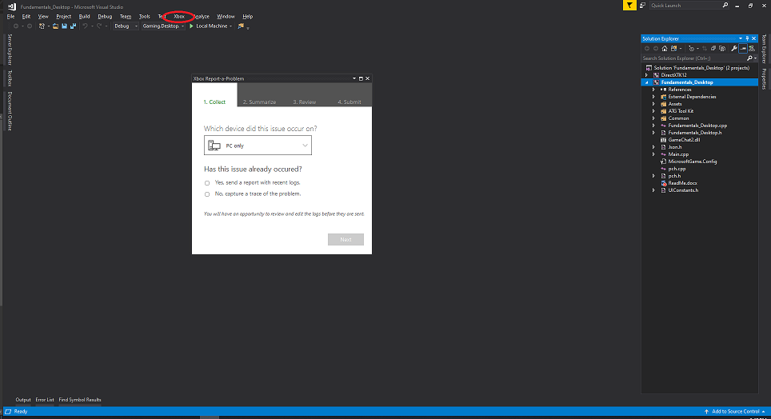

# Frequently asked questions (FAQ) for PC developers

| Question |
| --- |
| [Why are some of my MicrosoftGame.config dependencies not installed in the developer sandbox?](#MissingDependenciesDevSandbox) |
| [Why can't I see sandboxed store content after publishing: Error 194?](#SandboxedStoreContent) |
| [Why can't I get the latest version of gaming services?](#GamingServicesInstall) |
| [How can I uninstall a package which was installed by another user?](#UninstallPackagesMultiUser) |
| [How can I report a problem?](#ReportAProblem) |
| [Where should I save local game saves?](#LocalGameSaves) |

<a id="MissingDependenciesDevSandbox"></a>

### Why are some of my MicrosoftGame.config dependencies not installed in the developer sandbox?

The store is unable to install framework dependencies that are declared in [MicrosoftGame.config](../../features/common/game-config/MicrosoftGameConfig-toc.md) while in a developer sandbox. These dependencies need to be manually installed on the PC for your title to work.

> [!NOTE]
> It's important to ensure that the versions you install are the same as the versions that are specified in MicrosoftGame.config.

For more information, see [Framework package dependencies](../../features/common/packaging/packaging-framework-packages.md). 

<a id="SandboxedStoreContent"></a>

### Why can't I see sandboxed store content after publishing: Error 194?

You need to be signed in to Xbox Live on the PC. If you've recently run `wsreset`, you should sign out and sign in again.

<a id="GamingServicesInstall"></a>

### Why can't I get the latest version of gaming services?

You might not be in the RETAIL sandbox. Switch to the RETAIL sandbox, run Windows Update, and then return to your development sandbox.

<a id="UninstallPackagesMultiUser"></a>

### How can I uninstall a package that was installed by another user?

To remove a package for all the users on the PC, run the following command in an elevated PowerShell prompt: `Remove-AppXPackage -allusers <package_name>`.

<a id="ReportAProblem"></a>

### How can I report a problem?

After installing the Microsoft Game Development Kit (GDK), there's an **Xbox** item in the Visual Studio menu bar. To open a dialog box through which you can report a problem, select **Xbox** > **Xbox Report-a-Problem**.



> [!NOTE]
> Don't select **Feedback icon** > **Report-a-Problem** to report a problem. 

<a id="LocalGameSaves"></a>

### Where should I save local game saves?

We recommend using [XGameSaveFiles](../../features/common/game-save/xgamesavefiles.md) for Game Saves. It provides a managed file path that automatically syncs to the cloud. For titles that are porting to PC Game Pass and can't directly use the GDK, use [no-code cloud saves](../../features/common/game-save/game-saves-walkthroughs-and-samples.md#porting-previous-titles-to-pc-game-saves-with-no-code-cloud-saves) instead. For a full comparison of available APIs, see the [Game Saves developer guide](../../features/common/game-save/game-saves-developer-guide.md).

If your title doesn't use a GDK Game Saves API and manages save data independently, we recommend saving to the Windows *Saved Games* known folder, using the convention *\<Developer Name\>\\\<Game Name\>* to organize your save data. This folder is located at *%USERPROFILE%\Saved Games* and corresponds to the Windows known folder ID [FOLDERID_SavedGames](/windows/win32/shell/knownfolderid#FOLDERID_SavedGames). To retrieve this path programmatically, call [SHGetKnownFolderPath](/windows/win32/api/shlobj_core/nf-shlobj_core-shgetknownfolderpath) as shown in the following example.

```cpp
#include <shlobj.h>

PWSTR savedGamesPath = nullptr;
HRESULT hr = SHGetKnownFolderPath(FOLDERID_SavedGames, 0, nullptr, &savedGamesPath);
if (SUCCEEDED(hr))
{
    // Use savedGamesPath, e.g., append "\<Developer Name>\<Game Name>"
    // ...
    CoTaskMemFree(savedGamesPath);
}
```

> [!CAUTION]
> Don't save game data under the user's *Documents* folder. OneDrive automatically syncs the *Documents* folder, which can cause conflicts with cloud save synchronization and lead to data corruption. The *Saved Games* known folder is not synced by OneDrive by default, making it the safest choice for local game saves.

> [!NOTE]
> Ensure that your code creates these folders if they don't exist. This ensures that gamers can discover their saved games and back them up.

For titles that use no-code cloud saves, set the `RelativeTo` attribute of [`NoCodePCRoot`](../../reference/system/microsoftgameconfig/elements/microsoftgameconfig-element-nocodepcroot.md) to `SavedGames` in your MicrosoftGame.config to use this same folder. For more information, see [Porting previous titles to PC Game Saves with no-code cloud saves](../../features/common/game-save/game-saves-walkthroughs-and-samples.md#porting-previous-titles-to-pc-game-saves-with-no-code-cloud-saves).
