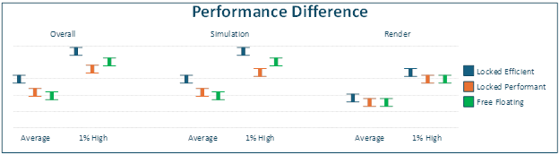
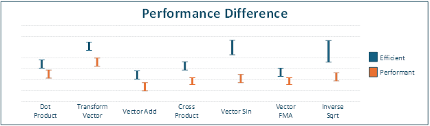
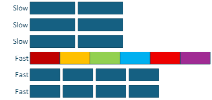
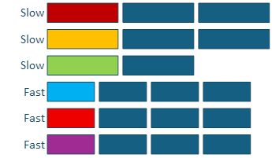

# Game Performance in Hybrid CPU Environments


CPU manufacturers are constantly balancing performance, power usage, and
die area. The reason is because customers have different usage patterns and
priorities. A person using a desktop machine is more interested in
performance, while  a laptop user is going to be more interested in
battery life. A smaller die area can equate to cheaper production costs.
To address these competing requirements, CPU manufacturers design *heterogeneous architectures* that allow the system to adapt dynamically to current workload demands while maintaining cost efficiency.

CPU manufacturers implemented a heterogeneous topology by using CPU cores with different efficiency levels. This approach replaced some cores in an existing CPU architecture with more power‑efficient cores. If the user doesn’t need the full
performance of the CPU the OS turns off more performant cores to
save significant amounts of power, thus leading to a longer battery
life. When more performance is needed, the OS can dynamically turn on the
more performant cores to handle the increased workload.

## Hardware

Various independent hardware vendors (IHVs) define heterogeneous CPU topologies differently. Intel and Qualcomm use the terms **Performance** and **Efficiency**, while
AMD uses the terms **Performance** and **Compact**. Each vendor makes trade‑offs between performance and efficiency when designing its core topology.

The following examples illustrate some of the design choices involved:

- **Different cache sizes**
  - The different cores might have different cache sizes.
  - For example, the performant cores might have larger L1 and L2 caches.

- **Cache sharing**
  - There can be diverse levels of sharing of the caches between cores.
  - For example, higher‑performance cores might each have a private L2 cache, while more efficient cores might share a single L2 cache.

- **Support for symmetric multi-threading (SMT)**
  - Some cores might support SMT while other cores don't.
  - Intel refers to SMT as *Hyper‑Threading*.

- **Internal core layout**
  - The internal resources of the various core types might be different.
  - For example, the performant cores might include more floating-point pipes, ALU pipes, or wider data lanes.

- **Maximum frequency**
  - The maximum frequency between the core types could be different.
  - For example, the performant cores might be able to achieve a higher frequency than the efficient cores.

These changes are designed to balance performance and power consumption across cores within a CPU.
A core with a higher
frequency has higher performance at the cost of
increased power usage. Several cores, all sharing the same cache decreases
 the die size, which reduces power usage, however
at the cost of reduced performance. The goal is to allow more dynamic
choices on performance and power usage. If the user doesn’t need full
performance the OS switches to more efficient cores to reduce power
consumption.

It’s important to note that Windows has a requirement that all cores on
the CPU support the same [Instruction Set
Architecture](https://en.wikipedia.org/wiki/Instruction_set_architecture)
(ISA). This requirement means that if a CPU supports a specific instruction set, then all cores in the CPU support that set. For instance, if the CPU says it supports AVX2 then all cores support AVX2.

For specific details on the differences between performant and efficient
cores see each IHV’s official documentation.

## Performance numbers

You expect cores at different efficiency levels to perform
differently. One core is designed for
performance and the other is designed for power savings. The question is how
different are the cores.

The data shown is a conglomeration across IHVs. Each IHV has
different scaling for each test based on the choices they made for their
topology. While the exact numbers are different, the patterns are
similar across all IHVs. Also, each CPU generation makes different
tradeoffs, which adjusts their relative numbers. Creating numbers
across all existing IHVs and generations is beyond the scope of this
article.

### Synthetic tests

Vector math is a major part of the work a game title does within a
frame. This workload could be anything from physics to AI to rendering. The game performs this work by using vector types with three or four floats that fit within a single 128‑bit SSE register. They cross a wide range of operations
such as dot products, matrix multiplication, square-root calculations, and vector
transforms. Performance differences in these operations can have a
significant effect on the overall frame time.

The following graphs show the relative cost of performing seven common
math operations. The measurements use a vector of four 32-bit floating-point values
stored in a single 128-bit SSE register. A matrix is made up of four vectors, for a total of sixteen 32-bit floating-point values across four 128-bit SSE registers. These operations were selected because they're commonly used within a frame.

- **Dot product**: Compute the dot product for a vector.
- **Transform vector**: Transform a vector by multiplying it with a matrix.
- **Vector add**: Add two vectors together.
- **Cross product**: Calculate the cross product of two vectors.
- **Vector sine**: Calculate an approximation of the sine for each element in a vector.
- **Vector FMA (fused multiply-add)**: Multiply two vectors and add a third.
- **Inverse square root**: Compute the inverse square root of a vector’s length.

**Figure 1:  Time taken to perform operation. Lower is better.**


In this graph, the y-axis is the time taken to perform the operation.
Each bar stands for the range of time for the operation measured across
all IHVs. The minimum and maximum time when running the test on either a
performant or an efficient core.

As expected, the performance between the core types is different.
However, the key takeaway from these numbers is that the performance
doesn’t scale across all the operations and IHVs. While the variability
of the results across IHVs tended to be similar, there were some with a
higher variability. The operations with a higher variability showed up
most within the Vector Sin and the Inverse Square Root operations. This difference can be
traced back to the core architecture choices between
performant and efficient cores. The exact cause of this delta can come
from multiple sources. For instance, the more performant cores could
have more Floating Point pipes leading to more operations in parallel. The exact
reason is unique to each IHV and generation of CPU. There might even
be a configuration where the performance delta doesn't exist for
certain operations. In the end, a title needs to account for this
variability across IHVs.

## Real world

The earlier numbers show specific benchmarks in isolation and they only
tell part of the story. The following numbers come from benchmarks
of a AAA game engine that uses two main threads (Simulation and
Render) with a set of job threads. The benchmark uses three test configurations.

- The two main threads run only on the higher-performance cores.
- The two main threads run only on the efficient cores.
- The two main threads run on all cores in the system.

In each test configuration, the job threads can float freely
across all the cores in the system. The rendering work uses the
lowest resolution and quality possible. This setting guarantees that the title
is CPU bound for the entire test run. This setting also makes the Simulation
thread the driving force on frame rate.

This graph shows the amount of time spent in each thread during a
frame. It shows both the average frame time and the 1% high. The 1% high
is the threshold for the longest 1% of the frames. Only 1% of all the
frames are above this value. This number gives a good sense of the
number of stuttering frames. The further away from the average
the worse the stuttering by the title. In all cases, lower values indicate fewer long frames and less visible stuttering.

As mentioned previously, the data shown is a conglomeration across IHVs.
Each IHV has different scaling for each test based on the choices
they made for their topology. While the exact numbers are different,
the patterns are similar across IHVs. Each CPU generation might make
different tradeoffs, which adjusts their relative numbers.
Creating numbers across all existing CPU IHVs and generations is beyond
the scope of this paper.

**Figure 2:  Average time taken and 1% high. Lower is better.**


In this graph, the y-axis is the time taken for one frame. Each bar
stands for the range of time for the operation measured across all IHVs.
The minimum and maximum time for each thread topology tested.

The OS thread scheduler uses heuristics to determine the amount of work
 performed by a thread. These heuristics are a combination of OS
choices and driver tweaks by an IHV. The scheduler uses this
information to make choices on which cores a particular thread should
execute. When it decides a thread is doing a large amount of work, the
scheduler moves that thread to a more performant core.

Because of the scheduler heuristics, some counterintuitive
behavior can occur where the title runs faster when the critical threads are
allowed to float freely. This behavior doesn't always happen and is 
dependent on the workload, core topology, and exact scheduler
heuristics.

In the case tested here, the Simulation thread spends more time
running each frame than the Render thread. The scheduler prefers to
place this thread on a more performant core. It also decides to place
the Render thread on a less performant core since it spends more
time suspended waiting for work. The net effect is that this decision opens a
more performant core for one of the job threads. If the Render thread
was performing more work, this situation might not occur.

However, the most interesting takeaway from this graph is in the 1% high
number. Even if the average is the same when the critical threads are
free-floating, the 1% high is worse than when the critical threads are
locked to the performant cores. This condition means the frame rate stutters more
when the critical threads are free floating. The most common reason
is that the scheduler heuristics operate over a sliding window. It takes
time to respond to a spike in the work needed for a frame. During that
time, a critical thread could be running on a less performant core.

> [!NOTE]
> Each manufacturer can adjust these scheduler heuristics to tailor them to their hardware. For example, AMD has
> their Workload Profile Scheduling and Intel has their Thread Director
> technology. Each IHV also tends to tweak the heuristics to match the
> specific topology of the SoC.

## Recommendations

### Thread Affinity

The advice for thread affinity when running on a desktop machine with
only a single efficiency class is to avoid setting hard thread
affinities and instead let threads float across all cores. The main
reason for this uncertainty is that it’s unknown what other processes might be running
on a user's machine ahead of time. It’s possible for a thread with a
hard affinity to end up sharing a core with another high priority thread
in the system. The net effect is that the title thread is starved for
execution. If this contention occurs on a frame-critical thread, the title can 
experience inconsistent frame times. You want to make sure the OS has a place
to move title threads to keep them running.

However, this advice needs to change when running on heterogeneous CPUs.
The main reason is that the OS doesn’t necessarily know which of the
title’s threads or jobs are frame critical. It has some heuristics to
determine what it thinks are the frame critical threads, but those
heuristics can still make incorrect choices. It might decide to move one
of those threads or jobs to a lower performing core and thus create a
higher likelihood of performance issues in the title.

The recommendation is to target allowing the title threads to run at a
minimum on three to four cores and more is preferred. For instance, on a
lower end system that has one higher performance core and three lower
performance cores you should allow the threads to float across all the
cores. On machines with three or more performance cores, you could 
restrict the frame critical threads to only those higher performance cores.

On higher end machines with many cores that also support SMT, some titles
might try to lock their threads to physical cores. This technique avoids
contention at the physical core level as several high priority threads
share the same resources of a physical core. In general, though it isn't
recommended to consider this case. The OS already applies this behavior system‑wide. It schedules threads across physical cores first and uses more logical cores only when necessary.

The only case a title should consider is when there are enough higher
performance cores in the system to support the titles’ critical threads.
In this case, it might be desirable to lock the frame critical threads to
higher performing cores. However, those threads should be allowed to
float across all the higher performing cores. While in some cases
allowing all threads to float across all cores can improve performance, 
this behavior isn't consistent across all CPU manufacturers.

If the title implements a work stealing system that can fully
balance the workload across all threads, then any job thread should be
allowed to float across all the cores. It doesn’t matter if they're
high priority or low priority job threads. The work stealing algorithm
automatically balances the load and allows the most work to complete
in the shortest amount of time. Threads on the higher performing cores
execute more jobs during the frame.

If there are multiple frame critical threads, it can be useful to set
their affinity such that no two frame critical threads can run on the
same core. For instance, if there are two frame critical threads then
setting their affinity to be an exclusive or of each other removes
the possibility of the OS causing the threads to contend with each
other. Again though, only consider this option if there are enough cores to
support this case while still allowing each frame critical thread to
float across a minimum of three to four cores.

### Thread Topology

When considering how to assign work to threads in a heterogeneous
environment, the primary data revolves around the length of the various
tasks and how they interact with each other. What is the average length
of each task, what are the dependencies between the tasks, what are the
priorities of each task, etc.

How much can the job threads absorb spikes in time on any critical
threads or jobs? If one of those threads or jobs runs 35 percent slower, how
much does that affect frame time? For example, if a task runs long how
much does this delay affect the rest of the frame, does the system stall until
that task is completed?

It can be useful to determine how much a heterogeneous system affects
frame time by adding extra overhead in the critical threads or jobs. As a
test, randomly make a job or block of work take an extra
25%-35% of time. The degree of change in overall frame time indicates how well the job system can absorb execution spikes. The ideal
situation is that the frame times have almost no change. It means the
system can absorb arbitrary spikes in frame time. The spikes come from either running on a
lower performant core or from another random process in the system using
CPU time.

### Thread Communication

Some thought should be taken with thread communication using locking
primitives. The overhead of a context switch is tightly coupled with the
[C-State](https://en.wikipedia.org/wiki/ACPI) of the receiver core
before the new thread starts running. The core needs to be in C0, the
running state, before the new thread can start running. The cheapest is
when the core was already running, it’s already in C0. However, if the
core is idle, it is in a lower C-State. The level of the C-State
corresponds to deeper levels of sleep. A deeper sleep results in less
power being used by the core. However, it's more expensive to wake
up and start running again from a deeper sleep. The most common low-power
C-state is C1, which can add an overhead from 2-7 μs. The next C-state, C2,
can add an overhead of approximately 40–100 μs. The exact number is IHV and SoC specific.
There are many variables that control what C-State a core is in when
idle, it’s a balance between responsiveness and power usage. A lower
C-State uses less power than a higher C-State. It’s common to have a
core first enter C1, then switch to C2 if it hasn’t been running code
for a while.

There's another concern, what happens when the thread submitting the
job and the thread executing the job are on cores with a different
performance profile. Technically it’s possible for the job thread to
complete jobs faster than new jobs are being created. This situation is more
likely to happen if the thread executing the job is on a faster core
than the thread submitting the jobs.

If a job takes less time to execute than it does to be created, the
title can get into a situation where a job thread is constantly
suspending waiting for new jobs. The net effect is that jobs become more
expensive to execute as the job thread is constantly suspending. The
overhead cost of a context switch is added to the time for each job to
execute. This overhead can paradoxically lead to lower frame rates when running
on more performant cores. For instance, work that used to take 250 μs can
suddenly start taking 275 μs, this regression is a 10% drop in performance.

Because of this case, the recommendation is that jobs are instead submitted in
batches as opposed to as they're created. For instance, if the system
follows a pattern where it builds a job, submits the job, builds a job,
submits a job, etc. This pattern should be adjusted to instead perform a
batch of builds first and then submit them all at the same time.

If the title is using an object that requires
[WaitForSingleObject](/windows/win32/api/synchapi/nf-synchapi-waitforsingleobject)
then it should be placed within a small spin loop. Call the function
with a timeout of 0, once the spin is done use the titles normal timeout
value. The best solution for this problem though is to use modern sync
APIs like [Slim Reader/Writer (SRW)
Locks](/windows/win32/sync/slim-reader-writer--srw--locks),
[Critical
Sections](/windows/win32/sync/critical-section-objects),
and
[WaitOnAddress](/windows/win32/api/synchapi/nf-synchapi-waitonaddress).
These sync APIs all include some form of spin internally, which can keep a thread
from constantly suspending. This spin is especially useful for locks
that are held for a short amount of time.

It’s important to avoid long spin locks. For instance, having a pattern
where threads constantly spin waiting for work to perform. If there's
other work that needs to be performed on the core the scheduler will
eventually suspend the spinning thread to perform this work. When this
preemption occurs, there's a high likelihood that the suspended thread remains
suspended for a significant amount of time. This behavior is all done to prevent
starvation of other threads. Since the title has little control over
when suspension happens, it can lead to stutters in frame rate.

### Job systems

For best performance, structure the engine around jobs rather than
relying on dedicated, long-running frame critical threads. For example,
a Simulation/Render thread model creates two persistent frame critical
threads. However, lengthy jobs can cause any job thread to behave as a
frame critical thread. If a job takes 10 ms, the thread executing it
becomes frame critical for that period, regardless of its original role.

### Work Stealing

The number one recommendation is to use work stealing across the entire
job system and let any frame critical threads take part in the work
stealing algorithm. For example, if the render thread is waiting for
render related jobs to complete it should execute some of those jobs.

This behavior is already common practice in many game engines. However, it’s
worth mentioning here because this type of behavior is critical for the
game engine to be able to absorb frame spikes due to heterogeneous cores
and possible OS preemption.

When a job takes longer to execute, it increases the risk of a frame‑time spike. This behavior could be caused by either the job
running on a lower performing core, or other work within the PC. The
recommendation is that the engine should aim for a job taking about two percent of the
frame. This budget means, for example, no more than about 333 μs for a game running at
60 fps. If needed multiple smaller jobs should be batched into a larger
job to aim for the two percent number. This approach provides a good tradeoff between job
size, thread communication, and the ability to absorb spikes. 

These examples show the effects that long frame‑critical jobs can have on system performance. In these examples, each job consists of the same
number of operations. In this example a single job that takes 375 μs on a
slow core and 250 μs on a fast core. The long pole job is 6x more
expensive than the other jobs.

The worst-case situation is when the long pole job ends up on one of the
slow cores. This can have a drastic effect on frame times. In this
scenario, the total time to execute the work is 2,250 μs, six times 375 μs.

**Figure 3:  Long pole example running on a slower core.**


Things do get better when the long pole job ends up on a faster core. In
this case. The total time is to 1,500 μs. Still not great, but better.

**Figure 4:  Long pole example running on a faster core.**


The best outcome avoids long‑pole jobs by keeping job sizes small and evenly distributed. In this example, the total execution time drops to 1,125 μs, which is half the time of the previous example, with the same amount of work completed.

**Figure 5:  Avoid long pole jobs by using proper job lengths.**


More importantly, if the OS tries to interrupt in the middle of a job’s
execution, the system automatically balances the workload. In this
case, the OS interrupted the title with a 375-μs task on a fast core. This rebalancing has
no effect on the overall frame time, it stays at 1,125 μs. One of the
jobs migrated over to free time on a slow core.

**Figure 6:  OS interruption with workload rebalancing maintains stable frame time.**


These examples only cover the case when the long pole job can start at
once, if it can’t start until later in the job queue the situation gets
worse. It all comes back to [Amdahl’s
Law](https://en.wikipedia.org/wiki/Amdahl%27s_law) where the time to
execute any system is tied to the longest running piece of that system.
It’s impossible for the engine to absorb any spikes that increase the
execution time of those long pole threads. These spikes can come from
running on a slower core, or interruptions from other high priority
processes in the system.

## Wrap up

By implementing these recommendations, you can ensure the game performs
reliably and remains resilient across different CPU architectures and
 interference from other Windows processes.

## Appendix

### Determining efficiency class of cores

Use the
[GetLogicalProcessorInformationEx](/windows/win32/api/sysinfoapi/nf-sysinfoapi-getlogicalprocessorinformationex)
function to determine the efficiency class of each processor in the
system. Iterate through the data returned by the function
looking for a
[RelationProcessorCore](/windows/win32/api/winnt/ns-winnt-processor_relationship)
block that contains the efficiency class and the core mask.

```cpp
char* processorInfoData = nullptr;
DWORD processorInfoDataSize = 0;

GetLogicalProcessorInformationEx(RelationAll, nullptr, &processorInfoDataSize);
processorInfoData = new char[processorInfoDataSize];
GetLogicalProcessorInformationEx(RelationAll, processorInfoData, &processorInfoDataSize);

auto workingDataBuffer = processorInfoData;
auto dataLeft = processorInfoDataSize;
while (dataLeft)
{
    auto procInfo = (SYSTEM_LOGICAL_PROCESSOR_INFORMATION_EX*) workingDataBuffer;
    switch (procInfo->Relationship)
    {
    case RelationProcessorCore:
        {
            processorEfficiency[procInfo->Processor.GroupMask[0].Mask] = 
                  procInfo->Processor.EfficiencyClass;
        }
        break;
    }
    dataLeft -= procInfo->Size;
    workingDataBuffer += procInfo->Size;
}
```

### Pinning threads based on power usage

As mentioned, core pinning by using affinity isn't recommended
in the desktop environment due to the possible interference from other
processes on the machine. However, Windows provides ways for a title
to give hints to the OS to recommend where work should be executed. One
way to do this guidance is through the power management APIs.

```cpp
    THREAD_POWER_THROTTLING_STATE PowerThrottling;
    ZeroMemory(&PowerThrottling, sizeof(PowerThrottling));
    PowerThrottling.Version = THREAD_POWER_THROTTLING_CURRENT_VERSION;

    // 
    // EcoQoS 
    // Turn EXECUTION_SPEED throttling on. 
    // ControlMask selects the mechanism 
    // and StateMask declares which mechanism should be on or off. 
    // 

    PowerThrottling.ControlMask = THREAD_POWER_THROTTLING_EXECUTION_SPEED;
    PowerThrottling.StateMask = THREAD_POWER_THROTTLING_EXECUTION_SPEED;

    SetThreadInformation(GetCurrentThread(),
        ThreadPowerThrottling,
        &PowerThrottling,
        sizeof(PowerThrottling));

    // 
    // HighQoS 
    // Turn EXECUTION_SPEED throttling off. 
    // ControlMask selects the mechanism
    // and StateMask is set to zero as mechanisms should be turned off. 
    // 

    PowerThrottling.ControlMask = THREAD_POWER_THROTTLING_EXECUTION_SPEED;
    PowerThrottling.StateMask = 0;

    SetThreadInformation(GetCurrentThread(),
        ThreadPowerThrottling,
        &PowerThrottling,
        sizeof(PowerThrottling));

    // 
    // Let system manage all power throttling. ControlMask is set to 0 as we don’t want 
    // to control any mechanisms. 
    // 

    PowerThrottling.ControlMask = 0;
    PowerThrottling.StateMask = 0;

    SetThreadInformation(GetCurrentThread(),
        ThreadPowerThrottling,
        &PowerThrottling,
        sizeof(PowerThrottling));
```

### Using CPU Sets to query efficiency class

Using [CPU Sets](/windows/win32/procthread/cpu-sets) is
another method to query the efficiency class of each core in the system.

```cpp
bool QueryCPUSets()
{
    ULONG requiredSize = 0;
    (void)GetSystemCpuSetInformation(nullptr, 0, &requiredSize, GetCurrentProcess(), 0);
    if (requiredSize == 0)
        return false;

    std::vector<uint8_t> rawBuffer(requiredSize);
    PSYSTEM_CPU_SET_INFORMATION cpuSets =
               reinterpret_cast<PSYSTEM_CPU_SET_INFORMATION>(rawBuffer.data());

    if (!GetSystemCpuSetInformation(cpuSets, requiredSize, 
               &requiredSize, GetCurrentProcess(), 0))
        return false;

    std::vector<CoreEfficiencyInfo> cores;
    std::map<uint8_t, uint32_t> efficiencyLevelCounts;

    uint8_t* current = rawBuffer.data();
    uint8_t* end = current + requiredSize;

    while (current < end)
    {
        PSYSTEM_CPU_SET_INFORMATION info =    
                 reinterpret_cast<PSYSTEM_CPU_SET_INFORMATION>(current);

        if (info->Type == CpuSetInformation)
        {
            CoreEfficiencyInfo coreInfo = {};
            coreInfo.cpuSetId = info->CpuSet.Id;
            coreInfo.coreIndex = info->CpuSet.CoreIndex;
            coreInfo.logicalProcessorIndex = info->CpuSet.LogicalProcessorIndex;
            coreInfo.efficiencyClass = info->CpuSet.EfficiencyClass;
            coreInfo.group = info->CpuSet.Group;
            cores.push_back(coreInfo);

            efficiencyLevelCounts[coreInfo.efficiencyClass]++;
        }

        current += info->Size;
    }
    return true;
}
```

### Using CPU Sets to assign threads to efficiency classes


[CPU Sets](/windows/win32/procthread/cpu-sets) can
also be used in place of explicitly setting the affinity mask for a
thread. The recommendation is to use CPU Sets instead of explicit affinity
masks.

```cpp
bool LockThreadToEfficiencyClass1(HANDLE thread, 
                   const std::vector<CoreEfficiencyInfo>& cores,uint32_t efficiencyClass)
    {
        std::vector<ULONG> cpuSetIds;
        for (const auto& core : cores)
        {
            if (core.efficiencyClass == efficiencyClass)
            {
                cpuSetIds.push_back(core.cpuSetId);
            }
        }

        if (cpuSetIds.empty())
            return false;

        if (!SetThreadSelectedCpuSets(thread, cpuSetIds.data(),
                        static_cast<ULONG>(cpuSetIds.size())))
            return false;

        return true;
}
```
