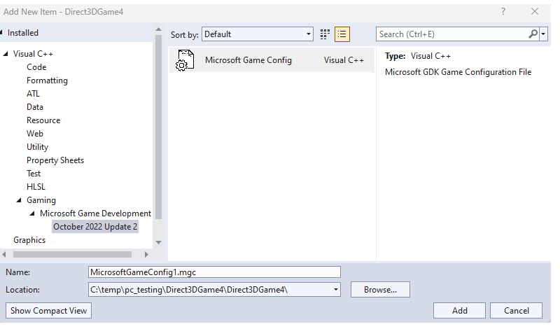
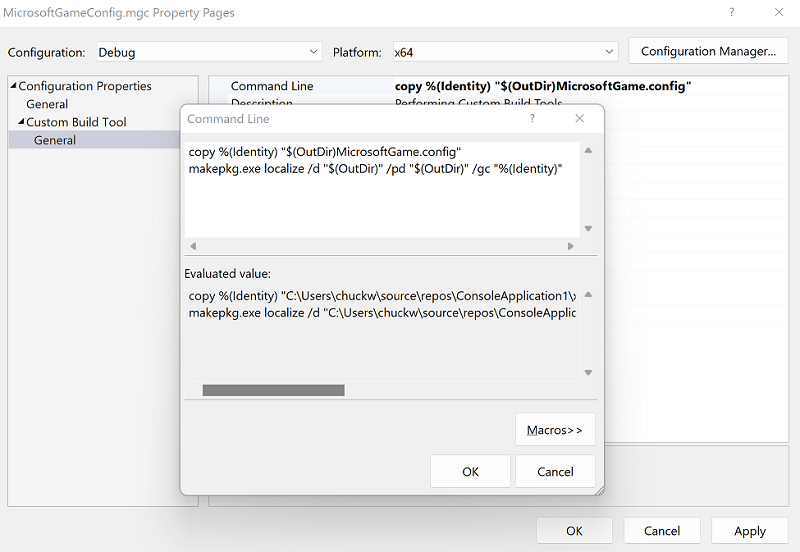

# Adding the Microsoft Game Development Kit to an existing desktop project

> [!NOTE]
> For games targeting PC Desktop using the Gaming Runtime, you are free to use Direct3D 12, Direct3D 11, or even legacy Direct3D 9. Note there are some special considerations if making use of legacy DirectX SDK components such as D3DX9, D3DX10, D3DX11, etc. See the [DirectX Framework package](../../../features/common/packaging/packaging-framework-packages.md) documentation for more details.

> [!NOTE]
> The following information assumes that you have an existing x64 desktop (Windows PC) project, a custom engine, and have installed the Microsoft Game Development Kit (GDK). If you aren't installing the GDK, see [Configuring projects without installing the Microsoft Game Development Kit](../../console-dev/usingwithoutinstall/project-configuration-withoutinstall.md).

The following steps will result in your project:
* Using the Windows API family `WINAPI_FAMILY_DESKTOP_APP` and linking against typical PC libraries, including `kernel32.lib`, `user32.lib`, etc.
* Including the necessary headers and libraries.
* Including `XGameRuntime.h` and linking to `XGameRuntime.lib`. All the Gaming Runtime capabilities are ready to use, along with the Xbox Live API (XSAPI) extension library.
* Having the ability to debug your game by using F5 with full package identity based on your *MicrosoftGameConfig.mgc* file.

#### To add the GDK to an existing desktop project

1. If desired, create a new copy of the Debug and Release configurations using the **Configuration Manager** or modify the existing ones.

1. Close the project and open it in a text editor. Use the detailed instructions in [Using the x64 platform with the Microsoft Game Development Kit (GDK)](../../../tools/tools-pc/visualstudio/gr-vs-templates.md) to modify the project **Globals**, **ExtensionSettings**, **VC++ Directories**, and **ItemDefinitionGroups**.

1. Close the text editor and open the project in Visual Studio.

1. Set up the *MicrosoftGameConfig.mgc*:
The GDK includes a Visual Studio Item Template for adding MicrosoftGameConfig.mgc files to a project.  To add a file using the Item Template:

* Right click on a project and select Add->New Item.  
* The MicrosoftGameConfig template can be found in the Visual C++->Gaming->Microsoft Game Development Kit->Edition node of the tree, shown as follows.

 

* Right click on the *MicrosoftGameConfig.mgc* file and set it to **Custom Build Tool**, hit **OK**.
* In the command line, click <Edit...> and paste:
```
copy %(Identity) "$(OutDir)MicrosoftGame.config"
makepkg.exe localize /d "$(OutDir)" /pd "$(OutDir)" /gc "%(Identity)"
```
* For the outputs, set
```
$(OutDir)MicrosoftGame.config
```

 

For more information, see [MicrosoftGame.config overview](../../../features/common/game-config/MicrosoftGameConfig-Overview.md).
