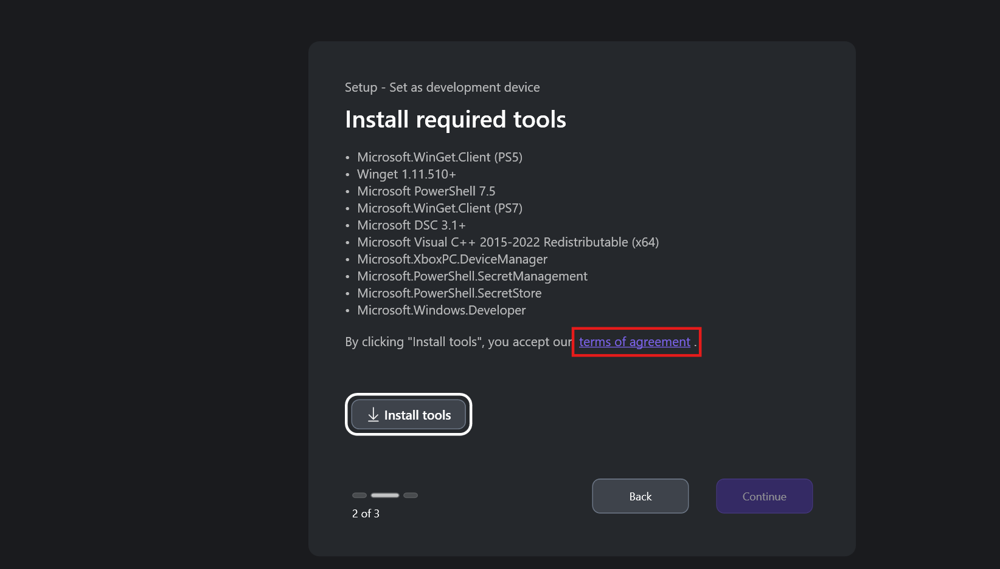
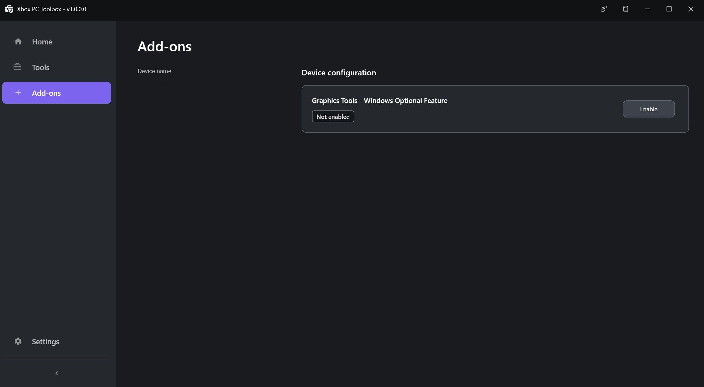
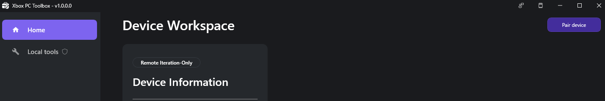
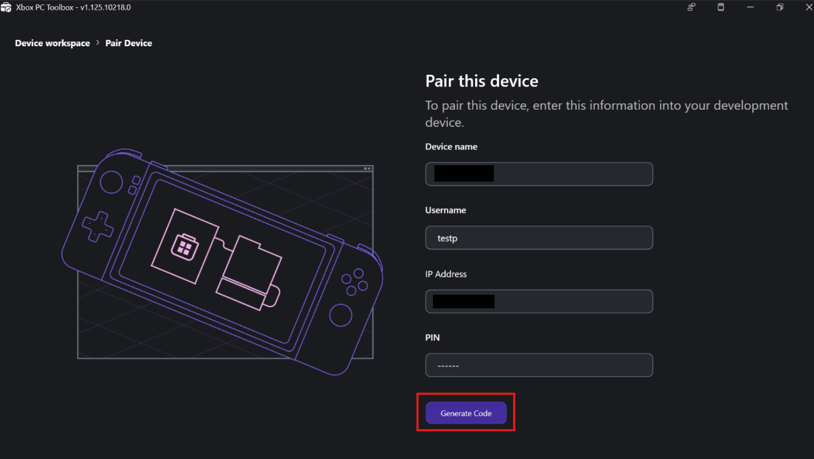
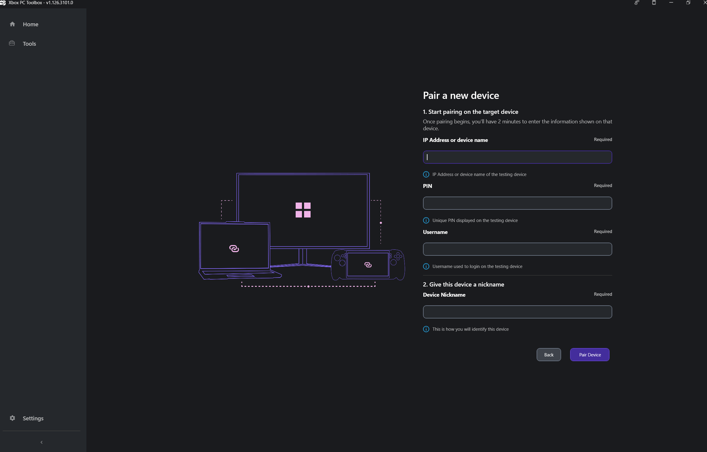
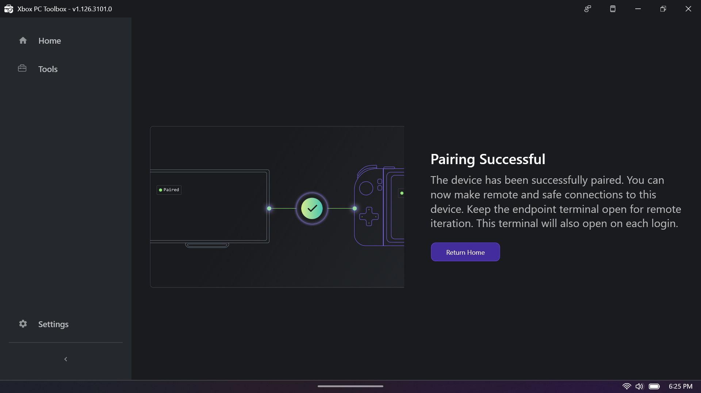
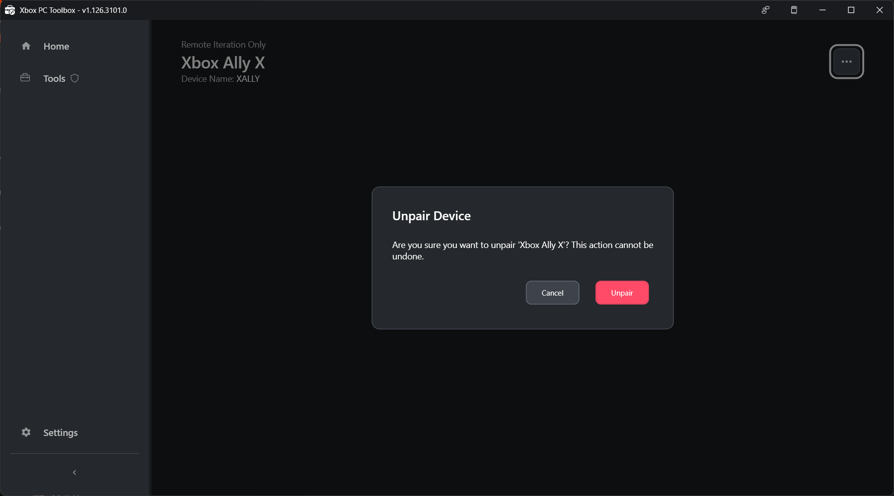
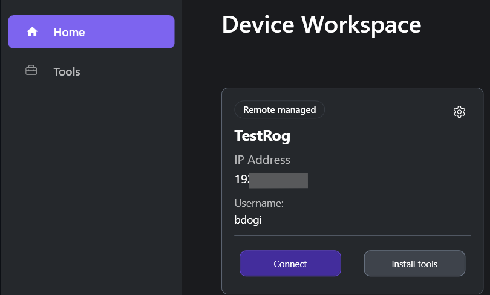

# How to use the Xbox PC Remote Tools

> [!IMPORTANT]
> The Xbox PC Toolbox app is in preview. Download it from the [Microsoft Store](https://aka.ms/toolboxinstaller) on Windows.

## Set up your development device

1. On your device, download and install the Xbox PC Toolbox from the Microsoft Store on Windows.

1. Open the app. Select **Set as development device**, and then choose **Continue**.

1. Select **Install Tools** to add the required components for your environment.

   > [!NOTE]
   > By selecting **Install Tools**, you accept the [Terms of Agreement](https://www.microsoft.com/en-us/servicesagreement). To review the terms, select the link on the installation screen.

    

1. After installation, choose the network adapter for the secure channel. If your system has one adapter, it’s selected automatically.

1. Add a strong passphrase to protect your SSH key. Save the passphrase securely. 

1. Select **Confirm** to start the device configuration process.

1. When configuration is complete, you see the device workspace screen. 

---

## Set up your remote target device

Follow the same steps as for the development device, with these differences:

1. In Step 2, select **Set as a remote target device** instead of development device.

1. Choose a device type:
   - **Fully Managed**: Enables remote iteration and device management capabilities over SSH.
   - **Lightweight**: Enables remote iteration scenarios (deploy, launch, and terminate) over HTTPS/TLS without requiring SSH setup.

   Both modes use encrypted communication.

   

1. In Step 5, you don't need to create SSH keys or add a passphrase on the remote target device.

---

## Manage device add-ons

Add-ons are optional components that enable development workflows that might not be necessary for every project. After you set up your device in the Xbox PC Toolbox, these add-ons become available.

Enable the Windows Graphics Tools add-on if you're debugging or profiling DirectX graphics or the D3D API. Windows Graphics Tools enables the D3D debug layer and GPU-based validation on your device. When enabled, you can use tools like PIX to run GPU Captures, and any D3D API validation errors are surfaced. 

You can also enable this add-on through Windows Settings by managing optional features. However, the Toolbox provides this add-on to streamline your device setup without needing to leave the app. 

You can enable or disable add-ons in the add-on workspace by selecting a single option. You can apply add-ons to your development PC and remote Windows devices.

> [!NOTE]
> If you face any issues disabling an add-on, ensure your Windows device is up to date and restart your device. If the issue persists, report it through Feedback Hub. 



---

## Pair your devices

1. **On the remote target device:** In the workspace, select **Pair device** to start pairing. 

    

1. **On the remote target device:** Select **Start Pairing**. The app generates a pin and displays connection details. Note these details for setup and testing the connection.

    

    > [!NOTE]
    > You have two minutes to enter the pin on the development PC before it expires.

1. **On the development device:** On the device workspace screen, select **Pair device**. This action opens the select device type screen where you choose between **Fully Managed** or  **Lightweight** for the remote target device. 

1. **On the development device:** This action opens the pair a new device screen where you enter the connection information you got from the remote target device. Enter the IP address or device name, pin, username, and nickname. Select **pair device**.

    

1. **On the remote target device:** When pairing succeeds, select **Return Home** to go back to the workspace. The device is ready for secure Fully Managed operations or Lightweight operations.

    

1. **On the development device:** To finalize setup for Fully Managed devices, accept the SSH fingerprint. The app opens a terminal and asks if you want to continue. Type `yes` and press Enter.

    [Accept SSH fingerprint](../../../../../media/public-images/remote-win-gamedev/SSH_Fingerprint_confirm_screen.png)

    > [!NOTE]
    > After connecting, type `exit` and press Enter to close the window. Closing by using the **X** button might cause known problems.

1. **On the development device:** When the connection test finishes, a success screen confirms your devices are securely paired. Select **Return home** to go on the device workspace screen to see all paired remote target devices.


---

## Unpair devices

To manage a paired device, select the gear icon on the device card in the workspace. From there, you can:

* **Unpair device**: Remove the paired device from your workspace.
* **Rename device**: Change the display name of the paired device.
* **Edit connection settings**: Update the IP address or other connection details for the paired device.

> [!IMPORTANT]
> Unpair from the **remote target device**. When you unpair from the remote target device, the SSH keys are removed on both devices, so the disconnection is clean. If you unpair from the development PC, the device is removed only from the local workspace.



---

## Use Xbox PC Device Manager (XDM)

Xbox PC Device Manager (XDM) is a PowerShell module that's installed during setup. It creates secure, encrypted communication between development PCs and remote devices. XDM manages device acquisition, OpenSSH configuration, trust, and it enables remote command execution with device state management.

### Start an interactive session

On your development PC, go to the device workspace in Xbox PC Toolbox. Find the card for the device you want to connect to and select **Connect**. This action starts an interactive session with the remote device over PowerShell remoting in a command-line terminal. Commands you run here execute on the remote device.



## Provision remote iteration tools

Use the command-line tools **wdRemote** and **wdEndpoint** to incrementally deploy, launch, and terminate games on remote Windows devices after you set up a secure connection by using Xbox PC Toolbox. Both tools are standalone executables that you install during pairing.

- **wdRemote.exe**: Runs on the development PC and sends commands.
- **wdEndpoint.exe**: Runs on remote target device and executes commands.

---

### Use wdRemote

Open a command-line terminal on your development PC to run `wdRemote` commands.

#### Deploy a game

When you specify paths for remote machines, use paths relative to the gameroot directory. The game root directory is `C:\%ProgramData%\Microsoft GDK\wdEndpoint\gameroot` on the remote target device.

```cmd
# Syntax
wdRemote /action:deploy /device:<computername or ip address> /source:<source_directory> /destination:<destination_directory_under_gameroot>

# Example
wdRemote /action:deploy /device:mypc1 /source:c:\game /destination:gamedir
```

#### Launch a game

```cmd
# Syntax  
wdRemote /action:launch /device:<computername or ip address> /path:<remote_path_to_exe_within_gameroot>

# Example
wdRemote /action:launch /device:mypc1 /path:gamedir\game.exe
```

#### Terminate a game

```cmd
# Syntax
wdRemote /action:terminate /device:<computername or ip address> /processid:<game_process_id>

# Example
wdRemote /action:terminate /device:mypc1 /processid:1234
```

### Send feedback

From the Xbox PC Toolbox title bar, select **Send Feedback**. Then select **Report a Problem**.

 

When reporting problems, include:

- **Operating System** version (Windows 10/11 build)
- **PowerShell version** (`$PSVersionTable`) for Xbox Device Management PowerShell Module problems
- **Network configuration** (Wi-Fi/Ethernet, corporate/home)
- **Error messages** (exact text)
- **Steps to reproduce**
- **Which tool** you used (Xbox PC Toolbox, Xbox Device Management PowerShell Module, wdRemote, or wdEndpoint)
- **Preview version** you're using

## See also

- [Xbox PC Remote command-line tool (wdRemote.exe)](../../../../tools/tools-pc/commandlinetools/gr-wdRemote.md)
- [Xbox PC Remote listening endpoint (wdEndpoint.exe)](../../../../tools/tools-pc/commandlinetools/gr-wdEndpoint.md)
- [Xbox PC Remote Tools Release Notes](release-notes/rwd-release-notes-2603.md)
- [Xbox PC Remote Tools FAQ and Troubleshooting Guide](remote-win-gamedev-tools-faq.md)
 