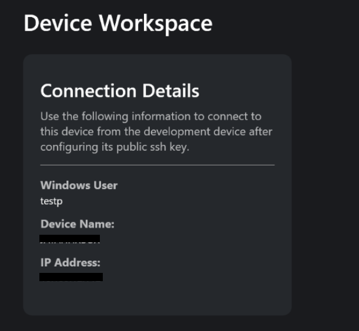
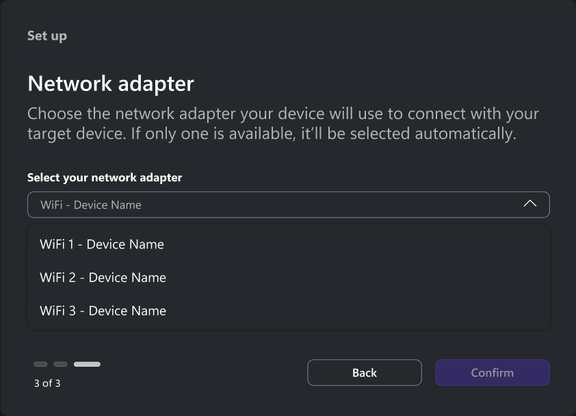

# Xbox PC Remote Tools FAQ and troubleshooting guide

> [!IMPORTANT]
> The Xbox PC Toolbox app is in preview. Download it from the [Microsoft Store](https://aka.ms/toolboxinstaller) on Windows.

## Frequently asked questions

| Question |
| --- |
| [What are the known issues, dependencies, and limitations?](#KnownIssues) |
| [What's the difference between Fully Managed and Lightweight device types?](#DeviceTypes) |
| [Where can I find the app version number?](#AppVersion) |
| [Does unpairing from my development PC fully disconnect the device?](#UnpairRecommendation) |
| [How do I find the device connection information of the target device?](#SecureChannelInfo) |
| [How do I verify configuration changes in the devices?](#VerifyConfigChanges) |
| [How do I verify and change the sandbox?](#VerifySandboxConfig) |
| [How do I select a specific network adapter for the secure channel setup?](#NetworkAdapterChoice) |
| [How can I report a problem?](#ReportProblem) |
| [What's the difference between Xbox Device Management PowerShell Module (XDM) and wdRemote/wdEndpoint?](#RWDToolsDifferences) |
| [Do I need both Xbox Device Management PowerShell Module (XDM) and wdRemote/wdEndpoint?](#ToolsRequirement) |
| [Why run wdEndpoint as Administrator the first time?](#AdminRequirement) |
| [Can I deploy multiple games to the same target device?](#MultiGameDeployment) |
| [What happens if the network connection drops during deployment?](#ConnectionDrop) |
| [Is all communication encrypted?](#CommsEncryption) |
| [Which tool should I use for what task?](#ToolsAndTasks) |
| [Can I use these tools with any Windows game?](#WinGamesSupport) |
| [What network ports do these tools use?](#NetPorts) |

<a id="DeviceTypes"></a>

### What's the difference between Fully Managed and Lightweight device types?

**Choose Fully Managed** if you need to manage device configuration, run PowerShell commands remotely, or use DSC to keep devices in a consistent state. SSH is automatically installed and configured for you during setup.

**Choose Lightweight** if you only need to deploy, launch, and terminate games on the target device and want a faster setup without SSH.

Both device types use encrypted communication. Fully Managed uses SSH for encryption, while Lightweight uses HTTPS/TLS. The device type you select for your development PC must match the device type on the target device. For example, you can't choose Lightweight on the target device and Fully Managed on the development PC.

| | Fully Managed | Lightweight |
| --- | --- | --- |
| **Encryption** | SSH | HTTPS/TLS |
| **Best for** | Full device management and remote iteration | Quick setup for deploy, launch, and terminate only |
| **Protocol** | PowerShell remoting over SSH | HTTPS/TLS |
| **Setup** | SSH is automatically installed and configured; requires fingerprint acceptance | No SSH setup needed, faster provisioning |
| **Remote iteration** | Deploy, launch, and terminate | Deploy, launch, and terminate |
| **Device management** | DSC configuration, sandbox management, and PowerShell remoting | Not available |

<a id="AppVersion"></a>

### Where can I find the app version number?

The app version number is displayed in the top-left corner of the Xbox PC Toolbox app. You can also find it in the **Settings** menu.

<a id="KnownIssues"></a>

### What are the known issues, dependencies, and limitations?

#### Known problems

1. PowerShell/DSC setup may fail and Xbox PC Toolbox might close unexpectedly during setup.
   * **Workaround:** See [PowerShell and DSC provisioning fails during setup](#powershell-and-dsc-provisioning-fails-during-setup).

2. Domain-joined target devices: Only password-based authentication is supported for OpenSSH connections in Fully Managed mode (key-based authentication is preferred but not available). Lightweight provisioning is available as an alternative for domain-joined devices.
   * **Note**: This problem affects domain-joined Windows Pro devices using Fully Managed mode. The team is working with OpenSSH and Microsoft Entra ID teams for future improvements.

3. WinGet command errors (for example, `winget search` fails) 

    * **Workaround:** Reboot the target device. The product team is investigating this problem.

4. Visual Studio debugger performance: The Xbox PC Remote Debugger hasn't been optimized for performance. Expect slower debugging times compared to local debugging. Debugger performance will be improved in a future release.

5. The Xbox PC Remote Debugger may stop responding after several debugging iterations. We recommend restarting your target device after approximately 50 iterations.
    * **Workaround:** Restart your target device and then restart the debugger session.

#### Dependencies and limitations

* Both devices need internet access during setup.
* Devices must be on the same local network and able to ping each other.
* The Xbox PC Toolbox app is only available in the RETAIL sandbox. Ensure devices are in RETAIL mode to download from the Microsoft Store. 
* Supported devices: Windows 10 or Windows 11, Home, or Pro editions.
* Physical access to both devices is required during setup.
* Administrator access is required on both devices for setup.
* Microsoft Entra ID–joined target devices are supported via Lightweight provisioning only. Fully Managed isn't available for Entra-joined devices. The app automatically detects this and disables the Fully Managed option during setup.

<a id="UnpairRecommendation"></a>

### Does unpairing from my development PC fully disconnect the device?

No. Unpairing from the development PC only removes the device from your local workspace. It doesn't clear the SSH keys on the remote target device. To fully disconnect, unpair from the **remote target device**. This action removes the SSH keys on both devices and ensures a clean disconnection.

<a id="SecureChannelInfo"></a>

### How do I find device connection information?

After you pair the target device with Xbox PC Toolbox, connection details appear on the **Testing Device** screen.



Alternatively, use PowerShell on the target device.

```powershell
# Open a PowerShell 7 terminal
$env:ComputerName  # Device name
$env:Username      # Username  
ipconfig           # IP address
```
<a id="VerifyConfigChanges"></a>

### How do I verify configuration changes on devices?

Use Device State Configuration (DSC) and PowerShell to test configurations.

```powershell
# Open a PowerShell 7 terminal on the DevPC
dsc config test -f "$env:LOCALAPPDATA\XboxPCDeviceManager\config\devPC.dsc.yaml"

# Network (usable on either device)  
dsc config test -f "$env:LOCALAPPDATA\XboxPCDeviceManager\config\network.dsc.yaml"
```

```powershell
# Open a PowerShell 7 terminal on TargetDevice
dsc config test -f "$env:LOCALAPPDATA\XboxPCDeviceManager\config\targetDevice.dsc.yaml"
```

You can also check configuration changes in Windows Settings for each device.

<a id="VerifySandboxConfig"></a>

### How do I verify and change the sandbox?

Set your sandbox to **RETAIL** for tool functionality. To check the current configuration, run:
`xblpcsandbox /get`

If the configuration isn't set to **RETAIL**, switch it by running:

`XblPCSandbox.exe RETAIL` 

<a id="NetworkAdapterChoice"></a>

### How do I select a specific network adapter for secure channel setup?

During setup, Xbox PC Toolbox lets you choose the network adapter.



<a id="ReportProblem"></a>

### How can I report a problem?

From the Xbox PC Toolbox title bar, select **Send Feedback**. Then select **Report a Problem**.

 

Include the following details:

* **Operating System** version (Windows 10/11 build)
* **PowerShell version** (`$PSVersionTable`) for Xbox Device Management PowerShell Module issues
* **Network configuration** (Wi-Fi/Ethernet, corporate/home)
* **Error messages** (exact text)
* **Steps to reproduce**
* **Which tool** was being used (Xbox PC Toolbox, Xbox Device Management PowerShell Module, `wdRemote`, or `wdEndpoint`)
* **Preview version**

<a id="RWDToolsDifferences"></a>

### What's the difference between Xbox Device Management PowerShell Module (XDM) and `wdRemote/wdEndpoint`?

* **XDM**: Sets up secure communication channels. 
* **`wdRemote/wdEndpoint`**: Deploys and launches games over those channels.

<a id="ToolsRequirement"></a>

### Do I need both XDM and `wdRemote/wdEndpoint`?

Yes. Use XDM to establish the connection, then use `wdRemote/wdEndpoint` for game deployment and execution.

<a id="AdminRequirement"></a>

### Why run `wdEndpoint` as administrator the first time?

The first time you run `wdEndpoint`, you need administrator access to create and store certificates and bind the HTTPS URL. Subsequent runs don't require elevation.

<a id="MultiGameDeployment"></a>

### Can I deploy multiple games to the same target device?

Yes. Deploy games to different directories and launch them as needed.

<a id="ConnectionDrop"></a>

### What happens if the network connection drops during deployment?

`wdRemote` shows an error. After restoring connectivity, retry the deployment command.

<a id="CommsEncryption"></a>

### Is all communication encrypted?

Yes. All communication between the development PC and target device is encrypted.

<a id="ToolsAndTasks"></a>

### Which tool should I use for each task?

* **Xbox PC Toolbox**: Use it to provision and acquire devices remotely, set up secure channels, install dependencies, and configure devices.
* **Test connectivity**: Use Xbox PC Toolbox before deploying games.
* **Remote sessions**: Use XDM-enabled remote sessions and PowerShell remoting to execute commands on the target device.
* **`wdRemote/wdEndpoint`**: Use these tools to deploy, test, and terminate games.

<a id="WinGamesSupport"></a>

### Can I use these tools with any Windows game?

Yes. These tools work with any Windows executable, not just Microsoft Game Development Kit (GDK) games.

<a id="NetPorts"></a>

### What network ports do these tools use?

* **XDM**: SSH (port 22)
* **`wdEndpoint`**: HTTPS (port 4275)

---

## Troubleshooting Guide

### Pairing fails in a corporate network environment

If you're on a corporate network and devices fail to pair or communicate:

* Verify that both devices are visible to each other on the network. Corporate firewalls or network segmentation might block device-to-device communication.
* Ensure the following ports are open between the devices: **port 22** (OpenSSH) and **port 4275** (Remote Iteration tools).
* Disconnect from any VPN before attempting to pair or connect.
* If your organization requires device registration, confirm your device is registered according to your IT policies.

### Error installing required tools

If you receive errors installing Xbox PC Device Manager, Microsoft.PowerShell.*, or Microsoft.Windows.Developer modules:

* **Workaround**: Delete the module directories from `%onedrive%/Documents/PowerShell/Modules/` and try again.
* **Cause**: OneDrive can interfere with PowerShell module installation.

### PowerShell and DSC provisioning fails during setup

If setup fails while installing PowerShell/DSC components or Xbox PC Toolbox closes during setup:

* Open an elevated terminal and run:

```powershell
winget uninstall Microsoft.PowerShell
winget uninstall Microsoft.DSC
winget install Microsoft.PowerShell --installer-type wix
winget install Microsoft.DSC --installer-type zip
```

* If setup hangs while installing DSC after these steps, restart Xbox PC Toolbox and try again.

### OpenSSH error: kex_exchange_identification: read: Connection reset

* Restart the target device.
* Ensure the device is on a private network profile; otherwise, the firewall might block the connection.
* Check for a corrupted `known_hosts` file on your local device.

> [!NOTE]
> This is an OpenSSH-specific issue unrelated to the Xbox PC Toolbox app.

### winget Microsoft PowerShell 7.5 installation fails (0x8A150049)

* **Workaround**: Uninstall PowerShell 7.6 (included with Visual Studio 2026). The newer version causes installation conflicts.

### Running winget over SSH fails after pairing

If `winget` commands fail after pairing a device by using **Connect**:

* **Workaround**: Run `Repair-WinGetPackageManager` on the target device, or reboot the target device.
* **Cause**: This problem occurs over SSH connections.

### Game deployment fails on handheld devices

If game deployment fails on handheld devices that go to sleep during deployment:

* **Workaround**: Adjust the power settings on the target device to prevent it from going to sleep during deployment. Ensure the device's sleep timer is set to a longer duration or disabled while deploying.
* **Cause**: The Xbox PC Toolbox no longer manages device power settings via DSC. On handheld devices with aggressive sleep timers, the device goes to sleep mid-deployment, causing `wdRemote` to fail.

### Pairing shows success on the remote target device but SSH connection fails on the development PC

If the remote target device shows pairing was successful but the development PC fails to complete SSH setup, check the following:

**Verify the OpenSSH server is running on the remote target device:**

```powershell
Get-Service sshd
```

If the service is stopped, restart it:

```powershell
Restart-Service sshd
```

If the service isn't running, the development PC can't establish an SSH connection to the remote target device.

**Check if the ssh-agent on the development PC is offering stale keys:**

Test by bypassing the ssh-agent:

```powershell
ssh -o IdentitiesOnly=yes -i "$env:USERPROFILE\.ssh\XboxPCDeviceManagerKey" -o PreferredAuthentications=publickey user@target-ip "echo SUCCESS"
```

- If this command **succeeds**, the ssh-agent is caching wrong keys. Follow the steps below to fix it.
- If this command **fails**, the issue is on the remote target device side. To diagnose further, see [How to collect OpenSSH logs](#OpenSSHLogs).

To fix the ssh-agent:

```powershell
# Clear all cached keys
ssh-add -D

# Restart the agent service
Restart-Service ssh-agent

# Re-add only the correct key
ssh-add "$env:USERPROFILE\.ssh\XboxPCDeviceManagerKey"

# Verify only your key is loaded
ssh-add -l

# Test the connection
ssh -o PreferredAuthentications=publickey user@target-ip "echo SUCCESS"
```

<a id="OpenSSHLogs"></a>

### How to collect OpenSSH logs

If you encounter connection problems related to OpenSSH, enable verbose logging to help diagnose the problem.

1. Open **Notepad** as an administrator.

2. Open the file `C:\ProgramData\ssh\sshd_config`.

   > [!NOTE]
   > If the file doesn't appear in Notepad, change the file filter from **Text Documents (*.txt)** to **All Files (*.*)**.

3. Find the section that starts with `# Logging` and change:

    ```
    # Logging
    #SyslogFacility AUTH
    #LogLevel INFO
    ```

    to:

    ```
    # Logging
    SyslogFacility LOCAL0
    LogLevel Debug3
    ```

4. Open a PowerShell terminal as an administrator and restart the SSH service:

    ```powershell
    net stop sshd
    net start sshd
    ```

5. Reproduce the issue in the Xbox PC Toolbox app.

6. Collect the logs from `C:\ProgramData\ssh\logs`. Compress the folder into a .zip file to share with the development team.

7. After collecting logs, revert the changes made in step 3 (add `#` back to the beginning of each line) and restart the SSH service again using step 4.

## See also

- [How to use the Xbox PC Remote Tools](remote-win-gamedev-how-to-use-tools.md)
- [Xbox PC Remote Tools quickstart guide](remote-win-gamedev-quickstart.md)
- [Xbox PC Remote Tools overview](../../overviews/remote-win-gamedev.md)
