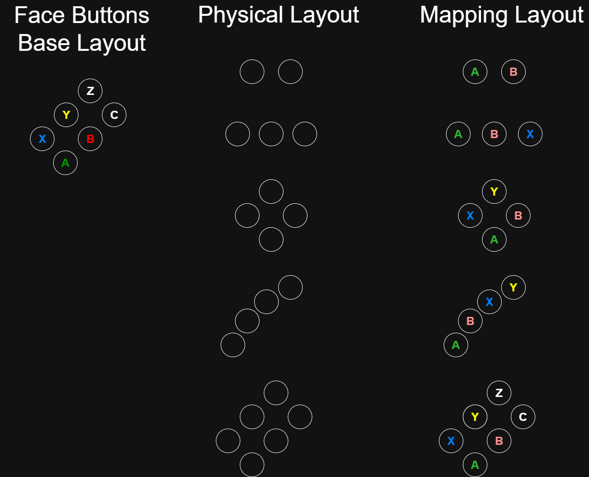

# GameInputGamepadInfo

Describes the properties of a gamepad.

<a id="syntaxSection"></a>

## Syntax

```cpp
struct GameInputGamepadInfo
{
    GameInputGamepadButtons supportedLayout;
    GameInputLabel          menuButtonLabel;
    GameInputLabel          viewButtonLabel;
    GameInputLabel          aButtonLabel;
    GameInputLabel          bButtonLabel;
    GameInputLabel          cButtonLabel;
    GameInputLabel          xButtonLabel;
    GameInputLabel          yButtonLabel;
    GameInputLabel          zButtonLabel;
    GameInputLabel          dpadUpLabel;
    GameInputLabel          dpadDownLabel;
    GameInputLabel          dpadLeftLabel;
    GameInputLabel          dpadRightLabel;
    GameInputLabel          leftShoulderButtonLabel;
    GameInputLabel          rightShoulderButtonLabel;
    GameInputLabel          leftThumbstickButtonLabel;
    GameInputLabel          rightThumbstickButtonLabel;
    uint32_t                extraButtonCount;
    uint32_t                extraAxisCount;
};
```

<a id="membersSection"></a>

### Members

*supportedLayout*<br>
Type: [GameInputGamepadButtons](../enums/gameinputgamepadbuttons.md)

Describes the layout of the gamepad. Since axes have button translations, then these can be used to determine which axes are present on the gamepad.

*menuButtonLabel*<br>
Type: [GameInputLabel](../enums/gameinputlabel.md)

Physical label for Menu button.

*viewButtonLabel*<br>
Type: [GameInputLabel](../enums/gameinputlabel.md)

Physical label for View button.

*aButtonLabel*<br>
Type: [GameInputLabel](../enums/gameinputlabel.md)

Physical label for **A** button.

*bButtonLabel*<br>
Type: [GameInputLabel](../enums/gameinputlabel.md)

Physical label for **B** button.

*cButtonLabel*<br>
Type: [GameInputLabel](../enums/gameinputlabel.md)

Physical label for **C** button.

*xButtonLabel*<br>
Type: [GameInputLabel](../enums/gameinputlabel.md)

Physical label for **X** button.

*yButtonLabel*<br>
Type: [GameInputLabel](../enums/gameinputlabel.md)

Physical label for **Y** button.

*zButtonLabel*<br>
Type: [GameInputLabel](../enums/gameinputlabel.md)

Physical label for **Z** button.

*dpadUpLabel*<br>
Type: [GameInputLabel](../enums/gameinputlabel.md)

Physical label for D-pad up.

*dpadDownLabel*<br>
Type: [GameInputLabel](../enums/gameinputlabel.md)

Physical label for D-pad down.

*dpadLeftLabel*<br>
Type: [GameInputLabel](../enums/gameinputlabel.md)

Physical label for D-pad left.

*dpadRightLabel*<br>
Type: [GameInputLabel](../enums/gameinputlabel.md)

Physical label for D-Pad right.

*leftShoulderButtonLabel*<br>
Type: [GameInputLabel](../enums/gameinputlabel.md)

Physical label for left shoulder button.

*rightShoulderButtonLabel*<br>
Type: [GameInputLabel](../enums/gameinputlabel.md)

Physical label for right shoulder button.

*leftThumbstickButtonLabel*<br>
Type: [GameInputLabel](../enums/gameinputlabel.md)

Physical label for left thumbstick.

*rightThumbstickButtonLabel*<br>
Type: [GameInputLabel](../enums/gameinputlabel.md)

Physical label for right thumbstick.

*extraButtonCount*<br>
Type: uint32_t

The number of device buttons that are not mapped to gamepad buttons.

*extraAxisCount*<br>
Type: uint32_t

The number of device axes that are not mapped to gamepad axes.

<a id="remarksSection"></a>

## Remarks

This structure is used in the [GameInputDeviceInfo](gameinputdeviceinfo.md) structure.

`GameInputDeviceInfo` is used by the [IGameInputDevice::GetDeviceInfo](../interfaces/igameinputdevice/methods/igameinputdevice_getdeviceinfo.md) method.

For more information, see [GameInput devices](../../../../features/common/input/overviews/input-devices.md).

### Gamepad Layout

GameInput supports a range of form factors for gamepads instead of limiting support to a single standard layout. This is exposed through the `supportedLayout` member of this structure as a bitfield of type [GameInputGamepadButtons](../enums/gameinputgamepadbuttons.md). Axes are also present in this enumeration through the axis-to-button translations such as `GameInputGamepadLeftTriggerButton`. For more information on these translations, see [GameInputGamepadButtons](../enums/gameinputgamepadbuttons.md#remarks).

There is no minimum required layout for a gamepad and it may have any combination of the supported axes and buttons. Any buttons or axes not supported is expected to be left and accessed as extra axes or buttons.

We have defined some common groupings of gamepad elements and common layouts as constants. These can be used to quickly identify a common layout, filter for a specific inputs or create custom layouts. For more information, see [GameInputGamepadButtons](../enums/gameinputgamepadbuttons.md#constantsSection).

Since the expected range of supported layouts and form factors is limitless, there are small set of considerations and behaviors that we expect for mappings and gamepad users to follow:

- For elements of which there are two, such as thumbsticks, shoulder or triggers, if there is one present in the center, then the default should be for it be the left element. If it is positioned to the left or right of the device, then it should be mapped accordingly.

- In order to prevent ambiguity due to different glyphs, face buttons are expected to be mapped and read according to their physical position and regardless of its glyph as following:



The following code example demonstrates how to determine whether a gamepad supports a layout or a specific input or module.

```cpp
bool IsStandardLayout(const GameInputGamepadInfo& gamepadInfo) noexcept
{
    // Supports the standard layout and no more
    return (gamepadInfo.supportedLayout & GameInputGamepadLayoutStandard) == GameInputGamepadLayoutStandard;
}

bool IsDpadSupported(const GameInputGamepadInfo& gamepadInfo) noexcept
{
    // Supports the D-pad module and more
    return gamepadInfo.supportedLayout & GameInputGamepadModuleDpad;
}

bool IsXButtonSupported(const GameInputGamepadInfo& gamepadInfo) noexcept
{
    return gamepadInfo.supportedLayout & GameInputGamepadX;
}
```

The following code example demonstrates how to create a custom layout and determine if the gamepad supports it.

```cpp
bool IsCustomLayoutSupported(const GameInputGamepadInfo& gamepadInfo) noexcept
{
    static const GameInputGamepadButtons customLayout =
        GameInputGamepadA |
        GameInputGamepadB |
        GameInputGamepadC |
        GameInputGamepadX |
        GameInputGamepadY |
        GameInputGamepadZ |
        GameInputGamepadModuleShoulders |
        GameInputGamepadModuleDpad;

    return (gamepadInfo.supportedLayout & customLayout) == GameInputGamepadLayoutCustom;
}
```

<a id="requirementsSection"></a>

## Requirements

**Header:** GameInput.h

**Supported platforms:** Windows, Xbox One family consoles and Xbox Series consoles

<a id="seealsoSection"></a>

## See also

[Overview of GameInput](../../../../features/common/input/overviews/input-overview.md)  
[GameInput](../gameinput_members.md)

## Version History

| Version | Changes |
| --- | --- |
| **v3** | **Added** `supportedLayout` (GameInputGamepadButtons bitmask), `cButtonLabel`, `zButtonLabel`, `extraButtonCount`, `extraAxisCount`. |
| **v0** | Introduced. |

## Appendix: Previous versions

### v0, v1, v2

```cpp
struct GameInputGamepadInfo
{
    GameInputLabel menuButtonLabel;
    GameInputLabel viewButtonLabel;
    GameInputLabel aButtonLabel;
    GameInputLabel bButtonLabel;
    GameInputLabel xButtonLabel;
    GameInputLabel yButtonLabel;
    GameInputLabel dpadUpLabel;
    GameInputLabel dpadDownLabel;
    GameInputLabel dpadLeftLabel;
    GameInputLabel dpadRightLabel;
    GameInputLabel leftShoulderButtonLabel;
    GameInputLabel rightShoulderButtonLabel;
    GameInputLabel leftThumbstickButtonLabel;
    GameInputLabel rightThumbstickButtonLabel;
};
```