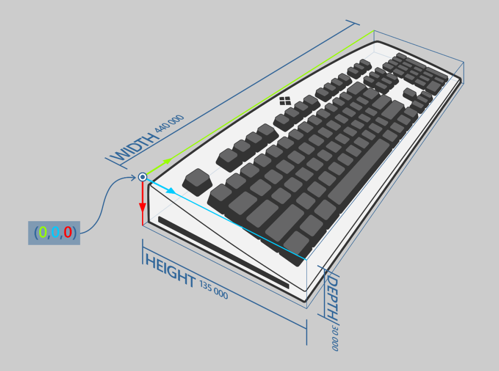
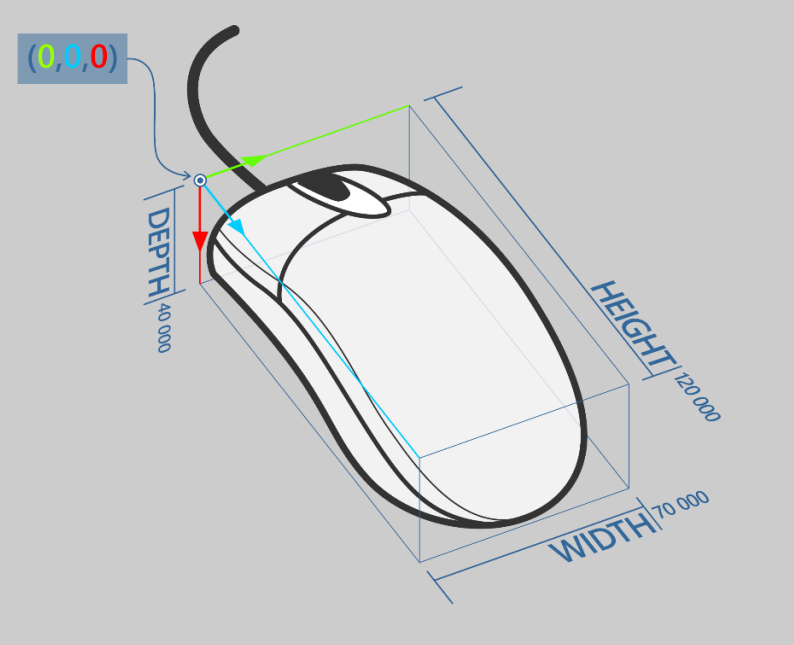

# ILampArray::GetBoundingBox  

Returns the logical 3D bounding box encompassing the ILampArray.  

## Syntax  
  
```cpp
void GetBoundingBox(
    LampArrayPosition* boundingBox)
```
  
### Parameters  

*boundingBox*&nbsp;&nbsp;\_Out\_  
Type: [LampArrayPosition*](../../../structs/lamparrayposition.md)  

The value of the bounding box.

### Return value  

Type: void
  
## Remarks  

The origin (zero) point of the bounding box is the upmost, farthest, left-hand corner of the box. The results of [ILampInfo::GetPosition](../../ilampinfo/methods/ilampinfo_getposition.md) are oriented with respect to this origin point.  

X corresponds to Width, ascending from left to right.  
Y corresponds to Height, ascending from farthest to closest.  
Z corresponds to Depth, ascending from top to bottom.  

Values are measured in meters.

The following is an example of a bounding box for a keyboard:  



The following is an example of a bounding box for a mouse:  



## Requirements  
  
**Header:** LampArray.h  

**Library:** xgameplatform.lib  

**Supported platforms:** Xbox One family consoles and Xbox Series consoles  

## See also  

[Lighting API Overview](../../../../../../features/common/lighting/gc-lighting-toc.md)  
[LampArrayPosition](../../../structs/lamparrayposition.md)  
[ILampArray](../ilamparray.md)  