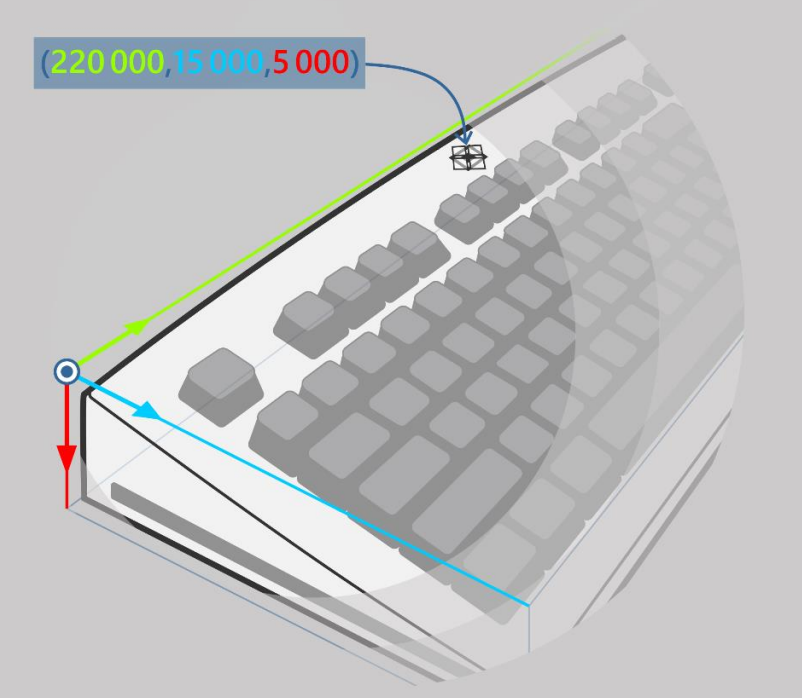

# ILampInfo::GetPosition  

Returns the 3D position of the Lamp relative to the origin of the LampArray's bounding box.  

## Syntax  
  
```cpp
LampArrayPosition GetPosition(
)
```  
  
### Parameters  

This method has no parameters.

### Return value  

Type: [LampArrayPosition](../../../structs/lamparrayposition.md)

The position of the Lamp.

## Remarks  

The origin (zero) point of the bounding box is the upmost, farthest, left-hand corner of the box.  

X corresponds to Width, ascending from left to right.  
Y corresponds to Height, ascending from farthest to closest.  
Z corresponds to Depth, ascending from top to bottom.  

Position values are measured in meters.  

The following is an example of the position of a branding Lamp on a keyboard:  

  

## Requirements  
  
**Header:** LampArray.h  

**Library:** xgameplatform.lib  

**Supported platforms:** Xbox One family consoles and Xbox Series consoles  
  
## See also  

[Lighting API Overview](../../../../../../features/common/lighting/gc-lighting-toc.md)  
[ILampArray::GetBoundingBox](../../ilamparray/methods/ilamparray_getboundingbox.md)  
[ILampInfo](../ilampinfo.md)