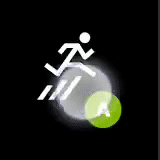
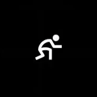
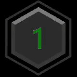
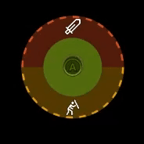

# Button

A basic control that can respond to player touch input. Can be styled to have custom artwork for both the background and face image.

## Properties

`type` - _"button"_. Specifies the control type.

`action` - _string_. [Action(s)](../types/game-streaming-touch-action.md) to be invoked when a player touches the button.

`enabled` - _boolean_, _optional_. Defaults to `true`. Sets the visual state of the control to enabled/disabled. A disabled control will still receive input from the player but *not* change the visual style based on the input.

`pullAction` - _string_ or  _object_, _optional_. The [Action(s)](../types/game-streaming-touch-action.md) to be invoked when a player pulls the button during a touch. When defining the pull action as an object, as shown in the below samples, the pull button becomes segmented such that each item in the pull action `items` array assigns an action to that segment. Segments are spaced evenly around the button with up to 4 segments allowed.

- Segmented Pull Action Properties (Introduced in v4.1)

  - `type` - _"segmented"_. Specifies the type of the pull action to be a segmented pull action.

  - `items` - _array_. An array of up to 4 [Action(s)](../types/game-streaming-touch-action.md), each of which is invoked when a player drags or pulls a touch to the edge of the control in the direction for that segment.

`toggle` - _boolean_, _optional_. Defaults to `false`.

- If `false`, input for the button will be sent when pressed and not when not pressed.
- If `true`, each press of the button will switch if input is being sent for the corresponding action(s) .

`visible` - _boolean_, _optional_. Defaults to `true`. Determines whether the control is displayed to the player to interact with. To change during game play, see [Changing touch layouts using game state](../../../../features/common/game-streaming/building-touch-layouts/game-streaming-touch-changing-layouts-game-state.md#change_state).

`styles` - _object_, _optional_. Customization of the visual representation of the control. The styles are represented as an object per state that can be styled.

The button control can have the following states styled.

- `default` - The base style.
- `disabled` - The style when the control is disabled. If not specified, when the control is disabled, a transformation will be applied to the default style to make it appear disabled.
- `idle` - Applied when the player *isn't* interacting with the control.
- `activated` - Applied when the player is touching the button.
- `pulled` - Applied when the player is touching and pulling a button. For segmented pull actions, only the single segment being pulled is styled with this state; other segments retain the `activated` styling.
- `toggled` - Applied when the button is in a toggled state and the player isn't touching the button.

**Styling properties per state**

`opacity` - _number_, _optional_. The opacity to be applied to the control. Default to 1.0 for all states but `disabled`.

`faceImage` - _object_, _optional_. Can either be an [icon](../types/game-streaming-touch-icon.md) or [image asset](../types/game-streaming-touch-asset.md).

`background` - _object_, _optional_. Can either be a [color](../types/game-streaming-touch-color.md) or an [image asset](../types/game-streaming-touch-asset.md). Isn't visible in idle and disabled states.

**Asset dimensions**

For each of the style objects that accept image assets, a given asset is provided at a base resolution and at 1.5x, 2.0x, 3.0x, and 4.0x scales of that base resolution. The resolution of a given image must be less or equal to the following maximum resolutions.

| Object     | @1.0x | @1.5x | @2.0x   | @3.0x   | @4.0x   |
| :--------- | :---- | :---- | :------ | :------ | :------ |
| faceImage  | 60x60 | 90x90 | 120x120 | 180x180 | 240x240 |
| background | 60x60 | 90x90 | 120x120 | 180x180 | 240x240 |

## Remarks

Buttons are commonly used to allow the player to perform actions that would normally be done by one or more physical buttons on their physical controller.

Utilize multiple actions to enable the player to easily replicate combination actions (for example, press the left bumper and the right bumper simultaneously).

**Styling remarks**

When in the `activated` state, the `faceImage` is displayed 25% smaller.

There are labels and default styling for the background color for buttons that don't use custom assets and have a single action of `gamepadX`, `gamepadY`, `gamepadA`, or `gamepadB`.

## Samples

#### Example 1: Jump button mapped to the A button



```JSON
{
    "type": "button",
    "action": "gamepadA",
    "styles": {
        "default": {
            "faceImage": {
                "type": "icon",
                "value": "jump"
            }
        }
    }
}
```

#### Example 2: Crouch button mapped to pressing the left bumper and the right bumper simultaneously



```JSON
{
    "type": "button",
    "action": [ "leftBumper", "rightBumper"] ,
    "styles": {
        "default": {
            "faceImage": {
                "type": "icon",
                "value": "crouch"
            }
        }
    }
}
```

#### Example 3: Button with custom face image and background image



```JSON
{
    "type": "button",
    "action": "gamepadA",
    "enabled" : true,
    "styles": {
        "default": {
            "background": {
                "type": "asset",
                "value": "hex_background"
            },
            "faceImage": {
                "type": "asset",
                "value": "one"
            }
        },
        "activated": {
            "background": {
                "type": "asset",
                "value": "hex_background_glow"
            }
        }
    }
}
```

#### Example 4: Segmented pull action with custom styling per segment

> [!NOTE]
> For styling segmented pull buttons, the `pullIndicator` array must be the same length as the `items` property that defined the segments. In other words, each segment must have a styling definition or `null` must be used to omit styling overrides for a specific segement.



```JSON
{
    "type": "button",
    "action": "gamepadA",
    "pullAction": {
       "type": "segmented",
       "items": [
          "gamepadB",
          "gamepadY"
       ]
    },
    "styles": {
        "default": {
           "pullIndicator": [
               {
                 "faceImage": {
                    "type": "icon",
                    "value": "sword"
                 }
               },
               {
                 "faceImage": {
                    "type": "icon",
                    "value": "block"
                 }
               }
            ]
        },
        "idle": {
           "pullIndicator": [
               null,
               {
                 "opacity": 0.5
               }
            ]
        }
    }
}
```


## Requirements

**Minimum Layout Version:** 1.0+ (Styling support in 2.0+).

## See also

[Touch Adaptation Kit Reference](../../../../features/common/game-streaming/game-streaming-touch-touch-adaptation-kit-overview.md)
