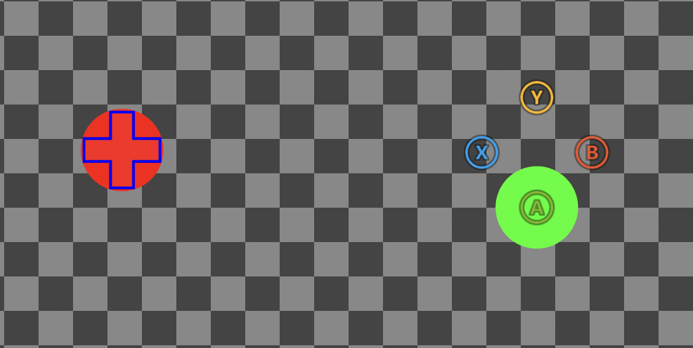
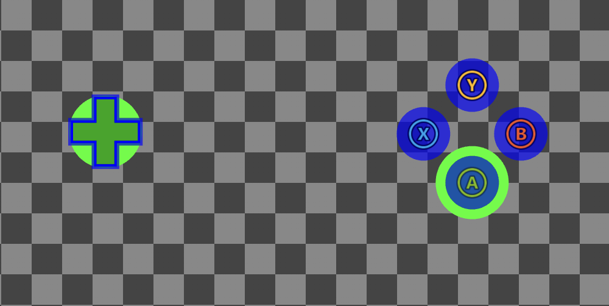

# Color Palette

A collection of reusable colors that can be referenced in layouts.

## Properties

`default` - _object_, _optional_. A collection of [Hexadecimal color](../types/game-streaming-touch-hexcolor.md) definitions that can be referenced using a [color reference](../types/game-streaming-touch-colorreference.md).

`highContrast` - _object_, _optional_. A collection of [Hexadecimal color](../types/game-streaming-touch-hexcolor.md) definitions that can be referenced using a [color reference](../types/game-streaming-touch-colorreference.md). Overrides definitions in `default` when [High contrast mode](../../../../features/common/game-streaming/building-touch-layouts/game-streaming-tak-high-contrast-mode.md) is enabled.

<a id="sample"></a>

## Sample

```JSON
{
  "$schema": "https://raw.githubusercontent.com/microsoft/xbox-game-streaming-tools/main/touch-adaptation-kit/schemas/layout/4.0/layout.json",
  "styles": {
    "colors": {
      "default": {
        "myColor1": "#ff0000ff",
        "myColor2": "#00ff00ff",
        "system_contentPrimary": "#0000ffff"
      },
      "highContrast": {
        "myColor1": "#00ff00ff",
        "system_contrastPrimary": "#0000ffaa"
      }
    }
  },
  "content": {
    "left": {
      "inner": [
        {
          "type": "directionalPad",
          "styles": {
            "idle": {
              "background": {
                "type": "color",
                "value": "colors/myColor1"
              }
            }
          }
        }
      ]
    },
    "right": {
      "inner": [
          {
              "type": "button",
              "action": "gamepadY"
          },
          {
              "type": "button",
              "action": "gamepadB"
          },
          {
              "type": "button",
              "action": "gamepadA",
              "styles": {
                "idle": {
                  "background": {
                    "type": "color",
                    "value": "colors/myColor2"
                  }
                }
              }
          },
          {
              "type": "button",
              "action": "gamepadX"
          }
      ]
    }
  }
}
```

The above layout with high contrast mode **disabled**:



And with high contrast mode **enabled**:



<a id="remarks"></a>

## Remarks

The above [sample](#sample) includes color definitions that override [system colors](#system-colors) (e.g., `system_contentPrimary`, `system_accentPrimary` etc.) as well as custom color definitions (`myColor1`, `myColor2`). Controls **implicitly** sample system colors when styling, meaning any overrides will effect the global styling of all controls (unless a control has it's own override within a custom `styles` block). Custom colors must be **explicitly** referenced using a [color reference](../types/game-streaming-touch-colorreference.md) (e.g., `colors/myColor1`). Additionally, custom color definitions **cannot** use the reserved `system_` prefix as it's reserved for system colors.

Color definitions are declared in `default` and `highContrast` objects, and are activated when [high contrast mode](../../../../features/common/game-streaming/building-touch-layouts/game-streaming-tak-high-contrast-mode.md) is disabled or enabled, respectively. When high contrast mode is disabled, colors are sampled from `default`. When enabled, colors are first sampled from `highContrast`, falling back on `default` if no definition exists. If a system color override is not present in `default`, a system default is used, while custom colors **must** be defined in `default`. The following table outlines how the above color definitions will resolve dependent on if high contrast (HC) mode is enabled or not:

| Color definition       | HC mode disabled | HC mode enabled |
|:-----------------------|------------------|-----------------|
| myColor1               | `#ff0000ff`      | `#00ff00ff`     |
| myColor2               | `#00ff00ff`      | `#00ff00ff`     |
| system_contentPrimary  | `#0000ffff`      | `#0000ffff`     |
| system_contrastPrimary | system default   | `#0000ffaa`     |


<a id="system-colors"></a>

## System colors

The following table summarizes the list of system colors in the touch adaptation kit, a description of how they are used to style controls, as well as their system default values when high contrast (HC) mode is disabled/enabled.

| System Color              | Description                                                                                            | HC mode disabled | HC mode enabled |
|:--------------------------|:-------------------------------------------------------------------------------------------------------|:-----------------|:----------------|
| system_contentPrimary     | Color used for styling components such as middle strokes, icon tints, and dpad gradients.              | `#ffffffff`      | `#ffffffff`     |
| system_contentSecondary   | Color used for styling components such as backgrounds and fills.                                       | `#ffffff1a`      | `#ffffffff`     |
| system_contrastPrimary    | Color used for styling contrast components such as inner/outer strokes and face image backplates.      | `#00000000`      | `#000000bf`     |
| system_contrastSecondary  | Color used for styling contrast components such as touchpad strokes.                                   | `#00000000`      | `#ffffffff`     |
| system_actionColorDefault | Color used for styling components on controls where the `action` field is set to a non-gamepad action. | `#ffffffff`      | `#ffffffe6`     |
| system_actionColorA       | Color used for styling components on controls where the `action` field is set to `gamepadA`.           | `#7eb902ff`      | `#ffffffe6`     |
| system_actionColorB       | Color used for styling components on controls where the `action` field is set to `gamepadB`.           | `#f25127ff`      | `#ffffffe6`     |
| system_actionColorX       | Color used for styling components on controls where the `action` field is set to `gamepadX`.           | `#00a2eeff`      | `#ffffffe6`     |
| system_actionColorY       | Color used for styling components on controls where the `action` field is set to `gamepadY`.           | `#ffb807ff`      | `#ffffffe6`     |
| system_accentPrimary      | Color used for styling components such as the ergo-edit inner wheel.                                   | `#8cc08cff`      | `#8cc08cff`     |
| system_accentSecondary    | Color used for styling components such as the ergo-edit outer wheel.                                   | `#61ab61ff`      | `#61ab61ff`     |

For an up to date listing, refer to the definitions prefixed with `_SystemColor` in the [latest schema](https://github.com/microsoft/xbox-game-streaming-tools/blob/main/touch-adaptation-kit/schemas/layout/v4.0/layout.json).

## See Also

[Touch Adaptation Kit Reference](../../../../features/common/game-streaming/game-streaming-touch-touch-adaptation-kit-overview.md)  
[High contrast mode for Touch Adaptation Layouts](../../../../features/common/game-streaming/building-touch-layouts/game-streaming-tak-high-contrast-mode.md)