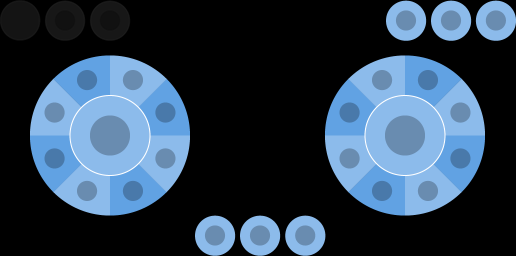
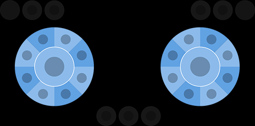
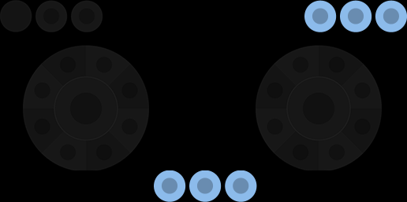

# Content

Defines the actual content of the layout. Content on the layout is organized into containers based on where it is located on the display, like `lower`. Within each container are a set of controls, like a button, that can, can either be directly specified or placed into sub-containers based on named properties or sub-arrays.

## Properties

`center` - _object_, _optional_. [Wheel](game-streaming-touch-wheel.md) of controls that is displayed in the center of the screen.

`layers` - _object_, _optional_. A set of [layer](game-streaming-touch-layer.md) definitions that allow a set of controls to be displayed based on a [layer action](game-streaming-touch-layer-action.md).

`left` - _object_, _optional_. [Wheel](game-streaming-touch-wheel.md) of controls that is by default displayed under the player's left hand/thumb.

`lower` - _object_, _optional_. An object that lets you place controls in any of the three `leftCenter`, `center` or `rightCenter` slots in the lower row of controls.

`right` - _object_, _optional_. [Wheel](game-streaming-touch-wheel.md) of controls that is by default displayed under the player's right hand/thumb.

`sensors` - _array_, _optional_. A list of [sensor controls](../../../../features/common/game-streaming/game-streaming-touch-touch-adaptation-kit-overview.md#sensor-controls) that should be enabled on this layout.

`upper` - _object_, _optional_. An object that lets you place an array of controls in `right` slots in the upper row of controls.

## Remarks

The available location for controls on a layout are:

By convention, the `left` wheel is primarily used for movement and the `right` wheel for the most common actions.

Consider placing infrequently used tasks in the `upperRight` or the `lower` slots.

> [!NOTE]
> The `center` wheel slot is not positioned well ergonomically for landscape usage. Should only be used when `orientation` is portrait for phones.
>
> The `orientation` only affects the touch layouts being displayed. Using something other than the default of `landscape` should only be done if the game is making an explicit change in rendering to match the layout's orientation.

## Samples

Please see [our GitHub](https://github.com/microsoft/xbox-game-streaming-tools/tree/main/touch-adaptation-kit/samples) for complete layout samples for a variety of game genres.
These samples also demonstrate more advanced features like using custom assets for a tailored look and feel.

## Requirements

The version of the layout is specified by the `$schema` attribute in the layout json file. This specifies the specific set of controls and capabilities that are available in the layout.

The properties described here are valid for layout versions 4.0 and above.

## See Also

[Touch Adaptation Kit Reference](../../../../features/common/game-streaming/game-streaming-touch-touch-adaptation-kit-overview.md)  
[Getting started with sample layouts](../../../../features/common/game-streaming/building-touch-layouts/samples/game-streaming-touch-getting-started-with-sample-layouts.md)