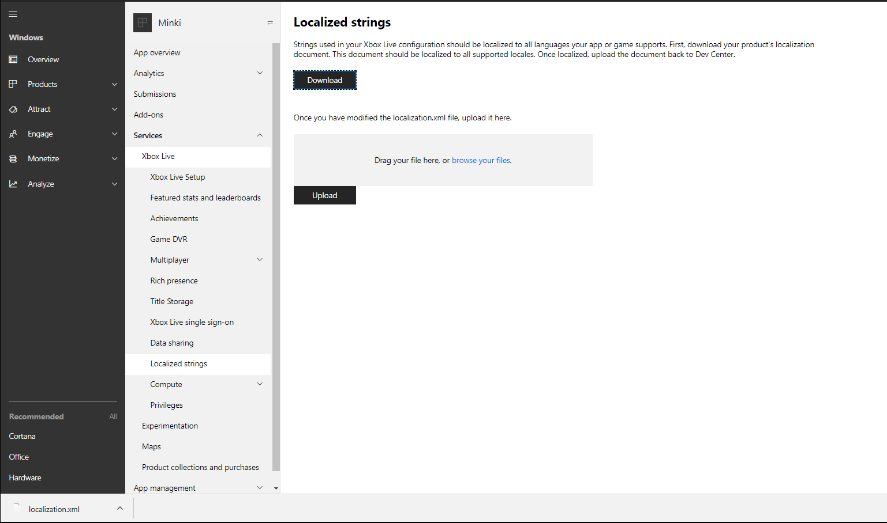
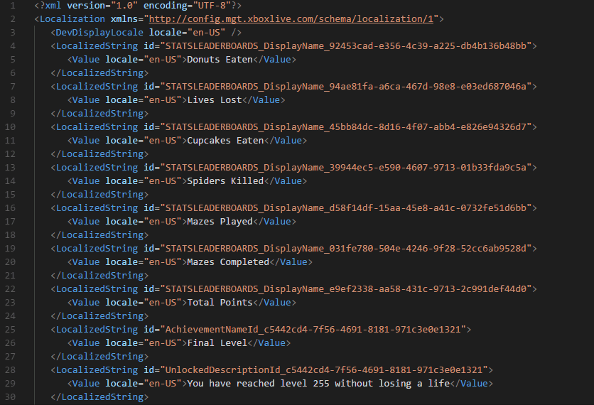
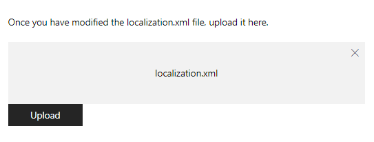

# Configuring localized strings in Partner Center

This topic describes how to configure localized strings in Partner Center. These values determine how title configurations, such as achievements, will be displayed in the system UI and in XSAPI calls such as `XblAchievementsGetAchievementAsync`. The [Xbox services language fallback](live-language-fallback.md) process determines which language is used in the event that a localized string is not available in the system's current language setting.

For example, if an achievement has an en-US localized string "Hello, World!" and an es-MX string "¡Hola, mundo!" in Partner Center, it would result in these scenarios:

|System Setting |Language Used          |Display in System UI and XSAPI Calls|
|---------------|-----------------------|------------------------------------|
|en-US          |en-US                  |"Hello, World!"                     |
|es-MX          |es-MX                  |"¡Hola, mundo!"                     |
|es-AR          |es-MX*                 |"¡Hola, mundo!"                     |
|zh-CN          |en-US*                 |"Hello, World!"                     |

\*Xbox services language fallback

To localize all your Xbox services configurations to all the languages that your game supports, use the **Localized strings** page in Partner Center.
Service configurations that you've created on subsequent Xbox services pages are added to the file that you download.

Use [Partner Center](https://partner.microsoft.com/dashboard) to configure the localized strings in all the languages that are associated with your game.

**To add string configuration in Partner Center**

1. In Partner Center, select **Xbox services** > **Gameplay settings** > **Localized strings**.

   The **Localized strings** configuration page appears for your title.

2. Select **Download**.

   A localization.xml file is downloaded to your local computer.

   
   
   
   

3. In the following video example, you can add the localized strings by copying the `<Value locale="en-US">Donuts Eaten</Value>` tag and changing the value of the locale to the language of your choice and the value of the localized string. To avoid errors, you must have at least one `Value` tag within the developer display locale.

   The value of the `locale` attribute must include the language code followed by a hyphen (-) and the country code.
   For example, `locale="en-US"` means the English language as it's used in the United States.
   For more information, see <a href="/partner-center/develop/partner-center-supported-languages-and-locales" target="_blank">Partner Center supported languages and locales</a>.

   
   
   
   

4. After you've added all the localized strings, upload the .xml file by dragging it into the provided box (shown as follows) or browsing through your local computer.

   
   
   
   

The following table shows the error messages that might appear when you upload the localization.xml file.

| Error | Reason |
|---------------------------|-------------|
| Failed XSD Validation: The element 'LocalizedString' in namespace 'https://config.mgt.xboxlive.com/schema/localization/1' cannot contain text. List of possible elements expected: 'Value' in namespace 'https://config.mgt.xboxlive.com/schema/localization/1' | This occurs when the XML document is malformed. |
| Localization string is missing an entry for the developer display locale. | This occurs when a localized string is missing an entry whose locale doesn't match the developer display locale. |
| Failed XSD Validation: The 'locale' attribute is invalid - The value ' ' is invalid according to its datatype 'https://config.mgt.xboxlive.com/schema/localization/1:NonEmptyString' - The Pattern constraint failed. | This occurs when a localized string is missing the locale value in the `<Value>` tag. The value of the `locale` attribute must include the language code followed by a hyphen (-) and the country code. |

## See also  
[Xbox Live Language Fallback](live-language-fallback.md)  
