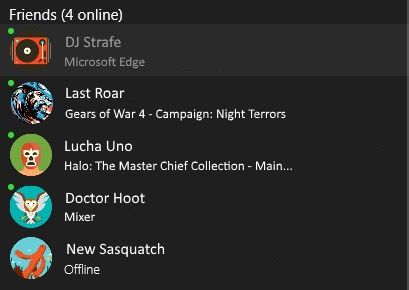
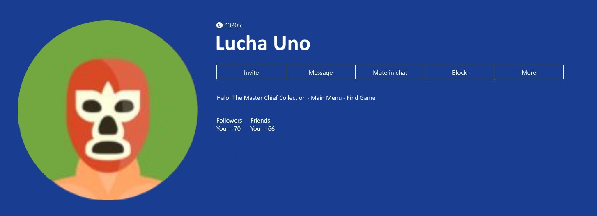
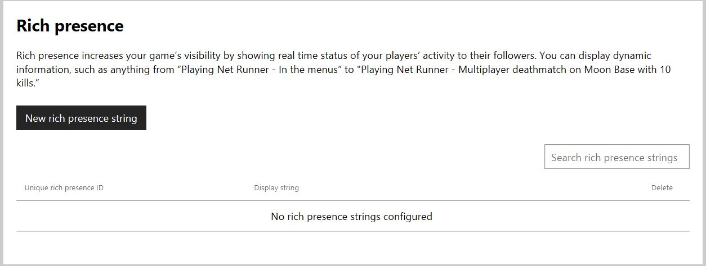
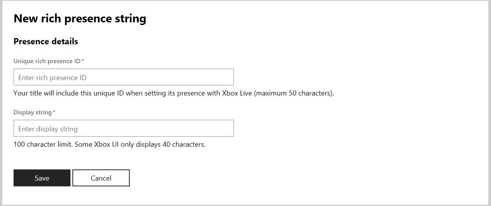
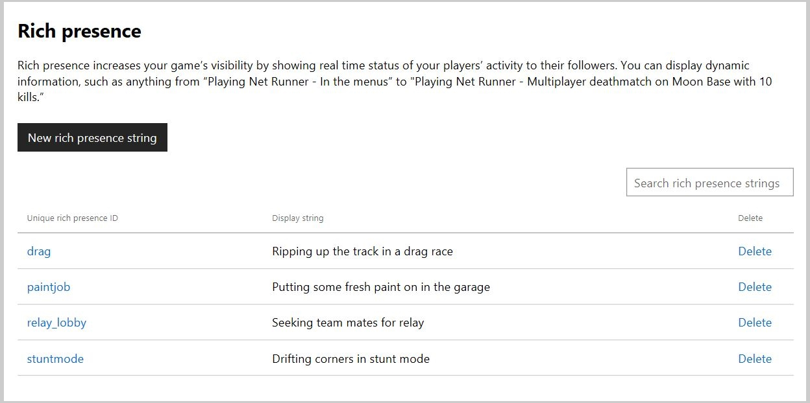

# Configuring Rich Presence strings in Partner Center 

A Rich Presence string displays a user's in-game activity after the name of the game that the user is playing, separated by a hyphen.
A Rich Presence string is displayed under a player's Gamertag in the **Friends & clubs** list and as in the player's Xbox services user profile.

> [!IMPORTANT]
> Rich Presence strings aren't available to Xbox Creators Program titles and therefore aren't configurable for those titles. The content in this article is for Managed Partners.

Configured Rich Presence strings are appended to the name of the game being played.

If you create a game called BubblePop and configure the Rich Presence string "Popping bubbles with friends", your configured string will produce "BubblePop - Popping bubbles with friends" as a status.
Below, you can see how a Rich Presence string will appear in context.

In the following screenshot, Xbox users Last Roar and Lucha Uno are playing games that use Rich Presence strings.

In the following screenshot, Lucha Uno's full Rich Presence string is in their profile.

## Requirements

Before configuring Rich Presence strings, you and your title must meet the following criteria.

- You must have a Windows development account.
- Your development account must be registered as a Managed Partner account, rather than a Creators Program account.
- Your title must be registered in Partner Center and be Xbox services–enabled.

Before you can use Rich Presence strings, you must configure them in Partner Center.

## Rich Presence configuration page

Rich Presence strings are configured as a part of Xbox services for your title in [Partner Center](https://partner.microsoft.com/dashboard).

**To configure a Rich Presence string**

1. Go to [Partner Center](https://partner.microsoft.com/dashboard) on developer.microsoft.com.

2. Sign in with your registered Windows developer account if sign-in is requested.

3. Choose your Xbox services–enabled title or app from the **Overview** page. Don't select a Creators Program title because it won't be enabled for Rich Presence string configuration.

4. Select **Xbox services** > **Gameplay settings** on the **Game overview** page or from the left navigation pane.

5. Select the **Rich presence** tab.

The **Rich presence** configuration page displays a brief description of the service, a button to create a new Rich Presence string, and a searchable list of your previously configured strings.
From this page, you can configure new strings and edit and review your configured strings.

In this example, strings like "Playing Net Runner - Multiplayer deathmatch on Moon Base with 10 kills." aren't available with title-managed player data. Event-based player data *variables* aren't available with title-managed player data. The variable here is the number of "10" kills. After the title-managed player data update, the equivalent string would be "Playing Net Runner - Multiplayer deathmatch on Moon Base." "Playing Net Runner - In the menus" remains a valid Rich Presence string.

## Create a new Rich Presence string

1. Select **Create New rich presence**.
1. The **New rich presence string** page appears.
1. Complete the **Presence details** that include the **Unique rich presence ID** and the **Display string** for your new Rich Presence string.

3. **Unique rich presence ID**: A string used to identify your Rich Presence string.
This string will be used to set the status of players for your game and is associated with the particular string you would like to display.
Your ID can be a maximum of 50 characters.
1. **Display string**: The string to display that's appended to the status of a gamer playing your game.
This is where you add the Rich Presence string you want displayed to generate interest in your game.
Your display can be a maximum of 100 characters. However, there are instances where only the first 40 characters are shown.
1. Complete both fields, and then select **Save**. 
1. The **Rich presence** page appears. Your new Rich Presence string has been added to the list of configured strings.

## Review, edit, and delete strings

Here you can see a Rich presence configuration page with a few configured strings.

**To review previously created strings**

1. Browse the list on the **Rich presence** page.
1. Both the **Unique rich presence ID** and the **Display string** appear together. This will be useful when you need to use the Unique rich presence Id in your title's code to specify a Rich Presence string.

**To edit a Rich Presence string**

1. Select the **Unique rich presence ID** link for the string you want to edit.
1. The same UI appears that's used to create a new Rich Presence string with the current string settings filled in for editing.
1. Make edits as needed.
1. Select **Save** to update the configured string with your changes.

**To delete a configured Rich Presence string**

1. Select the **delete** link on the **Rich presence** configuration page in the same row as the Rich Presence string you would like to delete.
1. Confirm the deletion.

## See also

[Rich Presence overview](../live-presence-overview.md) 
