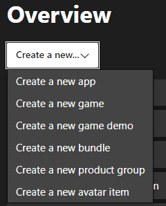
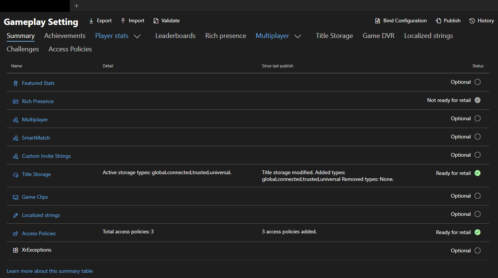
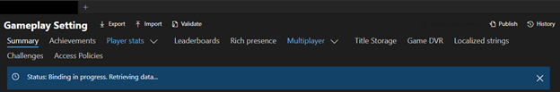

# Game Binding overview

Xbox services Game Binding allows you to set up two console products that share an Xbox services configuration.  

> [!NOTE]
> Contact your Microsoft account manager to begin using the Game Binding feature.

## What is it?

You can configure two titles to share the same Xbox services configuration.  

A *primary product* is an Xbox services-enabled title that's configured using Partner Center. All changes to Xbox services occur in Partner Center. All Xbox services configuration changes impact both products.  

A *secondary product* is initially enabled, and content is approved by Microsoft. It shares the Xbox services configuration with the primary product.

At the core of the Game Binding feature is a Partner Center configuration change so that two or more products can share the same Xbox services configuration. A change is also made to the packaged metadata of the secondary product. During the setup process, there aren't any required changes made to the primary product.

### Benefits

With Game Binding, two separate products are created so that if you want to put more resources into creating the Xbox Series version of a title, you can sell the Xbox Series and Xbox One products separately.  

This method is ideal if you want to keep your user base intact across multiple console generations.  

You can use Game Binding for a seamless gaming experience for users who purchase multiple versions of the title and want to resume game progression and achievement unlocks.

> [!NOTE]
> This doesn't require any changes to the primary title, and you can flexibly add a secondary version later.
  
## Policies and terms of use
  
The following are policies you're required to agree to before using Xbox services Game Binding.

* The title only binds console products together, such as the Xbox Series version of the title to the Xbox One version of the title.
* The title only selects the platforms it's using for game binding in Partner Center.
* There's special work that must be done to support cross-generational play.
   > [!NOTE]
   > If the title only supports the Xbox One family of consoles for the binding, we don't recommend selecting the Xbox Series family of consoles as a supported platform. As a workaround, you can add the cross-generational play capability to your multiplayer configuration.
* All titles that share the primary title configuration are close to carbon copies of the original, or they're the same title with a stripped-down experience.
* Ensure that there's a clear distinction between the product offerings in the store to set the right expectation with users.
* Once the secondary product has released to GA, it can't be unbound. Binding and unbinding titles is only supported while the secondary product is in production and isn't released to users.
* Titles are comfortable with Xbox services changes that are made to bound products.

> [!NOTE]
> There are plans to expand the scope and offerings of this feature.

## What if you want to use Game Binding with Windows PC?

Windows PC titles can share configurations with console titles by using the Game Binding feature. If a title has a Windows PC version, we recommend that only one PC product be used within the binding.

## What has been tested by the feature team?

To ensure that we have absolute confidence in this feature, we have tested Xbox services at all stages of Game Binding. This includes testing before binding, as the product is bound, and after binding the products.

To ensure that there's transparency when testing this feature, we have performed all known Xbox experiences for a product.  

We used the samples that ATG provides and called the same APIs that our customers call to access various Xbox features.  

For our testing, it was essential that all products were in a working state during the binding process so that you can test this feature while actively developing your title.

## Set up

Use the following sections and steps to set up and configure your title for Xbox services Game Binding. This process requires work on the secondary product, but it doesn't require work for the primary product.  

> [!NOTE]
> Don't start configuring your product for Game Binding until the feature team has onboarded customers to use the feature.

### Entering the flight
  
Please contact your Microsoft account manager to begin using Game Binding. They can enable the feature on your behalf.  

Once your studio is in the flight, you can access the feature for all future products.

### Primary product setup in Partner Center
  
If you haven't created your product in Partner Centre, use the following steps to set up your primary, Xbox services-enabled product.  

 1. Navigate to Partner Center and create the primary product you want to enable for Xbox services configuration.
 1. Contact your Microsoft account manager to assist in setting up and approving your product. For more information about Partner Center, see [Partner Center Documentation](/partner-center/).
 1. Configure Xbox services as you normally would.
 1. To test your product, publish the content to your desired sandbox.

With the primary product enabled for Xbox services, you can access all the relevant Xbox services identifiers needed for your secondary product.

### Secondary product setup in Partner Center
  
Now it's time to set up your secondary product with access to the Xbox services configuration in your primary product.  

 1. Create the secondary product by using Partner Center. Enable the product as a game by selecting **Create a new...** > **Create a new game** as shown in the following screenshot.
    >
 1. Contact your Microsoft account manager with your business justification for using Xbox services Game Binding between this secondary product and your primary product.
    * Ensure that you meet the criteria for game binding in your business justification.
    * After approval from your Microsoft account manager, both of your products are Xbox services-enabled.
    > [!NOTE]
    > If you want to use cross-generational play with your product, ensure that you've added that capability in Partner Center.
 1. From your secondary product, select **Xbox services** > **Gameplay settings**.
 1. From the top-right of the page, select **Bind Configuration** as shown in the following screenshot.
    >
 1. After selecting **Bind Configuration**, use the details on the page to bind your secondary product to your primary product. Enter the Product Name or Store ID of the primary product, and then select **Save** as shown in the following screenshot.  
 1. After selecting **Save**, an internal process sets up your secondary title.
    > [!NOTE]
    > This process doesn't impact the primary product, and it only makes changes to the secondary product's configuration as shown in the following screenshot.  
    >

After the process completes, the page refreshes with the Xbox services configuration of the primary product shown within the secondary, and it will remain as read-only.  

To edit the configuration, select the **Edit** button. This button takes you to the primary product to make changes. Changes that are made to a Xbox services configuration impact both versions of the title.  

> [!NOTE]
> If you want to unbind the products, you can do so via the **Unbind Configuration** button. This option restores your previous Xbox service configuration for the secondary product.  
> If you want to bind another product to your primary product, complete the steps above for a new secondary product.  

You can view all bound products that are bound together from the primary title.  

### Secondary product package setup
  
After completing the steps from the section Secondary product setup in Partner Center in this topic, you can set up your secondary game package.  

To find the correct identifiers that are under the secondary product, select **Game setup** > **Identity details** section. 

If your secondary title is built using the Microsoft Game Development Kit (GDK), use **Xbox Title ID** and the **MSA App ID** values in **Game setup** as the **TitleID** and **Identity** values in the *MicrosoftGame.config* file.

If your secondary title is built by using the Xbox Development Kit (XDK), use **TitleID** and **SCID** values in **Xbox Settings** as the**TitleID** and **Identity** values in the *Package.appmanifest* file.

> [!NOTE]
> Within the configuration of the secondary product, please ensure that you only test in sandboxes that are configured and set up in the configuration of the primary product. For example, testing Xbox features won't work if Xbox services isn't configured in that sandbox.

## Frequently Asked Questions
  
### Should I include additional identifiers in my secondary product that are found in my primary product?
  
No, you should only use the specific primary identity details that are found in the game setup page of the secondary product.  

For example, each product should have their own unique MSA App ID to avoid any unforeseen consequences.  

### What happens if I unbind the secondary product?
  
The previously configured Xbox services configuration becomes viewable and editable again from the secondary product. In other words, this restores the secondary product to the unbound state.  

From there, you can make changes that are independent of the primary product. However, you must make changes to the package for the secondary product to access Xbox services features from the secondary product.  

The unbinding process has no effect on the primary product.

## See also

* [Test accounts](../../develop/test-accounts/live-test-accounts.md)
