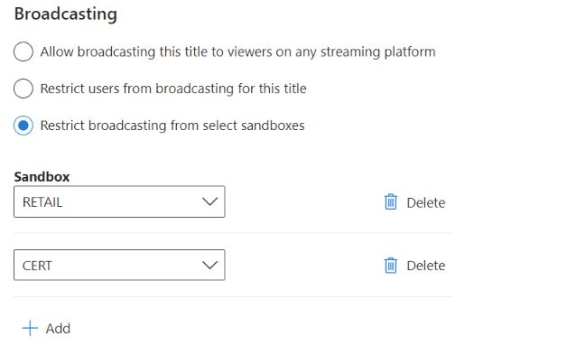

# Configuring Privileges in Partner Center

The Privileges configuration page dictates whether or not gamers will be restricted from streaming your title to streaming services or if players will be able to play your free-to-play multiplayer without Xbox Live Gold (if applicable).

You can find the **Privileges** section the following way.

1. Sign in to [Partner Center](https://developer.microsoft.com/dashboard).
2. Select the **Apps and games** workspace from the Home page. The **Apps and games \| Overview** page appears.
3. On the **Apps and games \| Overview** page, use **Search** to find and select your game.
4. If the game is already contnent approved for Xbox services, you will see multiple sections under the **Xbox services** section on the left nav. 
Select **Privileges** under **Xbox Services** section

The Privileges page has two settings that you can configure. The first, whether or not gamers will be restricted from streaming your title to streaming services. The second, if players will be able to play your free-to-play multiplayer without Xbox Live Gold (if applicable).

## Broadcasting Privilege

By default, your game will not restrict broadcasting on any streaming platform; changes to this page are only required if you would like to restrict broadcasting.

You can configure broadcasting in three ways:
* Allow broadcasting everywhere, select **Allow broadcasting this title to viewers on any streaming platform**.
* Restrict broadcasting everywhere, select **Restrict users from broadcasting for this title**.
* Restrict broadcasting by Sandbox, add a sandbox in the **Restrict broadcasting from select sandboxes** section.

To restrict broadcasting on a particular sandbox, click **Add** button in the **Restrict broadcasting from select sandboxes** section.
Choose the target sandbox from the dropdown list, then check the box underneath to restrict broadcasting for that title on the chosen sandbox.
To remove restrictions on broadcasting, sandbox overrides can be deleted.

> [!NOTE]
> Checking the box to disable broadcasting will only prohibit streaming done through Xbox consoles or the Windows game bar on PC. Selecting **Restrict users from broadcasting for this title** does not prevent the use of capture cards or other external capture or streaming services.

## Multiplayer Privilege 

Certain games may be eligable to be considered free-to-play. This means that players will not need to pay for gold access to play your game with others online over the Xbox Network. Once approved, you will have the ability to configure the multiplayer Privilege(s) on this page. 
By default, your game will not allow silver Xbox Live users to play multiplayer; changes to this page are required if you would like to enable free-to-play for your game.

You can configure free-to-play multiplayer in three ways:
* Disable the privilege everywhere, select **Disabled**, this is also the default.
* Allow the privilege everywhere, select **Allow in all sandboxes**. 
* Allow in specific sandboxes, via **Allow in specific sandboxes** section.

To allow the free to play privilege in a particular sandbox, select **Add** button in the **Allow in specific sandboxes** section.
Choose the target sandbox from the dropdown list, then check the box underneath to restrict allow the free to play privilege for that title on the chosen sandbox.
To remove restrictions, sandbox overrides can be deleted.

To keep any configuration changes made for settings on this page, select the **Save** button.
