# Modern gamertags

Since 2002, hundreds of millions of Xbox accounts that have been created and the Xbox gamertag namespace was saturated. This made it difficult for users to find a unique name to personalize their experience on Xbox network. As Xbox expanded into more regions and languages, we needed to support a broader set of characters in gamertags.
  
With these factors in mind, Xbox has substantially enhanced the capabilities of gamertags to support *Unicode (Universal Coded Character Set) Transformation Format 8-bit (UTF-8)* characters across worldwide alphabets and duplicate gamertags.

When we launched the Xbox PC app and Xbox Game Bar on Windows 10, we enabled users to create modern gamertags, or convert their classic gamertag to a modern gamertag.

We strongly recommend going through all these topics below before implementing support for modern gamertags.

* [Modern gamertag definition](live-modern-gamertags-definition.md)
* [UTF-8 character ranges support](live-modern-gamertags-unicode.md)
* [Backwards compatibility](live-modern-backwards-compatibility.md)
* [XR-046](../../../../../store/policies/XR/XR046.md)
* [Best practices and testing](live-modern-gamertags-best-practices-and-testing.md)
  

## Examples of modern gamertags

| Suggested rendering | Unique modern gamertag | Modern gamertag | Suffix | Classic gamertag |
| --- | --- | --- | --- | --- |
| P3 | P3 | P3 |  | P3 |
| **Dragon** #1652| Dragon#1652 | Dragon | 1652 | Dragon1652 |
| 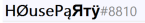 | 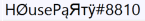 | 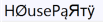 | 8810 | HOusePaRTy8810 |
| 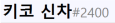 | 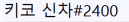 | 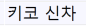 | 2400 | Player8423 2400 |
| 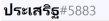 | 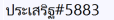 | 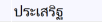 | 5883 | VisorOwl |

The examples from the table include the following scenarios.  

* The user whose gamertag is P3 claimed their gamertag as a classic gamertag before the shift to modern gamertags, and they haven't switched to a modern gamertag. Modern gamertag fields "pass through" the classic gamertag, and the suffix is blank.

* The user whose gamertag is Dragon#1652 either created their account after the release of modern gamertags, or they changed their classic gamertag to a modern gamertag to get the name they wanted. A suffix was assigned to this user because "Dragon" was taken by someone long ago.

* The user whose gamertag is 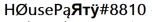 selected a modern gamertag using Latin "look-alike" characters because they thought it was cool.

Their classic gamertag is mapped to the corresponding basic Latin characters so that the classic and
modern gamertags can remain as consistent as possible and are identifiable across various platforms.

* The Korean user whose gamertag is 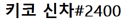 created their modern gamertag with Hangul characters. This gamertag was auto-assigned a random classic gamertag with the last 4 characters matching the suffix. This user didn't use any option to customize their gamertag further.

* The Thai user whose gamertag is 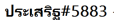 created a modern gamertag with Thai characters that includes character modifications via diacritics. Because of the diacritics, the number of characters that are rendered on-screen is less than the raw number of characters that are returned in the API fields. This user chose to customize their classic gamertag so that in older games that didn't support modern gamertags, their gamertag appeared with a name that was still meaningful for them.  
  
## See also  
  
* [Modern gamertag definition](live-modern-gamertags-definition.md)
* [Classic gamertags](live-classic-gamertags-overview.md)
* [Backwards compatibility](live-modern-backwards-compatibility.md)
* [Best practices and testing](live-modern-gamertags-best-practices-and-testing.md)