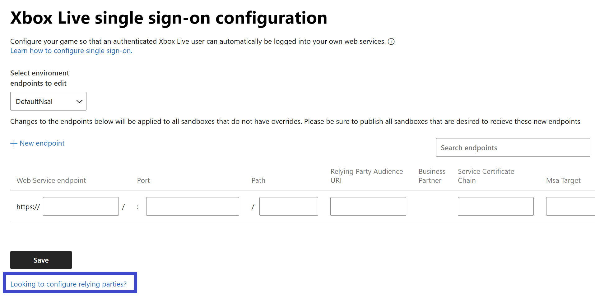

# Configuring single sign-on in Partner Center

> [!NOTE]
> This article is for Managed Partners, and does not apply to titles in the Xbox Creators Program.

Single sign-on allows a player to sign in to your title using their Xbox account sign-in.
This lets a player that is signed into Xbox services run an app or game without logging in a second time with a different account credential specific to your service.

For example, your title might be an app that enables your service to stream content such as videos and music to their device, as long as they have a valid account with your service.
If the user is signed into their Xbox account, they should be able to stream content without having to sign in to your service each time.

If your app sends Kinect data to an external service, you can also configure that in Partner Center.

If your title requires that users create an account separate from Xbox services, you should provide a way for them to link their Xbox account with their account on your service as a one time action.

When you configure single sign-on, you can specify URLs and their relying party.
Any time that your app calls any of the URLs specified, Xbox services will automatically attach an Xbox Secure Token Service (XSTS) token.

The service that receives the key is known as a *relying party*. You must configure [relying parties](https://developer.microsoft.com/xboxconfig/relyingparties/index) before you can configure single sign-on.
Each relying party configuration specifies what information is contained in the XSTS token, as well as a unique encryption key that the relying party can use to decode the XSTS token.

**To add a configuration:**

* Select your title in [Partner Center](https://partner.microsoft.com/dashboard). 
* From the title dashboard menu, navigate to **Xbox services** > **Single sign-on** to display the "Xbox services single sign-on configuration" page.
* Select **New endpoint** to create a new single sign-on entry. This adds a new row to the end of the list of configurations.
* In the __Web Service endpoint__ box, enter the Fully Qualified Domain Name (FQDN) of your service. The domain name also supports wildcard domains at the top level. For example, `.mygame.com` is supported and matches all subdomains like `example.mygame.com` and `partner.example.mygame.com`. In contrast, `service..mygame.com` isn't supported as the wildcard isn't specified at the top level. If needed, enter the Port number and Path.
* In the __Relying Party Audience URI__ box, select a suitable relying party from a dropdown list. Relying party information specifies how the XSTS token is encoded. The dropdown list is populated by defining the URI in your **Account settings** first. To define a new URI, select "Looking to configure relying parties?" under the **Save** button and you'll be directed to the __Relying parties__ page. Alternatively, you can navigate to the same page by selecting **Apps and games** > **Xbox Live** > **Relying parties**. For more information, see [Configure Relying Parties](../web-services/live-web-services.md) section in __Setting up web services__.
* Click on the **Save** button to save your changes.
* Publish or republish your title to a sandbox for the configuration changes to be reflected.

