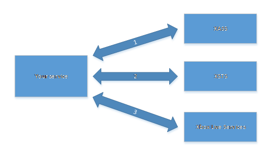

# Title service calls to Xbox services

This article describes how to call Xbox services from a custom title service using an Xbox Security Token (XSTS):  

This article covers the following sections:

- [S2S configuration](#s2s-configuration)
- [Service authentication flow](#service-authentication-flow)
- [Proof keys](#proof-keys)
- [Obtaining a service token](#obtaining-a-service-token)
- [Obtaining an XSTS token for S2S calls](#obtaining-a-service-auth-token)
- [Calling Xbox service endpoints](#calling-xbox-services-endpoints)
- [See also](#see-also)  

Xbox services can be accessed from title services through service-to-service (S2S) access, also known as *back end-to-back end*. Enabling new game play and interaction scenarios like custom matchmaking services. They can use S2S calls to create and read multiplayer session information and player data.

The RESTful request pattern to call Xbox service endpoints is identical between clients and title services. However, the authentication path is different. Title services require more authentication steps before Xbox service calls can be performed. The following sections describe the flow for this authentication path to enable S2S access for your service.

<a id="s2s-configuration"></a>

## S2S configuration

This section provides an overview of S2S call access to Xbox services for titles. S2S access isn't enabled by default for each title. Access must first be configured on a publisher and title level in Partner Center.

### Business Partner Certificate setup

To gain access to Xbox services, a title service must have credentials that are registered on Xbox services. A *Business Partner Certificate* is used for this access. This certificate is an X509 certificate issued by the Xbox services certificate authority (CA).

The Business Partner Certificate is configured on a *publisher level* and for *all sandboxes* through the Xbox services Web Services page in Partner Center. For detailed configuration steps, see [Configuring single sign-on in Partner Center](../custom-service-config/single-sign-on/live-single-sign-on.md).

#### Business Partner Certificate expiration

Like other certificates, Business Partner Certificates expire. They should be updated before they expire. Currently, Business Partner Certificates are generated with a lifespan of about 18 months from their creation date. In the future, the lifespan of Business Partner Certificates might change. Expired Business Partner Certificates don't work after their expiration date. Errors occur when you try to obtain Service tokens (S tokens) or XSTS tokens related to these certificates.

Developers must track the expiration date of any Business Partner Certificates in use and refresh them through Partner Center before they expire. It's recommended to set a set a calendar reminder one week before a Business Partner Certificate expiration date to refresh and deploy a new one.

### Configuring Xbox services access with Business Partner Certificates

To enable a server with a Business Partner Certificate to access Xbox services, each title must grant access rights to the web service that the Business Partner Certificate was generated for. This configuration is performed *per title* in Partner Center. For detailed information, see [Access policies overview](../custom-service-config/access-policies/live-access-policies-overview.md).

<a id="delegated-s2s-configuration"></a>

### Delegated S2S configuration

To make S2S calls to Xbox services on behalf of a user, a service must already be configured for service authentication and a relying party. For detailed information, see [Xbox services authentication for title services](../service-authentication/live-title-service-authentication.md).

For delegated S2S call access, the token definition for the relying party must also include the `DelegationToken` claim. This claim contains the information needed by XSTS to issue tokens on behalf of the user.

The delegation token for a user expires 30 days after it was issued. This token should only be used as long as a user is signed in or requests for the user are necessary. Titles must delete delegation tokens that are no longer needed.

 [Return to the top of this article.](#title-service-calls-to-xbox-services)

<a id="service-authentication-flow"></a>

## Service authentication flow

The following diagram depicts the three steps for authenticating a title service with Xbox services.



1. The title service first performs an authentication POST request to the Xbox Service Authentication Service (XSAS), noting the sandbox, proof keys, and token type in the body of the request. The Business Partner Certificate obtained earlier must be used as the client TLS certificate. If successful, XSAS returns an S-token with a default lifetime of two weeks.

    > XSAS: `https://service.auth.xboxlive.com/service/authenticate`

1. The S token can then be exchanged for an authorization token called an *X-token* by making a POST request to XSTS.  The following parameters are required, the S token, the ID of the sandbox that you're trying to access, and the name of the target relying party as the request properties.  

    > XSTS: `https://xsts.auth.xboxlive.com/xsts/authorize`  

1. Optionally, you can add the `DelegationToken` claim to the request in case the call needs to be made on behalf of the user who you obtained that claim for. In this scenario, the supplied `SandboxId` must be accessible by the user of the `DelegationToken` claim. Using X-tokens obtained in this way, your service can make authenticated calls to various Xbox services.  

 [Return to the top of this article.](#title-service-calls-to-xbox-services)

<a id="proof-keys"></a>

## Proof keys

The use of proof keys prevents a man-in-the middle attack that allows the capture of tokens and authoring messages on behalf of the true token owner by an attacker. For a full code sample of generating proof keys and signatures, see the GameService console sample that's available for download on [Xbox Developer Downloads](https://aka.ms/gdkdl).

More specifically, when obtaining a security token, the caller first generates a public/private key pair. The caller then keeps the private key for itself and sends the public key with the security token request (explained later in the [Obtaining a service token](#obtaining-a-service-token) section of this article). The public key is then embedded in the token. Each time the caller sends a request to a service, it passes the token to the service and signs the message with the private key. Only the caller has the private key.

The service that is receiving the message verifies the validity of the token, and then validates the signature of the request by using the public key that is contained in the token. If the request signature is validated, it proves that the caller has the private key. Assuming that the caller has its private key safe, this proves that the caller is the same party that provided the public key to the security token service.

The key itself is a JSON Web Key (JWK) as defined in the Internet Engineering Task Force (IETF) specification for [https://tools.ietf.org/html/draft-ietf-jose-json-web-key-08](https://tools.ietf.org/html/draft-ietf-jose-json-web-key-08).

The URL, path, query string, `Authorization` header, and time stamp are always signed. As a result, they're implicitly in the signature policy to be used to sign the request. Each service that exposes authentication endpoints can also require additional headers that have to be included in the signature policy. It can also specify a the maximum size (in bytes) of the request body that will be signed. Each service defines the set of signing algorithms that it supports.

The signature policy looks like the following in JSON form.

```json
{
    "Version": 1,
    "SupportedAlgorithms": [ "ES256", "ES384" ],
    "ExtraHeaders": [ ],
    "MaxBodyBytes": 8192
}
```

Clients&mdash;your title service, in this case&mdash;must learn about the required signing policy for the endpoints that they need to call. They create a data stream to sign from the request (the exact process is described in steps 1 through 7, as follows), hash the data stream by using Secure Hashing Algorithm 256 (SHA256), and then encrypt it by using the private key to produce a signature.

The signature is transmitted through an `HTTP` header and is made of the following three parts.  

1. The signature policy version. It's expressed as a 4-byte integer value in network-byte order (big-endian).  
1. A 64-bit [Windows file time](https://msdn.microsoft.com/library/system.datetime.tofiletimeutc.aspx) in network-byte order.  
1. The resulting signature bytes.  

These three parts are combined as a single byte stream and encoded as a base-64 string that is sent with the request as an additional header&mdash;the `Signature` header.

Because the signature is transported as an `HTTP` header, any message that includes a hash of the body must be hashed in memory before any bytes of the body are written to the request stream. The signature is computed over the actual bytes transmitted. The signature must be computed after any request-body transformations.

The exact process of creating the data stream to sign is shown as follows. All string data, such as the headers and URL, are encoded in ASCII. The body is an opaque blob and is signed as-is.

The values of these elements are explained as follows.

1. The policy version as a 4-byte unsigned integer in network-byte order, followed by a null byte.

2. The time stamp (from the `Signature` header) in network-byte order, followed by a null byte.

3. The `HTTP` method, in uppercase (for example, GET or POST), followed by a null byte.

4. The absolute path and query string, followed by a null byte.

5. The value of the `Authorization` header (if present), followed by a null byte.

6. The other headers that are specified in the signature policy, each followed by a null byte if you're adding any header. If there are no additional headers, no byte should be added.

7. Let `N` be the maximum number of bytes of the body to sign, as specified by the signature policy for the endpoint to be called. Let `M` be the size of the uncompressed body. If `M \> N`, use the first `N` bytes of the uncompressed body. If `M \<= N`, use the entire uncompressed body (without padding). A null byte is appended (the null byte must be appended, even if there isn't a request body).

Each of the previous elements is separated by a null byte (0x00) to mitigate any ambiguity from concatenation without a separator. The null byte is used because the HTTP standard forbids the use of non-printable characters in the headers. As a result, any attempt to insert or extend the data would need to include the null byte and would thus be an invalid `HTTP` request.

The absolute path and query string are obtained from the URI of the request that is signed. If the URI of the request is "`https://service.xbox.com/service1/foo?q0=v0&q1=v1\#frag,`" the absolute path and query string is "`/service1/foo?q0=v0&q1=v1\#frag`". The absolute path must start with a forward slash (/).

Any headers in the request that are specified in the policy must be included in the signature in the same order as they appear in the signature policy. The `Authorization` header is always signed. If the policy specifies a header that isn't present in the request, it doesn't have to be in the signature. For example, if the policy specifies headers `\[ H~1~, H~2~, H~3~ \]` and the request includes only `H~1~` and `H~2~`, `H~3~` can be left out. This is needed if the global policy specifies headers such as `Range`, which doesn't apply for POST requests.

However, if a header is missing, the corresponding null bytes must still be included. This also applies if no headers are specified. The data stream to sign would include two null bytes between the `H~1~` and `H~3~` headers if `H~2~` were missing. Another way to think about this is to consider missing headers as an empty string.

 [Return to the top of this article.](#title-service-calls-to-xbox-services)

<a id="obtaining-a-service-token"></a>

## Obtaining a service token

This section covers details about the request, response, and error handling that are associated with obtaining a service token. For a full sample code implementation of requesting and managing service tokens, see the GameService console sample that is available for download on [Xbox Developer Downloads](https://aka.ms/gdkdl).

### Service Token Request

XSAS provides the following REST endpoint to handle service authentication.

`https://service.auth.xboxlive.com/service/authenticate`

This endpoint requires at TLS 1.2 (or greater) and a valid Business Partner Certificate to be used as a client SSL certificate in the request.
If the connection to the endpoint is dropped, that is usually a result of the previous items missing or misconfigured in the request.

Your service performs a POST, with a body obeying the following `XSASRequest` data contract.

```cpp
[DataContract]
public class XSASRequest
{
    [DataMember(EmitDefaultValue = false)]
    public string RelyingParty { get; set; }
    [DataMember(EmitDefaultValue = false)]
    public string TokenType { get; set; }
    [DataMember]
    public XSASPropertyBag Properties { get; set; }
}
[DataContract]
public class XSASPropertyBag
{
    [DataMember(EmitDefaultValue = false)]
    public Ecc256ProofKey ProofKey { get; set; }
}
[DataContract]
public class Ecc256ProofKey
{
    [DataMember(Name = "alg", Order = 0)]
    public string Algorithm { get; set; }
    [DataMember(Name = "kty", Order = 1)]
    public string KeyType { get; set; }
    [DataMember(Name = "use", Order = 2)]
    public string Use { get; set; }
    [DataMember(Name = "crv", Order = 3)]
    public string CurveType { get; set; }
    [DataMember(Name = "x", Order = 4)]
    public string X { get; set; }
    [DataMember(Name = "y", Order = 5)]
    public string Y { get; set; }
}
```

The only required property in `PropertyBag` for `XSASRequest` is `ProofKey`. It needs to be a JWK, as indicated in the [Proof keys](#proof-keys) section of this article.

> [!NOTE]
> Cache or keep a record of the proof key for this S token. Use that proof key to generate the signature for calls to Xbox services by using tokens that were obtained with the S token.

Additionally, the headers in the following table must be included in the request.

| Header name                       | Header value                      |
|-----------------------------------|-----------------------------------|
| x-xbl-contract-version            | 1                                 |
| content-type                      | application/json                  |
| signature                         | Message signature computed following the specification in the [Proof keys](#proof-keys) section of this article. The signing policy for the XSAS service is as follows. `{Version = 1, ExtraHeaders = [ ], MaxBodyBytes = long.MaxValue, SupportedAlgorithms = new[] { "ES256" } }` |

Following is the code for a sample request.

```json
POST 'https://service.auth.xboxlive.com/service/authenticate'
x-xbl-contract-version: 1,
Signature: AAAAAQHPR6izYEzPeW1W5ghsfJP+Vzop0bEleqi6+XNG1eMt2htQr22W84Nku4y4fLqnryN1dFZF/0RuLD3UyY5U3uaBr37p+27TuA==,
Content-Type: application/json,
Content-Length: 242
{
    "Properties":
    {
        "ProofKey":
            {
                "alg":"ES256",
                "kty":"EC",
                "use":"sig",
                "crv":"P-256",
                "x":"G5lQkFZPAGDEKmd4BUdpinSWa8ptp8JrCvpNZu0t-I0",
                "y":"mqHWdo9l3cq99t4xdI2gqhzLpf984oNF9jYA4D5mfnc"
            }
    },
    "RelyingParty":"http://auth.xboxlive.com",
    "TokenType":"JWT"
}
```

Ensure that curve points `x` and `y` are an even length when you convert them from decimal representation to hexadecimal representation. If you don't, this can result in an incorrect conversion length that is rejected by the service.

The raw format is one in which `r` and `s` are merely concatenated. In this format, `r` and `s` must first be represented as sequences of bytes, with some convention (usually big-endian), possibly with some extra padding bytes of value 0x00. This ensures that `r` and `s` encodings have the same size. The identical size for `r` and `s` encodings are important for verifiers to know where to split this data.

The raw format is expected instead of DER. For this raw format, 0x00 padding must be applied, too.  

### Service Token Response

The data contract for the response is as follows.

```cpp
[DataContract]
public class XASTokenResponse
{
    [DataMember]
    public DateTime IssueInstant;
    [DataMember]
    public DateTime NotAfter;
    [DataMember]
    public byte[] Token;
}

Sample response body:

{
    "IssueInstant":"2022-03-24T21:56:33.31115Z",
    "NotAfter":"2022-04-07T21:56:33.31115Z",
    "Token":"eyJlbmMiOiJBMTI4Q0JiY...<truncated>...WxnIjoiUGagXRLVVC-L4",
    "DisplayClaims":null
}
```

### Service Token Error handling

If the proof key signature isn't valid, the server returns a 403 error.

> [!NOTE]
> For the SSL channel to be successfully established, the full trust certificate chain for the Business Partner Certificate needs to be installed on the client. The certificate chain is published. You can download the appropriate certificates by opening the Business Partner Certificate, selecting the **Certification Path** tab, and then viewing or downloading the individual certificates that you need.

 [Return to the top of this article.](#title-service-calls-to-xbox-services)

<a id="obtaining-a-service-auth-token"></a>

## Obtaining an XSTS token for S2S calls

This section provides details about the request, response, and error handling that are associated with obtaining an X token. For a full sample code implementation of requesting, managing, and using XSTS tokens for S2S calls, see the GameService console sample that's available for download on [Xbox Developer Downloads](https://aka.ms/gdkdl).

The following two types of XSTS tokens are available to authenticate your service to Xbox services.

- **Service auth XSTS tokens:** Contains only the identity of your service and is created by using the generated service token. This token can only be used to authenticate with string verification, multiplayer, and deleted account services.
- **Delegated auth XSTS tokens:** Includes a user claim and is required for authentication to most Xbox services and Microsoft Store services.

### Request

The XSTS service provides the following REST endpoint to handle authorization.

`https://xsts.auth.xboxlive.com/xsts/authorize`

Your service performs a POST, with a body obeying the following `XSTSRequest` data contract.
 > [!NOTE]
 > When obtaining a service auth XSTS token, you only provide the S token.
 For a delegated auth XSTS token, you would also include the `DelegationToken` value. It contains the user's identity that you are making calls on behalf of.  

```cpp
[DataContract]
public class XSTSRequest
{
    [DataMember(EmitDefaultValue = false)]
    public string RelyingParty { get; set; }
    [DataMember(EmitDefaultValue = false)]
    public string TokenType { get; set; }
    [DataMember]
    public XSTSPropertyBag Properties { get; set; }
    public byte[] ProofKey { get; set; }
}
```

### The RelyingParty property

Tokens are issued (and encrypted) for specific relying parties. A service configured for a given relying party can only consume tokens that are issued for that relying party.

Therefore, depending on the Xbox services that you need to call, you might need to retrieve different tokens, each time specifying the relevant relying party that you need a token for.

The following table indicates which relying party you need to get a token for to successfully access each Xbox services service.

 | Xbox services service HostName                      | Relying party name              |
 |-----------------------------------------------------|---------------------------------|
 | `https://musicdelivery-ssl.xboxlive.com`            | `http://music.xboxlive.com`     |
 | `https://cloudcollection-ssl.xboxlive.com`          | `http://music.xboxlive.com`     |
 | `https://music.xboxlive.com`                        | `http://music.xboxlive.com`     |
 | `https://collections.mp.microsoft.com`              | `http://licensing.xboxlive.com` |
 | `https://inventory.xboxlive.com`                    | `http://licensing.xboxlive.com` |
 | `https://licensing.xboxlive.com`                    | `http://licensing.xboxlive.com` |
 | `https://accountstroubleshooter.xboxlive.com`       | `http://accounts.xboxlive.com`  |
 | `https://*.xboxlive.com` (if not previously listed) | `http://xboxlive.com`           |

It's also possible to retrieve a token for a custom relying party that is specified for a title endpoint (for example, <https://example.com/> or rp://example.com/). Note that custom relying party names, unlike Xbox services relying party names, have a trailing forward slash (/).

### The PropertyBag property

The `PropertyBag` data contract for XSTS is as follows.

```cpp
[DataContract]
public class XSTSPropertyBag
{
    [DataMember(EmitDefaultValue = false)]
    public string ServiceToken { get; set; }
    [DataMember(EmitDefaultValue = false)]
    public string[] UserTokens { get; set; }
    [DataMember(EmitDefaultValue = false)]
    public string SandboxId { get; set; }
    [DataMember(EmitDefaultValue = false)]
    public string DelegationToken { get; set; }
}
```

The `ServiceToken` property contains the `Token` value of the response from XSAS.

The `SandboxId` property contains the name of the sandbox that you're trying to access; for example, "ABCD.1". The main sandbox for all retail users and content is named "RETAIL". (Note that the name is uppercase; it's case-sensitive.) You can always set this dynamically by looking for the sandbox claim in the client-side XSTS token that is used to authenticate the client with your service.

> [!NOTE]
> When the Business Partner Certificate you're using has been issued for a specific sandbox, you must use the same value here.

The `DelegationToken` property is optional in this scenario and should be used only if you're calling Xbox services on behalf of the user. Here, you should include the value of the `DelegationToken` claim that was extracted from an X token that you've previously received from an Xbox One console or other client. The `DelegationToken` claim can be added to your XSTS tokens as detailed in the [Delegated S2S configuration](#delegated-s2s-configuration) section earlier in this article.

The `UserTokens` property should be used only if you're making calls to Xbox services from a website where the web servers get authenticated with a Business Partner Certificate, and the user gets authenticated to your website by using the Microsoft account OAuth flow for user authentication. In this case, the `UserTokens` property should be an array of one element that contains the token that was retrieved by exchanging the user's access token that was retrieved from the Microsoft account for a User (U) token at the Xbox Authentication Service for Users (XASU) service.

### Headers

| Header name                       | Header value                      |
|-----------------------------------|-----------------------------------|
| x-xbl-contract-version            | 1                                 |
| content-type                      | application/json                  |
| signature                         | Message signature computed following the specification in the [Proof keys](#proof-keys) section of this article. The same key must be used to sign this message as was used to sign messages to other authentication services (XSAS or XASU). The signing policy for the XSTS service is as follows. `{Version = 1, ExtraHeaders = [ ], MaxBodyBytes = long.MaxValue, SupportedAlgorithms = new[] { "ES256" } }` |

### Service auth XSTS token request example

Following is the code for a sample request.

```json
POST https://xsts.auth.xboxlive.com/xsts/authorize HTTP/1.1
x-xbl-contract-version: 1
Signature:
AAAAAQHPljBFa8IDokJK3DPInYd8yzJiQOw5dvhAwN9JEPjkqaC7PirhKpUuhhG1Bt3S9EGlYNlzDNQi0raKe0Swes/vpHQk6UT90w==
Content-Type: application/json
Host: xsts.auth.xboxlive.com
Content-Length: 6473
{
  "RelyingParty": "https://xboxlive.com",
  "TokenType": "JWT",
  "Properties": {
    "ServiceToken": "eyJlbmMiOiJBM**<truncated>**AY",
    "SandboxId": "XDKS.1"
  }
}
```

### Delegated Auth XSTS Token request example

Following is the code for a sample request.

```json
POST https://xsts.auth.xboxlive.com/xsts/authorize HTTP/1.1
x-xbl-contract-version: 1
Signature:
AAAAAQHPljBFa8IDokJK3DPInYd8yzJiQOw5dvhAwN9JEPjkqaC7PirhKpUuhhG1Bt3S9EGlYNlzDNQi0raKe0Swes/vpHQk6UT90w==
Content-Type: application/json
Host: xsts.auth.xboxlive.com
Content-Length: 6473
{
  "RelyingParty": "https://xboxlive.com",
  "TokenType": "JWT",
  "Properties": {
    "ServiceToken": "eyJlbmMiOiJBM**<truncated>**AY",
    "DelegationToken": "0ZJpZZR5p/YTNSfjf8MefoRGfXZUm+b6tEOB...",
    "SandboxId": "XDKS.1"
  }
}
```

### Delegated Auth XSTS Token Response

The data contract for the XSTS response is as follows.

```cpp
[DataContract]
public class XSTSTokenResponse
{
    [DataMember(Name = "IssueInstant", Order = 0)]
    public string IssueInstant { get; set; }
    [DataMember(Name = "NotAfter", Order = 1)]
    public string NotAfter { get; set; }
    [DataMember(Name = "Token", Order = 2)]
    public string Token { get; set; }
    [DataMember(Name = "DisplayClaims", Order = 3)]
    public XSTSDisplayClaims DisplayClaims { get; set; }
    public byte[] SigningProofKey { get; set; }
}

[DataContract]
public class XSTSDisplayClaims
{
    [DataMember(Name="xui")]
    public XuiClaims[] XuiClaims { get; set; }
}

[DataContract]
public class XuiClaims
{
    [DataMember(Name = "agg",EmitDefaultValue=false)]
    public string AgeGroup { get; set; }
    [DataMember(Name = "gtg", EmitDefaultValue = false)]
    public string Gamertag { get; set; }
    [DataMember(Name = "prv", EmitDefaultValue = false)]
    public string Privileges { get; set; }
    [DataMember(Name = "xid", EmitDefaultValue = false)]
    public string Xuid { get; set; }
    [DataMember(Name = "uhs", EmitDefaultValue = false)]
    public string UserHash { get; set; }
}
```

If no `DelegationToken` or `UserTokens` properties were specified in the request, the response doesn't contain any display claims.

Otherwise, the `DisplayClaims` property of the response contains a set of information about the user as defined in the previous data contract.

- **Agegroup**: This can be Child, Teen, or Adult.
- **Gamertag**: The gamertag of the user.
- **Privileges**: The set of privileges that the user has. (For more information about privileges, see [Xbox services security token claims](../service-authentication/security-tokens/live-token-claims.md).)
- **Xuid**: The XUID of the user.

  > [!IMPORTANT]
  > You must *not* store the user XUID in your databases unless you have been given express consent by Microsoft (through your developer account manager (DAM)) to do so.

- **UserHash**: The unique identifier for the user to be used when constructing `Authorization` headers for requests to Xbox services. For more information, see [Calling Xbox service endpoints](#calling-xbox-services-endpoints).

Note that not all relying parties expose all `DisplayClaims`. To receive all claim members, use the <https://xboxlive.com> relying party name.

Following is the code for a sample response for the "<https://xboxlive.com>" relying party.

```json
HTTP/1.1 200 OK
Cache-Control: no-cache, no-store
Content-Length: 3196
Content-Type: application/json
X-Content-Type-Options: nosniff
X-XblCorrelationId: bafef442-9a66-4351-ae48-ef1812295b8e
Date: Wed, 02 Jul 2022 20:00:29 GMT
{
   "IssueInstant":"2022-07-02T20:00:29.3191631Z",
   "NotAfter":"2022-07-03T04:00:29.3191631Z",
   "Token":"eyJlbmMiO**<Truncated>** FtM",
   "DisplayClaims":{
      "xui":[
         {
            "agg":"Adult",
            "gtg":"Cool Gamertag here",
            "prv":"190 191 193 194 196 198 199 200 201 203 204 205 206 207 208 209 214 217 220 224 227 228 235 238 245 247 249 250 252 254 255",
            "xid":"2814630418365389",
            "uhs":"1283950176146904870"
         }
      ]
   }
}
```

### Delegated Auth Error handling

If the XSTS token request is rejected, the response does, in some cases, contain data that indicates why the request was rejected.

```cpp
[DataContract]
public class AuthorizeResponseNotAuthorized
{
    [DataMember(Name = "Identity")]
    public string Identity { get; set; }
    [DataMember(Name = "XErr")]
    public uint XErr { get; set; }
    [DataMember(Name = "Message")]
    public string Message { get; set; }
}
```

The `Identity` and `Message` properties can be ignored.

The `XErr` property can have the following values.

 | Value | Description |
 | ---------- | ----------- |
 | 0x8015DC03 | There's an issue with the user account (Enforcement Ban). The user should be advised to resolve any issue either on the console or by signing in to <https://xbox.com>. |
 | 0x8015DC05 | There's an issue with the user account (Parental Restriction). The user should be advised to resolve any issue either on the console or by signing in to <https://xbox.com>. |
 | 0x8015DC09 | There's an issue with the user account (Account Creation Required). The user should be advised to resolve any issue either on the console or by signing in to <https://xbox.com>. |
 | 0x8015DC0A | There's an issue with the user account (Terms of Use not Accepted). The user should be advised to resolve any issue either on the console or by signing in to <https://xbox.com>. |
 | 0x8015DC0B | There's an issue with the user account (Country/region not Authorized). The user should be advised to resolve any issue either on the console or by signing in to <https://xbox.com>. |
 | 0x8015DC0C | There's an issue with the user account (Age Verification Required). The user should be advised to resolve any issue either on the console or by signing in to <https://xbox.com>. |
 | 0x8015DC0D | There's an issue with the user account (Account Curfew). The user should be advised to resolve any issue either on the console or by signing in to <https://xbox.com>. |
 | 0x8015DC0E | There's an issue with the user account (Child not in Family). The user should be advised to resolve any issue either on the console or by signing in to <https://xbox.com>. |
 | 0x8015DC0F | There's an issue with the user account (CSV Transition Required). The user should be advised to resolve any issue either on the console or by signing in to <https://xbox.com>. |
 | 0x8015DC10 | There's an issue with the user account (Account Maintenance Required). The user should be advised to resolve any issue either on the console or by signing in to <https://xbox.com>. |
 | 0x8015DC13 | There's an issue with the user account (Gamertag Change Required). The user should be advised to resolve any issue either on the console or by signing in to <https://xbox.com>. |
 | 0x8015DC12 | Access to the sandbox specified in the request was denied. You should verify that the correct sandbox was specified in the request, and/or that the appropriate access policies were created through your Developer Partner Manager or Microsoft contact. |
 | 0x8015DC1F | An expired service token was passed in the request. |
 | 0x8015DC22 | An expired User token was passed in the request. |
 | 0x8015DC26 | An invalid User token was passed in the request. |
 | 0x8015DC27 | An invalid service token was passed in the request. |
 | 0x8015DC31 | Xbox services authentication infrastructure is currently experiencing an outage. |
 | 0x8015DC32 | Xbox services authentication infrastructure is currently experiencing an outage. |

 [Return to the top of this article.](#title-service-calls-to-xbox-services)

<a id="calling-xbox-services-endpoints"></a>

## Calling Xbox service endpoints

This section describes how to perform authentication for calling Xbox services. The objective of obtaining X tokens from the XSTS service is to make authenticated calls to various Xbox services. For the calls to be successful, an `Authorization` header and a `Signature` header must be specified when making calls to these services.

The `Authorization` header takes the following structure.

`authorization: XBL3.0 x=<userHash>;<XToken>`

The `userHash` part of that header should be set as follows.

- For the case where a `DelegationToken` or `UserTokens` property was set in the XSTS request, the `UserHash` property from the `DisplayClaims` element of the XSTS response should be used.

  > Example:\
  > `XBL3.0 x=1077552597660441275;eyJlbmMiO...(truncated)`

- For the case where only `ServiceToken` was specified in the XSTS request, the `UserHash` property should be set to a hyphen (-).

  > Example:\
  > `XBL3.0 x=-;eyJlbmMiO...(truncated)`

The `XToken` part of that header should be set to the value of the `Token` element in the XSTS response. Note that X tokens have an expiration date and time. They're specified in the `NotAfter` element of the XSTS response. If an expired token is used to call Xbox services, the request is denied with an HTTP status of 401 and an indication appears in the `www-authenticate` header of the response that the token is expired.

Xbox services also require a message signature computed following the specification as described in the [Proof keys](#proof-keys) section of this article.

When calling Xbox services from your service, be sure to reuse X tokens until they're expired instead of requesting a new token with each request. Also, batch calls together where possible such as social calls to increase throughput and avoid request throttling.
For specific information about calling the Xbox services multiplayer services S2S, see [Service-to-service multiplayer session management](s2s-call-patterns/live-mpsd-service-to-service.md).

 [Return to the top of this article.](#title-service-calls-to-xbox-services)

<a id="see-also"></a>

## See also

[Xbox services RESTful reference](../../../../reference/live/rest/atoc-xboxlivews-reference.md)  

[Service-to-service multiplayer session management](s2s-call-patterns/live-mpsd-service-to-service.md)  

[Getting the deleted accounts list from a service](s2s-call-patterns/live-get-deleted-accounts-list.md)  

[Microsoft Store Service APIs](../../../../store/commerce/service-to-service/microsoft-store-apis/xstore-nav.md)
