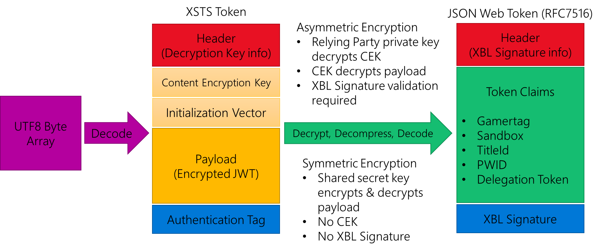

# Xbox services security tokens (XSTS tokens)

This article provides an overview of the structure of Xbox services security tokens created by the Xbox Secure Token Service (XSTS).
These tokens are also referred to as X-tokens or XSTS tokens in some documentation

Xbox services use security tokens created by XSTS for authentication of users and devices.
XSTS tokens are also available for title use.
Title XSTS tokens are configured in Partner Center to provide various claims and information depending on their intended audience and use.

Tokens are meant for a specific *relying party*, which represents a set of service endpoints that share the same *token configuration*, *encryption type*, and *signature policy*. They're described in more detail as follows.

* **Token configuration:** The claims that are in the token; token lifetime
* **Encryption key:** The key that was used to encrypt the token
* **Signature policy:** Specifies which parts of the request (headers and/or body) that must be signed for integrity validation

Xbox services use the same preconfigured relying party that's opaque to a title.
Publishers that have their own services that their titles call must configure a relying party via the Partner Center Xbox services configuration.

## Multiuser tokens

For Xbox, tokens contain user identities for any user who is currently signed in to the console. The `xui` claim in the token is an array that contains one or more of these user objects. An incoming request has an authorization header in this format:

`XBL3.0 x=<user hash>;<token>`

The user hash value is one of three values.

* A number that matches the user hash claim of one of the user identities in the token, indicating that the request is for that specific user.
* An asterisk (*), indicating that the request is for all users who are contained within the token.
* A hyphen (-), indicating that the request isn't in the context of any of the users in the token.

If the user hash value in the header matches the user/hash claim of one of the [user identities in the token](#user-identityidentities-xui), the request is meant for only that user. User hash values are unique to that instance but aren't guaranteed to always be the same for a given user in future XSTS tokens. They shouldn't be used as a permanent identifier or cached.

## Token structure

XSTS tokens use a custom JSON Web Token (JWT) format with an encrypted payload, which is referred to as the outer token.
The format follows JWT RFC 7519 with two other sections to facilitate the decryption of the payload.
Each part of the token is separated by a period in the encoded token string.

Once decrypted, the payload is a standard JSON Web Token (JWT RFC 7519) referenced to as the inner token.
The inner token contains the claims and authentication information from the corresponding relying party configuration.

For a sample token broken down into these separate parts and sections, see [Sample Xbox services security token](live-sample-xsts-token.md).

| Array Index | Token Section | Encrypted | Decryption Keys | Details |
|-------------|---------------|-----------|-----------------|---------|
| 0           | Header        | No        |                 | Details about the encryption method and thumbprint (x5t) of public cert used to decrypt the content encryption key section |
| 1           | Content encryption key | Yes | Relying party private cert key matching the x5t in the header | Decrypt to get the content encryption key used with the initialization vector to  decrypt the payload section |
| 2           | Initialization vector  | No  | | Used with the AES decryption of the Content encryption key to decrypt the payload section |
| 3           | Payload                | Yes | Content encryption key (once decrypted) and initialization vector | Encrypted JWT that contains the claims and information that your server needs for authentication of the user. |
| 4           | Authentication tag | No | | The integrity value for the token. |

The maximum size of an XSTS token with all of the above sections is 64 KB.

### Outer token encryption

The outer token uses two encryption keys to secure the inner token and its claims.

First the payload is encrypted with a content encryption key created when the XSTS token is generated.
This content encryption key is then itself encrypted using an asymmetric public certificate key tied to the corresponding relying party the token is being created for.
This public certificate key is uploaded in Partner Center when configuring the relying party.

To access the decrypted payload that represents the inner token, a service must:

1. Check the outer token's x5t header to get the thumbprint of the certificate used to encrypt the content encryption key
2. Decrypt the content encryption key using the relying party's private certificate key
3. Use the content encryption key and initialization vector to decrypt the outer token payload

#### Legacy encryption and token formats

Some titles and publishers might still be using the older legacy format of XSTS tokens, which don't follow the JWT RFC 7519 format.
This option is only for titles that were migrated from the Xbox Developer Portal (XDP) or that require this format for compatibility purposes.
This JWT format shouldn't be used for new token configurations.

Additionally, Partner Center previously included a Symmetric shared key encryption option.
This option was deprecated due to security concerns and isn't available for new relying party configurations.

### Inner token

After the payload is decrypted, it's a UTF8 array that represents the inner token that follows JWT RFC 7516.

The payload of the inner token contains the claims configured for the relying party the token was created against.
Claims that aren't configured for the relying party in Partner Center won't be included in the token payload.
Claim values can be traditional types (for example, string, integer, and GUID).
They can also be a JSON object that represents a more complex structure.
For more information, see [Xbox services security token claims](live-token-claims.md).

> [!NOTE]
> Claim values with no data can be represented through null values or can be missing from the token entirely. Title services should consider this when parsing claim values.

#### Inner token header and signature validation

The inner token has a header that includes information related to generating and validating the signature of the inner token.
This signature validation provides that the token is coming from the Xbox Live service and hasn't been tampered.

There are currently two supported key types used to generate the validation signature and can be configured for your Relying Party in Partner Center:

 1. The current XSTS signing JWK (JSON Web Key)
 1. The current XSTS signing certificate

As of December 2024, all inner token headers include the JWK related values (kid & jku) even if your token is configured for the XBL Signing Certificate.
Meaning an inner token header might have both x5u/x5t and jku/kid values that both pairs point to the same signing certificate.  
The certificate is host in the correct format expected when reading the cert from the x5u or jku URIs respectively.

Both the XSTS signing certificate and JWK methods are intended to update and refresh as needed and without prior notification to partners.
Therefore, services should never hard code or rely on installing a saved copy of the XSTS signing certificate or current JWK used for validating tokens.
Services should cache the signature keys/certs, then download and add any new key/cert to the cache when presented with an x5t or kid not in the cache.
Ensuring that when a new XSTS signing JWK or certificate is rolled out, no action or work is required by your service to support the new signing key.
Before downloading any key or cert, you should validate the URI's host matches the expected value to ensure you're downloading a valid key or cert generated by the Xbox Live service.
For more information and expected URI host values for each type see [Using the XSTS JKW signing key](#using-the-xsts-jkw-signing-key) and [Using the XSTS signing certificate](#using-the-xsts-signing-certificate).

Because the XSTS signing JWK rotates frequently, it's recommended that partners enable the JKU option on their relying parties in Partner Center.

The [Game Service sample](https://aka.ms/gdksamples) highlights these recommendations.

##### Using the XSTS JKW signing key

If your relying party is configured with the JKU option, your token is using the current XSTS signing JWK and have following header values in the inner token:  

| value | Description |
|-------|-------------|
| kid   | Key ID used to look up the signature key in your cache. |
| jku   | URL where the signature key can be downloaded and added to your cache in order to validate the token's signature. Services must verify this url is within the xsts.auth.xboxlive.com domain. |

> [!IMPORTANT]
> Before your service downloads a new signing key, validate that the jku url is part of the xsts-keys.auth.xboxlive.com domain. If not, the token should be rejected and key not downloaded.

All valid signing cert keys are available at <https://xsts-keys.auth.xboxlive.com/keys> and should be the same url in the jku.
It's recommended for your service to prepopulate your signing key cache with keys found at the URL on your service instance startup.
Your service needs to handle new keys on tokens not yet in the cache at runtime by going through the full list of keys, finding the one matching the kid, and then caching it.

##### Using the XSTS signing certificate

If your relying party doesn't have the JKU option enabled in Partner Center, your token is using the current XSTS signing certificate and have following header values in the inner token:  

| value | Description |
|-------|-------------|
| x5t   | X.509 Certificate SHA-1 thumbprint of the certificate needed to validate the token |
| x5u   | X.509 URL where the certificate can be downloaded and added to your cache in order to validate the token's signature. Services must verify this url is within the xsts.auth.xboxlive.com domain |
| kid   | Same value as the x5t, used to identify the specific JWK downloaded in the data from the jku |
| jku   | URL where the JWK format of the signing certificates can be downloaded and added to your cache. Services must verify this url is within the xsts.auth.xboxlive.com domain |

> [!NOTE]
> Even though your Relying Party isn't configured for JKU / KID, those claims will be in the header of your inner token. The values mirror the values of the x5t and x5u.

> [!IMPORTANT]
> Before your service downloads a new signing certificate key, validate that the url from the x5u or jku is part of the xsts.auth.xboxlive.com domain. If not, the token should be rejected and certificate not downloaded.

All valid signing cert keys are available at <https://xsts.auth.xboxlive.com/xsts/signingkeys> as a json array of Base64 encoded certificates.
It's recommended for your service to prepopulate your signing key cache with the certificate keys from this endpoint on your service instance startup.  
Your service still needs to handle new keys on tokens that aren't in the cache at runtime.

From the JWT RFC 7519 document:
> 4.1.5   "x5u" (X.509 URL) Header Parameter
> The "x5u" (X.509 URL) Header Parameter is a URI [RFC3986] that refers to a resource for the X.509 public key certificate or certificate chain [RFC5280] corresponding to the key used to digitally sign the JWS.  The identified resource must provide a representation of the certificate or certificate chain that conforms to RFC 5280 [RFC5280] in PEM-encoded form, with each certificate delimited as specified in Section 6.1 of RFC 4945 [RFC4945].  The certificate containing the public key corresponding to the key used to digitally sign the JWS must be the first certificate.  The certificate might be followed by additional certificates, with each subsequent certificate being the one used to certify the previous one.  The protocol used to acquire the resource must provide integrity protection; an HTTP GET request to retrieve the certificate must use TLS [RFC2818] [RFC5246]; and the identity of the server must be validated, as per Section 6 of RFC 6125 [RFC6125].
> Also, see Section 8 on TLS requirements.  Use of this Header Parameter is OPTIONAL.

### Identities

A set of related claims that describe aspects of a principal are known as an *identity*. From a structural perspective, they're claims where the value is a JSON object. That object is a set of claims or an array of sets of claims.

The identities that can be contained in Xbox One tokens are listed and described as follows (with their specific short names shown in parentheses).

#### Device identity (xdi)

The claims in the device identity provide details about the device that requested the token. There can be only one device identity in the token. Meaning the device identity is a list of claims and values.

#### Title identity (xti)

The claims in the title identity provide details about the title that's running on Xbox One that requested the token. The token can contain only one title identity. If present in the token, the title identity is a simple list of claims and values.

For a full list of claim values, see [Xbox services security token claims](live-token-claims.md).

#### Service identity (xsi)

The claims in the service identity provide details about a service if the request came from that service instead of from Xbox One. There can be only one service identity in the token. If present, the service identity is a simple list of claims and values.

#### User identity/identities (xui)

The claims in the user identity provide details about a user. If more than one user is signed in to the console, there's more than one user identity in the token. If present, the user identity is an array of claims sets (even if it's an array with one object).

The authorization header of the request contains the necessary information to determine which user in the token the request applies to. For more information about processing tokens with multiple users, see Multiuser tokens in a following section.

#### Aggregate identity (xai)

The claims in the aggregate identity provide a merged set of values that represent all the users in the token, such as age group (the value matches that of the youngest user) and privileges. Combining these values as a separate identity enables the service to make decisions without having to directly perform the analysis. In addition, it ensures privileges blocked by banning actions are enforced.

## See also

[Xbox services security token claims](live-token-claims.md)

[Sample Xbox Live security token](live-sample-xsts-token.md)

[Xbox services authentication for title services](../live-title-service-authentication.md)
