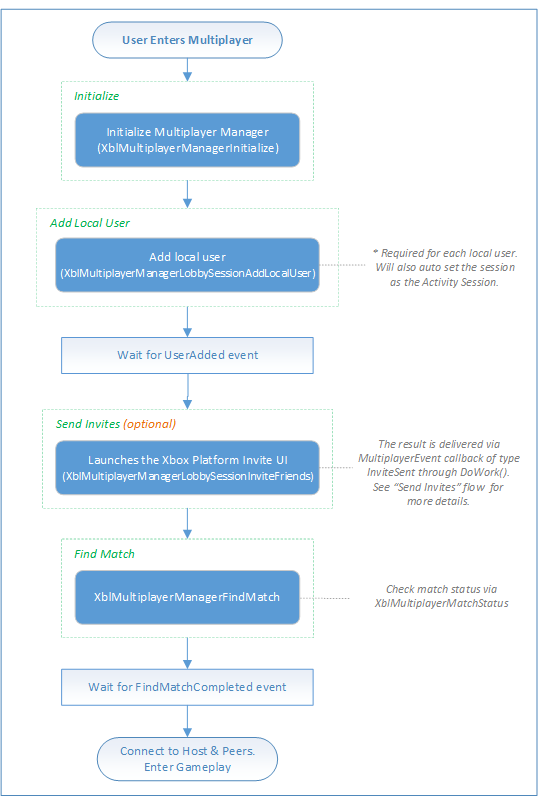

# Playing a game by using SmartMatch matchmaking (flowchart)

The following flowchart shows how to start a new multiplayer game by adding and inviting friends to the game. SmartMatch matchmaking is then used to fill any open slots with other Xbox services members.

For code examples of this process, see [Finding a multiplayer game by using SmartMatch using Multiplayer Manager](../../how-to/live-play-multiplayer-with-matchmaking.md).

## SmartMatch matchmaking

## See also

[Sending invites to another player (flowchart)](live-mpm-send-invites.md)  
