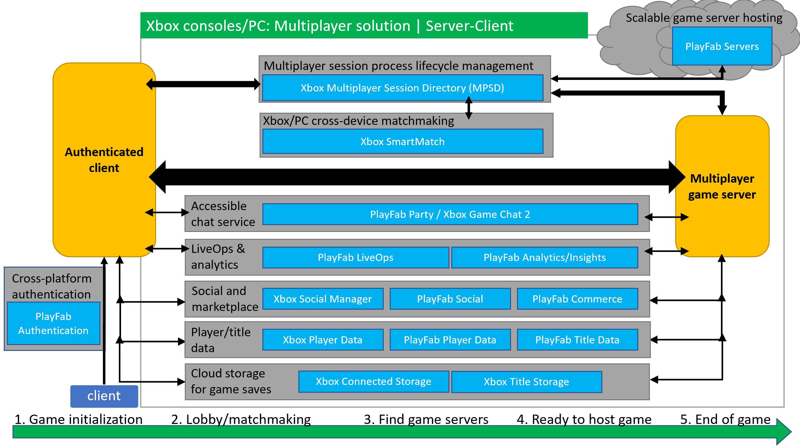
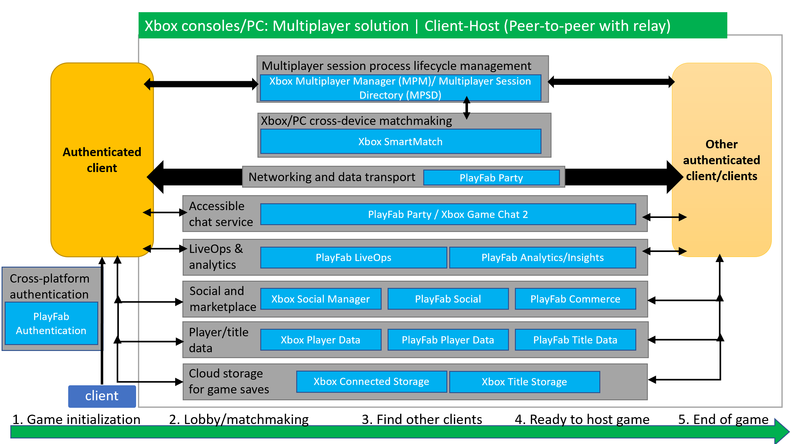

# Xbox and PC multiplayer design guidance

This topic describes how you can use and combine our services for developing titles using the Microsoft Game Development Kit (GDK) to target Xbox One, Xbox Series X\|S consoles, and Windows PC for Microsoft Store. 

## Multiplayer server-client design

In a server-client design, authoritative game logic is hosted in the server. This design uses PlayFab Servers, PlayFab Party for voice and text chat, Xbox Multiplayer Session Directory (MPSD), and Xbox SmartMatch.

Image below shows how our services work together to create a multiplayer game session using the server-client architecture.

## Multiplayer client-host design

In a client-host design, clients act as hosts. This means clients can provide authoritative game logic and game states management. This design uses PlayFab Party, MPSD or Xbox Multiplayer Manager (MPM), and Xbox SmartMatch. 

When developing games using this design, you can use Party to enable chat and data communication by allowing clients to automatically connect to one another through a transparent, low-latency cloud relay. 

You can view this as a peer-to-peer architecture but has a relay for communication. The use of a transparent, low-latency relay avoids IP leaks and other related security concerns that are associated with traditional peer-to-peer implementation and therefore, improves online safety for your players.

Image below shows how our services work together to create a multiplayer game session using the client-host design.

## How to combine solutions for Xbox console and PC titles

Table below shows the different combinations and technologies you can use to create your desired multiplayer experience.

> [!NOTE]
> Whether you are using all, some, or none of our multiplayer technologies, titles must still comply with Xbox Requirements (XRs) for online safety and privacy. Xbox social experiences around invites, joins, and recent players is a XR for Xbox and PC for Windows titles. In order to light up these features, you would need to integrate GDK into your title.

| Various combinations | Networking    |Voice and text chat  | Session  | Matchmaking       | Invites/join                      |
|----------------------|---------------|---------------------|----------|-------------------|-----------------------------------|
| 1 |Custom solution| Custom solution     | Custom solution             | Custom solution   | Multiplayer Activity (MPA) 20.06+ |
| 2 |Custom solution| PlayFab Party       | Multiplayer Manager (MPM)/ Multiplayer Session Directory (MPSD)   | Smart Match       | MPM/ MPSD        |
| 3 |PlayFab Party  | Custom solution     | MPM/ MPSD   | Smart Match       | MPA 20.06+                        |
| 4 |PlayFab Party  | PlayFab Party       | Custom solution             | Smart Match       | MPA 20.06+                        |
| 5 |PlayFab Party  | PlayFab Party       | MPM/ MPSD   | Custom solution   | MPA 20.06+                        |
| 6 |PlayFab Party  | PlayFab Party       | PlayFab Lobby (via PlayFab Multiplayer SDK)   | PlayFab Matchmaking (via PlayFab Multiplayer SDK)   | PlayFab Lobby (via PlayFab Multiplayer SDK)                    |

Key: **Custom solution** means you are using an in-house implementation or other non-Microsoft middleware solutions.

## See also

* [Multiplayer overview](multiplayer-intro.md)
* [Cross-platform multiplayer design guidance](multiplayer-design-guidance-cross-platform.md)
* [Multiplayer concepts overview](../concepts/live-multiplayer-concepts.md)
* [Common multiplayer scenarios](live-common-multiplayer-scenarios.md)
